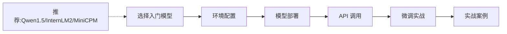

# self-llm - 开源大模型食用指南学习指南

## 项目概述

### 一句话总结项目价值
**self-llm** 是 Datawhale 社区打造的"中国宝宝专属"开源大模型入门教程，专门针对 **50+ 主流开源大模型** 提供从环境配置、本地部署到高效微调的 **全流程保姆级指导**，让零基础学习者也能顺利跑通大模型应用。

### 核心亮点
- **覆盖面极广**：支持 Qwen、InternLM、ChatGLM、LLaMA、DeepSeek 等 50+ 主流模型，且持续更新
- **全流程覆盖**：环境配置 → 模型下载 → API 部署 → Web Demo → LangChain 集成 → LoRA 微调，一条龙服务
- **保姆级教程**：每个模型都提供完整的代码示例、环境配置步骤、截图说明，真正"照着做就能跑"
- **多硬件平台支持**：除了标准 NVIDIA GPU，还支持 AMD GPU、昇腾 NPU、Apple M 系列芯片
- **实战导向**：提供 4 个精选案例（Chat-嬛嬛、天机、AMChat、数字生命），将学习成果直接转化为可展示的项目

### 适合谁学
- **在校大学生**：想接触大模型但缺乏系统指导，需要"手把手"教程
- **NLP 初学者**：了解过理论但没亲手部署过开源模型
- **应用开发者**：想基于开源模型构建私域应用，需要部署和微调经验
- **科研人员**：需要快速搭建实验环境，进行模型对比和微调实验
- **预算有限的学习者**：无法使用商业 API，希望通过低成本本地部署体验大模型

---

## 核心架构解析

### 教程整体结构

项目采用 **"模型为中心"** 的组织方式，整体分为 5 大模块：

```
self-llm/
├── models/              # 核心教程区（50+ 模型的独立教程）
├── examples/            # 实战案例区（4 个完整项目）
├── dataset/             # 通用数据集
├── models_amd/          # AMD GPU 专区
├── models_ascend/       # 昇腾 NPU 专区
├── models_mlx/          # Apple M 系列专区
└── utils.py             # 工具脚本（贡献者统计等）
```

### 包含的技术模块

每个模型的教程通常包含 **4 个渐进式模块**：

| 模块 | 内容 | 难度 | 典型文件命名 |
|------|------|------|-------------|
| **环境配置** | GPU 环境搭建、依赖安装 | ⭐ | `01-模型名 FastAPI部署.md` |
| **部署使用** | API 服务、Web Demo、LangChain 集成 | ⭐⭐ | `02-模型名 langchain 接入.md` |
| **微调实战** | LoRA/QLoRA/全量微调 | ⭐⭐⭐ | `04-模型名 Xtuner Qlora 微调.md` |
| **进阶专题** | 多卡部署、评测、优化 | ⭐⭐⭐⭐ | `05-模型名 评测.md` |

**典型示例**：Qwen3 模型教程包含 11 个文件，从模型结构解析 → vLLM 部署 → Windows 部署 → LoRA 微调 → GRPO 强化学习微调 → AMD 部署，覆盖从入门到进阶的全路径。

### 学习路径规划

项目官方推荐的学习顺序：



**建议学习路线**：
1. **第一阶段（入门）**：选 Qwen1.5 或 InternLM2，完成环境配置 + API 部署（约 2-3 小时）
2. **第二阶段（进阶）**：尝试 LangChain 集成 + Web Demo 搭建（约 3-4 小时）
3. **第三阶段（实战）**：完成一次 LoRA 微调，跑通 Chat-嬛嬛 或 AMChat 案例（约 5-8 小时）
4. **第四阶段（拓展）**：探索其他模型，对比差异，尝试多模态或推理模型

---

## 代码逻辑主线

### 1. 环境配置模块

**核心逻辑**：所有教程都基于 **Linux + GPU** 环境，推荐使用 AutoDL 等云端 GPU 平台。

关键步骤（以 [InternLM2 FastAPI 部署](file:///Users/han/Documents/projects/Learn-LLM-and-Agent/99-开源项目学习/01-大模型训练基础/self-llm/models/InternLM2/01-InternLM2-7B-chat%20FastAPI部署.md) 为例）：

```bash
# 1. pip 换源（加速下载）
pip config set global.index-url https://pypi.tuna.tsinghua.edu.cn/simple

# 2. 安装核心依赖
pip install fastapi uvicorn modelscope transformers accelerate
```

**为什么这样设计**：
- 使用清华源解决国内网络问题
- `modelscope` 是阿里达摩院的模型库，下载国内模型比 HuggingFace 快
- `transformers` 是 HuggingFace 的核心库，所有模型加载都基于它

### 2. 模型下载模块

**核心代码模式**（出现在几乎所有教程中）：

```python
from modelscope import snapshot_download

# 一键下载模型到本地
model_dir = snapshot_download(
    'Shanghai_AI_Laboratory/internlm2-chat-7b',  # 模型 ID
    cache_dir='/root/autodl-tmp',                 # 保存路径
    revision='master'
)
```

**关键理解**：
- `modelscope` 类似中国的 HuggingFace，模型存放在国内服务器
- 下载后模型会保存为多个文件（权重、配置、分词器等）
- 7B 模型约 14GB，下载时间取决于网速

### 3. 模型加载与推理

**标准代码模板**（[api.py](file:///Users/han/Documents/projects/Learn-LLM-and-Agent/99-开源项目学习/01-大模型训练基础/self-llm/models/InternLM2/01-InternLM2-7B-chat%20FastAPI部署.md#L54-L112)）：

```python
from transformers import AutoTokenizer, AutoModelForCausalLM

# 加载分词器和模型
tokenizer = AutoTokenizer.from_pretrained(
    "Shanghai_AI_Laboratory/internlm2-chat-7b", 
    trust_remote_code=True  # 允许执行模型自定义代码
)

model = AutoModelForCausalLM.from_pretrained(
    "Shanghai_AI_Laboratory/internlm2-chat-7b",
    torch_dtype=torch.float16,  # 半精度，节省显存
    trust_remote_code=True
).cuda()  # 加载到 GPU

# 推理
response, history = model.chat(tokenizer, "你好", history=[])
```

**核心概念解释**：
- **Tokenizer（分词器）**：把文字转换成模型能理解的数字 ID，就像翻译官
- **AutoModelForCausalLM**：因果语言模型，适合对话生成任务
- **torch_dtype=torch.float16**：使用半精度，显存占用减半，推理速度提升
- **trust_remote_code=True**：允许模型加载自定义代码，部分模型需要此选项

### 4. API 服务部署

**FastAPI 部署逻辑**（[api.py](file:///Users/han/Documents/projects/Learn-LLM-and-Agent/99-开源项目学习/01-大模型训练基础/self-llm/models/InternLM2/01-InternLM2-7B-chat%20FastAPI部署.md#L54-L112)）：

```python
from fastapi import FastAPI
import uvicorn

app = FastAPI()  # 创建 Web 应用

@app.post("/")  # 定义 POST 接口
async def create_item(request: Request):
    prompt = await request.json()  # 获取用户输入
    response = model.chat(tokenizer, prompt, history=[])  # 模型推理
    return {"response": response}  # 返回结果

# 启动服务
uvicorn.run(app, host='0.0.0.0', port=6006)
```

**类比理解**：
- FastAPI 就像一个餐厅的服务员，接收顾客（客户端）的点单（请求）
- 模型是后厨厨师，处理订单并出餐（生成回复）
- uvicorn 是餐厅经理，负责调度服务员和管理营业（服务器运行）

### 5. LoRA 微调模块

**微调核心流程**（以 [InternLM2 Xtuner Qlora 微调](file:///Users/han/Documents/projects/Learn-LLM-and-Agent/99-开源项目学习/01-大模型训练基础/self-llm/models/InternLM2/04-InternLM2-7B-chat%20Xtuner%20Qlora%20微调.md) 为例）：

```bash
# 1. 安装 Xtuner（微调工具）
git clone -b v0.1.14 https://github.com/InternLM/xtuner
pip install -e '.[all]'

# 2. 准备数据集（JSONL 格式）
# 生成 career_coach.jsonl

# 3. 查看可用配置模板
xtuner list-cfg

# 4. 复制并修改配置
xtuner copy-cfg internlm2_chat_7b_qlora_oasst1_e3 my_config

# 5. 启动微调
xtuner train my_config
```

**数据集格式要求**：

```json
{"conversation": [{"system": "你是一个职场教练", "input": "工作压力大怎么办？", "output": "建议..."}]}
```

**关键理解**：
- **LoRA（Low-Rank Adaptation）**：只训练模型的一小部分参数（约 1-3%），大幅降低显存需求
- **QLoRA**：在 LoRA 基础上加入量化，8GB 显存即可微调 7B 模型
- **Xtuner**：上海 AI 实验室开发的微调工具箱，封装了复杂的训练逻辑

---

## 快速上手实践

### 环境配置步骤

**方案一：云端 GPU（推荐初学者）**
1. 注册 AutoDL 平台（https://www.autodl.com/）
2. 租用一张 RTX 3090（24GB 显存），约 1-2 元/小时
3. 选择镜像：`PyTorch 2.0.0 + Python 3.8 + CUDA 11.8`
4. 打开 JupyterLab，开始实践

**方案二：本地 GPU**
- 要求：NVIDIA GPU，显存 ≥ 8GB（QLoRA 微调）或 ≥ 16GB（直接推理 7B 模型）
- 系统：Ubuntu 20.04/22.04
- 安装 CUDA 11.8+ 和 PyTorch

### 运行第一个示例

**目标**：在 30 分钟内完成 InternLM2 的 API 部署并成功调用

**步骤**：

1. **安装依赖**（在终端执行）：

```bash
pip install modelscope transformers fastapi uvicorn
```

2. **下载模型**（创建 `download.py`）：

```python
from modelscope import snapshot_download
model_dir = snapshot_download('Shanghai_AI_Laboratory/internlm2-chat-7b', cache_dir='/root/autodl-tmp')
```

3. **部署 API**（创建 `api.py`，代码参考前文）：

```bash
python api.py
```

4. **调用测试**（新开终端）：

```bash
curl -X POST "http://127.0.0.1:6006" \
     -H 'Content-Type: application/json' \
     -d '{"prompt": "你好，请自我介绍"}'
```

### 预期输出与验证方法

**成功标志**：
- 模型加载完成后显示：`model.eval()` 无报错
- API 启动成功显示：`Uvicorn running on http://0.0.0.0:6006`
- curl 调用返回 JSON 格式响应，包含 `"response"` 字段

**示例响应**：

```json
{
  "response": "你好！我是书生·浦语，一个由上海人工智能实验室开发的大语言模型。我可以帮助你回答问题、创作文字、进行对话等。有什么我可以帮到你的吗？",
  "status": 200,
  "time": "2024-06-15 10:30:00"
}
```

**验证清单**：
- [ ] 模型文件下载完成（约 14GB）
- [ ] Python 脚本无报错运行
- [ ] API 服务正常响应
- [ ] 能收到合理的对话回复

---

## 核心知识点总结

### 1. 模型参数量与显存的关系

**概念**：模型参数量（如 7B = 70 亿参数）决定了模型的"脑容量"，也决定了需要的显存大小。

**计算公式**：
- 全精度（FP32）：参数量 × 4 字节 = 显存（如 7B × 4 = 28GB）
- 半精度（FP16）：参数量 × 2 字节 = 显存（如 7B × 2 = 14GB）
- 量化（INT8/INT4）：进一步压缩到 7GB 或 3.5GB

**为什么重要**：显存不够会直接 OOM（Out of Memory）报错，选择模型前必须确认硬件条件。

### 2. Tokenizer（分词器）的作用

**概念**：Tokenizer 是大模型的"翻译官"，把人类语言转换成模型能理解的数字 ID。

**类比**：就像输入法把拼音转换成汉字，Tokenizer 把文字转换成模型内部的"词汇表 ID"。

**为什么重要**：不同模型的 Tokenizer 不同，混用会导致乱码或推理失败。

### 3. LoRA 微调的原理

**概念**：LoRA 不修改原模型参数，而是"旁路"注入少量可训练参数，就像给模型戴眼镜而不是做手术。

**核心优势**：
- 显存需求降低 80%（7B 模型从 60GB 降到 8GB）
- 训练时间缩短 50%
- 可随时切换不同任务的 LoRA 权重

**为什么重要**：让普通学生也能在消费级 GPU 上微调大模型。

### 4. 量化（Quantization）

**概念**：用更低精度存储模型权重，牺牲极小精度换取大幅显存节省。

**类比**：把高清照片压缩成 JPEG，肉眼看不出区别，但文件小很多。

**常见方案**：
- **FP16**：半精度，推理标准配置
- **INT8**：8 位量化，显存减半
- **INT4**：4 位量化，显存降至 1/4（QLoRA 使用）

**为什么重要**：量化让 24GB 显卡也能跑 70B 模型（通过 QLoRA）。

### 5. 模型格式与加载方式

**常见格式**：
- **HuggingFace 格式**：`pytorch_model.bin` + `config.json` + `tokenizer.model`
- **GGUF 格式**：单文件，适合 CPU/Apple M 推理
- **Safetensors**：更安全的权重格式，推荐优先使用

**加载方式**：
```python
# HuggingFace 标准加载
from transformers import AutoModelForCausalLM
model = AutoModelForCausalLM.from_pretrained("模型路径")

# 带量化的加载
model = AutoModelForCausalLM.from_pretrained("模型路径", torch_dtype=torch.float16)
```

**为什么重要**：格式不匹配会导致加载失败或性能下降。

### 6. 上下文长度（Context Length）

**概念**：模型一次能处理的最大文本长度，单位是 token（约等于 1-2 个汉字）。

**常见规格**：
- 标准模型：4K tokens（约 8000 汉字）
- 长文模型：32K - 200K tokens（InternLM2 支持 20 万字）

**为什么重要**：超出上下文长度会被截断，长文档处理需要选择长文模型。

### 7. vLLM 推理加速

**概念**：vLLM 是专用推理引擎，通过 PagedAttention 技术提升吞吐量 2-5 倍。

**类比**：就像从单车道升级成多车道高速公路，同时处理更多请求。

**为什么重要**：生产环境部署必须使用 vLLM 或类似加速框架，否则并发能力极差。

---

## 常见疑问解答

### Q1：我没有 GPU，能学习这个项目吗？

**答**：可以，但有局限。

**可行方案**：
- 使用 Google Colab 免费 GPU（T4，16GB，每次 4 小时）
- 使用 AutoDL 等平台按需租用 GPU（1-2 元/小时，学完即释放）
- Apple M 系列芯片可使用 `models_mlx/` 专区，基于 CPU 推理

**局限性**：
- 7B 以上模型无法本地推理
- 微调必须使用 GPU
- 响应速度较慢

**建议**：先用云端 GPU 完成基础部署，理解流程后再考虑本地硬件。

### Q2：教程中为什么都用 AutoDL？我可以用其他平台吗？

**答**：完全可以。教程使用 AutoDL 是因为：
- 国内访问速度快，模型下载方便
- 价格便宜，适合学生群体
- 预装 PyTorch 环境，开箱即用

**替代平台**：
- **Google Colab**：免费，但需要科学上网
- **Kaggle Notebooks**：免费 GPU，但时间受限
- **阿里云 PAI**：企业级，价格较高
- **本地 GPU**：最佳体验，但需要硬件投资

**关键**：只要满足 Ubuntu + CUDA + PyTorch 环境，任何平台都可以。

### Q3：微调时如何选择 LoRA、QLoRA 还是全量微调？

**答**：根据显存和需求选择：

| 方法 | 显存需求（7B） | 训练时间 | 效果 | 适用场景 |
|------|---------------|---------|------|---------|
| **QLoRA** | 8GB | 快 | 良好 | 个人学习、快速原型 |
| **LoRA** | 16GB | 中 | 较好 | 学术研究、中等数据集 |
| **全量微调** | 60GB+ | 慢 | 最佳 | 工业级应用、大数据集 |

**建议**：初学者从 QLoRA 开始，效果足够且成本低。

### Q4：为什么下载模型这么慢？有没有加速方法？

**答**：模型下载慢通常因为网络问题。

**加速方法**：
1. **使用 ModelScope**（教程默认）：国内服务器，速度最快
2. **使用 hf-mirror.com**：HuggingFace 国内镜像
3. **配置代理**：如果有稳定代理
4. **离线传输**：从他人处拷贝已下载模型

**验证方法**：
```python
# 检查模型是否完整
import os
model_path = "/root/autodl-tmp/model_name"
print(os.listdir(model_path))
# 应包含：config.json, pytorch_model.bin, tokenizer.model 等
```

### Q5：微调后的模型如何使用？和原模型有什么区别？

**答**：微调后模型的使用方式完全相同，只是"知识"更专业。

**使用方式**：
```python
# 加载微调后的模型
model = AutoModelForCausalLM.from_pretrained(
    "./output_checkpoint/final/",  # 指向微调输出目录
    trust_remote_code=True
).cuda()
```

**区别**：
- **原模型**：通识能力强，什么都会但不够精
- **微调后**：在特定领域（如医疗、法律、甄嬛体）表现更好，但可能遗忘部分通用知识

**类比**：原模型是通识教育本科生，微调后是特定领域研究生。

---

## 学习资源推荐

### 官方配套资源
- **Datawhale Happy-LLM**：从零训练大模型的原理教程
- **Tiny-Universe**：手写 RAG、Agent、Eval 任务
- **LLM-Universe**：大模型应用开发教程

### 延伸学习
- **Xtuner 官方文档**：https://github.com/InternLM/xtuner
- **vLLM 推理优化**：https://github.com/vllm-project/vllm
- **LangChain 集成**：本项目 `models/*/` 中的 LangChain 教程

### 社区支持
- 提交 Issue 或 PR 参与项目共建
- 联系 Datawhale 核心贡献者获取指导
- 参考 `contributors.json` 找到各模块负责人

---

> **学习寄语**：大模型学习就像学游泳，看再多教程也不如下水试一试。本项目最大的价值不是理论知识，而是让你**真正跑通第一个模型部署**。不要怕报错，每一个 error 都是成长的机会。祝你在大模型世界里玩得开心！🚀
