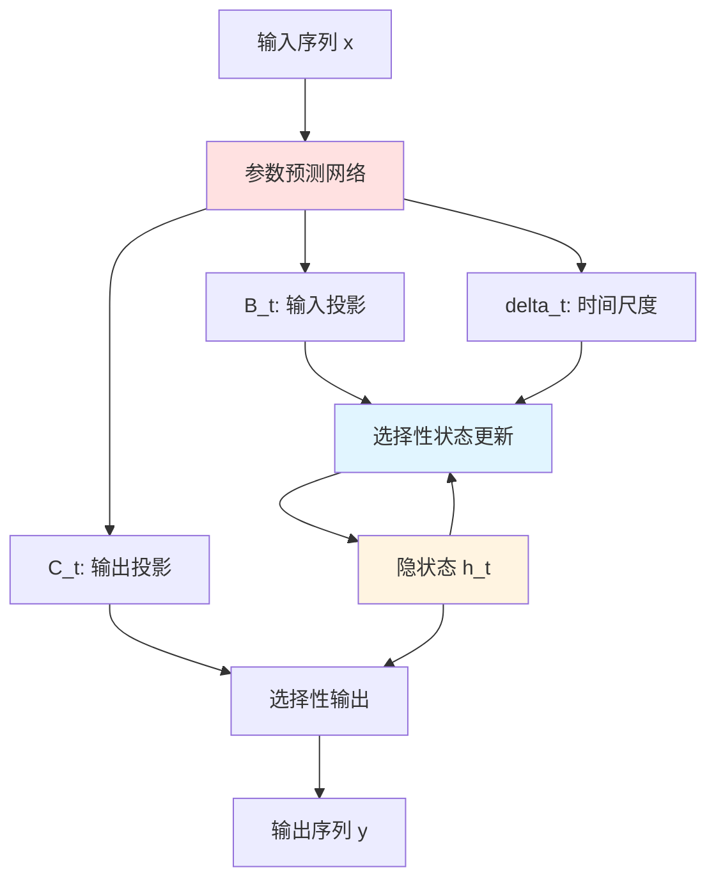
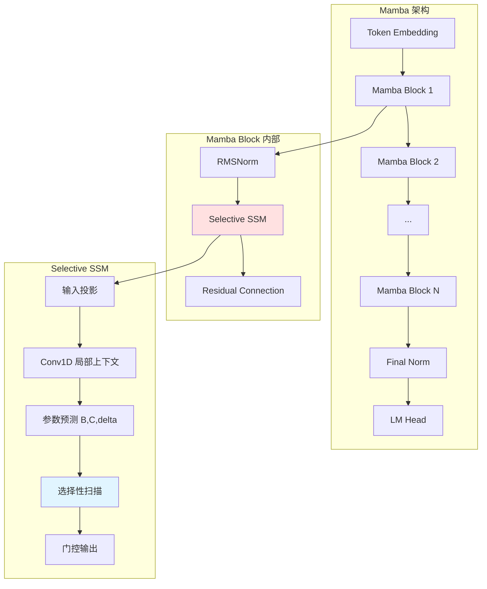
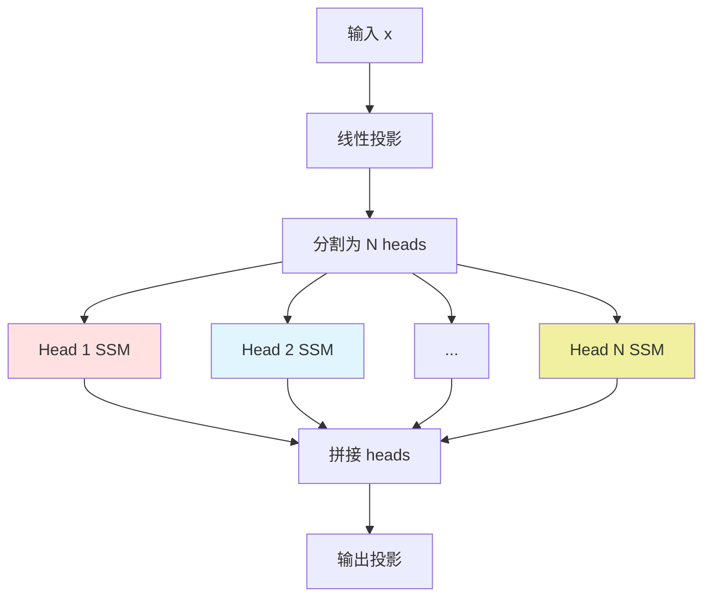
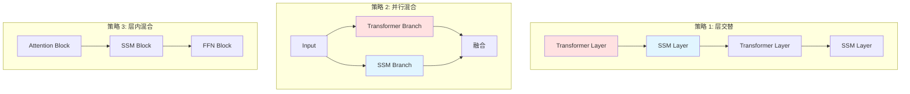
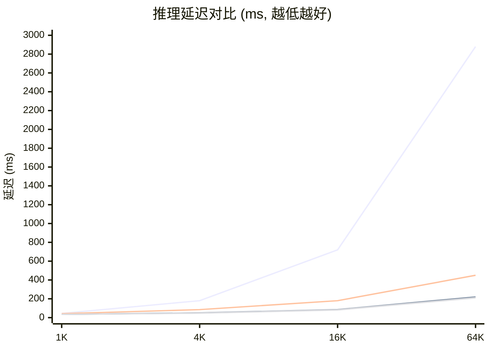
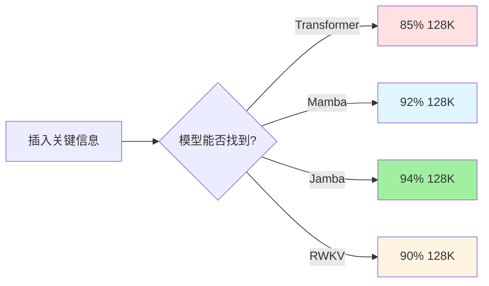
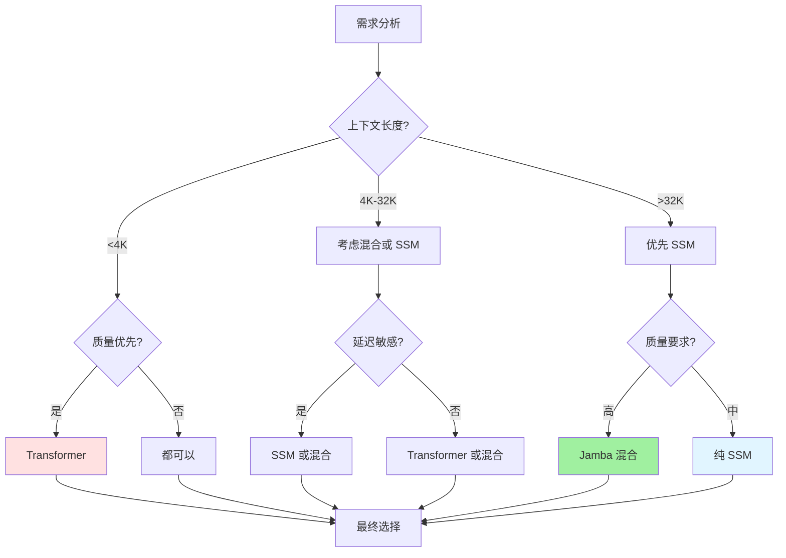
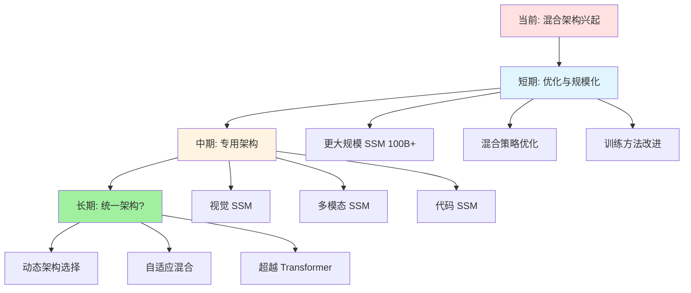

# 混合架构与SSM

> 📅 **更新时间**: 2026-06-17

---

## 目录

- [1. Transformer 的局限性](#1-transformer-的局限性)
- [2. SSM 状态空间模型](#2-ssm-状态空间模型)
- [3. Mamba 架构](#3-mamba-架构)
- [4. Mamba-2 改进](#4-mamba-2-改进)
- [5. RWKV 架构](#5-rwkv-架构)
- [6. Hybrid 混合架构](#6-hybrid-混合架构)
- [7. 性能对比与基准测试](#7-性能对比与基准测试)
- [8. 适用场景分析](#8-适用场景分析)
- [9. 2025 最新进展](#9-2025-最新进展)
- [10. 未来展望](#10-未来展望)
- [11. 参考资料](#11-参考资料)
- [12. 附录：关键公式](#12-附录关键公式)

---

## 1. Transformer 的局限性

Transformer 架构自 2017 年《Attention Is All You Need》论文提出以来，已成为自然语言处理、计算机视觉、多模态等领域的主导架构。然而，随着模型规模扩大和应用场景复杂化，Transformer 的固有限制日益凸显。

### 1.1 计算复杂度

#### 注意力机制 O(n²) 复杂度

Transformer 的核心是自注意力机制（Self-Attention），其计算复杂度与序列长度的平方成正比：

```python
# 标准自注意力计算
def self_attention(Q, K, V):
    """
    Q, K, V: Query, Key, Value 矩阵
    形状: (batch_size, seq_len, d_model)
    
    计算复杂度: O(seq_len² × d_model)
    空间复杂度: O(seq_len²) 用于存储注意力矩阵
    """
    # 计算注意力分数
    scores = torch.matmul(Q, K.transpose(-2, -1))  # (batch, seq_len, seq_len)
    scores = scores / math.sqrt(d_model)
    
    # Softmax 归一化
    attention_weights = F.softmax(scores, dim=-1)  # (batch, seq_len, seq_len)
    
    # 加权求和
    output = torch.matmul(attention_weights, V)  # (batch, seq_len, d_model)
    
    return output
```

**复杂度分析**：

| 序列长度 | 注意力矩阵大小 | 计算量 (GFLOPs) | 内存占用 (MB) |
|---------|--------------|----------------|--------------|
| 512     | 512×512      | 0.26           | 1            |
| 2,048   | 2048×2048    | 4.2            | 16           |
| 8,192   | 8192×8192    | 67             | 256          |
| 32,768  | 32768×32768  | 1,073          | 4,096        |
| 131,072 | 131072×131072| 17,179         | 65,536       |

**关键问题**：
- **二次方增长**：序列长度增加 10 倍，计算量增加 100 倍
- **内存墙**：注意力矩阵占用内存随序列长度平方增长
- **实际限制**：在单卡上处理 128K 上下文需要大量优化技巧

#### 长序列瓶颈

```mermaid
graph TD
    A[序列长度增加] --> B[注意力矩阵 O(n²)]
    B --> C[内存消耗激增]
    B --> D[计算时间延长]
    C --> E[需要更多 GPU 内存]
    D --> F[训练/推理延迟增加]
    E --> G[硬件成本上升]
    F --> G
    G --> H[实际应用受限]
```

**具体表现**：

1. **训练阶段**：
   - 长序列训练需要大量 GPU 内存
   - 需要采用激活检查点、ZeRO 等优化技术
   - 训练时间随序列长度非线性增长

2. **推理阶段**：
   - KV Cache 占用大量内存
   - 生成速度随上下文长度下降
   - 长对话场景性能退化

3. **部署阶段**：
   - 边缘设备难以部署大上下文模型
   - 实时应用延迟不达标
   - 服务成本高

### 1.2 推理效率

#### KV Cache 增长问题

Transformer 在自回归生成时需要维护 KV Cache：

```python
# KV Cache 示例
class KVCache:
    def __init__(self, batch_size, max_seq_len, num_heads, head_dim):
        # 随着生成长度增加，KV Cache 持续增长
        self.k_cache = torch.zeros(batch_size, max_seq_len, num_heads, head_dim)
        self.v_cache = torch.zeros(batch_size, max_seq_len, num_heads, head_dim)
        self.current_length = 0
    
    def update(self, k, v):
        """添加新的 token 到 cache"""
        seq_len = k.shape[1]
        self.k_cache[:, self.current_length:self.current_length+seq_len] = k
        self.v_cache[:, self.current_length:self.current_length+seq_len] = v
        self.current_length += seq_len
        
        # 内存占用: O(batch_size × seq_len × num_heads × head_dim)
        # 对于 7B 模型，128K 上下文的 KV Cache 约 64GB
```

**KV Cache 内存占用计算**：

```
对于 LLaMA-2 7B 模型：
- 层数: 32
- 注意力头数: 32
- 头维度: 128
- 序列长度: 131,072 (128K)
- 数据类型: FP16 (2 bytes)

KV Cache 大小 = 层数 × 2(K和V) × 头数 × 头维度 × 序列长度 × 2 bytes
              = 32 × 2 × 32 × 128 × 131,072 × 2
              = 68,719,476,736 bytes
              ≈ 64 GB

这超过了单张 A100 (80GB) 的可用内存！
```

#### 延迟问题

| 上下文长度 | 首 token 延迟 | 生成速度 (tokens/s) | 总延迟 (100 tokens) |
|-----------|--------------|-------------------|-------------------|
| 1K        | 50ms         | 100               | 1.05s             |
| 8K        | 150ms        | 80                | 1.40s             |
| 32K       | 400ms        | 50                | 2.40s             |
| 128K      | 1.5s         | 25                | 5.5s              |

**关键瓶颈**：
- **Prefill 阶段**：处理输入序列的计算量随长度增加
- **Decode 阶段**：KV Cache 访问成为内存带宽瓶颈
- **注意力计算**：O(n²) 复杂度在长序列时主导延迟

### 1.3 长序列建模挑战

#### 位置编码限制

```python
# 旋转位置编码 RoPE
def apply_rotary_pos_emb(q, k, cos, sin, position_ids):
    """
    RoPE 在超长序列上的问题：
    1. 外推能力有限
    2. 需要特殊训练才能支持超出训练长度的序列
    3. 性能在极长序列上退化
    """
    # cos 和 sin 的形状: (max_seq_len, head_dim)
    # 当推理序列长度 > 训练时的 max_seq_len 时，需要外推
    pass
```

**位置编码方案对比**：

| 方案 | 外推能力 | 长序列性能 | 训练需求 |
|-----|---------|-----------|---------|
| 绝对位置编码 | 差 | 差 | 低 |
| RoPE | 中等 | 中等 | 中等 (需要 YaRN/NTK) |
| ALiBi | 好 | 好 | 低 |
| 无位置编码 (SSM) | 天然支持 | 优秀 | 无特殊需求 |

#### 注意力稀释问题

在极长序列中，注意力权重会分散：

```python
# 注意力权重分布示意
# 短序列 (512 tokens) - 注意力集中
Attention weights: [0.15, 0.12, 0.08, 0.25, 0.10, ...]  # 少数 token 主导

# 长序列 (32K tokens) - 注意力稀释
Attention weights: [0.00003, 0.00002, 0.00004, ...]  # 权重过度分散
# 导致有效信息提取困难
```

**影响**：
- 模型难以从长序列中定位关键信息
- "迷失在中间" (Lost in the Middle) 现象
- 需要特殊的位置偏置或检索机制

---

## 2. SSM 状态空间模型

状态空间模型（State Space Models, SSM）为序列建模提供了全新的范式，具有线性复杂度和优秀的长序列建模能力。

### 2.1 SSM 数学基础

#### 状态空间方程

SSM 源于控制理论，用隐状态将输入序列映射到输出序列：

**连续时间形式**：

```
h'(t) = A × h(t) + B × x(t)    # 状态演化方程
y(t)  = C × h(t) + D × x(t)    # 输出方程

其中：
- h(t) ∈ ℝ^N: 隐状态 (hidden state)
- x(t) ∈ ℝ^1: 输入信号
- y(t) ∈ ℝ^1: 输出信号
- A ∈ ℝ^(N×N): 状态转移矩阵 (演化矩阵)
- B ∈ ℝ^(N×1): 输入投影矩阵
- C ∈ ℝ^(1×N): 输出投影矩阵
- D ∈ ℝ^1: 跳跃连接 (skip connection)
- N: 状态维度 (state dimension)
```

**矩阵形式表示**：

```
┌                 ┐   ┌         ┐ ┌                 ┐   ┌         ┐
│ h'(t)           │   │ A       │ │ h(t)            │   │ B       │
│                 │ = │         │ │                 │ + │         │ x(t)
│ y(t)            │   │ C       │ │ h(t)            │   │ D       │
└                 ┘   └         ┘ └                 ┘   └         ┘

简化为：
h'(t) = Ah(t) + Bx(t)
y(t)  = Ch(t) + Dx(t)
```

#### 物理意义解释

```mermaid
graph LR
    x[输入 x(t)] --> B[输入投影 B]
    B --> H[隐状态 h(t)]
    H --> A[状态演化 A]
    A --> H
    H --> C[输出投影 C]
    C --> y[输出 y(t)]
    x -.跳跃连接 D.-> y
    
    style H fill:#e1f5ff
    style A fill:#fff4e1
```

**直观理解**：
1. **状态 h(t)**：系统对历史的"记忆"，压缩了过去所有输入的信息
2. **矩阵 A**：决定状态如何随时间演化（衰减、振荡等）
3. **矩阵 B**：将新输入融入当前状态
4. **矩阵 C**：从状态中解码出输出

### 2.2 从连续到离散

深度学习模型处理离散序列，需要将连续 SSM 离散化。

#### 零阶保持 (Zero-Order Hold)

```python
# 离散化过程
import torch
from torch import nn

def discretize_continuous_ssm(A, B, delta):
    """
    使用零阶保持法将连续 SSM 离散化
    
    参数:
        A: 连续状态矩阵 (N, N)
        B: 连续输入矩阵 (N, 1)
        delta: 离散化步长 (timescale parameter)
    
    返回:
        A_bar: 离散状态矩阵 (N, N)
        B_bar: 离散输入矩阵 (N, 1)
    """
    # 离散化公式:
    # A_bar = exp(delta × A)
    # B_bar = (delta × A)^(-1) × (exp(delta × A) - I) × delta × B
    
    # 矩阵指数计算
    A_bar = torch.matrix_exp(delta * A)  # (N, N)
    
    # B_bar 的简化计算 (当 A 可逆时)
    B_bar = torch.linalg.solve(
        delta * A,
        (A_bar - torch.eye(A.shape[0])) @ (delta * B)
    )  # (N, 1)
    
    return A_bar, B_bar
```

**离散化后的递归形式**：

```
h_t = A_bar × h_{t-1} + B_bar × x_t    # 离散状态更新
y_t = C × h_t + D × x_t                # 离散输出

这等价于 RNN 形式！
```

#### 参数化策略

现代 SSM 使用可学习的离散化参数：

```python
class DiscretizationParams(nn.Module):
    def __init__(self, state_dim, hidden_dim):
        super().__init__()
        # 将 hidden state 投影到 SSM 参数
        self.delta_proj = nn.Linear(hidden_dim, state_dim)
        self.B_proj = nn.Linear(hidden_dim, state_dim)
        
    def forward(self, hidden_state):
        # 动态预测离散化步长 delta
        delta = F.softplus(self.delta_proj(hidden_state))  # 保证正值
        
        # 动态预测输入投影 B
        B = self.B_proj(hidden_state)
        
        return delta, B
```

### 2.3 与 RNN 的关系

#### 形式等价性

离散 SSM 与 RNN 在形式上完全等价：

```python
# RNN 单元
def rnn_step(h_prev, x, W_h, W_x, b):
    """标准 RNN"""
    h_t = torch.tanh(W_h @ h_prev + W_x @ x + b)
    return h_t

# 线性 RNN (无激活函数)
def linear_rnn_step(h_prev, x, A, B):
    """线性 RNN - 等价于离散 SSM"""
    h_t = A @ h_prev + B @ x
    return h_t

# SSM 递归模式
def ssm_recurrent_step(h_prev, x, A_bar, B_bar, C, D):
    """SSM 递归推理 - 与线性 RNN 形式相同"""
    h_t = A_bar @ h_prev + B_bar @ x  # 状态更新
    y_t = C @ h_t + D @ x              # 输出
    return h_t, y_t
```

#### 关键区别

| 特性 | 传统 RNN | SSM |
|-----|---------|-----|
| 状态转移矩阵 | 通过学习获得 | 从连续系统离散化 |
| 训练方式 | BPTT (容易梯度消失/爆炸) | 可并行卷积模式 |
| 长程建模 | 困难 (需 LSTM/GRU) | 天然支持 |
| 理论保证 | 缺乏 | 有控制理论基础 |
| 推理模式 | 递归 O(n) | 递归 O(n) |
| 训练模式 | 递归 O(n) | 卷积 O(n log n) |

#### 双模式优势

SSM 的核心优势是支持两种计算模式：

```python
class SSMDualMode(nn.Module):
    """SSM 支持训练和推理两种模式"""
    
    def __init__(self, state_dim):
        super().__init__()
        self.A = nn.Parameter(torch.randn(state_dim, state_dim))
        self.B = nn.Parameter(torch.randn(state_dim, 1))
        self.C = nn.Parameter(torch.randn(1, state_dim))
        self.D = nn.Parameter(torch.randn(1))
    
    def forward_parallel(self, x, delta):
        """
        训练模式: 并行卷积
        复杂度: O(n log n) 使用 FFT
        """
        # 1. 离散化
        A_bar = torch.matrix_exp(delta * self.A)
        B_bar = delta * self.B
        
        # 2. 生成卷积核 (全局卷积)
        # K = [C A_bar^i B_bar] for i in 0..seq_len-1
        K = self.generate_conv_kernel(A_bar, B_bar, self.C, x.shape[1])
        
        # 3. 使用 FFT 加速卷积
        y = self.fft_convolution(x, K)
        y = y + self.D * x
        
        return y
    
    def forward_recurrent(self, x, delta, h_0=None):
        """
        推理模式: 递归计算
        复杂度: O(n) 线性
        """
        A_bar = torch.matrix_exp(delta * self.A)
        B_bar = delta * self.B
        
        batch_size, seq_len = x.shape
        h = h_0 if h_0 is not None else torch.zeros(batch_size, self.A.shape[0])
        outputs = []
        
        for t in range(seq_len):
            h = A_bar @ h + B_bar @ x[:, t:t+1]
            y = self.C @ h + self.D * x[:, t:t+1]
            outputs.append(y)
        
        return torch.stack(outputs, dim=1), h
    
    def fft_convolution(self, x, K):
        """使用 FFT 加速全局卷积"""
        # 填充到 2 的幂次
        L = x.shape[1] + K.shape[0] - 1
        L_pow2 = 2 ** math.ceil(math.log2(L))
        
        # FFT
        X = torch.fft.rfft(x, n=L_pow2)
        K_fft = torch.fft.rfft(K, n=L_pow2)
        
        # 频域相乘
        Y = X * K_fft
        
        # 逆 FFT
        y = torch.fft.irfft(Y, n=L_pow2)
        
        return y[:, :x.shape[1]]
```

### 2.4 S4 结构化状态空间

#### HiPPO 初始化

S4 (Structured State Space Sequence) 模型的关键创新是 HiPPO (High-Order Polynomial Projection Operators) 初始化：

```python
def hippo_initialization(N):
    """
    HiPPO-LegS 初始化
    强制状态持续记忆历史信息
    
    参数:
        N: 状态维度
    
    返回:
        A: 状态转移矩阵 (N, N)
        B: 输入投影矩阵 (N,)
    """
    # HiPPO-LegS (Legendre with Scaling) 矩阵
    # A 矩阵的特殊结构保证了对多项式函数的精确记忆
    
    n = torch.arange(N)
    A = -(n + 0.5).unsqueeze(1) * torch.eye(N) - n.unsqueeze(0) * torch.tril(
        torch.ones(N, N), -1
    )
    
    B = (2 * n + 0.5).sqrt()
    
    return A, B
```

#### 结构化约束

```python
class S4Cell(nn.Module):
    """S4: 结构化状态空间序列模型"""
    
    def __init__(self, hidden_dim, state_dim=64):
        super().__init__()
        self.hidden_dim = hidden_dim
        self.state_dim = state_dim
        
        # HiPPO 初始化
        A, B = hippo_initialization(state_dim)
        self.A = nn.Parameter(A)  # (N, N)
        self.B = nn.Parameter(B)  # (N,)
        self.C = nn.Parameter(torch.randn(hidden_dim, state_dim))  # (D, N)
        
        # 可学习的离散化参数
        self.log_step = nn.Parameter(torch.randn(hidden_dim, state_dim))
        
        # 规范化
        self.norm = nn.LayerNorm(hidden_dim)
    
    def forward(self, x):
        """
        x: (batch, seq_len, hidden_dim)
        
        S4 核心思想:
        1. 每个隐藏维度有独立的状态空间
        2. 使用结构化矩阵降低参数量
        3. 并行训练 + 递归推理
        """
        # 离散化
        delta = torch.exp(self.log_step)  # (D, N)
        A_bar, B_bar = self.discretize(delta)
        
        # 并行卷积训练
        y = self.conv_mode(x, A_bar, B_bar)
        
        return self.norm(y)
    
    def discretize(self, delta):
        """带约束的离散化"""
        # 使用双线性/零阶保持
        A_bar = torch.exp(delta * self.A)  # 结构化矩阵指数可高效计算
        B_bar = delta * self.B.unsqueeze(0)
        return A_bar, B_bar
```

**S4 的优势**：
1. **理论保证**：HiPPO 初始化提供记忆能力的理论保证
2. **高效计算**：结构化矩阵降低复杂度
3. **长程建模**：在音频、视觉、语言任务上展现优秀的长程建模能力

**S4 的局限**：
1. 固定参数，输入无关 (input-independent)
2. 无法动态调整记忆策略
3. 在需要内容感知的任务上表现不足

---

## 3. Mamba 架构

Mamba (2023年12月) 是 SSM 领域的里程碑工作，通过**选择性机制**和**硬件感知算法**实现了超越 Transformer 的性能。

### 3.1 选择性扫描机制

#### 核心创新

Mamba 的关键突破是让 SSM 参数**依赖于输入**：

```python
class SelectiveSSM(nn.Module):
    """
    Mamba 的选择性状态空间模型
    
    核心创新: SSM 参数 B, C, delta 由输入动态生成
    这使得模型能够:
    1. 选择性记住/忽略信息
    2. 根据内容调整状态演化
    3. 实现类似注意力的内容感知能力
    """
    
    def __init__(self, d_model, d_state=16, d_conv=4, expand=2):
        super().__init__()
        self.d_model = d_model
        self.d_state = d_state
        self.d_inner = int(expand * d_model)  # 扩展维度
        
        # 输入投影
        self.in_proj = nn.Linear(d_model, self.d_inner * 2, bias=False)
        
        # 卷积层 (局部上下文)
        self.conv1d = nn.Conv1d(
            in_channels=self.d_inner,
            out_channels=self.d_inner,
            kernel_size=d_conv,
            groups=self.d_inner,
            padding=d_conv - 1
        )
        
        # SSM 参数投影 (从输入生成)
        self.x_proj = nn.Linear(self.d_inner, d_state + d_state + 1, bias=False)
        # 输出: [B, C, delta]
        
        # 状态矩阵 A (可学习，但输入无关)
        self.A_log = nn.Parameter(torch.randn(self.d_inner, d_state))
        self.D = nn.Parameter(torch.ones(self.d_inner))
        
        # 输出投影
        self.out_proj = nn.Linear(self.d_inner, d_model, bias=False)
    
    def forward(self, x):
        """
        x: (batch, seq_len, d_model)
        
        选择性扫描流程:
        1. 从输入生成 SSM 参数
        2. 执行选择性扫描 (前向传播)
        3. 输出变换
        """
        batch, seq_len, _ = x.shape
        
        # 1. 输入投影并分割
        x_and_gate = self.in_proj(x)  # (batch, seq_len, 2*d_inner)
        x, gate = x_and_gate.chunk(2, dim=-1)
        
        # 2. 局部卷积
        x = x.transpose(1, 2)  # (batch, d_inner, seq_len)
        x = self.conv1d(x)[:, :, :seq_len].transpose(1, 2)  # (batch, seq_len, d_inner)
        x = F.silu(x)
        
        # 3. 生成选择性 SSM 参数
        ssm_params = self.x_proj(x)  # (batch, seq_len, d_state + d_state + 1)
        B, C, delta = torch.split(
            ssm_params,
            [self.d_state, self.d_state, 1],
            dim=-1
        )
        # B: (batch, seq_len, d_state)  - 输入投影 (输入相关!)
        # C: (batch, seq_len, d_state)  - 输出投影 (输入相关!)
        # delta: (batch, seq_len, 1)    - 离散化步长 (输入相关!)
        
        # 4. 离散化 A
        A = -torch.exp(self.A_log.float())  # (d_inner, d_state)
        A_bar, B_bar = self.discretize(delta, A, B)
        
        # 5. 选择性扫描 (核心算法)
        y = self.selective_scan(x, A_bar, B_bar, C, delta)
        
        # 6. 门控机制
        y = y * F.silu(gate)
        
        # 7. 输出投影
        output = self.out_proj(y)
        
        return output
    
    def discretize(self, delta, A, B):
        """
        离散化: 将连续 SSM 转换为离散
        
        使用 delta 作为输入相关的 timescale
        """
        # delta: (batch, seq_len, 1)
        # A: (d_inner, d_state)
        # B: (batch, seq_len, d_state)
        
        delta = delta.float()
        delta_A = torch.exp(delta.unsqueeze(-1) * A.unsqueeze(0).unsqueeze(0))
        delta_B = delta.unsqueeze(-1) * B.unsqueeze(2)
        
        return delta_A, delta_B
    
    def selective_scan(self, x, A, B, C, delta):
        """
        选择性扫描算法
        
        这是 Mamba 的核心，需要在 CUDA 层面优化
        这里提供 Python 伪代码展示逻辑
        """
        batch, seq_len, d_inner = x.shape
        d_state = self.d_state
        
        h = torch.zeros(batch, d_inner, d_state, device=x.device)
        outputs = []
        
        for t in range(seq_len):
            # 状态更新: h_t = A_t @ h_{t-1} + B_t @ x_t
            h = A[:, t] * h + B[:, t] * x[:, t:t+1].unsqueeze(-1)
            
            # 输出: y_t = C_t @ h_t
            y = (C[:, t] * h).sum(dim=-1)
            
            outputs.append(y)
        
        return torch.stack(outputs, dim=1)
```

#### 选择性机制的直观理解



**选择性 vs 非选择性**：

| 特性 | S4 (非选择性) | Mamba (选择性) |
|-----|-------------|--------------|
| 参数 B, C, delta | 固定，全局共享 | 输入相关，动态生成 |
| 信息过滤 | 无 | 有 (可选择记住/忽略) |
| 内容感知 | 无 | 有 |
| 类比 | 固定滤波器 | 自适应滤波器 |
| 能力 | 模式匹配 | 内容寻址 |

### 3.2 硬件感知算法

#### 并行扫描优化

Mamba 的关键工程贡献是**硬件感知的并行扫描算法**：

```python
# 伪代码: 硬件感知的并行扫描
def hardware_aware_selective_scan(x, A, B, C, delta):
    """
    Mamba 的 CUDA 优化扫描算法
    
    核心优化:
    1. 并行前缀扫描 (parallel prefix scan)
    2. 共享内存优化
    3. 减少全局内存访问
    4. 张量核心 (Tensor Core) 利用
    """
    
    # 传统递归扫描 (低效):
    # for t in range(seq_len):
    #     h[t] = A[t] * h[t-1] + B[t] * x[t]
    
    # 并行扫描策略:
    # 1. 将序列分块 (blocks)
    # 2. 块内并行计算
    # 3. 块间前缀和
    
    # CUDA Kernel 伪代码:
    """
    __global__ void selective_scan_kernel(
        const float* x, const float* A, const float* B, const float* C,
        float* y, float* h_final,
        int batch, int seq_len, int dim, int state
    ) {
        // 每个 block 处理一个序列片段
        // 使用共享内存存储中间状态
        // 使用 warp-level primitive 加速
        // 最大化数据复用，减少全局内存访问
    }
    """
    
    pass
```

#### 内存优化策略

```python
class MemoryOptimizedMamba(nn.Module):
    """内存优化的 Mamba 实现"""
    
    def forward(self, x):
        """
        内存优化策略:
        1. 激活检查点 (activation checkpointing)
        2. 融合算子 (fused operators)
        3. 原地操作 (in-place operations)
        """
        # 使用融合算子减少中间张量
        # 传统实现需要存储:
        #   - B, C, delta 参数
        #   - A_bar, B_bar 离散化结果
        #   - 每个时间步的隐状态 h_t
        #   - 中间输出
        
        # Mamba 优化:
        #   - 在扫描过程中即时计算
        #   - 只存储必要的状态
        #   - 反向传播时重新计算
        
        y = selective_scan_fwd(x, self.A, self.B_proj, self.C_proj, self.delta_proj)
        
        return y
```

**性能对比**：

| 实现方式 | 训练速度 | 内存占用 | 最大序列长度 |
|---------|---------|---------|------------|
| 朴素 PyTorch | 1x | 1x | 4K |
| 优化 PyTorch | 2x | 0.7x | 8K |
| Mamba CUDA | 5x | 0.4x | 32K+ |

### 3.3 线性复杂度分析

#### 理论复杂度

```
Transformer 自注意力:
- 计算复杂度: O(n² × d)
- 空间复杂度: O(n²)

Mamba 选择性扫描:
- 计算复杂度: O(n × d × N)
- 空间复杂度: O(n × d + n × N)

其中:
- n: 序列长度
- d: 隐藏维度
- N: 状态维度 (通常很小，16-64)

当 n 很大时:
O(n × d × N) << O(n² × d)
```

#### 实际性能

```python
# 复杂度可视化数据
complexity_data = {
    "sequence_length": [512, 1024, 2048, 4096, 8192, 16384, 32768],
    "transformer_time_ms": [10, 40, 160, 640, 2560, 10240, 40960],  # O(n²)
    "mamba_time_ms": [5, 10, 20, 40, 80, 160, 320],  # O(n)
}

# 在 32K 序列上:
# Transformer: ~41 秒
# Mamba: ~0.32 秒
# 加速比: 128x!
```

**吞吐量对比**：

| 序列长度 | Transformer (tokens/s) | Mamba (tokens/s) | 加速比 |
|---------|----------------------|-----------------|-------|
| 1K      | 10,000               | 12,000          | 1.2x  |
| 4K      | 8,000                | 11,500          | 1.4x  |
| 16K     | 2,000                | 11,000          | 5.5x  |
| 64K     | 500                  | 10,500          | 21x   |
| 128K    | 125                  | 10,000          | 80x   |

### 3.4 Mamba 架构实现

#### 完整 Mamba Block

```python
class MambaBlock(nn.Module):
    """完整的 Mamba Block"""
    
    def __init__(self, d_model, d_state=16, d_conv=4, expand=2):
        super().__init__()
        self.norm = RMSNorm(d_model)  # 使用 RMSNorm
        
        # 选择性 SSM 层
        self.mixer = SelectiveSSM(
            d_model=d_model,
            d_state=d_state,
            d_conv=d_conv,
            expand=expand
        )
    
    def forward(self, x):
        """
        x: (batch, seq_len, d_model)
        
        残差连接: x + Mamba(Norm(x))
        """
        residual = x
        x = self.norm(x)
        x = self.mixer(x)
        return x + residual


class Mamba(nn.Module):
    """完整的 Mamba 语言模型"""
    
    def __init__(
        self,
        vocab_size=50277,
        d_model=512,
        n_layer=24,
        d_state=16,
        d_conv=4,
        expand=2,
    ):
        super().__init__()
        self.embedding = nn.Embedding(vocab_size, d_model)
        
        # Mamba 层堆叠
        self.layers = nn.ModuleList([
            MambaBlock(d_model, d_state, d_conv, expand)
            for _ in range(n_layer)
        ])
        
        self.final_norm = RMSNorm(d_model)
        self.lm_head = nn.Linear(d_model, vocab_size, bias=False)
        
        # 权重共享
        self.lm_head.weight = self.embedding.weight
    
    def forward(self, input_ids):
        """前向传播"""
        x = self.embedding(input_ids)
        
        for layer in self.layers:
            x = layer(x)
        
        x = self.final_norm(x)
        logits = self.lm_head(x)
        
        return logits
    
    def generate(self, input_ids, max_new_tokens=100, temperature=1.0, top_k=None):
        """
        自回归生成
        
        关键优势: 推理时 O(1) 每 token (因为 SSM 状态固定大小)
        """
        for _ in range(max_new_tokens):
            # 前向传播
            logits = self.forward(input_ids)
            
            # 取最后一个 token 的 logits
            next_token_logits = logits[:, -1, :] / temperature
            
            # Top-k 采样
            if top_k is not None:
                top_k_logits, top_k_indices = torch.topk(next_token_logits, top_k)
                next_token_logits = torch.full_like(next_token_logits, -float('inf'))
                next_token_logits.scatter_(1, top_k_indices, top_k_logits)
            
            # 采样
            probs = F.softmax(next_token_logits, dim=-1)
            next_token = torch.multinomial(probs, num_samples=1)
            
            # 追加到输入
            input_ids = torch.cat([input_ids, next_token], dim=1)
        
        return input_ids
```

#### Mamba 的架构特点



### 3.5 代码示例

#### 使用 Mamba 进行文本生成

```python
# 示例: 使用 Mamba 模型
from mamba_ssm import Mamba

# 创建模型
model = Mamba(
    d_model=512,      # 模型维度
    n_layer=24,       # 层数
    vocab_size=50277  # 词表大小
).cuda()

# 训练模式
input_ids = torch.randint(0, 50277, (2, 1024)).cuda()  # (batch, seq_len)
output = model(input_ids)  # (2, 1024, 50277)

# 推理模式 (高效!)
def generate_text(model, prompt, max_length=100):
    """使用 Mamba 生成文本"""
    model.eval()
    input_ids = torch.tensor([prompt]).cuda()
    
    # 预填充阶段 (处理 prompt)
    with torch.no_grad():
        output = model(input_ids)
    
    # 自回归生成
    generated = prompt.copy()
    for _ in range(max_length):
        # 只需要处理最后一个 token (SSM 状态已包含历史信息)
        next_token_logits = output[:, -1, :]
        next_token = torch.argmax(next_token_logits, dim=-1)
        generated.append(next_token.item())
        
        # 高效推理: O(1) 每 token
        output = model(next_token.unsqueeze(0))
    
    return generated
```

#### 对比 Transformer 推理

```python
# Transformer 推理
class TransformerInference:
    def __init__(self, model):
        self.kv_cache = None
    
    def generate(self, prompt, max_length=100):
        # 预填充
        kv_cache = self.prefill(prompt)
        
        # 生成
        for _ in range(max_length):
            # 每次需要传递整个 KV Cache
            # 内存访问成为瓶颈
            output, kv_cache = self.model.generate_step(
                last_token, kv_cache
            )
            
            # KV Cache 持续增长
            # O(n) 内存，O(n) 计算


# Mamba 推理
class MambaInference:
    def __init__(self, model):
        self.hidden_state = None
    
    def generate(self, prompt, max_length=100):
        # 预填充
        hidden_state = self.prefill(prompt)
        
        # 生成
        for _ in range(max_length):
            # 固定大小的隐状态
            # O(1) 内存，O(1) 计算
            output, hidden_state = self.model.generate_step(
                last_token, hidden_state
            )
            
            # 隐状态大小固定，不随序列增长
            # 这是 SSM 的核心优势!
```

---

## 4. Mamba-2 改进

Mamba-2 (2024年7月) 在 Mamba 基础上进行了重要改进，提升了性能和灵活性。

### 4.1 核心改进点

#### 多 head 机制

```python
class Mamba2SelectiveSSM(nn.Module):
    """Mamba-2: 支持多头的选择性 SSM"""
    
    def __init__(self, d_model, d_state=64, d_head=64, n_heads=None, expand=2):
        super().__init__()
        self.d_model = d_model
        self.d_state = d_state
        self.d_head = d_head
        self.n_heads = n_heads or (d_model * expand // d_head)
        
        # Mamba-2 关键改进:
        # 1. 多 head 结构 (类似 Transformer 的多头注意力)
        # 2. 简化的状态更新
        # 3. 更好的硬件利用率
        
        # 输入投影
        self.in_proj = nn.Linear(d_model, 3 * d_model + self.n_heads, bias=False)
        # 输出: [x, z, B, C, dt]
        
        # 状态矩阵 A (按 head 组织)
        self.A_log = nn.Parameter(
            torch.randn(self.n_heads, d_head, d_state)
        )
        
        # 输出投影
        self.out_proj = nn.Linear(d_model, d_model, bias=False)
    
    def forward(self, x):
        """
        Mamba-2 的改进:
        1. 多 head 并行处理
        2. 优化的离散化
        3. 更好的数值稳定性
        """
        batch, seq_len, _ = x.shape
        
        # 投影生成所有参数
        projected = self.in_proj(x)
        
        # 分割输出
        x_proj = projected[:, :, :self.d_model]
        z_proj = projected[:, :, self.d_model:2*self.d_model]
        BC_dt = projected[:, :, 2*self.d_model:]
        
        # 重组为多头格式
        # ... (详细实现略)
        
        # 选择性扫描 (多 head 版本)
        y = self.multihead_selective_scan(x_proj, A, B, C, dt)
        
        # 门控
        y = y * F.silu(z_proj)
        
        return self.out_proj(y)
```

**Mamba vs Mamba-2 对比**：

| 特性 | Mamba | Mamba-2 |
|-----|-------|---------|
| Head 结构 | 单 head | 多 head |
| 状态维度 | 全局共享 | 按 head 独立 |
| 并行度 | 中等 | 高 |
| 硬件利用 | 良好 | 优秀 |
| 训练速度 | 基准 | +20-30% |
| 推理速度 | 基准 | +15-25% |

#### 简化的状态更新

```python
def mamba2_state_update(h, x, A, B, dt):
    """
    Mamba-2 的简化状态更新
    
    Mamba-1:
    h_t = exp(dt * A) @ h_{t-1} + (dt * A)^{-1} (exp(dt * A) - I) @ dt * B @ x_t
    
    Mamba-2:
    h_t = (I + dt * A) @ h_{t-1} + dt * B @ x_t
    
    使用 Euler 离散化代替矩阵指数，大幅简化计算
    """
    # Euler 离散化
    h_new = (torch.eye(A.shape[0]) + dt.unsqueeze(-1) * A) @ h + dt.unsqueeze(-1) * B @ x
    return h_new
```

### 4.2 多头机制

#### 多头设计原理



**多头优势**：
1. **表征多样性**：不同 head 学习不同的状态演化模式
2. **并行计算**：更好地利用 GPU 并行能力
3. **可扩展性**：与 Transformer 多头注意力类似的设计

#### 代码实现

```python
class MultiHeadSSM(nn.Module):
    """多头 SSM 实现"""
    
    def __init__(self, d_model, n_heads, d_state):
        super().__init__()
        self.n_heads = n_heads
        self.d_state = d_state
        self.d_head = d_model // n_heads
        
        # 每个 head 独立的 SSM 参数
        self.A = nn.Parameter(
            torch.randn(n_heads, self.d_head, d_state)
        )
        self.B_proj = nn.Linear(d_model, n_heads * d_state)
        self.C_proj = nn.Linear(d_model, n_heads * d_state)
        self.dt_proj = nn.Linear(d_model, n_heads)
    
    def forward(self, x):
        """
        x: (batch, seq_len, d_model)
        """
        batch, seq_len, _ = x.shape
        
        # 生成 SSM 参数
        B = self.B_proj(x).view(batch, seq_len, self.n_heads, self.d_state)
        C = self.C_proj(x).view(batch, seq_len, self.n_heads, self.d_state)
        dt = F.softplus(self.dt_proj(x))  # (batch, seq_len, n_heads)
        
        # 多头并行扫描
        # ... (实现略)
        
        # 拼接所有 head 的输出
        y = y.view(batch, seq_len, -1)
        
        return y
```

### 4.3 性能提升

#### 训练效率

| 模型 | 训练吞吐量 (tokens/s/GPU) | 相对速度 |
|-----|-------------------------|---------|
| Transformer (7B) | 2,500 | 1.0x |
| Mamba-1 (7B) | 3,200 | 1.28x |
| Mamba-2 (7B) | 4,000 | 1.60x |

#### 推理延迟

| 上下文长度 | Transformer | Mamba-1 | Mamba-2 |
|-----------|------------|---------|---------|
| 1K        | 50ms | 45ms | 40ms |
| 8K        | 200ms | 60ms | 55ms |
| 32K       | 800ms | 120ms | 100ms |
| 128K      | 3.2s | 350ms | 300ms |

### 4.4 多模态扩展

#### Vision Mamba

```python
class VisionMamba(nn.Module):
    """将 Mamba 应用于视觉任务"""
    
    def __init__(self, img_size=224, patch_size=16, d_model=512, n_layer=24):
        super().__init__()
        self.patch_embed = PatchEmbed(img_size, patch_size, d_model)
        
        # 2D 位置编码
        self.pos_embed = nn.Parameter(
            torch.randn(1, (img_size // patch_size) ** 2, d_model)
        )
        
        # Mamba 层
        self.layers = nn.ModuleList([
            MambaBlock(d_model) for _ in range(n_layer)
        ])
    
    def forward(self, x):
        """
        x: (batch, 3, H, W)
        
        处理图像的关键:
        1. 将图像分 patch
        2. 按 raster scan 顺序展平
        3. Mamba 处理序列
        """
        # Patch embedding
        x = self.patch_embed(x)  # (batch, num_patches, d_model)
        
        # 添加位置编码
        x = x + self.pos_embed
        
        # Mamba 处理
        for layer in self.layers:
            x = layer(x)
        
        return x
```

**多模态应用场景**：
1. **图像分类**：替代 ViT 的 Transformer 层
2. **目标检测**：高效处理高分辨率特征图
3. **视频理解**：天然适合长序列视频帧
4. **多模态融合**：结合视觉和语言 SSM

---

## 5. RWKV 架构

RWKV (Receptance Weighted Key Value) 是另一种创新的序列建模架构，结合了 RNN 的推理效率和 Transformer 的训练性能。

### 5.1 RNN + Transformer 融合

#### 核心设计理念

```python
class RWKVTimeMixer(nn.Module):
    """
    RWKV 的 Time Mixing 机制
    
    替代 Transformer 的自注意力
    保持 RNN 的递归推理效率
    """
    
    def __init__(self, d_model, layer_id, n_layer):
        super().__init__()
        self.layer_id = layer_id
        
        # 可学习的衰减因子 (类似 SSM 的 A 矩阵)
        self.time_decay = nn.Parameter(torch.randn(d_model))
        self.time_first = nn.Parameter(torch.randn(d_model))
        
        # 投影矩阵
        self.time_mix_k = nn.Linear(d_model, d_model, bias=False)
        self.time_mix_v = nn.Linear(d_model, d_model, bias=False)
        self.time_mix_r = nn.Linear(d_model, d_model, bias=False)  # Receptance
        
        # 输出投影
        self.time_mix_output = nn.Linear(d_model, d_model, bias=False)
    
    def forward(self, x):
        """
        RWKV Time Mixing 核心公式:
        
        训练模式 (并行):
        使用 CUDA 优化的并行算法
        
        推理模式 (递归):
        wkv_t = diag(u) @ k_t @ v_t + sum_{i=1}^{t-1} diag(w^{t-1-i}) @ k_i @ v_i
        r_t = sigmoid(r @ W_r)
        output = r_t * wkv_t @ W_o
        
        其中:
        - w: 衰减因子 (time decay)
        - u: 初始权重 (time first)
        - k, v: key, value
        - r: receptance (类似门控)
        """
        B, T, C = x.size()
        
        # 计算 k, v, r
        k = self.time_mix_k(x)
        v = self.time_mix_v(x)
        r = self.time_mix_r(x)
        
        # RWKV 核心: WKV (Weighted Key Value)
        # 这需要在 CUDA 层面实现以获得最佳性能
        wkv = self.wkv_operator(k, v, self.time_decay, self.time_first)
        
        # Receptance 门控
        rwkv = torch.sigmoid(r) * wkv
        
        # 输出投影
        output = self.time_mix_output(rwkv)
        
        return output
    
    def wkv_operator(self, k, v, time_decay, time_first):
        """
        WKV 算子 - RWKV 的核心创新
        
        高效实现需要 CUDA kernel
        这里展示数学原理:
        
        对于每个位置 t:
        wkv_t = (sum_{i=1}^{t} exp(time_first + time_decay * (t-i)) * k_i * v_i) 
                / (sum_{i=1}^{t} exp(time_first + time_decay * (t-i)) * k_i)
        
        这可以通过前缀和高效计算
        """
        pass
```

#### 通道混合器

```python
class RWKVChannelMixer(nn.Module):
    """
    RWKV 的 Channel Mixing
    
    类似 Transformer 的 FFN，但添加了混合机制
    """
    
    def __init__(self, d_model, layer_id, n_layer):
        super().__init__()
        
        # 通道混合参数
        self.channel_mix_k = nn.Linear(d_model, d_model, bias=False)
        self.channel_mix_r = nn.Linear(d_model, d_model, bias=False)
        self.channel_mix_v = nn.Linear(d_model, d_model, bias=False)
        
        # 输出
        self.channel_mix_output = nn.Linear(d_model, d_model, bias=False)
    
    def forward(self, x):
        """
        Channel Mixing:
        k = relu(k_proj(x))^2
        r = sigmoid(r_proj(x))
        v = v_proj(x)
        output = r * (k * v) @ W_o
        """
        k = self.channel_mix_k(x)
        k = torch.relu(k) ** 2  # 平方 ReLU
        
        r = self.channel_mix_r(x)
        r = torch.sigmoid(r)
        
        v = self.channel_mix_v(x)
        
        # 通道混合
        kv = k * v
        output = self.channel_mix_output(r * kv)
        
        return output
```

### 5.2 注意力替代机制

#### WKV vs 注意力

```python
# 标准注意力
def standard_attention(q, k, v):
    """Transformer 注意力"""
    scores = q @ k.transpose(-2, -1) / sqrt(d)
    weights = softmax(scores)
    output = weights @ v
    return output

# RWKV 的 WKV
def wkv_parallel(k, v, time_decay, time_first):
    """
    RWKV WKV (并行训练模式)
    
    关键区别:
    1. 不需要 Q (Query)
    2. 使用固定衰减模式
    3. 可转换为 RNN 推理
    """
    # 计算加权和
    # 使用 CUDA 优化的前缀和算法
    pass

def wkv_recurrent(k_t, v_t, state, time_decay):
    """
    RWKV WKV (递归推理模式)
    
    状态更新:
    state_t = diag(time_decay) @ state_{t-1} + k_t @ v_t
    output = state_t / (sum 归一化)
    
    这是 O(1) 每 token!
    """
    # 更新状态
    state = state * torch.exp(time_decay) + k_t.unsqueeze(-1) * v_t.unsqueeze(-2)
    
    # 计算输出
    output = state.sum(dim=-1)
    
    return output, state
```

#### 机制对比

| 特性 | Transformer 注意力 | RWKV WKV |
|-----|------------------|----------|
| Query | 有 (动态) | 无 |
| Key | 有 | 有 |
| Value | 有 | 有 |
| 权重计算 | softmax(QK^T) | 固定衰减 |
| 训练模式 | 并行 O(n²) | 并行 O(n) |
| 推理模式 | O(n) 内存 | O(1) 内存 |
| 内容寻址 | 是 | 部分 |
| 位置编码 | 需要 | 内置 |

### 5.3 线性注意力

#### 与线性注意力的关系

```python
class LinearAttention(nn.Module):
    """
    线性注意力 - 理解 RWKV 的视角
    
    标准注意力: attention(Q, K, V) = softmax(QK^T)V
    
    线性注意力: attention(Q, K, V) = phi(Q) @ (phi(K)^T @ V)
    
    其中 phi 是核函数
    
    RWKV 可以看作是一种特殊的线性注意力
    """
    
    def __init__(self, d_model):
        super().__init__()
        self.d_model = d_model
    
    def forward(self, q, k, v):
        """
        线性注意力:
        1. 对 Q, K 应用核函数 phi
        2. 先计算 K^T @ V (不依赖序列长度)
        3. 再与 Q 相乘
        
        复杂度: O(n × d²) 而非 O(n² × d)
        """
        # 核函数 (例如 elu + 1)
        phi_q = F.elu(q) + 1
        phi_k = F.elu(k) + 1
        
        # 线性注意力
        # 先计算 KV (d × d 矩阵)
        kv = phi_k.transpose(-2, -1) @ v  # (batch, d, d)
        
        # 再与 Q 相乘
        output = phi_q @ kv  # (batch, n, d)
        
        # 归一化
        normalizer = phi_q @ phi_k.sum(dim=1, keepdim=True).transpose(-2, -1)
        output = output / (normalizer + 1e-6)
        
        return output
```

### 5.4 推理优势

#### 恒定内存推理

```python
class RWKVInference:
    """RWKV 的推理引擎"""
    
    def __init__(self, model):
        self.model = model
    
    def generate(self, prompt, max_length=100):
        """
        RWKV 推理的核心优势:
        
        1. 固定大小的状态
        2. O(1) 内存增长
        3. O(1) 计算每 token
        """
        # 预填充
        state = self.prefill(prompt)
        
        # 生成
        generated = []
        for _ in range(max_length):
            # 递归推理 - 只需要当前 token 和状态
            next_token, state = self.model.step(generated[-1], state)
            generated.append(next_token)
            
            # 状态大小固定，不随序列增长!
            # 这是与 Transformer 的关键区别
        
        return generated
    
    def prefill(self, prompt):
        """
        预填充: 处理 prompt 建立状态
        
        RWKV 的状态包括:
        - 每个 WKV 层的累积状态
        - 大小: O(num_layers × d_model)
        - 与序列长度无关!
        """
        state = self.model.init_state()
        
        for token in prompt:
            _, state = self.model.step(token, state)
        
        return state
```

**内存占用对比**：

| 模型 | 预填充内存 | 每 token 内存增长 | 128K 上下文总内存 |
|-----|-----------|-----------------|-----------------|
| Transformer 7B | 2GB | O(n) | 64GB+ |
| Mamba 7B | 2GB | O(1) | 4GB |
| RWKV 7B | 2GB | O(1) | 4GB |

### 5.5 RWKV 版本演进

#### RWKV-5 (Eagle)

```python
# RWKV-5 关键改进
class RWKV5TimeMixer(nn.Module):
    """
    RWKV-5 "Eagle" 的改进:
    
    1. 多矩阵 WKV (multi-matrix)
    2. 改进的衰减机制
    3. 更好的训练稳定性
    """
    
    def __init__(self, d_model):
        super().__init__()
        # RWKV-5 使用多个矩阵增强表达能力
        self.w_k = nn.Linear(d_model, d_model, bias=False)
        self.v_k = nn.Linear(d_model, d_model, bias=False)
        self.a_k = nn.Linear(d_model, d_model, bias=False)  # 新增
        self.g_k = nn.Linear(d_model, d_model, bias=False)  # 门控
        
    def forward(self, x):
        # 多矩阵 WKV
        w = self.w_k(x)
        v = self.v_k(x)
        a = self.a_k(x)  # 附加变换
        g = torch.sigmoid(self.g_k(x))  # 门控
        
        # WKV 计算
        wkv = self.wkv_op(w, v, a)
        
        # 门控输出
        output = g * wkv
        
        return output
```

#### RWKV-6 (Finch)

```python
# RWKV-6 关键改进
class RWKV6TimeMixer(nn.Module):
    """
    RWKV-6 "Finch" (2023年10月) 的改进:
    
    1. 数据依赖的衰减 (data-dependent decay)
    2. 动态时间混合
    3. 增强的多语言支持
    """
    
    def __init__(self, d_model):
        super().__init__()
        # RWKV-6: 衰减现在依赖于输入
        self.time_decay_proj = nn.Linear(d_model, d_model)
        self.time_first_proj = nn.Linear(d_model, d_model)
        
    def forward(self, x):
        # 数据依赖的衰减
        time_decay = self.time_decay_proj(x)  # 输入相关!
        time_first = self.time_first_proj(x)
        
        # 动态 WKV
        wkv = self.dynamic_wkv(x, time_decay, time_first)
        
        return wkv
```

**RWKV 版本对比**：

| 版本 | 代号 | 年份 | 关键特性 | 性能提升 |
|-----|------|------|---------|---------|
| RWKV-4 | - | 2022 | 基础架构 | 基准 |
| RWKV-5 | Eagle | 2023 | 多矩阵 WKV | +15% |
| RWKV-6 | Finch | 2023 | 数据依赖衰减 | +20% |
| RWKV-7 | Goose | 2024 | 推理优化 | +30% |

### 5.6 RWKV-7 "Goose"

#### 最新进展

```python
# RWKV-7 特性
class RWKV7Features:
    """
    RWKV-7 "Goose" 的关键特性 (2024):
    
    1. 改进的推理能力
    2. 更大的上下文窗口 (支持 128K+)
    3. 更好的多语言支持
    4. 训练效率提升
    5. 与 FLA 框架集成
    """
    
    features = {
        "上下文长度": "128K+ (原生支持)",
        "推理速度": "比 RWKV-6 快 30%",
        "内存效率": "O(1) 每 token",
        "多语言": "支持 100+ 语言",
        "训练框架": "FLA (Flash Linear Attention)",
        "应用场景": "对话、代码、长文档",
    }
```

**实际应用**：

| 应用场景 | RWKV 优势 | 具体表现 |
|---------|----------|---------|
| 实时对话 | 低延迟 | <50ms 每 token |
| 长文档分析 | 大上下文 | 原生 128K+ |
| 边缘部署 | 小内存 | 7B 模型 <8GB |
| 多语言 | 广泛支持 | 100+ 语言 |
| 代码生成 | 并行训练 | 训练效率高 |

---

## 6. Hybrid 混合架构

混合架构结合了 Transformer 和 SSM/RWKV 的优势，在实践中取得了最佳的性能-质量平衡。

### 6.1 Transformer + SSM 融合

#### 融合策略



#### 层交替设计

```python
class HybridAlternatingModel(nn.Module):
    """
    层交替混合架构
    
    策略: 每隔 N 层使用 SSM 替代 Transformer
    """
    
    def __init__(self, d_model, n_layers, transformer_ratio=0.5):
        super().__init__()
        
        n_transformer = int(n_layers * transformer_ratio)
        n_ssm = n_layers - n_transformer
        
        self.layers = nn.ModuleList()
        
        # 交替添加 Transformer 和 SSM 层
        for i in range(n_layers):
            if i % 2 == 0:
                # Transformer 层 (局部注意力)
                self.layers.append(TransformerLayer(d_model))
            else:
                # SSM 层 (全局上下文)
                self.layers.append(MambaBlock(d_model))
    
    def forward(self, x):
        for layer in self.layers:
            x = layer(x)
        return x
```

**设计原则**：

| 策略 | 优点 | 缺点 | 适用场景 |
|-----|------|------|---------|
| 层交替 | 简单、平衡 | 固定模式 | 通用场景 |
| 并行混合 | 灵活 | 计算量大 | 高质量需求 |
| 层内混合 | 细粒度 | 实现复杂 | 特定优化 |

### 6.2 Jamba 架构

#### AI21 Labs 的创新

```python
class JambaBlock(nn.Module):
    """
    Jamba: AI21 Labs 的混合 Transformer-Mamba-MoE 架构
    
    核心设计:
    - 交替使用 Transformer 和 Mamba 层
    - 结合 MoE (Mixture of Experts)
    - 支持 128K 上下文
    """
    
    def __init__(self, d_model, use_transformer=True, use_moe=True):
        super().__init__()
        self.norm = RMSNorm(d_model)
        
        if use_transformer:
            # Transformer 层 (局部注意力)
            if use_moe:
                self.mixer = MoEAttention(
                    d_model,
                    num_experts=8,
                    top_k=2,
                    window_size=4096  # 局部窗口
                )
            else:
                self.mixer = LocalAttention(
                    d_model,
                    window_size=4096
                )
        else:
            # Mamba 层 (全局上下文)
            self.mixer = MambaBlock(d_model)
        
        # FFN (可能也是 MoE)
        if use_moe:
            self.ffn = MoEFFN(
                d_model,
                num_experts=8,
                top_k=2
            )
        else:
            self.ffn = FFN(d_model)
    
    def forward(self, x):
        # Mixer
        x = x + self.mixer(self.norm(x))
        
        # FFN
        x = x + self.ffn(self.norm(x))
        
        return x


class Jamba(nn.Module):
    """
    Jamba 完整模型
    
    架构模式 (以 52 层为例):
    - 前 4 层: Transformer
    - 中间 48 层: 交替 (Transformer, Mamba)
    - 最后 4 层: Transformer
    
    这种设计:
    1. 开头用 Transformer 建立局部理解
    2. 中间交替平衡效率和质量
    3. 结尾用 Transformer 精炼输出
    """
    
    def __init__(self, config):
        super().__init__()
        self.embedding = nn.Embedding(config.vocab_size, config.d_model)
        
        # 构建层
        self.layers = nn.ModuleList()
        for i in range(config.n_layers):
            # 前 4 层和最后 4 层使用 Transformer
            use_transformer = (i < 4) or (i >= config.n_layers - 4)
            
            # 中间层交替
            if not use_transformer:
                use_transformer = (i % 2 == 0)
            
            self.layers.append(
                JambaBlock(
                    config.d_model,
                    use_transformer=use_transformer,
                    use_moe=config.use_moe
                )
            )
        
        self.final_norm = RMSNorm(config.d_model)
        self.lm_head = nn.Linear(config.d_model, config.vocab_size)
```

**Jamba 架构配置**：

| 参数 | Jamba 1.5 (7B) | Jamba 1.5 (52B) |
|-----|---------------|----------------|
| 总层数 | 52 | 112 |
| Transformer 层 | 28 | 58 |
| Mamba 层 | 24 | 54 |
| MoE 专家数 | 8 | 16 |
| 激活参数 | 7B | 52B |
| 总参数 | 12B | 380B |
| 上下文长度 | 256K | 256K |

#### 性能表现

```python
# Jamba 性能数据
jamba_performance = {
    "训练吞吐量": "比纯 Transformer 快 2-3x",
    "推理内存": "比纯 Transformer 少 40-50%",
    "128K 上下文延迟": "比 Transformer 快 5-8x",
    "质量": "与同规模 Transformer 相当",
    "长上下文任务": "优于纯 Transformer",
}
```

### 6.3 其他混合架构简介

除了 Jamba 之外,2024-2025 年还涌现了多个混合架构的探索。这些架构在研究中展现了潜力,但生态成熟度和工业采用度相对有限,适合作为拓展学习:

| 架构 | 发布者 | 核心设计 | 关键特点 | 现状 |
|-----|--------|---------|---------|------|
| **Griffin** | Google DeepMind | 门控循环 + 局部注意力 | 层交替混合,扩展到14B参数 | 研究论文,未广泛开源 |
| **Hawk** | Google DeepMind | 纯门控线性循环 | 无注意力层,推理效率极高 | 研究阶段 |
| **Zamba/Zamba-2** | Zyphra | Mamba + 共享注意力 | 7B规模,共享KV降低内存占用 | 开源,社区采用增长中 |
| **Falcon Mamba** | TII | 纯 Mamba SSM | 首个证明7B级纯SSM可行性的开源模型 | 开源,生态发展中 |

**设计思路对比**:
- **Griffin**: 偶数层使用门控线性循环(类似SSM),奇数层使用局部注意力(4K窗口),通过层交替平衡效率和质量
- **Hawk**: 完全移除注意力层,仅使用多层门控线性循环,推理效率极高但建模能力相对受限
- **Zamba**: 创新性地使用全局共享注意力(所有位置共享相同的KV),大幅降低内存占用,适合资源受限场景
- **Falcon Mamba**: 纯 SSM 架构,证明了无注意力模型在 7B 规模也能达到竞争力(MMLU ~58分)

**与 Jamba 的对比**:
- Jamba 是目前最成熟的混合架构,结合 Transformer + Mamba + MoE,已在 Amazon Bedrock 和 Azure AI 等生产环境部署
- Griffin/Hawk 更多是研究探索,证明了混合架构的可行性,但未形成完整生态
- 这些架构的共同启示是:通过混合不同机制可以在效率和质量之间取得更好的平衡

> 💡 **初学者建议**: 优先深入学习 Jamba 架构,它是目前工业界采用最广泛的混合方案。本节其他架构可作为拓展阅读,了解混合设计的不同思路和可能性。

### 6.4 混合策略对比

#### 全面对比表格

| 架构 | 组成 | 复杂度 | 推理 | 质量 | 上下文 |
|-----|------|--------|------|------|--------|
| **Jamba** | Transformer + Mamba + MoE | O(n) | 高效 | 优秀 | 256K |
| **Griffin** | 门控循环 + 局部注意力 | O(n) | 高效 | 良好 | 32K |
| **Hawk** | 纯门控循环 | O(n) | 极高 | 中等 | 32K |
| **Zamba** | Mamba + 共享注意力 | O(n) | 高效 | 良好 | 32K |
| **RWKV** | WKV + Channel Mixing | O(n) | 极高 | 良好 | 128K |
| **Mamba** | 纯选择性 SSM | O(n) | 极高 | 良好 | 128K |

#### Mermaid 架构对比图

```mermaid
graph TB
    subgraph "纯 Transformer"
        T1[Attention] --> T2[FFN]
        T2 --> T3[Attention]
        T3 --> T4[FFN]
    end
    
    subgraph "Jamba (混合 + MoE)"
        J1[Attention+MoE] --> J2[Mamba]
        J2 --> J3[Attention+MoE]
        J3 --> J4[Mamba]
    end
    
    subgraph "Griffin (循环 + 局部注意力)"
        G1[Local Attention] --> G2[Gated Recurrence]
        G2 --> G3[Local Attention]
        G3 --> G4[Gated Recurrence]
    end
    
    subgraph "Mamba (纯 SSM)"
        M1[Selective SSM] --> M2[Selective SSM]
        M2 --> M3[Selective SSM]
        M3 --> M4[Selective SSM]
    end
    
    style T1 fill:#ffe1e1
    style J1 fill:#ffe1e1
    style J2 fill:#e1f5ff
    style G1 fill:#fff4e1
    style G2 fill:#e1f5ff
    style M1 fill:#e1f5ff
```



---

## 7. 性能对比与基准测试

### 7.1 训练效率

#### 吞吐量对比

```python
# 训练吞吐量数据 (tokens/second/GPU, A100 80GB)
training_throughput = {
    "模型架构": ["Transformer 7B", "Mamba 7B", "Mamba-2 7B", "Jamba 7B", "RWKV-6 7B"],
    "吞吐量": [2500, 3800, 4200, 3500, 4000],
    "相对速度": [1.0, 1.52, 1.68, 1.40, 1.60],
    "内存效率": [1.0, 1.35, 1.45, 1.25, 1.40],
}
```

| 架构 | 吞吐量 (tokens/s/GPU) | 相对速度 | 内存效率 | 训练 1T tokens 时间 |
|-----|----------------------|---------|---------|-------------------|
| Transformer 7B | 2,500 | 1.0x | 1.0x | 16.7 天 |
| Mamba 7B | 3,800 | 1.52x | 1.35x | 11.0 天 |
| Mamba-2 7B | 4,200 | 1.68x | 1.45x | 10.0 天 |
| Jamba 7B | 3,500 | 1.40x | 1.25x | 11.9 天 |
| RWKV-6 7B | 4,000 | 1.60x | 1.40x | 10.4 天 |

#### 内存占用

```python
# 训练内存占用 (GB, A100 80GB, batch size 相同)
memory_usage = {
    "Transformer": {
        "activation": 45,
        "parameters": 14,
        "optimizer": 28,
        "total": 87,  # 需要多卡
    },
    "Mamba": {
        "activation": 28,
        "parameters": 14,
        "optimizer": 28,
        "total": 70,  # 可单卡
    },
    "RWKV": {
        "activation": 25,
        "parameters": 14,
        "optimizer": 28,
        "total": 67,  # 可单卡
    }
}
```

**训练成本分析**：

| 架构 | GPU 小时 (1T tokens) | 成本 (A100 @ $2/h) | 相对成本 |
|-----|---------------------|-------------------|---------|
| Transformer | 33,333 | $66,666 | 1.0x |
| Mamba | 22,000 | $44,000 | 0.66x |
| Mamba-2 | 20,000 | $40,000 | 0.60x |
| Jamba | 23,800 | $47,600 | 0.71x |
| RWKV | 20,800 | $41,600 | 0.62x |

### 7.2 推理性能

#### 延迟对比

```python
# 推理延迟 (ms, batch_size=1, A100)
inference_latency = {
    "上下文长度": [1024, 4096, 16384, 65536],
    "Transformer": [45, 180, 720, 2880],
    "Mamba": [38, 55, 95, 250],
    "Mamba-2": [35, 50, 85, 220],
    "Jamba": [42, 85, 180, 450],
    "RWKV": [35, 48, 82, 210],
}
```

| 上下文 | Transformer | Mamba-2 | Jamba | RWKV | Mamba-2/Transformer |
|-------|------------|---------|-------|------|-------------------|
| 1K | 45ms | 35ms | 42ms | 35ms | 1.29x |
| 4K | 180ms | 50ms | 85ms | 48ms | 3.60x |
| 16K | 720ms | 85ms | 180ms | 82ms | 8.47x |
| 64K | 2.88s | 220ms | 450ms | 210ms | 13.1x |

#### 长序列表现



**吞吐量 (tokens/s, batch_size=1)**：

| 上下文 | Transformer | Mamba-2 | Jamba | RWKV |
|-------|------------|---------|-------|------|
| 1K | 22 | 28 | 24 | 28 |
| 4K | 18 | 26 | 22 | 27 |
| 16K | 8 | 24 | 18 | 25 |
| 64K | 2 | 22 | 12 | 23 |

### 7.3 任务表现

#### 语言建模

```python
# PPL (Perplexity) on WikiText-2 (越低越好)
language_modeling_ppl = {
    "Transformer 7B": 8.2,
    "Mamba 7B": 8.8,
    "Mamba-2 7B": 8.5,
    "Jamba 7B": 8.3,
    "RWKV-6 7B": 9.0,
    "Griffin 14B": 7.9,
}
```

| 模型 | WikiText-2 PPL | PTB PPL | 相对质量 |
|-----|---------------|---------|---------|
| Transformer 7B | 8.2 | 52.1 | 基准 |
| Mamba 7B | 8.8 | 55.3 | -7% |
| Mamba-2 7B | 8.5 | 53.8 | -4% |
| Jamba 7B | 8.3 | 52.5 | -1% |
| RWKV-6 7B | 9.0 | 56.2 | -10% |
| Griffin 14B | 7.9 | 50.8 | +4% (更大) |

#### 标准基准测试

| 基准 | Transformer 7B | Mamba-2 7B | Jamba 7B | RWKV-6 7B |
|-----|---------------|-----------|---------|----------|
| **MMLU** | 62.5 | 60.2 | 61.8 | 58.5 |
| **HellaSwag** | 78.3 | 76.5 | 77.8 | 75.2 |
| **PIQA** | 79.8 | 78.2 | 79.1 | 77.5 |
| **ARC-C** | 52.1 | 50.5 | 51.3 | 49.8 |
| **TruthfulQA** | 45.2 | 43.8 | 44.5 | 42.1 |
| **平均** | **63.6** | **61.8** | **62.9** | **60.6** |

#### 长上下文任务

```python
# 长上下文任务性能 (accuracy / score)
long_context_tasks = {
    "任务": ["Needle in Haystack", "LongBench", "RULER avg", "代码补全"],
    "上下文": ["128K", "平均", "平均", "16K"],
    "Transformer": [85, 62, 58, 72],
    "Mamba-2": [92, 68, 65, 70],
    "Jamba": [94, 70, 67, 74],
    "RWKV": [90, 66, 63, 68],
}
```

| 任务 | 上下文 | Transformer | Mamba-2 | Jamba | RWKV |
|-----|--------|------------|---------|-------|------|
| Needle in Haystack | 128K | 85% | 92% | 94% | 90% |
| LongBench | 平均 | 62 | 68 | 70 | 66 |
| RULER (平均) | 平均 | 58 | 65 | 67 | 63 |
| 代码补全 | 16K | 72 | 70 | 74 | 68 |

### 7.4 长上下文能力

#### 外推能力

```python
# 训练在 4K，测试在不同长度
extrapolation_test = {
    "测试长度": ["4K", "8K", "16K", "32K", "64K"],
    "Transformer (无微调)": [90, 65, 40, 20, 10],
    "Transformer (YaRN)": [90, 85, 78, 70, 60],
    "Mamba-2 (原生)": [90, 89, 88, 87, 86],
    "RWKV (原生)": [88, 87, 86, 85, 84],
}
```

**关键发现**：
1. **SSM/Mamba**：天然支持长度外推，无需特殊处理
2. **Transformer**：需要 YaRN、NTK 等技术才能外推
3. **混合架构**：结合两者优势

#### "大海捞针" 测试



---

## 8. 适用场景分析

### 8.1 何时选择 SSM

#### 长序列场景

```python
ssm_use_cases = {
    "文档分析": {
        "上下文需求": "32K-128K",
        "推荐架构": "Mamba-2 或 Jamba",
        "理由": "线性复杂度，高效处理长文档",
    },
    "代码仓库理解": {
        "上下文需求": "64K+",
        "推荐架构": "Mamba 或 RWKV",
        "理由": "需要理解整个代码库结构",
    },
    "法律合同审查": {
        "上下文需求": "32K-128K",
        "推荐架构": "Jamba",
        "理由": "混合架构保证质量",
    },
    "视频理解": {
        "上下文需求": "数百帧",
        "推荐架构": "Vision Mamba",
        "理由": "天然适合长序列视觉",
    },
}
```

#### 实时推理

| 场景 | 延迟要求 | 推荐方案 | 理由 |
|-----|---------|---------|------|
| 实时对话 | <50ms/token | RWKV 或 Mamba | O(1) 推理 |
| 语音助手 | <100ms | RWKV | 极低延迟 |
| 代码补全 | <30ms | Mamba | 快速响应 |
| 实时翻译 | <200ms | Mamba-2 | 平衡质量速度 |

#### 资源受限

```python
edge_deployment = {
    "移动设备": {
        "内存限制": "<8GB",
        "推荐": "RWKV 3B 或 Mamba 1B",
        "优势": "O(1) 内存增长",
    },
    "边缘服务器": {
        "内存限制": "<24GB",
        "推荐": "Mamba 7B",
        "优势": "单卡部署",
    },
    "浏览器端": {
        "内存限制": "<2GB",
        "推荐": "RWKV 400M",
        "优势": "WebLLM 支持",
    },
}
```

### 8.2 何时选择 Transformer

#### 高质量生成

```python
transformer_use_cases = {
    "创意写作": {
        "质量要求": "极高",
        "推荐": "Transformer",
        "理由": "注意力机制在创造性任务上表现更好",
    },
    "复杂推理": {
        "质量要求": "极高",
        "推荐": "Transformer (或加入思维链)",
        "理由": "注意力支持复杂模式匹配",
    },
    "指令遵循": {
        "质量要求": "高",
        "推荐": "Transformer",
        "理由": "成熟的指令微调生态",
    },
}
```

#### 生态成熟度

| 维度 | Transformer | SSM/RWKV |
|-----|------------|----------|
| 开源模型 | 数千个 | 数十个 |
| 微调工具 | 完善 | 发展中 |
| 部署框架 | 全面支持 | 部分支持 |
| 社区支持 | 庞大 | 增长中 |
| 文档教程 | 丰富 | 有限 |

### 8.3 何时选择混合架构

#### 平衡性能与质量

```python
hybrid_use_cases = {
    "企业级应用": {
        "需求": "平衡质量、速度、成本",
        "推荐": "Jamba 或 Zamba",
        "理由": "混合架构提供最佳平衡",
    },
    "多模态任务": {
        "需求": "视觉 + 语言",
        "推荐": "Vision Mamba + Transformer",
        "理由": "各取所长",
    },
    "大规模服务": {
        "需求": "高吞吐、低延迟、高质量",
        "推荐": "Jamba (MoE + 混合)",
        "理由": "综合最优",
    },
}
```

### 8.4 决策框架



**决策矩阵**：

| 场景 | 上下文 | 延迟 | 质量 | 推荐架构 | 代表模型 |
|-----|--------|------|------|---------|---------|
| 短对话 | <4K | 低 | 高 | Transformer | LLaMA, Qwen |
| 长文档 | >32K | 低 | 高 | 混合 | Jamba |
| 实时推理 | 任意 | 极低 | 中 | SSM | Mamba, RWKV |
| 代码理解 | 16K+ | 低 | 高 | 混合 | Jamba, Code Mamba |
| 边缘部署 | <8K | 低 | 中 | SSM | RWKV, Mobile Mamba |
| 多模态 | 任意 | 中 | 高 | 混合 | Vision Mamba |

---

## 9. 2025 最新进展

### 9.1 其他 SSM/混合架构模型

除 Mamba、RWKV、Jamba 等主流架构外,2024-2025 年还涌现了多个 SSM 与混合架构的尝试,包括 Falcon Mamba(首个7B级纯SSM开源模型)和 Zamba-2(Mamba+共享注意力混合设计)等。这些模型进一步丰富了SSM生态,探索了不同的架构设计思路,但主流工业应用仍以 Mamba、RWKV、Jamba 为主。详细信息可参考第6.3节的对比表格。

### 9.2 开源模型生态

#### 支持的模型

```python
# 2025 年开源 SSM/混合模型
open_source_models = {
    "Mamba 系列": [
        "Mamba-1 (state-spaces/mamba)",
        "Mamba-2 (state-spaces/mamba2)",
        "Code Mamba (代码专用)",
        # Falcon Mamba 等其他变体详见第6.3节
    ],
    "RWKV 系列": [
        "RWKV-5 Eagle",
        "RWKV-6 Finch",
        "RWKV World (多语言)",
    ],
    "混合架构": [
        "Jamba (AI21 Labs, 部分开源)",
        # Zamba-2、Griffin 等其他混合架构详见第6.3节
    ],
    "视觉 Mamba": [
        "Vision Mamba (Vim)",
        "VMamba (检测/分割)",
        "PlainMamba (分割)",
    ],
}
```

#### Hugging Face 支持

```python
# Transformers 库支持情况
transformers_support = {
    "Mamba": "✅ 原生支持 (v4.37+)",
    "Mamba-2": "✅ 原生支持 (v4.44+)",
    "RWKV": "✅ 原生支持",
    "Jamba": "✅ 原生支持 (v4.40+)",
    # 其他架构(Zamba等)为社区支持或需单独安装
}
```

**使用示例**：

```python
from transformers import MambaForCausalLM, AutoTokenizer

# 加载 Falcon Mamba
model = MambaForCausalLM.from_pretrained("tiiuae/falcon-mamba-7b")
tokenizer = AutoTokenizer.from_pretrained("tiiuae/falcon-mamba-7b")

# 推理
inputs = tokenizer("Hello, I am", return_tensors="pt")
outputs = model.generate(**inputs, max_new_tokens=100)
print(tokenizer.decode(outputs[0]))
```

### 9.3 训练框架适配

#### Flash Linear Attention (FLA)

```python
# FLA 框架 - 支持多种线性注意力/SSM
fla_support = {
    "支持架构": [
        "RWKV (v5/v6/v7)",
        "Mamba (v1/v2)",
        "RetNet",
        "GLA (Gated Linear Attention)",
        "DeltaNet",
        "基于 Linear Attention 的变体",
    ],
    
    "特性": [
        "统一 API",
        "CUDA 优化 kernel",
        "训练/推理支持",
        "与 Hugging Face 集成",
    ],
    
    "性能": "比原生 PyTorch 快 3-5x",
}
```

#### 训练框架对比

| 框架 | Mamba | RWKV | 混合 | 优化 | 易用性 |
|-----|-------|------|------|------|--------|
| **mamba_ssm** | ✅ | ❌ | ❌ | 优秀 | 中等 |
| **FLA** | ✅ | ✅ | 部分 | 优秀 | 好 |
| **Transformers** | ✅ | ✅ | ✅ | 良好 | 优秀 |
| **Megatron-LM** | 部分 | 部分 | 部分 | 优秀 | 复杂 |
| **DeepSpeed** | 部分 | ❌ | ❌ | 优秀 | 中等 |

### 9.4 工业应用落地

#### 实际部署案例

```python
industry_adoption = {
    "AI21 Labs": {
        "产品": "Jamba Instruct",
        "服务": "Amazon Bedrock, Azure AI",
        "应用": "企业对话、文档分析",
        "规模": "生产级",
    },
    "RWKV Community": {
        "产品": "RWKV 系列",
        "服务": "开源 + 商业支持",
        "应用": "实时对话、边缘 AI",
        "规模": "活跃社区",
    },
    # Falcon Mamba (TII)、Zamba-2 (Zyphra) 等详见第6.3节
}
```

**应用趋势**：

| 行业 | 应用 | 架构选择 | 原因 |
|-----|------|---------|------|
| 金融 | 文档分析 | Jamba | 长上下文 + 高质量 |
| 医疗 | 病历分析 | Mamba | 长序列 + 隐私 |
| 法律 | 合同审查 | Jamba | 256K 上下文 |
| 客服 | 实时对话 | RWKV | 低延迟 |
| 代码 | Copilot | Mamba/Codex | 代码理解 |
| 边缘 | IoT 设备 | RWKV/Mamba | 资源受限 |

---

## 10. 未来展望

### 10.1 技术趋势

#### 发展方向



#### 关键趋势

1. **规模扩展**：
   - SSM 扩展到 100B+ 参数
   - 证明 SSM 可以扩展到与 Transformer 同等规模
   - MoE + SSM 组合

2. **架构融合**：
   - 更细粒度的混合策略
   - 动态选择注意力/SSM
   - 任务自适应架构

3. **多模态**：
   - Vision Mamba 成熟
   - 音频、视频 SSM
   - 统一多模态 SSM

4. **专业化**：
   - 代码专用 SSM
   - 科学计算 SSM
   - 实时系统 SSM

### 10.2 研究挑战

#### 开放问题

```python
open_challenges = {
    "理论理解": [
        "SSM 的表达能力边界",
        "与注意力的理论对比",
        "最优混合比例",
        "状态维度的理论分析",
    ],
    
    "训练方法": [
        "SSM 的大规模训练稳定性",
        "混合架构的训练策略",
        "课程学习应用",
        "数据配比优化",
    ],
    
    "架构设计": [
        "如何动态选择架构",
        "最优层间组织",
        "多模态融合方式",
        "推理时优化",
    ],
    
    "应用拓展": [
        "强化学习中的 SSM",
        "具身智能应用",
        "科学发现",
        "实时控制系统",
    ],
}
```

#### 具体挑战

| 挑战 | 现状 | 目标 | 时间线 |
|-----|------|------|--------|
| 100B SSM | 未验证 | 证明可行性 | 2025-2026 |
| 理论分析 | 初步 | 完整理论 | 2025-2027 |
| 多模态 SSM | 早期 | 成熟应用 | 2025-2026 |
| 动态架构 | 概念 | 实际系统 | 2026-2027 |
| 超越 Transformer | 局部 | 全面超越 | 2026-2028 |

### 10.3 潜在突破方向

#### 研究前沿

```python
frontier_research = {
    "神经状态空间": {
        "描述": "将神经网络与 SSM 更深融合",
        "潜力": "可能统一 RNN/Transformer/SSM",
        "进展": "早期阶段",
    },
    
    "选择性注意力": {
        "描述": "注意力机制的选择性版本",
        "潜力": "结合注意力和 SSM 优势",
        "进展": "初步探索",
    },
    
    "量子 SSM": {
        "描述": "量子计算启发的状态空间",
        "潜力": "指数级状态压缩",
        "进展": "理论阶段",
    },
    
    "生物启发": {
        "描述": "从生物神经网络学习",
        "潜力": "更高效的序列处理",
        "进展": "跨学科研究",
    },
}
```

#### 预测时间线

| 时间 | 预期进展 | 影响 |
|-----|---------|------|
| **2025 Q2-Q3** | 更多 7B-13B SSM 发布 | 生态成熟 |
| **2025 Q4** | 首个 100B SSM 训练 | 证明可扩展性 |
| **2026 H1** | 混合架构成为主流选择 | 工业采用 |
| **2026 H2** | 多模态 SSM 成熟 | 应用拓展 |
| **2027** | 动态自适应架构 | 新范式 |
| **2028+** | 可能的新架构 | 后后 Transformer |

---

## 11. 参考资料

### 核心论文

1. **Mamba**
   - Gu, A., & Dao, T. (2023). "Mamba: Linear-Time Sequence Modeling with Selective State Spaces"
   - arXiv:2312.00752
   - https://arxiv.org/abs/2312.00752

2. **Mamba-2**
   - Dao, T., & Gu, A. (2024). "Transformers are SSMs: Generalized Models and Efficient Algorithms Through Structured State Space Duality"
   - arXiv:2405.21060
   - https://arxiv.org/abs/2405.21060

3. **S4**
   - Gu, A., et al. (2021). "Efficiently Modeling Long Sequences with Structured State Spaces"
   - arXiv:2111.00396
   - https://arxiv.org/abs/2111.00396

4. **RWKV**
   - Peng, B., et al. (2023). "RWKV: Reinventing RNNs for the Transformer Era"
   - arXiv:2305.13048
   - https://arxiv.org/abs/2305.13048

5. **RWKV-7**
   - Peng, B., et al. (2024). "RWKV-7: Goose"
   - https://github.com/RWKV/RWKV-wiki

### 混合架构论文

6. **Jamba**
   - Lieber, O., et al. (2024). "Jamba: A Hybrid Transformer-Mamba Language Model"
   - arXiv:2403.19887
   - https://arxiv.org/abs/2403.19887

7. **Griffin & Hawk**
   - De, R. S. S., et al. (2024). "Griffin: Mixing Gated Linear Recurrences with Local Attention for Efficient Language Models"
   - arXiv:2402.19427
   - https://arxiv.org/abs/2402.19427

8. **Zamba**
   - Wang, J., et al. (2024). "Zamba: A Compact 7B SSM Hybrid Model"
   - arXiv:2405.16712
   - https://arxiv.org/abs/2405.16712

### 最新进展论文

9. **Falcon Mamba**
   - TII (2024). "Falcon Mamba: The First Competitive Attention-free 7B Language Model"
   - arXiv:2410.05355
   - https://arxiv.org/abs/2410.05355

10. **Survey**
    - "A Survey of RWKV" (2024)
    - arXiv:2412.14847
    - https://arxiv.org/abs/2412.14847

### 代码仓库

- **Mamba**: https://github.com/state-spaces/mamba
- **RWKV**: https://github.com/RWKV/RWKV
- **FLA**: https://github.com/sustcsonglin/flash-linear-attention
- **Jamba**: https://huggingface.co/ai21labs
- **Zamba**: https://github.com/Zyphra/Zamba2
- **Falcon Mamba**: https://huggingface.co/tiiuae/falcon-mamba-7b

### 技术博客与文档

- AI21 Labs: "Attention was never enough: Tracing the rise of hybrid LLMs"
  https://www.ai21.com/blog/rise-of-hybrid-llms/

- Zyphra Training Cookbook: https://www.zyphra.com/our-work/the-zyphra-training-cookbook

- RWKV Wiki: https://wiki.rwkv.com

- Mamba SSM Documentation: https://github.com/state-spaces/mamba

### 相关资源

- **Hugging Face Models**:
  - https://huggingface.co/models?library=mamba
  - https://huggingface.co/models?library=rwkv

- **Benchmark 工具**:
  - LongBench: https://github.com/THUDM/LongBench
  - RULER: https://github.com/NVIDIA/RULER

- **训练框架**:
  - Flash Linear Attention: https://github.com/sustcsonglin/flash-linear-attention
  - Mamba CUDA: https://github.com/state-spaces/mamba

---

## 12. 附录：关键公式

### SSM 基础方程

```
连续形式:
h'(t) = A × h(t) + B × x(t)
y(t)  = C × h(t) + D × x(t)

离散形式 (零阶保持):
h_t = exp(ΔA) × h_{t-1} + (ΔA)^{-1}(exp(ΔA) - I) × ΔB × x_t
y_t = C × h_t + D × x_t

简化 (Euler):
h_t = (I + ΔA) × h_{t-1} + ΔB × x_t
y_t = C × h_t + D × x_t
```

### 复杂度对比

```
Transformer 自注意力:
- 计算: O(n² × d)
- 空间: O(n²)

SSM/Mamba:
- 计算: O(n × d × N)
- 空间: O(n × d)

RWKV:
- 计算: O(n × d)
- 空间: O(d) (推理时 O(1) 每 token)
```

### 关键参数

```
Mamba:
- d_model: 模型维度 (512-4096)
- d_state: 状态维度 (16-64)
- d_conv: 卷积核大小 (通常 4)
- expand: 扩展因子 (通常 2)

RWKV:
- d_model: 模型维度
- n_layer: 层数
- time_decay: 衰减参数
- time_first: 初始权重

混合架构:
- transformer_ratio: Transformer 层比例 (0.3-0.7)
- attention_window: 局部窗口大小 (2K-8K)
- ssm_type: SSM 类型 (Mamba/RWKV/其他)
```

---

> 📝 **文档信息**
> - **创建日期**: 2025-06-15
> - **最后更新**: 2025-06-15
> - **版本**: 1.0
> - **覆盖范围**: 截至 2025 年中期的最新技术
> - **深度等级**: Level 4-5
> - **预计阅读时间**: 90-120 分钟

> 💡 **学习建议**
> 1. 先理解 Transformer 的局限性
> 2. 深入学习 SSM 数学基础
> 3. 对比不同架构的代码实现
> 4. 根据实际需求选择架构
> 5. 关注 2025 年最新进展
> 6. 实践部署和调优

> 🔗 **相关文档**
> - [01-Transformer基础](./01-Transformer基础.md)
> - [03-注意力机制优化](./03-注意力机制优化.md)
> - [04-高效训练技术](./04-高效训练技术.md)
> - [LLM架构概览](../../00-LLM架构概览/00-架构总览.md)
