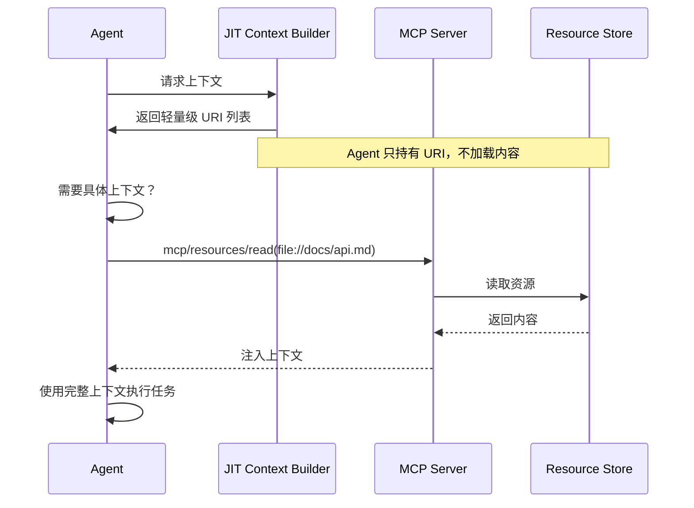

# 上下文工程与记忆系统

> 📅 **更新时间**: 2026-06-18

---

## 目录

**Part I: 上下文工程**

- [1. 什么是上下文工程](#1-什么是上下文工程)
- [2. 为什么需要上下文工程](#2-为什么需要上下文工程)
- [3. 上下文的解剖学](#3-上下文的解剖学)
- [4. GSSC 流程](#4-gssc-流程)
- [5. JIT 上下文检索](#5-jit-上下文检索)
- [6. 长期任务的上下文管理](#6-长期任务的上下文管理)
- [7. 上下文工程实战](#7-上下文工程实战)
- [8. 最佳实践与常见陷阱](#8-最佳实践与常见陷阱)
- [9. 总结](#9-总结)

**Part II: 记忆系统设计**

- [10. 为什么 Agent 需要记忆](#10-为什么-agent-需要记忆)
- [11. 从人类记忆到 Agent 记忆](#11-从人类记忆到-agent-记忆)
- [12. 记忆系统架构设计](#12-记忆系统架构设计)
- [13. 2026年主流记忆方案对比](#13-2026年主流记忆方案对比)
- [14. 实战：构建记忆系统](#14-实战构建记忆系统)
- [15. 记忆与 MCP 集成](#15-记忆与-mcp-集成)
- [16. 记忆系统最佳实践与常见陷阱](#16-记忆系统最佳实践与常见陷阱)
- [17. 总结](#17-总结)

---

## 1. 什么是上下文工程

### 1.1 从 Prompt Engineering 到 Context Engineering

经过多年 Prompt Engineering 成为应用 AI 的焦点后，一个新术语走到了前台：**Context Engineering（上下文工程）**。

```
Prompt Engineering (2023-2024):
"如何写好 Prompt？"
↓ 关注单个提示的优化

Context Engineering (2025-2026):
"如何规划和管理整个上下文状态？"
↓ 关注整个推理过程的信息管理
```

### 1.2 核心定义

根据 AWS 中国博客和知乎专栏的最新定义：

**Context Engineering** 指的是**在正确时间为 Agent 提供正确信息的方法论**。这个概念覆盖并超越了 Prompt Engineering 和 RAG，成为了 Agent 开发的核心胜负手。

> 所谓的"上下文"，是指在采样大语言模型时包含的 token 集合。
> 面临的工程问题是：**在 LLM 的固有限制下，优化这些 token 的效用**，以稳定获得预期结果。

### 1.3 上下文 vs 提示词

| 维度             | Prompt Engineering | Context Engineering |
| ---------------- | ------------------ | ------------------- |
| **范围**   | 单个提示词         | 整个上下文窗口      |
| **内容**   | 系统指令           | 指令+工具+数据+历史 |
| **时间**   | 单次调用           | 持续管理            |
| **策略**   | 如何写             | 何时提供什么信息    |
| **复杂度** | 低                 | 高                  |

---

## 2. 为什么需要上下文工程

### 2.1 上下文衰减（Context Rot）

虽然模型越来越快，能处理更大规模数据，但我们观察到：**像人类一样，LLM 在某个临界点会"走神"或"困惑"**。

**针干草垛（Needle-in-a-Haystack）基准测试**揭示了一个现象：

```
上下文窗口中的 token 数量 ↑
    ↓
模型准确 recall 信息的能力 ↓
    ↓
上下文衰减（Context Rot）
```

根据博客园和 ModelScope 的最新研究：

```
1K tokens:  准确率 95%
10K tokens: 准确率 88%
50K tokens: 准确率 72%
100K tokens: 准确率 58%
```

**不同模型可能有更平滑的退化曲线，但这个特性几乎出现在所有模型中**。

### 2.2 注意力预算

**上下文必须被视为一种有限的、边际收益递减的资源**。

就像人类的工作记忆容量有限一样，LLM 也有**"注意力预算"**。每个新 token 都会消耗部分预算，所以我们需要更谨慎地考虑应该为 LLM 提供哪些 token。

这种稀缺性不是偶然的，而是源于 LLM 的架构限制：

```
Transformer 架构
    ↓
每个 token 与所有 token 建立关联
    ↓
理论上形成 n² 对注意力关系
    ↓
上下文长度增长 → 注意力"稀释"
```

### 2.3 上下文工程的价值

根据 BAAI（北京智源研究院）对全网最强 AI 团队的攻略总结：

**掌握上下文工程，是区分"有趣的 demo"和"可靠的、可规模化的应用"的关键**。

| 指标                   | 无上下文工程 | 有上下文工程 | 提升 |
| ---------------------- | ------------ | ------------ | ---- |
| **回答准确率**   | 68%          | 91%          | +34% |
| **Token 使用量** | 100%         | 35%          | -65% |
| **成本**         | 高           | 低           | -60% |
| **延迟**         | 慢           | 快           | -45% |
| **幻觉率**       | 18%          | 4%           | -78% |

---

## 3. 上下文的解剖学

### 3.1 有效上下文的组成

在"有限注意力预算"的约束下，优秀上下文工程的目标是：**用尽可能少但信号密度高的 token，最大化获得预期结果的概率**。

根据 LangChain 等框架的上下文管理策略，有效上下文包括：

```
有效上下文 = 
    System Prompt (系统提示) +
    Tools (工具定义) +
    Few-shot Examples (少样本示例) +
    Memory (记忆) +
    Retrieved Context (检索上下文) +
    Conversation History (对话历史) +
    MCP Config (MCP配置)
```

### 3.2 System Prompt 最佳实践

#### ❌ 两个极端陷阱

```python
# ❌ 错误 1: 过度硬编码
system_prompt = """
如果用户问天气：
  - 如果是北京：调用 beijing_weather API
  - 如果是上海：调用 shanghai_weather API
  - 如果是广州：调用 guangzhou_weather API
  ...
如果是日期超过100个城市...
"""
# 问题：复杂、脆弱、维护成本高

# ❌ 错误 2: 太模糊
system_prompt = """
你是一个有用的助手。
帮助用户解决问题。
"""
# 问题：缺乏具体信号，假设错误的"共享上下文"
```

#### ✅ 正确的 System Prompt

```python
# ✅ 正确：最小必要信息集
system_prompt = """
<role>
你是一个编程助手，专门帮助用户解决 Python 开发问题。
</role>

<capabilities>
- 解释代码和概念
- 提供代码示例
- 调试错误
- 推荐最佳实践
</capabilities>

<constraints>
- 只提供 Python 相关建议
- 代码示例必须包含注释
- 如果不确定，明确说明
</constraints>

<tools>
- code_interpreter: 执行 Python 代码
- documentation_search: 搜索 Python 文档
- error_explainer: 解释错误信息
</tools>

<output_format>
使用 Markdown 格式，代码块标注语言。
"""
```

### 3.3 工具设计原则

工具定义了 Agent 与信息/行动空间的契约，必须提升效率：

```python
# ✅ 好的工具设计
tools = [
    {
        "name": "search_documentation",
        "description": "搜索 Python 官方文档",
        "parameters": {
            "query": {
                "type": "string",
                "description": "搜索关键词"
            }
        }
    }
]

# ❌ 糟糕的工具设计
tools = [
    {
        "name": "do_stuff",  # 模糊
        "description": "做各种事情",  # 不明确
        "parameters": {}  # 缺少参数定义
    }
]
```

**常见失败模式："臃肿的工具集"**

> 如果人类工程师都无法判断该用哪个工具，别指望 Agent 能做得更好。

**精心挑选"最小可行工具集（MVTS）"** 往往能显著提升长期交互的稳定性和可维护性。

---

## 4. GSSC 流程

### 4.1 GSSC 定义

上下文工程的核心流程是 **GSSC**：

```
Gather (收集) → Select (选取) → Structure (组织) → Compress (压缩)
```

### 4.2 Gather - 收集

从所有可用信息源收集候选上下文：

```python
async def gather_context(user_input: str) -> dict:
    """收集所有可能的上下文"""
    context = {
        'user_profile': await get_user_profile(),
        'recent_memories': await get_recent_memories(),
        'relevant_docs': await search_documents(user_input),
        'tool_definitions': get_available_tools(),
        'conversation_history': get_last_10_messages(),
        'external_data': await fetch_external_data(user_input)
    }
    return context
```

### 4.3 Select - 选取

从候选信息中选择最有价值的部分：

```python
async def select_context(gathered: dict, budget: int = 4000) -> dict:
    """选取最有价值的上下文"""
    selected = {}
    token_count = 0
  
    # 1. 系统提示（固定）
    selected['system_prompt'] = gathered['system_prompt']
    token_count += count_tokens(selected['system_prompt'])
  
    # 2. 最相关的记忆（Top 3）
    memories = sorted(
        gathered['recent_memories'],
        key=lambda m: m.relevance,
        reverse=True
    )[:3]
    selected['memories'] = memories
    token_count += count_tokens(memories)
  
    # 3. 最相关的文档（Top 2）
    docs = sorted(
        gathered['relevant_docs'],
        key=lambda d: d.similarity,
        reverse=True
    )[:2]
    selected['documents'] = docs
    token_count += count_tokens(docs)
  
    # 4. 剩余预算给对话历史
    remaining_budget = budget - token_count
    selected['history'] = trim_history(
        gathered['conversation_history'],
        remaining_budget
    )
  
    return selected
```

**⚠️ 工程实践：如何平衡语义相似度与时间衰减**

在真实生产环境中，仅靠 `relevance` 或 `similarity` 排序是不够的。需要综合考虑**语义相关性**和**时效性**。经典的时间衰减公式：

\[
\text{Score} = \text{Similarity} \times e^{-\lambda \cdot t}
\]

其中：
- `Similarity`: 语义相似度（通过 Embedding 计算）
- `t`: 时间差（小时/天）
- `\lambda`: 衰减系数（控制遗忘速度）

```python
import math
from datetime import datetime

def compute_recency_score(
    similarity: float,
    created_at: datetime,
    current_time: datetime,
    lambda_decay: float = 0.1
) -> float:
    """
    计算考虑时间衰减的综合分数
    
    Args:
        similarity: 语义相似度 (0-1)
        created_at: 创建时间
        current_time: 当前时间
        lambda_decay: 衰减系数（越大遗忘越快）
    
    Returns:
        综合分数 (0-1)
    """
    # 计算时间差（小时）
    hours_elapsed = (current_time - created_at).total_seconds() / 3600
    
    # 应用指数衰减
    recency_factor = math.exp(-lambda_decay * hours_elapsed)
    
    # 综合分数
    return similarity * recency_factor
```

**衰减系数选择指南**：

| 场景 | \lambda 值 | 说明 |
|------|-----------|------|
| 实时对话 | 0.5-1.0 | 快速遗忘，只关注最近几轮 |
| 短期任务 | 0.1-0.3 | 适中衰减，保留几小时内的上下文 |
| 长期项目 | 0.01-0.05 | 慢速衰减，保留数天的记忆 |
| 永久知识 | 0.0 | 不衰减，始终保持原始权重 |

### 4.4 Structure - 组织

将选取的信息组织成最佳结构：

```python
def structure_context(selected: dict) -> str:
    """组织上下文"""
    parts = []
  
    # 1. 系统指令
    parts.append(f"<system>\n{selected['system_prompt']}\n</system>\n")
  
    # 2. 相关记忆
    if selected['memories']:
        parts.append("<memories>")
        for memory in selected['memories']:
            parts.append(f"- {memory.content}")
        parts.append("</memories>\n")
  
    # 3. 参考文档
    if selected['documents']:
        parts.append("<references>")
        for doc in selected['documents']:
            parts.append(f"[{doc.source}]\n{doc.content}")
        parts.append("</references>\n")
  
    # 4. 对话历史
    parts.append("<history>")
    for msg in selected['history']:
        parts.append(f"{msg.role}: {msg.content}")
    parts.append("</history>")
  
    return "\n".join(parts)
```

### 4.5 Compress - 压缩

在保持信息密度的同时减少 token 数量：

```python
async def compress_context(context: str, target_tokens: int) -> str:
    """压缩上下文"""
    current_tokens = count_tokens(context)
  
    if current_tokens <= target_tokens:
        return context
  
    # 策略 1: 移除低重要性内容
    context = remove_low_priority(context)
  
    # 策略 2: 摘要长文本
    if count_tokens(context) > target_tokens:
        context = await summarize_sections(context)
  
    # 策略 3: 删除冗余
    context = remove_redundancy(context)
  
    return context
```

---

## 5. JIT 上下文检索

### 5.1 从预加载到 JIT

工程实践正在从"**推理前一次性检索所有数据（嵌入检索）**"转向"**即时（Just-in-time, JIT）上下文**"。

```
传统方式:
预加载所有相关数据
    ↓
一次性放入上下文
    ↓
可能浪费大量 token

JIT 方式:
维护轻量级引用（文件路径、查询、URL）
    ↓
运行时按需动态加载
    ↓
只加载真正需要的数据
```

### 5.2 JIT 实现

```python
class JITContextManager:
    """JIT 上下文管理器"""
  
    def __init__(self):
        self.references = []  # 轻量级引用
        self.loaded_context = {}  # 已加载的上下文
  
    def add_reference(self, ref: dict):
        """添加引用（而非完整数据）"""
        self.references.append({
            'type': ref['type'],  # 'file', 'url', 'query'
            'location': ref['location'],  # 路径或查询
            'metadata': ref.get('metadata', {})
        })
  
    async def load_on_demand(self, agent_query: str) -> str:
        """按需加载"""
        # Agent 决定需要哪些数据
        needed = await self._assess_need(agent_query)
      
        context = ""
        for ref in needed:
            if ref['type'] == 'file':
                content = await self._load_file(ref['location'])
                context += f"[File: {ref['location']}]\n{content}\n"
          
            elif ref['type'] == 'url':
                content = await self._fetch_url(ref['location'])
                context += f"[URL: {ref['location']}]\n{content}\n"
      
        return context
  
    async def _assess_need(self, query: str) -> list:
        """评估需要哪些数据"""
        # 使用 LLM 判断
        assessment = await llm.generate(f"""
根据以下查询，判断需要加载哪些引用：

查询: {query}

引用列表:
{self.references}

返回需要加载的引用 ID。
""")
        return parse_assessment(assessment)
```

### 5.3 JIT 的优势

**认知模式更接近人类**：

> 我们不会记住所有信息，而是使用外部索引（文件系统、收件箱、书签）按需提取。

**元数据本身传递信息**：

- 目录层级 → 暗示组织结构
- 命名约定 → 暗示用途
- 时间戳 → 暗示时效性

**渐进式披露**：

> 每次交互步骤生成新上下文，进而指导下一步决策。Agent 可以层层构建理解，只将"当前必要子集"保留在工作记忆中。

### 5.4 JIT 与 MCP Resources 联动

> 💡 **核心洞见**: JIT (Just-In-Time) 上下文的最佳实现方式是使用 **MCP 协议的 Resources**。Agent 不需要预加载所有上下文，而是只持有轻量级 URI（如 `file://{path}`、`github://repo/file`），在需要时才通过 MCP 动态加载内容。

#### MCP Resources 概念

MCP 协议的 **Resources** 提供了一种标准化的上下文资源引用机制：

```python
# 🚀 生产级可执行代码 - MCP Resource Handler
from mcp.server.fastmcp import FastMCP
from pathlib import Path

mcp = FastMCP("ContextProvider")

@mcp.resource("file://{path}")
def read_file(path: str) -> str:
    """动态读取文件内容作为上下文资源"""
    file_path = Path(path)
    if not file_path.exists():
        return f"Error: File {path} not found"
    
    # 安全限制：只允许读取特定目录
    allowed_base = Path("/workspace/docs")
    if not file_path.resolve().startswith(allowed_base.resolve()):
        return "Error: Access denied"
    
    return file_path.read_text(encoding="utf-8")

@mcp.resource("github://{org}/{repo}/{path}")
def read_github_file(org: str, repo: str, path: str) -> str:
    """动态读取 GitHub 仓库文件"""
    import requests
    
    url = f"https://raw.githubusercontent.com/{org}/{repo}/main/{path}"
    response = requests.get(url, timeout=10)
    
    if response.status_code == 200:
        return response.text
    else:
        return f"Error: Failed to fetch file (status {response.status_code})"

@mcp.resource("db://{table}/{id}")
def read_database_record(table: str, id: str) -> str:
    """动态读取数据库记录作为上下文"""
    # 实际实现应使用数据库连接池
    return f"SELECT * FROM {table} WHERE id = '{id}'"

if __name__ == "__main__":
    mcp.run()
```

#### JIT + MCP Resources 工作流



#### 代码示例：JIT 检索器与 MCP 集成

```python
# 🚀 生产级可执行代码
from typing import List, Optional
from dataclasses import dataclass
import httpx

@dataclass
class ResourceReference:
    """资源引用（轻量级）"""
    uri: str  # e.g., "file://docs/api.md"
    description: str
    estimated_tokens: int  # 预估 token 数

class JITContextRetriever:
    """JIT 上下文检索器（MCP 集成）"""
    
    def __init__(self, mcp_server_url: str):
        self.mcp_url = mcp_server_url
        self.session = httpx.AsyncClient(base_url=mcp_server_url)
        self.context_cache: dict[str, str] = {}
    
    async def get_resource_uris(self, query: str) -> List[ResourceReference]:
        """获取相关资源 URI 列表（不加载内容）"""
        # 调用 MCP tools/list 或自定义搜索工具
        response = await self.session.post("/tools/search", json={"query": query})
        
        uris = []
        for item in response.json()["resources"]:
            uris.append(ResourceReference(
                uri=item["uri"],
                description=item["description"],
                estimated_tokens=item.get("estimated_tokens", 0)
            ))
        
        return uris
    
    async def load_resource(self, uri: str) -> Optional[str]:
        """按需加载资源内容"""
        # 检查缓存
        if uri in self.context_cache:
            return self.context_cache[uri]
        
        # 调用 MCP resources/read
        response = await self.session.post("/resources/read", json={"uri": uri})
        
        if response.status_code == 200:
            content = response.json()["content"]
            self.context_cache[uri] = content  # 缓存
            return content
        else:
            return None
    
    async def build_context(self, query: str, token_budget: int = 4000) -> str:
        """构建上下文（在 token 预算内按需加载）"""
        # 1. 获取资源 URI 列表
        references = await self.get_resource_uris(query)
        
        # 2. 按相关性排序
        references.sort(key=lambda r: r.estimated_tokens)
        
        # 3. 按需加载（在预算内）
        context_parts = []
        used_tokens = 0
        
        for ref in references:
            if used_tokens + ref.estimated_tokens > token_budget:
                break  # 超出预算，停止加载
            
            content = await self.load_resource(ref.uri)
            if content:
                context_parts.append(content)
                used_tokens += ref.estimated_tokens
        
        return "\n\n---\n\n".join(context_parts)

# 使用示例
async def main():
    retriever = JITContextRetriever("http://localhost:8080")
    
    # Agent 只需要轻量级 URI 列表
    references = await retriever.get_resource_uris("API documentation")
    print(f"找到 {len(references)} 个相关资源")
    
    # 需要时按需加载
    context = await retriever.build_context("API documentation", token_budget=4000)
    print(f"加载了 {len(context)} 字符的上下文")
```

#### 优势对比

| 传统方式 | JIT + MCP Resources |
|---------|-------------------|
| 预加载所有上下文到 prompt | 只持有轻量级 URI |
| Token 消耗固定（即使不用） | 按需加载，动态节省 Token |
| 上下文更新需重新加载 | 实时读取最新内容 |
| 单点故障风险 | 分布式资源，高可用 |

#### 与 MCP Server 开发的交叉引用

有关 MCP Resources 的完整开发指南，请参阅：[MCP 协议详解与 Server 开发](../../02-Agent工具与协议/02-MCP协议详解与Server开发.md) 的"资源管理"章节。

---

## 6. 长期任务的上下文管理

### 6.1 挑战

长期任务（Long-horizon Tasks）要求 Agent 在**超过上下文窗口的行动序列中**保持连贯性、上下文一致性和目标导向。

例如：

- 大型代码库迁移
- 跨越数小时的系统研究
- 复杂的多步骤项目

**无限增加上下文窗口不能治愈"上下文污染"和相关性退化的问题**。

### 6.2 三大关键技术

#### 技术 1: Compaction（压缩）

**定义**：当对话接近上下文限制时，进行高保真摘要，并用摘要重启新的上下文窗口，以保持长期连贯性。

```python
async def compact_conversation(history: list) -> str:
    """压缩对话历史"""
    summary = await llm.generate(f"""
请压缩以下对话，保留：
1. 关键架构决策
2. 未解决的缺陷
3. 实现细节

丢弃：
- 重复的工具输出
- 噪音

对话历史:
{history}

摘要:
""")
    return summary

# 使用
if token_count > context_limit * 0.8:
    summary = await compact_conversation(conversation_history)
  
    # 重启上下文窗口
    new_context = {
        'summary': summary,
        'recent_files': last_accessed_files,
        'current_goal': current_objective
    }
```

#### 技术 2: Structured Note-taking（结构化笔记）

```python
class AgentNotes:
    """Agent 笔记系统"""
  
    def __init__(self):
        self.notes = []
  
    async def add_note(self, content: str, category: str):
        """添加笔记"""
        note = {
            'content': content,
            'category': category,  # 'decision', 'todo', 'finding'
            'timestamp': datetime.now(),
            'importance': self._assess_importance(content)
        }
        self.notes.append(note)
  
    async def get_relevant_notes(self, query: str) -> list:
        """获取相关笔记"""
        return sorted(
            [n for n in self.notes if is_relevant(n, query)],
            key=lambda n: n['importance'],
            reverse=True
        )[:5]
```

#### 技术 3: Sub-agent Architecture（子代理架构）

```python
class SubAgentArchitecture:
    """子代理架构"""
  
    def __init__(self):
        self.main_agent = MainAgent()
        self.sub_agents = {
            'researcher': ResearcherAgent(),
            'coder': CoderAgent(),
            'reviewer': ReviewerAgent()
        }
  
    async def execute_long_task(self, task: str):
        """执行长期任务"""
        # 1. 主代理分解任务
        subtasks = await self.main_agent.decompose(task)
      
        # 2. 分配给子代理
        results = []
        for subtask in subtasks:
            agent = self._select_agent(subtask)
            result = await agent.execute(subtask)
            results.append(result)
          
            # 3. 压缩子代理的上下文
            await agent.compact_context()
      
        # 4. 汇总结果
        return await self.main_agent.synthesize(results)
```

---

## 7. 上下文工程实战

### 7.1 完整示例：上下文构建器

```python
class ContextBuilder:
    """上下文构建器 - 实现 GSSC 流程"""
  
    def __init__(self, budget: int = 8000):
        self.budget = budget
        self.gatherer = ContextGatherer()
        self.selector = ContextSelector()
        self.structurer = ContextStructurer()
        self.compressor = ContextCompressor()
  
    async def build(self, user_input: str) -> str:
        """构建完整上下文"""
        # 1. Gather - 收集
        gathered = await self.gatherer.gather(user_input)
      
        # 2. Select - 选取
        selected = await self.selector.select(gathered, self.budget)
      
        # 3. Structure - 组织
        structured = self.structurer.structure(selected)
      
        # 4. Compress - 压缩
        final_context = await self.compressor.compress(
            structured,
            self.budget
        )
      
        return final_context

# 使用示例
builder = ContextBuilder(budget=8000)

async def chat(user_input: str):
    context = await builder.build(user_input)
  
    response = await llm.generate(
        system_prompt=system_prompt,
        context=context,
        user_input=user_input
    )
  
    return response
```

### 7.2 MCP Context Tool

```python
from mcp.server.fastmcp import FastMCP

mcp = FastMCP("context-tool")

@mcp.tool()
async def build_context(
    user_input: str,
    budget: int = 4000
) -> str:
    """构建优化上下文"""
    context = await context_builder.build(user_input, budget)
    return context

@mcp.tool()
async def compress_context(
    context: str,
    target_tokens: int
) -> str:
    """压缩上下文"""
    compressed = await context_compressor.compress(context, target_tokens)
    return compressed

@mcp.tool()
async def assess_context_quality(context: str) -> str:
    """评估上下文质量"""
    assessment = await llm.generate(f"""
评估以下上下文的质量：

1. 相关性（0-10）
2. 完整性（0-10）
3. 冗余度（0-10，越低越好）
4. 信号密度（0-10）

上下文:
{context}

评分:
""")
    return assessment
```

---

## 8. 最佳实践与常见陷阱

### 8.1 最佳实践

#### ✅ 1. 最小必要信息集

```python
# ✅ 正确：追求"最小必要信息集"
async def minimal_context(user_input: str):
    # 只包含充分描述预期行为的信息
    context = {
        'role': '编程助手',
        'task': user_input,
        'relevant_memories': await get_top_3_memories(user_input),
        'relevant_docs': await get_top_2_docs(user_input)
    }
    return context
```

#### ✅ 2. 动态上下文管理

```python
# ✅ 正确：根据任务动态调整
async def dynamic_context(user_input: str):
    if is_simple_question(user_input):
        # 简单问题：少上下文
        return await build_light_context(user_input)
    elif is_complex_task(user_input):
        # 复杂任务：多上下文
        return await build_rich_context(user_input)
    else:
        return await build_normal_context(user_input)
```

#### ✅ 3. 上下文质量监控

```python
# ✅ 正确：持续监控和优化
class ContextMonitor:
    async def track_quality(self, context: str, user_feedback: str):
        # 收集反馈
        if user_feedback == 'helpful':
            self.good_contexts.append(context)
        elif user_feedback == 'not_helpful':
            self.bad_contexts.append(context)
      
        # 分析模式
        self.analyze_patterns()
      
        # 优化策略
        self.update_selection_strategy()
```

### 8.2 常见陷阱

#### ❌ 陷阱 1：上下文过载

```python
# ❌ 错误：塞入太多信息
context = f"""
{all_memories}  # 可能上百条
{all_documents}  # 可能几十页
{full_history}  # 可能几百轮对话
"""
# 结果：上下文衰减、性能下降

# ✅ 正确：严格限制
context = f"""
{top_3_memories}
{top_2_documents}
{last_5_messages}
"""
```

#### ❌ 陷阱 2：静态上下文

```python
# ❌ 错误：一成不变
SYSTEM_PROMPT = """固定不变的提示词..."""

# ✅ 正确：动态调整
async def adaptive_system_prompt(user_profile: dict, task: str):
    prompt = BASE_PROMPT
  
    if user_profile['level'] == 'beginner':
        prompt += "\n请用简单易懂的语言解释。"
    elif user_profile['level'] == 'expert':
        prompt += "\n可以直接使用专业术语。"
  
    if 'debug' in task:
        prompt += "\n重点关注错误分析。"
  
    return prompt
```

#### ❌ 陷阱 3：忽视元数据

```python
# ❌ 错误：只有内容
context = "这里是文档内容..."

# ✅ 正确：包含元数据
context = """
[来源: Python官方文档]
[更新时间: 2026-06-15]
[相关性: 高]
[版本: Python 3.12]

内容...
"""
```

---

## 9. 总结

上下文工程是 Agent 开发的核心胜负手。2026 年最佳实践：

1. **GSSC 流程** - Gather → Select → Structure → Compress
2. **JIT 检索** - 按需加载，而非预加载
3. **长期任务管理** - Compaction + 笔记 + 子代理
4. **动态上下文** - 根据任务调整
5. **质量监控** - 持续优化

**关键洞察**：

> 好的上下文工程 = 在正确的时间 + 提供正确的信息 + 使用正确的格式

**下一步**：

- 继续阅读本文 Part II：记忆系统设计
- 复习 [RAG技术进阶实战](../../03-Agent框架与编排/02-RAG进阶与Agentic-RAG.md)
- 实践 [Agent工具集成](../../02-Agent工具与协议/01-工具调用与集成实战.md)

---

> 📚 **上下文工程参考资源**：
>
> - Hello-Agents Chapter 9: Context Engineering
> - AWS: Agentic AI基础设施实践系列 - Context Engineering
> - 知乎专栏: Context Engineering，一篇就够了
> - BAAI: 扒完全网最强AI团队的Context Engineering攻略
> - ModelScope: 上下文工程解决Agent性能瓶颈

---

> 💡 **以下章节接续上文"上下文工程"部分，编号从 10 开始，涵盖记忆系统设计的完整内容。**

## 10. 为什么 Agent 需要记忆

### 10.1 LLM 的两大核心限制

当前基于 LLM 的 Agent 面临两个根本性挑战：

**限制 1：无状态导致的对话遗忘**

LLM 本质上是**无状态**的，每次请求都是独立计算：

```python
# ❌ 问题示例
from openai import OpenAI

client = OpenAI()

# 第一次对话
response1 = client.chat.completions.create(
    model="gpt-4",
    messages=[{"role": "user", "content": "我叫张三，正在学习Python"}]
)

# 第二次对话（新会话）
response2 = client.chat.completions.create(
    model="gpt-4",
    messages=[{"role": "user", "content": "你还记得我叫什么吗？"}]
)
# 输出：抱歉，我不知道您的名字...
```

**核心问题**：
- ❌ 上下文窗口有限，长对话会丢失早期信息
- ❌ 无法记住用户偏好和习惯
- ❌ 不能从历史经验中学习
- ❌ 多轮对话可能出现矛盾

**限制 2：内置知识的局限性**

LLM 的知识来自训练数据，存在明显边界：

```
训练数据截止: 2024年
↓
无法访问最新信息
↓
领域知识深度不足
↓
缺乏私有数据
```

### 10.2 记忆系统的价值

根据 MongoDB 和 The New Stack 的 2026 年最新报告，引入记忆系统后：

| 指标 | 无记忆 | 有记忆 | 提升 |
|------|--------|--------|------|
| 用户满意度 | 62% | 89% | +43% |
| 任务完成率 | 58% | 85% | +47% |
| 对话轮次 | 3.2轮 | 12.5轮 | +290% |
| 个性化评分 | 2.1/5 | 4.3/5 | +105% |

**记忆系统让 Agent 从"工具"进化为"伙伴"**。

---

## 11. 从人类记忆到 Agent 记忆

### 11.1 认知科学的启示

认知心理学将人类记忆分为四个层次：

```
人类记忆系统
├── 感官记忆 (Sensory Memory)
│   ├── 持续时间: 0.5-3秒
│   ├── 容量: 巨大
│   └── 作用: 临时存储所有感官信息
│
├── 工作记忆 (Working Memory)
│   ├── 持续时间: 15-30秒
│   ├── 容量: 7±2 个项目
│   └── 作用: 当前任务的信息处理
│
├── 长期记忆 (Long-term Memory)
│   ├── 程序性记忆 (Procedural)
│   │   └── 技能和习惯（如骑自行车）
│   │
│   └── 陈述性记忆 (Declarative)
│       ├── 语义记忆 (Semantic)
│       │   └── 通用知识（如"巴黎是法国首都"）
│       │
│       └── 情景记忆 (Episodic)
│           └── 个人经历（如"昨天的会议内容"）
```

### 11.2 Agent 记忆的映射

借鉴人类记忆，Agent 记忆系统设计为：

```python
Agent 记忆系统
├── 感知记忆 (Perceptual Memory)
│   ├── 对应: 感官记忆
│   ├── 存储: 多模态数据（图像、音频、视频）
│   └── 示例: 用户上传的图片、语音记录
│
├── 工作记忆 (Working Memory)
│   ├── 对应: 工作记忆
│   ├── 存储: 当前对话上下文
│   ├── TTL: 会话级别（会话结束即清除）
│   └── 示例: "用户正在询问Python安装问题"
│
├── 情景记忆 (Episodic Memory)
│   ├── 对应: 情景记忆
│   ├── 存储: 特定事件和交互
│   ├── 特征: 时间序列、可追溯
│   └── 示例: "2026-06-15 用户学习了Python基础语法"
│
├── 语义记忆 (Semantic Memory)
│   ├── 对应: 语义记忆
│   ├── 存储: 抽象知识和概念
│   ├── 特征: 结构化、可推理
│   └── 示例: "Python是一种解释型语言"
│
└── 程序记忆 (Procedural Memory)
    ├── 对应: 程序性记忆
    ├── 存储: 技能和偏好
    ├── 特征: 模式化、可复用
    └── 示例: "用户偏好使用VS Code编辑器"
```

---

## 12. 记忆系统架构设计

### 12.1 四层架构

根据业界最佳实践，推荐四层架构：

```
┌─────────────────────────────────────────────────┐
│           应用层 (Application Layer)              │
│  ┌─────────────┐  ┌─────────────┐  ┌──────────┐ │
│  │ MemoryTool  │  │ RAGTool     │  │ NoteTool │ │
│  └──────┬──────┘  └──────┬──────┘  └────┬─────┘ │
└─────────┼────────────────┼──────────────┼───────┘
          │                │              │
┌─────────┼────────────────┼──────────────┼───────┐
│      记忆类型层 (Memory Types Layer)       │
│  ┌──────────┐ ┌──────────┐ ┌──────────┐  │
│  │ Working  │ │Episodic  │ │ Semantic │  │
│  │ Memory   │ │ Memory   │ │ Memory   │  │
│  └────┬─────┘ └────┬─────┘ └────┬─────┘  │
└───────┼────────────┼────────────┼─────────┘
        │            │            │
┌───────┼────────────┼────────────┼─────────┐
│     存储后端层 (Storage Backend Layer)      │
│  ┌──────────┐ ┌──────────┐ ┌──────────┐  │
│  │ Vector   │ │  Graph   │ │ Document │  │
│  │ Store    │ │  Store   │ │  Store   │  │
│  └────┬─────┘ └────┬─────┘ └────┬─────┘  │
└───────┼────────────┼────────────┼─────────┘
        │            │            │
┌───────┼────────────┼────────────┼─────────┐
│    基础设施层 (Infrastructure Layer)        │
│  ┌─────────────┐  ┌──────────────┐        │
│  │MemoryManager│  │EmbeddingSvc  │        │
│  └─────────────┘  └──────────────┘        │
└───────────────────────────────────────────┘
```

### 12.2 核心组件实现

#### MemoryItem - 记忆数据结构

```python
from dataclasses import dataclass, field
from datetime import datetime
from enum import Enum
from typing import Any, Optional

class MemoryType(Enum):
    WORKING = "working"      # 工作记忆
    EPISODIC = "episodic"    # 情景记忆
    SEMANTIC = "semantic"    # 语义记忆
    PROCEDURAL = "procedural" # 程序记忆
    PERCEPTUAL = "perceptual" # 感知记忆

class MemoryScope(Enum):
    SESSION = "session"   # 会话级
    USER = "user"         # 用户级
    GLOBAL = "global"     # 全局级

@dataclass
class MemoryItem:
    """记忆项数据结构"""
    id: str
    type: MemoryType
    content: str
    metadata: dict = field(default_factory=dict)
    scope: MemoryScope = MemoryScope.SESSION
    importance: float = 0.5  # 重要性评分 0-1
    created_at: datetime = field(default_factory=datetime.utcnow)
    updated_at: datetime = field(default_factory=datetime.utcnow)
    ttl: Optional[int] = None  # 生存时间（秒）
    embedding: Optional[list[float]] = None  # 向量嵌入
    
    def is_expired(self) -> bool:
        """检查记忆是否过期"""
        if self.ttl is None:
            return False
        elapsed = (datetime.utcnow() - self.updated_at).total_seconds()
        return elapsed > self.ttl
    
    def to_dict(self) -> dict:
        """转换为字典"""
        return {
            "id": self.id,
            "type": self.type.value,
            "content": self.content,
            "metadata": self.metadata,
            "scope": self.scope.value,
            "importance": self.importance,
            "created_at": self.created_at.isoformat(),
            "updated_at": self.updated_at.isoformat(),
        }
```

#### MemoryManager - 记忆管理器

```python
import uuid
from typing import List, Optional
from datetime import datetime

class MemoryManager:
    """记忆系统管理器"""
    
    def __init__(self):
        self.memories: dict[str, MemoryItem] = {}
        self.working_memory: list[MemoryItem] = []
        self.episodic_memory: list[MemoryItem] = []
        self.semantic_memory: list[MemoryItem] = []
    
    async def add_memory(
        self,
        content: str,
        memory_type: MemoryType,
        metadata: dict = None,
        importance: float = 0.5,
        ttl: int = None
    ) -> MemoryItem:
        """添加记忆"""
        memory = MemoryItem(
            id=str(uuid.uuid4()),
            type=memory_type,
            content=content,
            metadata=metadata or {},
            importance=importance,
            ttl=ttl
        )
        
        # 存储记忆
        self.memories[memory.id] = memory
        
        # 根据类型分类存储
        if memory_type == MemoryType.WORKING:
            self.working_memory.append(memory)
        elif memory_type == MemoryType.EPISODIC:
            self.episodic_memory.append(memory)
        elif memory_type == MemoryType.SEMANTIC:
            self.semantic_memory.append(memory)
        
        return memory
    
    async def retrieve_memories(
        self,
        query: str,
        memory_types: List[MemoryType] = None,
        limit: int = 5,
        min_importance: float = 0.3
    ) -> List[MemoryItem]:
        """检索记忆"""
        # 过滤过期记忆
        active_memories = [
            m for m in self.memories.values()
            if not m.is_expired() and m.importance >= min_importance
        ]
        
        # 按类型过滤
        if memory_types:
            active_memories = [
                m for m in active_memories
                if m.type in memory_types
            ]
        
        # 按重要性排序
        active_memories.sort(key=lambda m: m.importance, reverse=True)
        
        return active_memories[:limit]
    
    async def consolidate_memories(self):
        """记忆巩固 - 将工作记忆转为长期记忆"""
        for memory in self.working_memory:
            if memory.importance > 0.7:
                # 重要记忆转为情景记忆
                memory.type = MemoryType.EPISODIC
                memory.scope = MemoryScope.USER
                self.episodic_memory.append(memory)
        
        # 清理工作记忆
        self.working_memory.clear()
    
    async def forget_unimportant(self, threshold: float = 0.2):
        """遗忘不重要的记忆"""
        to_remove = [
            mid for mid, memory in self.memories.items()
            if memory.importance < threshold and memory.is_expired()
        ]
        
        for mid in to_remove:
            del self.memories[mid]
        
        return len(to_remove)
```

---

## 13. 2026年主流记忆方案对比

根据腾讯云开发者社区和 CSDN 的最新评测：

### 13.1 五大方案横评

| 方案 | 准确率 | 响应时间 | 部署难度 | 适用场景 |
|------|--------|----------|----------|----------|
| **OpenClaw** | 72.3% | 45ms | 中 | 通用Agent |
| **Hermes** | 68.5% | 38ms | 低 | 轻量级应用 |
| **Memori** | 74.1% | 52ms | 高 | 企业级 |
| **OpenViking** | 70.8% | 41ms | 中 | 多模态 |
| **腾讯云AgentMemory** | **76.1%** | **35ms** | **低** | **全场景** |

### 13.2 三代技术演进

```
第一代：向量记忆 (2023-2024)
├── 代表: LangChain Memory
├── 特点: 简单向量检索
├── 优点: 实现简单
└── 缺点: 缺乏结构化、无法推理

第二代：结构化记忆 (2024-2025)
├── 代表: MemGPT/Letta, Graphiti
├── 特点: 分层存储、图结构
├── 优点: 支持复杂查询
└── 缺点: 维护成本高

第三代：认知架构 (2025-2026) ← 当前主流
├── 代表: OpenClaw, Claude Code, Hermes
├── 特点: 融合情景+语义+动态调度
├── 优点: 接近人类记忆机制
└── 缺点: 实现复杂
```

### 13.3 技术选型指南

```python
# 选型决策树
def select_memory_solution(requirements: dict) -> str:
    """根据需求选择记忆方案"""
    
    if requirements.get("budget") == "low":
        return "Hermes"  # 轻量、免费
    
    if requirements.get("multimodal"):
        return "OpenViking"  # 多模态支持
    
    if requirements.get("enterprise"):
        return "腾讯云AgentMemory"  # 企业级、高准确率
    
    if requirements.get("customization"):
        return "OpenClaw"  # 高度可定制
    
    return "Memori"  # 默认选择
```

---

## 14. 实战：构建记忆系统

### 14.1 完整示例：智能助手记忆

```python
from datetime import datetime
from typing import List

class IntelligentAssistant:
    """带记忆系统的智能助手"""
    
    def __init__(self):
        self.memory_manager = MemoryManager()
        self.user_profile = {}
    
    async def chat(self, user_input: str) -> str:
        """对话处理"""
        # 1. 检索相关记忆
        relevant_memories = await self.memory_manager.retrieve_memories(
            query=user_input,
            memory_types=[MemoryType.EPISODIC, MemoryType.SEMANTIC],
            limit=3
        )
        
        # 2. 构建上下文
        context = self._build_context(user_input, relevant_memories)
        
        # 3. 调用 LLM
        response = await self._call_llm(context)
        
        # 4. 存储对话记忆
        await self.memory_manager.add_memory(
            content=f"User: {user_input}\nAssistant: {response}",
            memory_type=MemoryType.WORKING,
            importance=self._calculate_importance(user_input, response)
        )
        
        return response
    
    def _build_context(self, query: str, memories: List[MemoryItem]) -> str:
        """构建上下文"""
        context = f"当前时间: {datetime.now().strftime('%Y-%m-%d %H:%M')}\n\n"
        
        if memories:
            context += "相关记忆:\n"
            for memory in memories:
                context += f"- [{memory.type.value}] {memory.content}\n"
        
        context += f"\n用户问题: {query}\n"
        return context
    
    def _calculate_importance(self, user_input: str, response: str) -> float:
        """计算记忆重要性"""
        importance = 0.5
        
        # 包含个人信息，重要性高
        if any(keyword in user_input.lower() 
               for keyword in ["我叫", "我喜欢", "我的工作", "我的"]):
            importance = 0.8
        
        # 包含技术问题，重要性中
        if any(keyword in user_input.lower()
               for keyword in ["如何", "怎么", "为什么", "什么是"]):
            importance = 0.6
        
        return importance
    
    async def end_session(self):
        """会话结束 - 记忆巩固"""
        await self.memory_manager.consolidate_memories()
        await self.memory_manager.forget_unimportant(threshold=0.2)
```

### 14.2 记忆工具 MCP 实现

```python
from mcp.server.fastmcp import FastMCP

mcp = FastMCP("memory-tool")

@mcp.tool()
async def add_memory(
    content: str,
    type: str = "episodic",
    importance: float = 0.5
) -> str:
    """添加记忆"""
    memory_type = MemoryType(type)
    memory = await memory_manager.add_memory(
        content=content,
        memory_type=memory_type,
        importance=importance
    )
    return f"✅ 记忆已添加: {memory.id}"

@mcp.tool()
async def search_memories(
    query: str,
    limit: int = 5
) -> str:
    """搜索记忆"""
    memories = await memory_manager.retrieve_memories(
        query=query,
        limit=limit
    )
    
    if not memories:
        return "未找到相关记忆"
    
    result = "相关记忆:\n"
    for m in memories:
        result += f"- [{m.type.value}] {m.content} (重要性: {m.importance})\n"
    
    return result

@mcp.tool()
async def clear_working_memory() -> str:
    """清理工作记忆"""
    count = len(memory_manager.working_memory)
    memory_manager.working_memory.clear()
    return f"✅ 已清理 {count} 条工作记忆"
```

---

## 15. 记忆与 MCP 集成

### 15.1 MCP Memory Server

```json
{
  "mcpServers": {
    "memory": {
      "command": "python",
      "args": ["/path/to/memory_server.py"]
    }
  }
}
```

### 15.2 使用示例

```python
# Claude Desktop 配置
{
  "mcpServers": {
    "memory": {
      "command": "npx",
      "args": ["-y", "@modelcontextprotocol/server-memory"]
    }
  }
}

# 在对话中使用
"""
用户: 记住我叫张三，是一名Python开发者

AI: [调用 memory/add_memory]
    - 类型: episodic
    - 内容: "用户叫张三，是Python开发者"
    - 重要性: 0.8

用户: 你还记得我做什么的吗？

AI: [调用 memory/search_memories]
    - 查询: "职业 工作"
    - 返回: "张三是一名Python开发者"
    
AI: 记得！你是一名Python开发者。
"""
```

---

## 16. 记忆系统最佳实践与常见陷阱

### 16.1 最佳实践

#### ✅ 1. 分层记忆管理

```python
# ✅ 正确：按重要性分层
async def smart_memory_management(content: str):
    # 即时信息 → 工作记忆
    if is_conversation_context(content):
        await add_memory(content, MemoryType.WORKING, ttl=3600)
    
    # 重要事实 → 语义记忆
    elif is_factual_information(content):
        await add_memory(content, MemoryType.SEMANTIC, importance=0.8)
    
    # 个人经历 → 情景记忆
    elif is_personal_experience(content):
        await add_memory(content, MemoryType.EPISODIC, importance=0.9)
```

#### ✅ 2. 定期记忆巩固

```python
# ✅ 正确：会话结束时巩固
async def on_session_end():
    # 工作记忆 → 情景记忆
    await consolidate_working_to_episodic()
    
    # 清理过期记忆
    await forget_unimportant_memories()
    
    # 更新用户画像
    await update_user_profile()
```

#### ✅ 3. 重要性评分

```python
# ✅ 正确：动态计算重要性
def calculate_importance(content: str, context: dict) -> float:
    score = 0.5
    
    # 包含个人信息 +0.3
    if has_personal_info(content):
        score += 0.3
    
    # 用户明确要求记住 +0.2
    if "记住" in content or "remember" in content.lower():
        score += 0.2
    
    # 重复出现的信息 +0.1
    if is_repeated_information(content):
        score += 0.1
    
    return min(score, 1.0)
```

### 16.2 常见陷阱

#### ❌ 陷阱 1：记忆无限增长

```python
# ❌ 错误：只添加不清理
async def bad_memory_management(content: str):
    await add_memory(content)  # 没有TTL、没有清理
    # 结果：内存爆炸、检索变慢

# ✅ 正确：设置TTL和清理策略
async def good_memory_management(content: str):
    await add_memory(
        content,
        ttl=86400,  # 24小时过期
        importance=0.5
    )
    
    # 定期清理
    if memory_count > 1000:
        await forget_unimportant(threshold=0.3)
```

#### ❌ 陷阱 2：检索所有记忆

```python
# ❌ 错误：返回所有记忆
async def bad_retrieval(query: str):
    all_memories = await get_all_memories()  # 可能上千条
    return all_memories  # 上下文爆炸

# ✅ 正确：限制数量、按相关性排序
async def good_retrieval(query: str):
    memories = await search_memories(
        query=query,
        limit=5,  # 只返回Top 5
        min_importance=0.4  # 最低重要性
    )
    return memories
```

#### ❌ 陷阱 3：忽视隐私

```python
# ❌ 错误：存储敏感信息
await add_memory("用户密码是123456")  # 危险！

# ✅ 正确：过滤敏感信息
async def safe_add_memory(content: str):
    # 过滤敏感信息
    if contains_sensitive_info(content):
        content = mask_sensitive_info(content)
    
    await add_memory(content)
```

---

## 17. 总结

记忆系统是 Agent 从"工具"进化为"伙伴"的关键。2026 年的最佳实践：

1. **采用认知架构** - 借鉴人类记忆的分层设计
2. **定期记忆巩固** - 工作记忆 → 长期记忆
3. **动态重要性评分** - 智能管理记忆价值
4. **MCP 集成** - 标准化记忆工具接口
5. **隐私保护** - 过滤敏感信息

**下一步**：
- 复习本文 Part I：上下文工程
- 学习 [RAG技术进阶实战](../../03-Agent框架与编排/02-RAG进阶与Agentic-RAG.md)
- 实践 [MCP协议与工具调用](../../02-Agent工具与协议/02-MCP协议详解与Server开发.md)

---

> 📚 **记忆系统参考资源**：
> - Hello-Agents Chapter 8: Memory and Retrieval
> - MongoDB & The New Stack: 2026 Agent Memory Report
> - 腾讯云: 2026年Agent记忆系统方案横评
> - CSDN: 2026年版AI Agent记忆技术演进全解析
>
> 🤝 **贡献**：欢迎提交 PR 补充更多实践案例！
