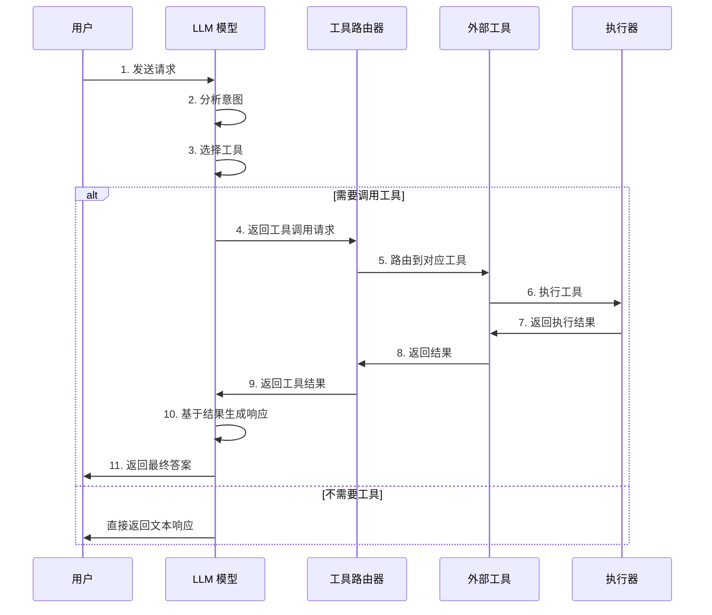
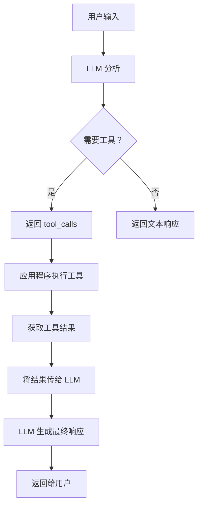
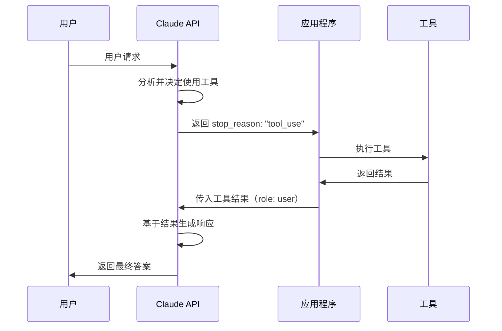
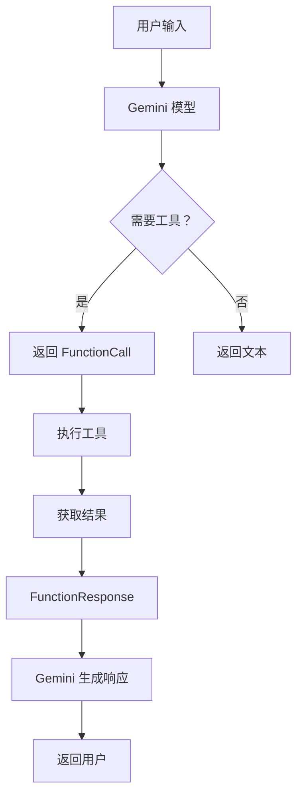
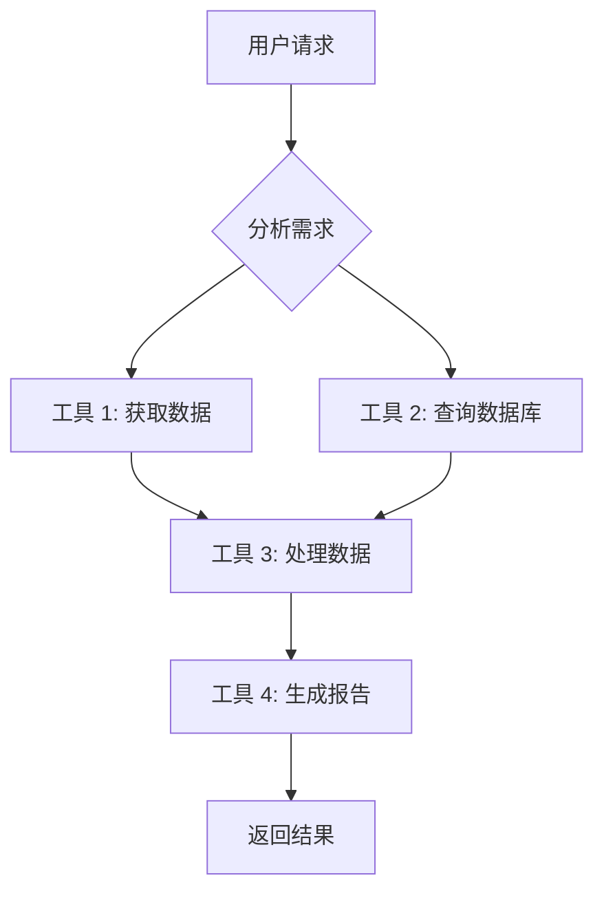
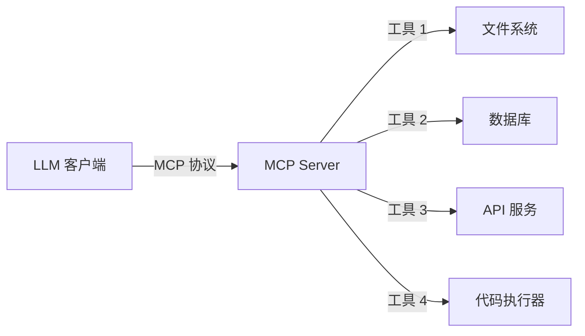

# 工具调用与集成实战

> 📅 **更新时间**: 2026-06-18  

---

## 目录

**Part A：工具调用基础与主流API**

- [1. 工具调用基础概念](#1-工具调用基础概念)
- [2. OpenAI Function Calling](#2-openai-function-calling)
- [3. Anthropic Tool Use](#3-anthropic-tool-use)
- [4. Google Gemini Function Calling](#4-google-gemini-function-calling)
- [5. 开源模型工具调用](#5-开源模型工具调用)
- [6. LangChain 工具系统](#6-langchain-工具系统)
- [7. 高级工具调用技术](#7-高级工具调用技术)
- [8. 生产级工具调用](#8-生产级工具调用)
- [9. MCP（Model Context Protocol）](#9-mcpmodel-context-protocol)
- [10. 工具调用评测与基准](#10-工具调用评测与基准)
- [11. 参考资料](#11-参考资料)

**Part B：Agent工具集成实战**

- [12. 工具调用基础](#12-工具调用基础)
- [13. 工具实现模式](#13-工具实现模式)
- [14. 工具调用流程](#14-工具调用流程)
- [15. 错误处理与重试](#15-错误处理与重试)
- [16. 工具编排与组合](#16-工具编排与组合)
- [17. 工具测试与调试](#17-工具测试与调试)
- [18. 性能优化](#18-性能优化)
- [19. 参考资料](#19-参考资料)

---

## 1. 工具调用基础概念

### 1.1 什么是工具调用

#### 定义

**工具调用（Tool Calling）**，也称为**函数调用（Function Calling）**，是大型语言模型（LLM）的一项核心能力，允许模型在生成文本响应时，**结构化地请求调用外部工具或函数**。

```
用户请求 → LLM 分析 → 决定调用工具 → 返回工具调用请求 
→ 外部执行工具 → 返回结果 → LLM 基于结果生成最终响应
```

#### 函数调用 vs 工具调用 vs Agent 工具使用

| 概念 | 定义 | 特点 | 适用场景 |
|------|------|------|----------|
| **函数调用** | 模型请求调用预定义函数 | 结构化 JSON 输出，单次调用 | API 调用、数据查询 |
| **工具调用** | 函数调用的广义形式 | 包含函数、API、代码执行等 | 复杂任务自动化 |
| **Agent 工具使用** | Agent 自主决策使用多个工具 | 多步推理、工具链编排 | 复杂工作流、自主决策 |

#### 能力扩展机制

工具调用是 LLM **能力边界扩展**的核心机制：

```
LLM 原生能力：
├── 文本生成
├── 语言理解
├── 逻辑推理
└── 知识问答（截至训练数据）

通过工具调用扩展：
├── 实时数据获取（天气、股票、新闻）
├── 数据库操作（查询、更新、删除）
├── 代码执行（Python、JavaScript）
├── 文件操作（读写、搜索、分析）
├── 外部 API 调用（支付、邮件、SMS）
├── 网页搜索与抓取
├── 图像生成与处理
└── 系统操作（Shell、Docker）
```

#### 为什么需要工具调用？

1. **知识时效性**：LLM 训练数据有截止日期，工具可获取实时信息
2. **精确计算**：LLM 不擅长数学计算，可调用计算器
3. **数据访问**：LLM 无法直接访问数据库或私有数据
4. **行动能力**：LLM 只能生成文本，工具可执行实际操作
5. **成本控制**：复杂计算交给专门工具，减少 LLM token 消耗

### 1.2 工具调用场景

#### 场景 1：外部 API 调用

```python
# 天气查询 API
工具定义：
{
  "name": "get_weather",
  "description": "获取指定城市的当前天气信息",
  "parameters": {
    "type": "object",
    "properties": {
      "city": {"type": "string", "description": "城市名称，如：北京、上海"},
      "unit": {"type": "string", "enum": ["celsius", "fahrenheit"], "description": "温度单位"}
    },
    "required": ["city"]
  }
}

用户输入："北京今天天气怎么样？"
LLM 输出：
{
  "tool_calls": [{
    "id": "call_abc123",
    "function": {
      "name": "get_weather",
      "arguments": '{"city": "北京", "unit": "celsius"}'
    }
  }]
}
```

#### 场景 2：数据库查询

```python
# SQL 查询工具
工具定义：
{
  "name": "query_database",
  "description": "执行 SQL 查询语句获取数据",
  "parameters": {
    "type": "object",
    "properties": {
      "query": {"type": "string", "description": "SQL 查询语句"},
      "database": {"type": "string", "description": "数据库名称", "enum": ["users", "orders", "products"]}
    },
    "required": ["query", "database"]
  }
}

用户输入："查询上个月销售额最高的 10 个产品"
LLM 生成 SQL：
SELECT product_name, SUM(amount) as total_sales
FROM orders
WHERE order_date >= '2026-05-01' AND order_date < '2026-06-01'
GROUP BY product_name
ORDER BY total_sales DESC
LIMIT 10;
```

#### 场景 3：代码执行

```python
# Python 代码执行器
工具定义：
{
  "name": "execute_python",
  "description": "执行 Python 代码并返回结果",
  "parameters": {
    "type": "object",
    "properties": {
      "code": {"type": "string", "description": "要执行的 Python 代码"}
    },
    "required": ["code"]
  }
}

用户输入："计算斐波那契数列的前 20 项"
LLM 生成代码：
def fibonacci(n):
    fib = [0, 1]
    for i in range(2, n):
        fib.append(fib[i-1] + fib[i-2])
    return fib[:n]

print(fibonacci(20))
```

#### 场景 4：文件操作

```python
# 文件读取工具
工具定义：
{
  "name": "read_file",
  "description": "读取指定路径的文件内容",
  "parameters": {
    "type": "object",
    "properties": {
      "file_path": {"type": "string", "description": "文件路径"},
      "encoding": {"type": "string", "description": "文件编码", "default": "utf-8"},
      "max_lines": {"type": "integer", "description": "最大读取行数", "default": 1000}
    },
    "required": ["file_path"]
  }
}
```

#### 场景 5：网页搜索

```python
# 搜索引擎工具
工具定义：
{
  "name": "web_search",
  "description": "使用搜索引擎查询互联网信息",
  "parameters": {
    "type": "object",
    "properties": {
      "query": {"type": "string", "description": "搜索关键词"},
      "num_results": {"type": "integer", "description": "返回结果数量", "default": 10},
      "language": {"type": "string", "description": "搜索结果语言", "default": "zh-CN"}
    },
    "required": ["query"]
  }
}
```

#### 场景 6：计算器使用

```python
# 数学计算工具
工具定义：
{
  "name": "calculator",
  "description": "执行数学计算",
  "parameters": {
    "type": "object",
    "properties": {
      "expression": {"type": "string", "description": "数学表达式，如：2 + 3 * 4"}
    },
    "required": ["expression"]
  }
}

用户输入："如果年利率是 5%，10000 元存 3 年复利是多少？"
LLM 生成：calculator(expression="10000 * (1 + 0.05) ** 3")
工具返回：11576.25
```

### 1.3 工具调用架构

#### 完整工具调用流程



#### 核心组件

```
工具调用系统架构：
┌─────────────────────────────────────────┐
│           应用层（Application）           │
│  - 用户界面                              │
│  - 请求处理                              │
│  - 响应格式化                            │
└────────────────┬────────────────────────┘
                 │
┌────────────────▼────────────────────────┐
│        LLM 层（Model Layer）             │
│  - 意图识别                              │
│  - 工具选择                              │
│  - 参数提取                              │
│  - 结果理解                              │
└────────────────┬────────────────────────┘
                 │
┌────────────────▼────────────────────────┐
│       工具管理层（Tool Manager）          │
│  - 工具注册                              │
│  - 工具发现                              │
│  - 权限验证                              │
│  - 速率限制                              │
└────────────────┬────────────────────────┘
                 │
┌────────────────▼────────────────────────┐
│       执行层（Execution Layer）           │
│  - 工具路由器                            │
│  - 参数验证                              │
│  - 错误处理                              │
│  - 超时控制                              │
└────────────────┬────────────────────────┘
                 │
┌────────────────▼────────────────────────┐
│       工具层（Tool Layer）                │
│  - API 工具                              │
│  - 数据库工具                            │
│  - 代码执行工具                          │
│  - 文件操作工具                          │
│  - 网络工具                              │
└─────────────────────────────────────────┘
```

#### 工具定义三要素

1. **名称（Name）**：唯一标识符
   - 使用动词 + 名词格式：`get_weather`、`query_database`
   - 避免歧义，保持语义清晰

2. **描述（Description）**：详细说明工具功能
   - 说明工具用途
   - 说明适用场景
   - 说明限制条件

3. **参数（Parameters）**：JSON Schema 定义
   - 参数类型
   - 参数描述
   - 必填/选填
   - 枚举值限制

### 1.4 工具调用发展历程

```
工具调用技术演进：

2022 年：
└── LangChain 诞生，初步的工具链概念

2023 年 3 月：
└── OpenAI 发布 Function Calling(gpt-3.5-turbo、gpt-4)
    └── 首次原生支持结构化函数调用

2023 年 6 月：
└── Anthropic 发布 Tool Use（Claude）
    └── XML 格式工具定义

2023 年底：
└── Google Gemini 支持 Function Calling
└── 开源模型开始跟进（Llama、Mistral）

2024 年：
├── OpenAI 改进 Function Calling（并行调用、Structured Outputs）
├── LangChain 工具生态成熟
├── Anthropic 发布 Extended Thinking + Tool Use
└── MCP（Model Context Protocol）协议发布

2025 年：
├── OpenAI 发布 Structured Outputs 2.0
├── Anthropic 发布 Advanced Tool Use
├── Gemini 3 支持多模态工具调用
├── ToolBench 等评测基准成熟
└── MCP 协议成为行业标准

2026 年：
├── 工具调用成为 LLM 标配能力
├── 自动工具发现与生成
├── 工具调用安全性大幅提升
└── 多 Agent 工具共享与协作
```

---

## 2. OpenAI Function Calling

### 2.1 Function Calling 原理

#### 工作流程



#### 核心概念

**工具定义结构**：
```python
tool = {
    "type": "function",
    "function": {
        "name": "函数名称",
        "description": "函数描述",
        "parameters": {
            "type": "object",
            "properties": {
                "参数名": {
                    "type": "参数类型",
                    "description": "参数描述"
                }
            },
            "required": ["必填参数列表"]
        },
        "strict": True  # 严格模式（2024 年新增）
    }
}
```

**API 调用流程**：
```python
# 第一次调用：获取工具调用请求
response = client.chat.completions.create(
    model="gpt-5.2",
    messages=[{"role": "user", "content": "北京天气怎么样？"}],
    tools=[weather_tool],
    tool_choice="auto"  # 或 "required" 或 {"type": "function", "function": {"name": "get_weather"}}
)

# 检查是否需要调用工具
if response.choices[0].message.tool_calls:
    # 执行工具
    tool_result = execute_tool(response.choices[0].message.tool_calls[0])
    
    # 第二次调用：传入工具结果
    final_response = client.chat.completions.create(
        model="gpt-5.2",
        messages=[
            {"role": "user", "content": "北京天气怎么样？"},
            response.choices[0].message,  # 包含 tool_calls
            {
                "role": "tool",
                "tool_call_id": response.choices[0].message.tool_calls[0].id,
                "content": tool_result
            }
        ],
        tools=[weather_tool]
    )
```

### 2.2 JSON Schema 定义规范

#### 完整 Schema 示例

```python
# 复杂工具定义示例：订单查询系统
order_query_tool = {
    "type": "function",
    "function": {
        "name": "query_orders",
        "description": "查询用户订单信息，支持多种过滤条件",
        "strict": True,  # 严格模式：强制遵循 schema
        "parameters": {
            "type": "object",
            "properties": {
                "user_id": {
                    "type": "string",
                    "description": "用户唯一标识符，格式：USR-XXXXX"
                },
                "status": {
                    "type": "string",
                    "description": "订单状态",
                    "enum": ["pending", "processing", "shipped", "delivered", "cancelled"]
                },
                "date_range": {
                    "type": "object",
                    "description": "订单日期范围",
                    "properties": {
                        "start_date": {
                            "type": "string",
                            "description": "开始日期，格式：YYYY-MM-DD"
                        },
                        "end_date": {
                            "type": "string",
                            "description": "结束日期，格式：YYYY-MM-DD"
                        }
                    },
                    "required": ["start_date", "end_date"],
                    "additionalProperties": False
                },
                "min_amount": {
                    "type": "number",
                    "description": "最小订单金额（元）",
                    "minimum": 0
                },
                "max_amount": {
                    "type": "number",
                    "description": "最大订单金额（元）",
                    "maximum": 1000000
                },
                "sort_by": {
                    "type": "string",
                    "description": "排序字段",
                    "enum": ["date", "amount", "status"],
                    "default": "date"
                },
                "limit": {
                    "type": "integer",
                    "description": "返回结果数量限制",
                    "minimum": 1,
                    "maximum": 100,
                    "default": 20
                }
            },
            "required": ["user_id"],
            "additionalProperties": False  # 严格模式必须设置
        }
    }
}
```

#### JSON Schema 类型对照表

| JSON Schema 类型 | Python 类型 | 示例 | 说明 |
|-----------------|------------|------|------|
| `string` | `str` | `"hello"` | 字符串 |
| `integer` | `int` | `42` | 整数 |
| `number` | `float` | `3.14` | 数字（含小数） |
| `boolean` | `bool` | `true/false` | 布尔值 |
| `array` | `list` | `[1, 2, 3]` | 数组 |
| `object` | `dict` | `{"key": "value"}` | 对象 |
| `null` | `None` | `null` | 空值 |

#### 高级 Schema 特性

```python
# 1. 枚举值限制
status_field = {
    "type": "string",
    "enum": ["active", "inactive", "pending"]
}

# 2. 数值范围限制
age_field = {
    "type": "integer",
    "minimum": 0,
    "maximum": 150
}

# 3. 字符串模式匹配
email_field = {
    "type": "string",
    "pattern": "^[\\w.-]+@[\\w.-]+\\.\\w+$"
}

# 4. 数组定义
tags_field = {
    "type": "array",
    "items": {
        "type": "string",
        "maxLength": 50
    },
    "minItems": 1,
    "maxItems": 10,
    "uniqueItems": True
}

# 5. 嵌套对象
address_field = {
    "type": "object",
    "properties": {
        "street": {"type": "string"},
        "city": {"type": "string"},
        "state": {"type": "string"},
        "zip_code": {"type": "string", "pattern": "^\\d{6}$"}
    },
    "required": ["street", "city", "state", "zip_code"],
    "additionalProperties": False
}

# 6. 多类型支持（OpenAI 特有）
flexible_field = {
    "type": ["string", "number", "null"]
}
```

### 2.3 实战示例

#### 示例 1：天气查询系统

```python
"""
完整的天气查询工具调用示例
使用 OpenAI Function Calling + 真实天气 API
"""

import openai
import requests
import json
from typing import Dict, Any

# 1. 定义天气工具
weather_tool = {
    "type": "function",
    "function": {
        "name": "get_weather",
        "description": "获取指定城市的实时天气信息，包括温度、湿度、风速等",
        "strict": True,
        "parameters": {
            "type": "object",
            "properties": {
                "city": {
                    "type": "string",
                    "description": "城市名称，支持中文和拼音，如：北京、Shanghai"
                },
                "unit": {
                    "type": "string",
                    "description": "温度单位",
                    "enum": ["celsius", "fahrenheit"]
                }
            },
            "required": ["city"],
            "additionalProperties": False
        }
    }
}

# 2. 实现天气 API 调用
def fetch_weather(city: str, unit: str = "celsius") -> str:
    """调用真实天气 API"""
    # 使用 OpenWeatherMap API（示例）
    api_key = "YOUR_API_KEY"
    base_url = "https://api.openweathermap.org/data/2.5/weather"
    
    params = {
        "q": city,
        "appid": api_key,
        "units": "metric" if unit == "celsius" else "imperial",
        "lang": "zh_cn"
    }
    
    try:
        response = requests.get(base_url, params=params)
        response.raise_for_status()
        data = response.json()
        
        # 提取关键信息
        weather_info = {
            "city": data["name"],
            "temperature": data["main"]["temp"],
            "feels_like": data["main"]["feels_like"],
            "humidity": data["main"]["humidity"],
            "description": data["weather"][0]["description"],
            "wind_speed": data["wind"]["speed"]
        }
        
        return json.dumps(weather_info, ensure_ascii=False)
    except Exception as e:
        return json.dumps({"error": str(e)}, ensure_ascii=False)

# 3. 工具调用处理
def process_tool_call(tool_call) -> str:
    """处理工具调用请求"""
    function_name = tool_call.function.name
    arguments = json.loads(tool_call.function.arguments)
    
    if function_name == "get_weather":
        return fetch_weather(
            city=arguments.get("city"),
            unit=arguments.get("unit", "celsius")
        )
    else:
        return json.dumps({"error": f"未知工具：{function_name}"})

# 4. 主流程
def chat_with_weather(user_input: str) -> str:
    """带天气查询的对话"""
    client = openai.OpenAI()
    
    # 第一次调用
    response = client.chat.completions.create(
        model="gpt-5.2",
        messages=[{"role": "user", "content": user_input}],
        tools=[weather_tool],
        tool_choice="auto"
    )
    
    message = response.choices[0].message
    
    # 检查是否需要调用工具
    if message.tool_calls:
        # 执行工具
        tool_results = []
        for tool_call in message.tool_calls:
            result = process_tool_call(tool_call)
            tool_results.append({
                "role": "tool",
                "tool_call_id": tool_call.id,
                "content": result
            })
        
        # 第二次调用（传入工具结果）
        final_response = client.chat.completions.create(
            model="gpt-5.2",
            messages=[
                {"role": "user", "content": user_input},
                message,
                *tool_results
            ],
            tools=[weather_tool]
        )
        
        return final_response.choices[0].message.content
    else:
        # 不需要工具，直接返回
        return message.content

# 5. 测试
if __name__ == "__main__":
    print(chat_with_weather("北京今天天气怎么样？"))
    print(chat_with_weather("你好"))  # 不需要工具
```

#### 示例 2：智能计算器

```python
"""
智能计算器工具调用示例
支持数学表达式计算
"""

import openai
import json
import ast
import operator

# 工具定义
calculator_tool = {
    "type": "function",
    "function": {
        "name": "calculate",
        "description": "执行数学表达式计算，支持加减乘除、幂运算等",
        "strict": True,
        "parameters": {
            "type": "object",
            "properties": {
                "expression": {
                    "type": "string",
                    "description": "数学表达式，如：2 + 3 * 4、(10 - 5) ** 2"
                }
            },
            "required": ["expression"],
            "additionalProperties": False
        }
    }
}

# 安全计算器实现
def safe_calculate(expression: str) -> str:
    """安全执行数学计算（防止代码注入）"""
    # 允许的运算符
    operators = {
        ast.Add: operator.add,
        ast.Sub: operator.sub,
        ast.Mult: operator.mul,
        ast.Div: operator.truediv,
        ast.Pow: operator.pow,
        ast.USub: operator.neg,  # 一元负号
    }
    
    def eval_node(node):
        if isinstance(node, ast.Num):  # 数字
            return node.n
        elif isinstance(node, ast.BinOp):  # 二元运算
            left = eval_node(node.left)
            right = eval_node(node.right)
            op_type = type(node.op)
            if op_type in operators:
                return operators[op_type](left, right)
            else:
                raise ValueError(f"不支持的运算符：{op_type}")
        elif isinstance(node, ast.UnaryOp):  # 一元运算
            operand = eval_node(node.operand)
            op_type = type(node.op)
            if op_type in operators:
                return operators[op_type](operand)
            else:
                raise ValueError(f"不支持的运算符：{op_type}")
        else:
            raise ValueError(f"不支持的表达式：{type(node)}")
    
    try:
        # 解析表达式
        tree = ast.parse(expression, mode='eval')
        result = eval_node(tree.body)
        return json.dumps({"result": result, "expression": expression})
    except Exception as e:
        return json.dumps({"error": str(e)})

# 处理工具调用
def handle_calculator_call(user_input: str) -> str:
    """处理计算器工具调用"""
    client = openai.OpenAI()
    
    response = client.chat.completions.create(
        model="gpt-5.2",
        messages=[{"role": "user", "content": user_input}],
        tools=[calculator_tool],
        tool_choice="auto"
    )
    
    message = response.choices[0].message
    
    if message.tool_calls:
        tool_call = message.tool_calls[0]
        args = json.loads(tool_call.function.arguments)
        result = safe_calculate(args["expression"])
        
        final_response = client.chat.completions.create(
            model="gpt-5.2",
            messages=[
                {"role": "user", "content": user_input},
                message,
                {
                    "role": "tool",
                    "tool_call_id": tool_call.id,
                    "content": result
                }
            ],
            tools=[calculator_tool]
        )
        
        return final_response.choices[0].message.content
    else:
        return message.content

# 测试
if __name__ == "__main__":
    print(handle_calculator_call("计算 (123 + 456) * 789 / 100"))
    print(handle_calculator_call("2 的 10 次方是多少？"))
```

#### 示例 3：数据库查询系统

```python
"""
数据库查询工具调用示例
使用 SQLAlchemy 实现安全的数据库查询
"""

import openai
import json
from sqlalchemy import create_engine, text
from typing import List, Dict, Any

# 工具定义
database_tool = {
    "type": "function",
    "function": {
        "name": "query_database",
        "description": "执行数据库查询，获取数据。仅支持 SELECT 查询。",
        "strict": True,
        "parameters": {
            "type": "object",
            "properties": {
                "query": {
                    "type": "string",
                    "description": "SQL SELECT 查询语句"
                },
                "database": {
                    "type": "string",
                    "description": "数据库名称",
                    "enum": ["users", "orders", "products", "analytics"]
                },
                "limit": {
                    "type": "integer",
                    "description": "返回结果数量限制",
                    "default": 100,
                    "maximum": 1000
                }
            },
            "required": ["query", "database"],
            "additionalProperties": False
        }
    }
}

# 数据库连接管理
class DatabaseManager:
    def __init__(self):
        self.engines = {
            "users": create_engine("postgresql://localhost/users_db"),
            "orders": create_engine("postgresql://localhost/orders_db"),
            "products": create_engine("postgresql://localhost/products_db"),
            "analytics": create_engine("postgresql://localhost/analytics_db")
        }
    
    def execute_query(self, query: str, database: str, limit: int = 100) -> str:
        """执行数据库查询"""
        # 安全检查：仅允许 SELECT
        query_lower = query.strip().lower()
        if not query_lower.startswith("select"):
            return json.dumps({"error": "仅支持 SELECT 查询"})
        
        # 禁止危险操作
        dangerous_keywords = ["drop", "delete", "update", "insert", "alter", "create"]
        for keyword in dangerous_keywords:
            if keyword in query_lower:
                return json.dumps({"error": f"不允许使用 {keyword} 操作"})
        
        try:
            engine = self.engines[database]
            with engine.connect() as conn:
                # 添加 LIMIT（如果没有）
                if "limit" not in query_lower:
                    query = f"{query.rstrip(';')} LIMIT {limit}"
                
                result = conn.execute(text(query))
                rows = result.fetchall()
                columns = result.keys()
                
                # 转换为字典列表
                data = [dict(zip(columns, row)) for row in rows]
                
                return json.dumps({
                    "count": len(data),
                    "data": data[:limit]
                }, default=str)
        except Exception as e:
            return json.dumps({"error": str(e)})

# 主流程
def chat_with_database(user_input: str) -> str:
    """带数据库查询的对话"""
    client = openai.OpenAI()
    db_manager = DatabaseManager()
    
    # 添加系统提示
    system_prompt = """你是一个数据分析助手。当用户询问数据时，使用 query_database 工具执行 SQL 查询。
注意事项：
1. 仅使用 SELECT 查询
2. 合理使用 LIMIT 限制结果数量
3. 使用清晰的字段别名"""
    
    response = client.chat.completions.create(
        model="gpt-5.2",
        messages=[
            {"role": "system", "content": system_prompt},
            {"role": "user", "content": user_input}
        ],
        tools=[database_tool],
        tool_choice="auto"
    )
    
    message = response.choices[0].message
    
    if message.tool_calls:
        tool_call = message.tool_calls[0]
        args = json.loads(tool_call.function.arguments)
        
        result = db_manager.execute_query(
            query=args["query"],
            database=args["database"],
            limit=args.get("limit", 100)
        )
        
        final_response = client.chat.completions.create(
            model="gpt-5.2",
            messages=[
                {"role": "system", "content": system_prompt},
                {"role": "user", "content": user_input},
                message,
                {
                    "role": "tool",
                    "tool_call_id": tool_call.id,
                    "content": result
                }
            ],
            tools=[database_tool]
        )
        
        return final_response.choices[0].message.content
    else:
        return message.content

# 测试
if __name__ == "__main__":
    print(chat_with_database("查询 orders 数据库中上个月销售额最高的 10 个产品"))
```

### 2.4 多工具调用

#### 并行工具调用

OpenAI 支持**单次响应返回多个工具调用**，可并行执行：

```python
"""
并行工具调用示例
同时调用多个工具获取信息
"""

import openai
import json

# 定义多个工具
tools = [
    {
        "type": "function",
        "function": {
            "name": "get_weather",
            "description": "获取城市天气信息",
            "parameters": {
                "type": "object",
                "properties": {
                    "city": {"type": "string"}
                },
                "required": ["city"]
            }
        }
    },
    {
        "type": "function",
        "function": {
            "name": "get_exchange_rate",
            "description": "获取货币汇率",
            "parameters": {
                "type": "object",
                "properties": {
                    "from_currency": {"type": "string"},
                    "to_currency": {"type": "string"}
                },
                "required": ["from_currency", "to_currency"]
            }
        }
    },
    {
        "type": "function",
        "function": {
            "name": "search_hotels",
            "description": "搜索酒店信息",
            "parameters": {
                "type": "object",
                "properties": {
                    "city": {"type": "string"},
                    "check_in": {"type": "string"},
                    "check_out": {"type": "string"}
                },
                "required": ["city", "check_in", "check_out"]
            }
        }
    }
]

def parallel_tool_calls(user_input: str) -> str:
    """处理并行工具调用"""
    client = openai.OpenAI()
    
    response = client.chat.completions.create(
        model="gpt-5.2",
        messages=[{"role": "user", "content": user_input}],
        tools=tools,
        tool_choice="auto"
    )
    
    message = response.choices[0].message
    
    # 检查是否有多个工具调用
    if message.tool_calls:
        print(f"需要调用 {len(message.tool_calls)} 个工具：")
        for tc in message.tool_calls:
            print(f"  - {tc.function.name}: {tc.function.arguments}")
        
        # 并行执行所有工具
        tool_results = []
        for tool_call in message.tool_calls:
            args = json.loads(tool_call.function.arguments)
            
            # 根据工具名称执行对应函数
            if tool_call.function.name == "get_weather":
                result = '{"temperature": 25, "condition": "晴朗"}'
            elif tool_call.function.name == "get_exchange_rate":
                result = '{"rate": 7.25, "from": "USD", "to": "CNY"}'
            elif tool_call.function.name == "search_hotels":
                result = '{"hotels": [{"name": "北京饭店", "price": 800}]}'
            else:
                result = '{"error": "未知工具"}'
            
            tool_results.append({
                "role": "tool",
                "tool_call_id": tool_call.id,
                "content": result
            })
        
        # 第二次调用
        final_response = client.chat.completions.create(
            model="gpt-5.2",
            messages=[
                {"role": "user", "content": user_input},
                message,
                *tool_results
            ],
            tools=tools
        )
        
        return final_response.choices[0].message.content
    else:
        return message.content

# 测试：需要同时调用多个工具
user_query = "我想下周去北京旅行，帮我查一下天气、汇率和酒店"
print(parallel_tool_calls(user_query))
```

#### 工具调用选择策略

```python
# tool_choice 参数说明

# 1. auto（默认）：模型自动决定是否调用工具
tool_choice = "auto"

# 2. required：强制调用至少一个工具
tool_choice = "required"

# 3. none：不调用任何工具
tool_choice = "none"

# 4. 指定工具：强制调用特定工具
tool_choice = {
    "type": "function",
    "function": {"name": "get_weather"}
}

# 使用场景对比
场景                      | 推荐设置
-------------------------|----------
聊天机器人                | auto
数据分析助手              | auto
强制查询场景              | required
纯文本生成                | none
特定工作流                | 指定工具
```

### 2.5 Structured Outputs

#### 什么是 Structured Outputs？

Structured Outputs 是 OpenAI 2024 年推出的功能，**保证模型输出严格遵循 JSON Schema**：

```python
"""
Structured Outputs 示例
保证输出格式完全符合 schema 定义
"""

import openai
from pydantic import BaseModel, Field
from typing import List, Optional

# 方法 1：使用 Pydantic 模型
class UserProfile(BaseModel):
    name: str = Field(description="用户姓名")
    age: int = Field(description="用户年龄", ge=0, le=150)
    email: str = Field(description="邮箱地址")
    phone: Optional[str] = Field(None, description="电话号码")
    interests: List[str] = Field(description="兴趣爱好列表", max_items=10)
    is_vip: bool = Field(description="是否为 VIP 用户")

# 转换为 JSON Schema
schema = UserProfile.model_json_schema()

structured_tool = {
    "type": "function",
    "function": {
        "name": "extract_user_profile",
        "description": "从文本中提取用户信息",
        "strict": True,  # 启用严格模式
        "parameters": schema
    }
}

# 方法 2：直接使用 response_format
def extract_user_info(text: str) -> UserProfile:
    """使用 Structured Outputs 提取用户信息"""
    client = openai.OpenAI()
    
    response = client.beta.chat.completions.parse(
        model="gpt-5.2",
        messages=[
            {
                "role": "system",
                "content": "从用户输入中提取个人信息，返回结构化的用户资料。"
            },
            {"role": "user", "content": text}
        ],
        response_format=UserProfile  # 直接指定 Pydantic 模型
    )
    
    # 自动解析为 Pydantic 对象
    user_profile = response.choices[0].message.parsed
    return user_profile

# 测试
if __name__ == "__main__":
    user_text = """
    我叫张三，今年 28 岁，邮箱是 zhangsan@example.com，
    电话是 13800138000。我喜欢编程、阅读和旅行。
    """
    
    profile = extract_user_info(user_text)
    print(f"姓名：{profile.name}")
    print(f"年龄：{profile.age}")
    print(f"邮箱：{profile.email}")
    print(f"兴趣：{profile.interests}")
```

#### Structured Outputs vs 普通 Function Calling

| 特性 | 普通 Function Calling | Structured Outputs |
|------|----------------------|-------------------|
| **Schema 遵循** | 尽力遵循，不保证 | 100% 保证 |
| **strict 模式** | 可选 | 必须启用 |
| **additionalProperties** | 建议 False | 必须 False |
| **适用场景** | 工具调用 | 数据提取、分类 |
| **性能** | 标准 | 略慢（严格验证） |
| **错误率** | 偶尔偏离 schema | 几乎为零 |

### 2.6 最佳实践

#### 工具命名规范

```python
# ✅ 好的命名
get_weather          # 动词 + 名词，清晰明确
query_database       # 动作明确
calculate_expression # 描述具体
send_email           # 意图清晰

# ❌ 差的命名
weather              # 缺少动词，意图不明
db                   # 缩写不清
func1                # 无意义
do_thing             # 过于模糊
```

#### 参数设计原则

```python
# ✅ 好的参数设计
{
    "city": {
        "type": "string",
        "description": "城市名称，如：北京、Shanghai、Tokyo"  # 包含示例
    },
    "date": {
        "type": "string",
        "description": "日期，格式：YYYY-MM-DD，如：2026-06-12"  # 明确格式
    },
    "limit": {
        "type": "integer",
        "description": "返回结果数量",
        "minimum": 1,
        "maximum": 100,  # 设置边界
        "default": 20    # 提供默认值
    }
}

# ❌ 差的参数设计
{
    "city": {
        "type": "string",
        "description": "城市"  # 描述太简单
    },
    "date": {
        "type": "string"
        # 缺少描述和格式说明
    },
    "num": {
        "type": "integer"
        # 参数名不清晰，无边界
    }
}
```

#### 描述优化技巧

```python
# 技巧 1：提供详细的功能说明
"description": "获取指定城市的实时天气信息，包括温度、湿度、风速、天气状况等。数据来源于中国气象局，每 10 分钟更新一次。"

# 技巧 2：说明使用场景
"description": "当用户询问天气、气候、温度、下雨等问题时使用此工具。不适用于天气预报或历史天气查询。"

# 技巧 3：提供参数示例
"parameters": {
    "properties": {
        "city": {
            "description": "城市名称。示例：北京、上海、广州、Shenzhen、Tokyo"
        }
    }
}

# 技巧 4：说明限制条件
"description": "仅支持查询当前天气，不支持预测未来天气。仅支持中国大陆城市，海外城市请使用 get_global_weather 工具。"
```

#### 性能优化

```python
# 1. 减少工具数量
# ❌ 不要这样：过多的工具会让模型困惑
tools = [tool1, tool2, tool3, ..., tool20]  # 20 个工具

# ✅ 应该分组或合并相关工具
tools = [
    weather_tools,      # 天气相关（合并）
    database_tools,     # 数据库相关（合并）
    api_tools           # API 相关（合并）
]

# 2. 使用 tool_choice 控制
# 确定需要工具时，使用 "required" 减少一次调用
response = client.chat.completions.create(
    model="gpt-5.2",
    messages=messages,
    tools=tools,
    tool_choice="required"  # 强制使用工具
)

# 3. 缓存工具结果
import functools

@functools.lru_cache(maxsize=100)
def get_weather_cached(city: str, unit: str) -> str:
    """缓存天气查询结果"""
    return fetch_weather(city, unit)

# 4. 并行执行工具
import asyncio

async def execute_tools_parallel(tool_calls):
    """并行执行多个工具调用"""
    tasks = [execute_tool(tc) for tc in tool_calls]
    results = await asyncio.gather(*tasks)
    return results
```

---

## 3. Anthropic Tool Use

### 3.1 Tool Use 原理

#### 与 OpenAI 的差异

| 特性 | OpenAI | Anthropic Claude |
|------|--------|------------------|
| **工具格式** | JSON Schema | JSON Schema + XML |
| **调用方式** | `tool_calls` 字段 | `tool_use` 内容块 |
| **结果传入** | `role: "tool"` | `role: "user"` + `tool_result` |
| **并行调用** | 支持 | 支持（Claude 3+） |
| **Thinking + Tool** | 不支持 | 支持（Extended Thinking） |
| **工具名称限制** | 64 字符 | 64 字符 |

#### Claude Tool Use 流程



### 3.2 工具定义格式

#### Claude 工具定义

```python
"""
Anthropic Claude Tool Use 示例
使用 anthropic Python SDK
"""

import anthropic
import json

# Claude 工具定义格式（与 OpenAI 略有不同）
tools = [
    {
        "name": "get_weather",
        "description": "获取指定城市的天气信息",
        "input_schema": {
            "type": "object",
            "properties": {
                "city": {
                    "type": "string",
                    "description": "城市名称，如：北京、上海"
                },
                "unit": {
                    "type": "string",
                    "description": "温度单位",
                    "enum": ["celsius", "fahrenheit"]
                }
            },
            "required": ["city"]
        }
    },
    {
        "name": "search_web",
        "description": "搜索互联网获取最新信息",
        "input_schema": {
            "type": "object",
            "properties": {
                "query": {
                    "type": "string",
                    "description": "搜索关键词"
                },
                "num_results": {
                    "type": "integer",
                    "description": "返回结果数量",
                    "default": 10
                }
            },
            "required": ["query"]
        }
    }
]

# Claude 消息格式（注意：没有 tools 字段，工具作为单独参数传入）
client = anthropic.Anthropic()

response = client.messages.create(
    model="claude-sonnet-4-20250514",
    max_tokens=4096,
    tools=tools,  # 工具作为顶层参数
    messages=[
        {"role": "user", "content": "北京今天天气怎么样？"}
    ]
)
```

#### 响应处理

```python
# 处理 Claude 的工具调用响应
def handle_claude_tool_call(response):
    """处理 Claude 的工具调用"""
    
    # 检查是否停止在工具使用
    if response.stop_reason == "tool_use":
        # 提取工具调用信息
        for content_block in response.content:
            if content_block.type == "tool_use":
                tool_name = content_block.name
                tool_input = content_block.input
                tool_use_id = content_block.id
                
                print(f"工具名称：{tool_name}")
                print(f"工具输入：{tool_input}")
                print(f"工具 ID：{tool_use_id}")
                
                # 执行工具
                result = execute_tool(tool_name, tool_input)
                
                # 构建继续对话的消息
                messages = [
                    {"role": "user", "content": "北京今天天气怎么样？"},
                    {
                        "role": "assistant",
                        "content": response.content
                    },
                    {
                        "role": "user",
                        "content": [
                            {
                                "type": "tool_result",
                                "tool_use_id": tool_use_id,
                                "content": result
                            }
                        ]
                    }
                ]
                
                # 继续对话
                final_response = client.messages.create(
                    model="claude-sonnet-4-20250514",
                    max_tokens=4096,
                    tools=tools,
                    messages=messages
                )
                
                return final_response.content[0].text
    else:
        # 正常文本响应
        return response.content[0].text
```

### 3.3 实战示例

#### 示例 1：文件操作工具

```python
"""
Claude 文件操作工具示例
使用 Tool Use 实现文件读写
"""

import anthropic
import json
import os
from pathlib import Path

# 定义文件操作工具
file_tools = [
    {
        "name": "read_file",
        "description": "读取指定路径的文件内容。支持文本文件、代码文件等。",
        "input_schema": {
            "type": "object",
            "properties": {
                "file_path": {
                    "type": "string",
                    "description": "文件路径，如：/home/user/document.txt"
                },
                "max_lines": {
                    "type": "integer",
                    "description": "最大读取行数，避免读取大文件",
                    "default": 1000
                }
            },
            "required": ["file_path"]
        }
    },
    {
        "name": "write_file",
        "description": "写入内容到指定文件。如果文件不存在则创建，存在则覆盖。",
        "input_schema": {
            "type": "object",
            "properties": {
                "file_path": {
                    "type": "string",
                    "description": "文件路径"
                },
                "content": {
                    "type": "string",
                    "description": "要写入的内容"
                }
            },
            "required": ["file_path", "content"]
        }
    },
    {
        "name": "list_directory",
        "description": "列出指定目录下的文件和子目录",
        "input_schema": {
            "type": "object",
            "properties": {
                "directory_path": {
                    "type": "string",
                    "description": "目录路径"
                },
                "recursive": {
                    "type": "boolean",
                    "description": "是否递归列出子目录",
                    "default": False
                }
            },
            "required": ["directory_path"]
        }
    }
]

# 工具实现
def execute_file_tool(tool_name: str, tool_input: dict) -> str:
    """执行文件操作工具"""
    try:
        if tool_name == "read_file":
            file_path = Path(tool_input["file_path"])
            max_lines = tool_input.get("max_lines", 1000)
            
            if not file_path.exists():
                return json.dumps({"error": f"文件不存在：{file_path}"})
            
            with open(file_path, 'r', encoding='utf-8') as f:
                lines = f.readlines()[:max_lines]
            
            return json.dumps({
                "file_path": str(file_path),
                "lines_read": len(lines),
                "content": "".join(lines)
            })
        
        elif tool_name == "write_file":
            file_path = Path(tool_input["file_path"])
            content = tool_input["content"]
            
            # 确保目录存在
            file_path.parent.mkdir(parents=True, exist_ok=True)
            
            with open(file_path, 'w', encoding='utf-8') as f:
                f.write(content)
            
            return json.dumps({
                "success": True,
                "file_path": str(file_path),
                "bytes_written": len(content)
            })
        
        elif tool_name == "list_directory":
            directory_path = Path(tool_input["directory_path"])
            recursive = tool_input.get("recursive", False)
            
            if not directory_path.exists():
                return json.dumps({"error": f"目录不存在：{directory_path}"})
            
            if recursive:
                files = [str(p) for p in directory_path.rglob("*")]
            else:
                files = [str(p) for p in directory_path.iterdir()]
            
            return json.dumps({
                "directory": str(directory_path),
                "count": len(files),
                "files": files[:100]  # 限制返回数量
            })
        
        else:
            return json.dumps({"error": f"未知工具：{tool_name}"})
    
    except Exception as e:
        return json.dumps({"error": str(e)})

# 主流程
def chat_with_files(user_input: str) -> str:
    """带文件操作的对话"""
    client = anthropic.Anthropic()
    
    # 第一次调用
    response = client.messages.create(
        model="claude-sonnet-4-20250514",
        max_tokens=4096,
        tools=file_tools,
        messages=[{"role": "user", "content": user_input}]
    )
    
    # 检查工具调用
    if response.stop_reason == "tool_use":
        # 提取工具调用
        tool_use_block = None
        for block in response.content:
            if block.type == "tool_use":
                tool_use_block = block
                break
        
        if tool_use_block:
            # 执行工具
            result = execute_file_tool(
                tool_use_block.name,
                tool_use_block.input
            )
            
            # 继续对话
            messages = [
                {"role": "user", "content": user_input},
                {"role": "assistant", "content": response.content},
                {
                    "role": "user",
                    "content": [
                        {
                            "type": "tool_result",
                            "tool_use_id": tool_use_block.id,
                            "content": result
                        }
                    ]
                }
            ]
            
            final_response = client.messages.create(
                model="claude-sonnet-4-20250514",
                max_tokens=4096,
                tools=file_tools,
                messages=messages
            )
            
            # 提取最终响应
            for block in final_response.content:
                if block.type == "text":
                    return block.text
    else:
        # 正常响应
        for block in response.content:
            if block.type == "text":
                return block.text
    
    return "无法处理请求"

# 测试
if __name__ == "__main__":
    print(chat_with_files("读取 /etc/passwd 文件的前 20 行"))
    print(chat_with_files("列出 /tmp 目录下的所有文件"))
```

#### 示例 2：API 调用工具

```python
"""
Claude API 调用工具示例
使用 Tool Use 调用外部 REST API
"""

import anthropic
import requests
import json

# 定义 API 调用工具
api_tools = [
    {
        "name": "http_request",
        "description": "发送 HTTP 请求到指定 URL。支持 GET、POST、PUT、DELETE 等方法。",
        "input_schema": {
            "type": "object",
            "properties": {
                "method": {
                    "type": "string",
                    "description": "HTTP 方法",
                    "enum": ["GET", "POST", "PUT", "DELETE", "PATCH"]
                },
                "url": {
                    "type": "string",
                    "description": "请求 URL"
                },
                "headers": {
                    "type": "object",
                    "description": "HTTP 请求头",
                    "additionalProperties": {"type": "string"}
                },
                "body": {
                    "type": "string",
                    "description": "请求体（JSON 格式）"
                },
                "timeout": {
                    "type": "integer",
                    "description": "超时时间（秒）",
                    "default": 30
                }
            },
            "required": ["method", "url"]
        }
    }
]

# HTTP 请求实现
def execute_http_request(tool_input: dict) -> str:
    """执行 HTTP 请求"""
    try:
        method = tool_input["method"]
        url = tool_input["url"]
        headers = tool_input.get("headers", {})
        body = tool_input.get("body")
        timeout = tool_input.get("timeout", 30)
        
        # 解析请求体
        if body:
            body = json.loads(body)
        
        # 发送请求
        response = requests.request(
            method=method,
            url=url,
            headers=headers,
            json=body,
            timeout=timeout
        )
        
        # 返回结果
        return json.dumps({
            "status_code": response.status_code,
            "headers": dict(response.headers),
            "body": response.text[:10000]  # 限制返回长度
        })
    
    except Exception as e:
        return json.dumps({"error": str(e)})

# 主流程
def chat_with_api(user_input: str) -> str:
    """带 API 调用的对话"""
    client = anthropic.Anthropic()
    
    system_prompt = """你是一个 API 助手。当用户需要获取实时数据或调用 API 时，使用 http_request 工具。
注意事项：
1. 仅调用用户授权或明确要求的 API
2. 合理设置超时时间
3. 处理错误情况"""
    
    response = client.messages.create(
        model="claude-sonnet-4-20250514",
        max_tokens=4096,
        system=system_prompt,
        tools=api_tools,
        messages=[{"role": "user", "content": user_input}]
    )
    
    if response.stop_reason == "tool_use":
        tool_use_block = None
        for block in response.content:
            if block.type == "tool_use":
                tool_use_block = block
                break
        
        if tool_use_block:
            result = execute_http_request(tool_use_block.input)
            
            messages = [
                {"role": "user", "content": user_input},
                {"role": "assistant", "content": response.content},
                {
                    "role": "user",
                    "content": [
                        {
                            "type": "tool_result",
                            "tool_use_id": tool_use_block.id,
                            "content": result
                        }
                    ]
                }
            ]
            
            final_response = client.messages.create(
                model="claude-sonnet-4-20250514",
                max_tokens=4096,
                system=system_prompt,
                tools=api_tools,
                messages=messages
            )
            
            for block in final_response.content:
                if block.type == "text":
                    return block.text
    
    else:
        for block in response.content:
            if block.type == "text":
                return block.text
    
    return "无法处理请求"

# 测试
if __name__ == "__main__":
    print(chat_with_api("查询 GitHub API 获取我的仓库列表"))
```

### 3.4 与 OpenAI 对比

#### 详细对比表

| 特性 | OpenAI Function Calling | Anthropic Tool Use |
|------|------------------------|-------------------|
| **工具定义** | `{"type": "function", "function": {...}}` | `{"name": "...", "input_schema": {...}}` |
| **调用响应** | `message.tool_calls` | `content` 中 `type: "tool_use"` |
| **结果传入** | `{"role": "tool", "tool_call_id": "..."}` | `{"role": "user", "content": [{"type": "tool_result", ...}]}` |
| **并行调用** | 单次返回多个 `tool_calls` | 单次返回多个 `tool_use` 块 |
| **Thinking 模式** | 不支持 | 支持（Extended Thinking） |
| **工具数量限制** | 128 个 | 无明确限制（建议 < 50） |
| **严格模式** | `strict: true` | 默认严格遵循 |
| **流式支持** | 支持 | 支持 |
| **错误处理** | 通过系统消息重试 | 在 `tool_result` 中返回错误 |

#### 代码对比示例

```python
# OpenAI 方式
response = client.chat.completions.create(
    model="gpt-5.2",
    messages=[{"role": "user", "content": "查询天气"}],
    tools=[weather_tool]
)

if response.choices[0].message.tool_calls:
    tool_call = response.choices[0].message.tool_calls[0]
    result = execute_tool(tool_call)
    
    final = client.chat.completions.create(
        model="gpt-5.2",
        messages=[
            {"role": "user", "content": "查询天气"},
            response.choices[0].message,
            {"role": "tool", "tool_call_id": tool_call.id, "content": result}
        ],
        tools=[weather_tool]
    )

# Claude 方式
response = client.messages.create(
    model="claude-sonnet-4-20250514",
    max_tokens=4096,
    tools=[weather_tool],
    messages=[{"role": "user", "content": "查询天气"}]
)

if response.stop_reason == "tool_use":
    tool_use = [b for b in response.content if b.type == "tool_use"][0]
    result = execute_tool(tool_use)
    
    final = client.messages.create(
        model="claude-sonnet-4-20250514",
        max_tokens=4096,
        tools=[weather_tool],
        messages=[
            {"role": "user", "content": "查询天气"},
            {"role": "assistant", "content": response.content},
            {"role": "user", "content": [{
                "type": "tool_result",
                "tool_use_id": tool_use.id,
                "content": result
            }]}
        ]
    )
```

### 3.5 高级工具使用

#### Extended Thinking + Tool Use

Claude 的 Extended Thinking 模式可以与工具调用结合，实现更复杂的推理：

```python
"""
Extended Thinking + Tool Use 示例
让模型在调用工具前进行深度思考
"""

import anthropic

response = client.messages.create(
    model="claude-sonnet-4-20250514",
    max_tokens=8192,
    thinking={
        "type": "enabled",
        "budget_tokens": 4096  # 思考 token 预算
    },
    tools=[complex_tool],
    messages=[{"role": "user", "content": "复杂的多步任务"}]
)

# 响应中包含 thinking 块
for block in response.content:
    if block.type == "thinking":
        print(f"思考过程：{block.thinking}")
    elif block.type == "tool_use":
        print(f"工具调用：{block.name}")
```

#### 计算机使用（Computer Use）

Claude 3.5 Sonnet 支持计算机使用工具：

```python
computer_use_tool = {
    "name": "computer",
    "description": "与计算机交互，包括点击、输入、截图等",
    "input_schema": {
        "type": "object",
        "properties": {
            "action": {
                "type": "string",
                "enum": ["screenshot", "click", "type", "key", "move"]
            },
            "coordinates": {
                "type": "object",
                "properties": {
                    "x": {"type": "number"},
                    "y": {"type": "number"}
                }
            },
            "text": {"type": "string"}
        },
        "required": ["action"]
    }
}
```

---

## 4. Google Gemini Function Calling

### 4.1 Gemini 工具调用架构

#### Gemini 工具调用特点

- **统一的工具定义格式**：与 OpenAI 类似，使用 JSON Schema
- **多模态支持**：可以结合图像、音频等模态
- **自动参数提取**：智能提取工具参数
- **并行调用**：支持同时调用多个工具

#### 工作流程



### 4.2 工具定义格式

```python
"""
Google Gemini Function Calling 示例
使用 google-genai SDK
"""

from google import genai
from google.genai import types
import json

# 定义工具（Gemini 格式）
tools = [
    types.Tool(
        function_declarations=[
            types.FunctionDeclaration(
                name="get_weather",
                description="获取指定城市的天气信息",
                parameters=types.Schema(
                    type="OBJECT",
                    properties={
                        "city": types.Schema(
                            type="STRING",
                            description="城市名称，如：北京、上海"
                        ),
                        "unit": types.Schema(
                            type="STRING",
                            description="温度单位",
                            enum=["celsius", "fahrenheit"]
                        )
                    },
                    required=["city"]
                )
            ),
            types.FunctionDeclaration(
                name="search_database",
                description="查询数据库获取数据",
                parameters=types.Schema(
                    type="OBJECT",
                    properties={
                        "query": types.Schema(
                            type="STRING",
                            description="SQL 查询语句"
                        ),
                        "database": types.Schema(
                            type="STRING",
                            description="数据库名称",
                            enum=["users", "orders", "products"]
                        )
                    },
                    required=["query", "database"]
                )
            )
        ]
    )
]

# 调用 Gemini
client = genai.Client(api_key="YOUR_API_KEY")

response = client.models.generate_content(
    model="gemini-2.5-flash",
    contents="北京今天天气怎么样？",
    tools=tools
)

# 处理工具调用
if response.function_calls:
    for func_call in response.function_calls:
        print(f"函数名称：{func_call.name}")
        print(f"函数参数：{func_call.args}")
        
        # 执行工具
        result = execute_tool(func_call.name, func_call.args)
        
        # 继续对话
        final_response = client.models.generate_content(
            model="gemini-2.5-flash",
            contents=[
                "北京今天天气怎么样？",
                response.candidates[0].content,  # 模型的工具调用
                types.Content(
                    role="model",
                    parts=[types.Part.from_function_response(
                        name=func_call.name,
                        response={"result": result}
                    )]
                )
            ],
            tools=tools
        )
        
        print(final_response.text)
```

### 4.3 多模态工具调用

#### 图像分析工具

```python
"""
Gemini 多模态工具调用示例
结合图像分析的工具使用
"""

from google import genai
from google.genai import types
from PIL import Image

# 定义图像分析工具
image_analysis_tool = types.Tool(
    function_declarations=[
        types.FunctionDeclaration(
            name="analyze_image",
            description="分析图像内容并提取关键信息",
            parameters=types.Schema(
                type="OBJECT",
                properties={
                    "image_url": types.Schema(
                        type="STRING",
                        description="图像 URL 或 base64 编码"
                    ),
                    "analysis_type": types.Schema(
                        type="STRING",
                        description="分析类型",
                        enum=["objects", "text", "faces", "scene"]
                    )
                },
                required=["image_url", "analysis_type"]
            )
        )
    ]
)

# 使用图像作为输入
response = client.models.generate_content(
    model="gemini-2.5-pro",
    contents=[
        "分析这张图片中的内容",
        types.Part.from_uri(
            file_uri="gs://bucket/image.jpg",
            mime_type="image/jpeg"
        )
    ],
    tools=[image_analysis_tool]
)

# Gemini 可以结合图像内容调用工具
if response.function_calls:
    # 处理工具调用
    pass
```

### 4.4 实战示例

```python
"""
完整的 Gemini 工具调用示例
包含错误处理和重试
"""

from google import genai
from google.genai import types
import json
import time

class GeminiToolCaller:
    def __init__(self, api_key: str):
        self.client = genai.Client(api_key=api_key)
        self.model = "gemini-2.5-flash"
    
    def call_with_tools(self, prompt: str, tools: list, max_retries: int = 3):
        """带工具调用的对话"""
        
        contents = [prompt]
        
        for attempt in range(max_retries):
            try:
                response = self.client.models.generate_content(
                    model=self.model,
                    contents=contents,
                    tools=tools
                )
                
                # 检查是否有工具调用
                if response.function_calls:
                    # 执行工具
                    function_responses = []
                    for func_call in response.function_calls:
                        result = self._execute_tool(func_call)
                        function_responses.append(
                            types.Content(
                                role="model",
                                parts=[types.Part.from_function_response(
                                    name=func_call.name,
                                    response={"result": result}
                                )]
                            )
                        )
                    
                    # 更新对话历史
                    contents.append(response.candidates[0].content)
                    contents.extend(function_responses)
                    
                    # 继续循环处理可能的连续工具调用
                    continue
                else:
                    # 无工具调用，返回最终结果
                    return response.text
            
            except Exception as e:
                if attempt < max_retries - 1:
                    time.sleep(2 ** attempt)  # 指数退避
                    continue
                else:
                    raise
        
        return "达到最大重试次数"
    
    def _execute_tool(self, func_call) -> str:
        """执行工具调用"""
        try:
            if func_call.name == "get_weather":
                return self._get_weather(func_call.args)
            elif func_call.name == "search_database":
                return self._search_database(func_call.args)
            else:
                return json.dumps({"error": f"未知工具：{func_call.name}"})
        except Exception as e:
            return json.dumps({"error": str(e)})
    
    def _get_weather(self, args) -> str:
        """获取天气"""
        # 实现天气查询
        return json.dumps({"temperature": 25, "condition": "晴朗"})
    
    def _search_database(self, args) -> str:
        """查询数据库"""
        # 实现数据库查询
        return json.dumps({"count": 10, "data": []})

# 使用示例
if __name__ == "__main__":
    caller = GeminiToolCaller(api_key="YOUR_API_KEY")
    
    result = caller.call_with_tools(
        prompt="查询北京天气和数据库中的用户信息",
        tools=[weather_tool, database_tool]
    )
    print(result)
```

---

## 5. 开源模型工具调用

### 5.1 Llama 工具调用

#### Llama 3.1+ 工具调用

```python
"""
Llama 3.1 工具调用示例
使用 Transformers 或 vLLM
"""

from transformers import AutoTokenizer, AutoModelForCausalLM
import torch
import json

# 加载模型
model_name = "meta-llama/Meta-Llama-3.1-70B-Instruct"
tokenizer = AutoTokenizer.from_pretrained(model_name)
model = AutoModelForCausalLM.from_pretrained(model_name, torch_dtype=torch.float16)

# 工具定义
tools = [
    {
        "type": "function",
        "function": {
            "name": "get_weather",
            "description": "获取天气信息",
            "parameters": {
                "type": "object",
                "properties": {
                    "city": {"type": "string"}
                },
                "required": ["city"]
            }
        }
    }
]

# Llama 3.1 使用特殊 token 格式
messages = [
    {"role": "system", "content": "You are a helpful assistant with access to tools."},
    {"role": "user", "content": "北京天气怎么样？"}
]

# 应用聊天模板
prompt = tokenizer.apply_chat_template(
    messages,
    tools=tools,
    add_generation_prompt=True,
    return_tensors="pt"
)

# 生成
inputs = tokenizer(prompt, return_tensors="pt").to(model.device)
outputs = model.generate(
    **inputs,
    max_new_tokens=512,
    temperature=0.7
)

response = tokenizer.decode(outputs[0], skip_special_tokens=True)
print(response)

# 解析工具调用（Llama 3.1 格式）
# 响应包含 <|tool_call|> 特殊标记
```

### 5.2 Qwen 工具调用

#### Qwen 2.5 工具调用

```python
"""
Qwen 2.5 工具调用示例
通义千问模型的工具调用
"""

from transformers import AutoTokenizer, AutoModelForCausalLM
import json

# 加载 Qwen 模型
tokenizer = AutoTokenizer.from_pretrained("Qwen/Qwen2.5-72B-Instruct")
model = AutoModelForCausalLM.from_pretrained("Qwen/Qwen2.5-72B-Instruct")

# 工具定义
tools = [
    {
        "type": "function",
        "function": {
            "name": "calculator",
            "description": "执行数学计算",
            "parameters": {
                "type": "object",
                "properties": {
                    "expression": {"type": "string"}
                },
                "required": ["expression"]
            }
        }
    }
]

# 构建消息
messages = [
    {"role": "system", "content": "You are Qwen, a helpful assistant with tools."},
    {"role": "user", "content": "计算 (123 + 456) * 789"}
]

# 应用模板
text = tokenizer.apply_chat_template(
    messages,
    tools=tools,
    add_generation_prompt=True,
    tokenize=False
)

# 生成
inputs = tokenizer(text, return_tensors="pt").to(model.device)
outputs = model.generate(**inputs, max_new_tokens=512)
response = tokenizer.decode(outputs[0], skip_special_tokens=True)

print(response)
# Qwen 使用 <|tool_call|> 格式
```

### 5.3 Mistral 工具调用

#### Mistral Large 工具调用

```python
"""
Mistral 工具调用示例
使用 Mistral AI API
"""

from mistralai import Mistral
import json

client = Mistral(api_key="YOUR_API_KEY")

# 工具定义
tools = [
    {
        "type": "function",
        "function": {
            "name": "search_wikipedia",
            "description": "搜索维基百科",
            "parameters": {
                "type": "object",
                "properties": {
                    "query": {"type": "string"}
                },
                "required": ["query"]
            }
        }
    }
]

# 调用
response = client.chat.complete(
    model="mistral-large-latest",
    messages=[{"role": "user", "content": "搜索量子计算"}],
    tools=tools,
    tool_choice="any"
)

# 处理工具调用
if response.choices[0].message.tool_calls:
    tool_call = response.choices[0].message.tool_calls[0]
    print(f"工具：{tool_call.function.name}")
    print(f"参数：{tool_call.function.arguments}")
```

### 5.4 开源模型对比

| 模型 | 工具调用支持 | 格式 | 特点 |
|------|------------|------|------|
| **Llama 3.3** | ✅ 原生支持 | 特殊 token | 与 OpenAI 格式兼容 |
| **Llama 4** | ✅ 改进支持 | 特殊 token | 更好的多工具调用 |
| **Qwen 3** | ✅ 优秀支持 | 特殊 token | 中文优化 |
| **Mistral Large 2** | ✅ 支持 | JSON | 与 OpenAI 类似 |
| **DeepSeek-V3.5** | ✅ 支持 | 特殊 token | 高效工具调用 |

---

## 6. LangChain 工具系统

### 6.1 BaseTool 抽象

```python
"""
LangChain 工具系统基础
BaseTool 抽象类
"""

from langchain_core.tools import BaseTool
from pydantic import BaseModel, Field
from typing import Optional

# 方法 1：继承 BaseTool
class WeatherTool(BaseTool):
    name: str = "get_weather"
    description: str = "获取指定城市的天气信息"
    
    def _run(self, city: str, unit: str = "celsius") -> str:
        """同步执行"""
        # 实现天气查询
        return f"{city} 的天气：温度 25°C，晴朗"
    
    async def _arun(self, city: str, unit: str = "celsius") -> str:
        """异步执行"""
        # 异步实现
        return await async_fetch_weather(city, unit)

# 方法 2：使用 @tool 装饰器（推荐）
from langchain_core.tools import tool

@tool
def get_weather(city: str, unit: str = "celsius") -> str:
    """获取指定城市的天气信息。
    
    Args:
        city: 城市名称
        unit: 温度单位（celsius 或 fahrenheit）
    """
    return f"{city} 的天气：温度 25°C，晴朗"

# 方法 3：使用 StructuredTool（带参数 schema）
from langchain_core.tools import StructuredTool

class WeatherInput(BaseModel):
    city: str = Field(description="城市名称")
    unit: str = Field(default="celsius", description="温度单位")

weather_tool = StructuredTool.from_function(
    func=get_weather,
    name="get_weather",
    description="获取天气信息",
    args_schema=WeatherInput
)
```

### 6.2 内置工具库

```python
"""
LangChain 内置工具
"""

from langchain_community.tools import (
    DuckDuckGoSearchRun,      # 网络搜索
    WikipediaQueryRun,        # Wikipedia
    ArxivQueryRun,            # 学术论文
    ShellTool,                # Shell 命令
    PythonREPLTool,           # Python 执行
    SQLDatabaseTool,          # 数据库
    RequestsGetTool,          # HTTP GET
    RequestsPostTool,         # HTTP POST
    FileSystemTools,          # 文件系统
    TwilioTools,              # SMS/电话
    GmailTools,               # 邮件
)

# 使用示例
search_tool = DuckDuckGoSearchRun()
result = search_tool.run("Python 编程")
print(result)

# Wikipedia 工具
wikipedia = WikipediaQueryRun()
result = wikipedia.run("人工智能")
print(result)

# Python REPL 工具
python_tool = PythonREPLTool()
result = python_tool.run("print(2 + 3 * 4)")
print(result)
```

### 6.3 自定义工具开发

```python
"""
自定义 LangChain 工具开发
完整示例
"""

from langchain_core.tools import BaseTool, tool
from pydantic import BaseModel, Field
import requests
import json
from typing import Optional

# 定义输入 schema
class APICallInput(BaseModel):
    method: str = Field(
        description="HTTP 方法",
        enum=["GET", "POST", "PUT", "DELETE"]
    )
    url: str = Field(description="请求 URL")
    headers: Optional[dict] = Field(None, description="请求头")
    body: Optional[dict] = Field(None, description="请求体")
    timeout: int = Field(default=30, description="超时时间（秒）")

# 创建工具
api_tool = BaseTool(
    name="http_request",
    description="发送 HTTP 请求到指定 URL",
    args_schema=APICallInput,
    return_direct=False
)

class HttpRequestTool(BaseTool):
    name: str = "http_request"
    description: str = "发送 HTTP 请求。支持 GET、POST、PUT、DELETE 方法。"
    args_schema: type[BaseModel] = APICallInput
    
    def _run(
        self,
        method: str,
        url: str,
        headers: Optional[dict] = None,
        body: Optional[dict] = None,
        timeout: int = 30
    ) -> str:
        """执行 HTTP 请求"""
        try:
            response = requests.request(
                method=method,
                url=url,
                headers=headers,
                json=body,
                timeout=timeout
            )
            
            return json.dumps({
                "status_code": response.status_code,
                "headers": dict(response.headers),
                "body": response.text[:5000]
            })
        except Exception as e:
            return json.dumps({"error": str(e)})

# 使用工具
http_tool = HttpRequestTool()
result = http_tool.invoke({
    "method": "GET",
    "url": "https://api.github.com"
})
print(result)
```

### 6.4 工具链编排

```python
"""
LangChain 工具链编排
使用 Agent 协调多个工具
"""

from langchain_openai import ChatOpenAI
from langchain_core.tools import tool
from langchain.agents import create_openai_tools_agent, AgentExecutor
from langchain_core.prompts import ChatPromptTemplate, MessagesPlaceholder

# 定义多个工具
@tool
def get_weather(city: str) -> str:
    """获取城市天气"""
    return f"{city}: 25°C，晴朗"

@tool
def search_news(query: str) -> str:
    """搜索新闻"""
    return f"关于 {query} 的新闻..."

@tool
def calculator(expression: str) -> str:
    """计算数学表达式"""
    return str(eval(expression))

tools = [get_weather, search_news, calculator]

# 创建 Agent
llm = ChatOpenAI(model="gpt-5.2")

prompt = ChatPromptTemplate.from_messages([
    ("system", "你是一个有用的助手，可以使用各种工具帮助用户。"),
    ("user", "{input}"),
    MessagesPlaceholder(variable_name="agent_scratchpad"),
])

agent = create_openai_tools_agent(llm, tools, prompt)
agent_executor = AgentExecutor(agent=agent, tools=tools, verbose=True)

# 执行
result = agent_executor.invoke({
    "input": "北京天气怎么样？另外帮我搜索一下 AI 新闻，再计算一下 123 * 456"
})
print(result["output"])
```

### 6.5 LangGraph 工具集成

```python
"""
LangGraph 工具集成
2025 年推荐的 Agent 构建方式
"""

from langgraph.prebuilt import create_react_agent
from langchain_core.tools import tool
from langchain_openai import ChatOpenAI

# 定义工具
@tool
def search(query: str) -> str:
    """搜索互联网"""
    return f"搜索结果：{query}"

@tool
def calculator(expression: str) -> str:
    """计算器"""
    return str(eval(expression))

# 创建 ReAct Agent
llm = ChatOpenAI(model="gpt-5.2")
tools = [search, calculator]

agent = create_react_agent(llm, tools)

# 执行
result = agent.invoke({
    "messages": [("user", "搜索 LangGraph 并计算 2 的 10 次方")]
})

print(result["messages"][-1].content)
```

---

## 7. 高级工具调用技术

### 7.1 多工具协调

#### 工具依赖图



#### 协调策略

```python
"""
多工具协调策略
"""

from typing import List, Dict, Any
import asyncio

class ToolCoordinator:
    def __init__(self):
        self.tools = {}
    
    def register_tool(self, name: str, tool_func):
        """注册工具"""
        self.tools[name] = tool_func
    
    async def execute_sequential(self, tool_calls: List[Dict]) -> List[Any]:
        """顺序执行工具"""
        results = []
        for tool_call in tool_calls:
            result = await self.execute_tool(tool_call)
            results.append(result)
        return results
    
    async def execute_parallel(self, tool_calls: List[Dict]) -> List[Any]:
        """并行执行工具"""
        tasks = [self.execute_tool(tc) for tc in tool_calls]
        results = await asyncio.gather(*tasks, return_exceptions=True)
        return results
    
    async def execute_with_dependencies(
        self,
        tool_calls: List[Dict],
        dependencies: Dict[str, List[str]]
    ) -> Dict[str, Any]:
        """带依赖关系执行
        
        dependencies: {
            "tool3": ["tool1", "tool2"],  # tool3 依赖 tool1 和 tool2
            "tool4": ["tool3"]
        }
        """
        results = {}
        completed = set()
        
        while len(completed) < len(tool_calls):
            # 找出可以执行的工具（依赖已满足）
            ready_tools = []
            for tc in tool_calls:
                name = tc["name"]
                if name not in completed:
                    deps = dependencies.get(name, [])
                    if all(d in completed for d in deps):
                        ready_tools.append(tc)
            
            # 并行执行就绪的工具
            tasks = [self.execute_tool(tc) for tc in ready_tools]
            task_results = await asyncio.gather(*tasks)
            
            # 记录结果
            for tc, result in zip(ready_tools, task_results):
                results[tc["name"]] = result
                completed.add(tc["name"])
        
        return results
    
    async def execute_tool(self, tool_call: Dict) -> Any:
        """执行单个工具"""
        name = tool_call["name"]
        args = tool_call.get("args", {})
        
        if name not in self.tools:
            raise ValueError(f"未知工具：{name}")
        
        return await self.tools[name](**args)

# 使用示例
coordinator = ToolCoordinator()

# 注册工具
coordinator.register_tool("fetch_data", fetch_data)
coordinator.register_tool("query_db", query_db)
coordinator.register_tool("process", process_data)
coordinator.register_tool("generate_report", generate_report)

# 执行带依赖的工具链
dependencies = {
    "process": ["fetch_data", "query_db"],
    "generate_report": ["process"]
}

results = await coordinator.execute_with_dependencies(
    tool_calls=[
        {"name": "fetch_data", "args": {"source": "api"}},
        {"name": "query_db", "args": {"query": "SELECT * FROM users"}},
        {"name": "process", "args": {}},
        {"name": "generate_report", "args": {}}
    ],
    dependencies=dependencies
)
```

### 7.2 工具结果聚合

```python
"""
工具结果聚合
合并多个工具的结果
"""

from typing import List, Dict
import json

class ResultAggregator:
    def __init__(self):
        self.results = []
    
    def add_result(self, tool_name: str, result: Any, success: bool = True):
        """添加工具结果"""
        self.results.append({
            "tool": tool_name,
            "result": result,
            "success": success,
            "timestamp": time.time()
        })
    
    def aggregate_as_json(self) -> str:
        """聚合为 JSON"""
        return json.dumps({
            "total_tools": len(self.results),
            "successful": sum(1 for r in self.results if r["success"]),
            "failed": sum(1 for r in self.results if not r["success"]),
            "results": self.results
        }, ensure_ascii=False, indent=2)
    
    def aggregate_as_text(self) -> str:
        """聚合为文本摘要"""
        lines = []
        for r in self.results:
            status = "✅" if r["success"] else "❌"
            lines.append(f"{status} {r['tool']}: {r['result']}")
        return "\n".join(lines)
    
    def get_failed_tools(self) -> List[Dict]:
        """获取失败的工具"""
        return [r for r in self.results if not r["success"]]

# 使用示例
aggregator = ResultAggregator()

aggregator.add_result("weather", {"temp": 25}, success=True)
aggregator.add_result("database", {"count": 100}, success=True)
aggregator.add_result("api", {"error": "timeout"}, success=False)

print(aggregator.aggregate_as_text())
print(aggregator.aggregate_as_json())
```

### 7.3 错误重试机制

```python
"""
工具调用错误重试机制
"""

import time
import random
from typing import Callable, Any

def retry_tool_call(
    func: Callable,
    max_retries: int = 3,
    backoff_factor: float = 1.0,
    jitter: bool = True,
    retryable_exceptions: tuple = (Exception,)
) -> Any:
    """带重试的工具调用装饰器
    
    Args:
        func: 要执行的函数
        max_retries: 最大重试次数
        backoff_factor: 退避因子
        jitter: 是否添加随机抖动
        retryable_exceptions: 可重试的异常类型
    """
    for attempt in range(max_retries + 1):
        try:
            return func()
        except retryable_exceptions as e:
            if attempt == max_retries:
                raise  # 最后一次，抛出异常
            
            # 计算等待时间
            wait_time = backoff_factor * (2 ** attempt)
            if jitter:
                wait_time *= (0.5 + random.random())
            
            print(f"尝试 {attempt + 1}/{max_retries + 1} 失败：{e}")
            print(f"等待 {wait_time:.2f} 秒后重试...")
            time.sleep(wait_time)

# 使用示例
@retry_tool_call(max_retries=3, backoff_factor=1.0)
def call_weather_api(city: str) -> str:
    """调用天气 API（带重试）"""
    response = requests.get(f"https://api.weather.com/{city}")
    response.raise_for_status()
    return response.text

# 异步版本
async def async_retry(
    func: Callable,
    max_retries: int = 3,
    backoff_factor: float = 1.0
) -> Any:
    """异步重试"""
    for attempt in range(max_retries + 1):
        try:
            return await func()
        except Exception as e:
            if attempt == max_retries:
                raise
            wait_time = backoff_factor * (2 ** attempt)
            await asyncio.sleep(wait_time)

# 使用
result = await async_retry(
    lambda: async_call_api("https://api.example.com"),
    max_retries=3
)
```

### 7.4 超时控制

```python
"""
工具调用超时控制
"""

import signal
from contextlib import contextmanager
from concurrent.futures import ThreadPoolExecutor, TimeoutError

# 方法 1：使用信号（仅 Unix）
@contextmanager
def timeout(seconds: int):
    """超时上下文管理器"""
    def timeout_handler(signum, frame):
        raise TimeoutError(f"工具调用超时（{seconds} 秒）")
    
    # 设置信号处理器
    old_handler = signal.signal(signal.SIGALRM, timeout_handler)
    signal.alarm(seconds)
    
    try:
        yield
    finally:
        signal.alarm(0)
        signal.signal(signal.SIGALRM, old_handler)

# 使用
try:
    with timeout(10):  # 10 秒超时
        result = slow_function()
except TimeoutError as e:
    print(f"超时：{e}")

# 方法 2：使用线程池
def execute_with_timeout(func: Callable, timeout: int, *args, **kwargs) -> Any:
    """使用线程池执行带超时的函数"""
    with ThreadPoolExecutor(max_workers=1) as executor:
        future = executor.submit(func, *args, **kwargs)
        try:
            return future.result(timeout=timeout)
        except TimeoutError:
            future.cancel()
            raise TimeoutError(f"函数执行超时（{timeout} 秒）")

# 方法 3：异步超时
async def async_with_timeout(coro, timeout: int):
    """异步超时"""
    try:
        return await asyncio.wait_for(coro, timeout=timeout)
    except asyncio.TimeoutError:
        raise TimeoutError(f"异步函数超时（{timeout} 秒）")

# 使用
result = await async_with_timeout(
    async_function(),
    timeout=30
)
```

### 7.5 流式工具调用

```python
"""
流式工具调用
实时返回工具执行进度
"""

from typing import AsyncGenerator
import json

async def streaming_tool_call(
    tool_name: str,
    tool_func: Callable,
    *args,
    **kwargs
) -> AsyncGenerator[str, None]:
    """流式执行工具并返回进度
    
    Yields:
        JSON 字符串，包含进度信息
    """
    # 开始信号
    yield json.dumps({
        "type": "start",
        "tool": tool_name,
        "timestamp": time.time()
    })
    
    try:
        # 执行工具（假设返回迭代器）
        for progress, result in tool_func(*args, **kwargs):
            # 进度信号
            yield json.dumps({
                "type": "progress",
                "tool": tool_name,
                "progress": progress,
                "timestamp": time.time()
            })
        
        # 完成信号
        yield json.dumps({
            "type": "complete",
            "tool": tool_name,
            "result": result,
            "timestamp": time.time()
        })
    
    except Exception as e:
        # 错误信号
        yield json.dumps({
            "type": "error",
            "tool": tool_name,
            "error": str(e),
            "timestamp": time.time()
        })

# 使用示例
async def process_large_dataset():
    """处理大型数据集（带进度）"""
    total = 1000
    results = []
    
    for i in range(total):
        # 处理数据
        result = process_item(i)
        results.append(result)
        
        # 产出进度
        yield (i + 1) / total, result

# 流式调用
async for message in streaming_tool_call(
    "process_data",
    process_large_dataset
):
    data = json.loads(message)
    if data["type"] == "progress":
        print(f"进度：{data['progress'] * 100:.1f}%")
    elif data["type"] == "complete":
        print(f"完成！结果：{data['result']}")
```

---

## 8. 生产级工具调用

### 8.1 安全考虑

#### 工具调用安全风险

```
安全威胁：
├── 代码注入（通过工具参数）
├── 数据泄露（工具返回敏感信息）
├── 权限提升（工具执行越权操作）
├── 拒绝服务（工具被滥用）
└── 供应链攻击（恶意工具）
```

#### 安全最佳实践

```python
"""
工具调用安全最佳实践
"""

import re
import json
from typing import Any, Dict

class SecurityValidator:
    """工具调用安全验证器"""
    
    # 危险操作黑名单
    DANGEROUS_PATTERNS = [
        r"rm\s+-rf",           # 删除文件
        r"DROP\s+TABLE",       # SQL 注入
        r"__import__",         # Python 注入
        r"eval\s*\(",          # eval 调用
        r"exec\s*\(",          # exec 调用
        r"os\.system",         # 系统调用
        r"subprocess",         # 子进程
    ]
    
    @classmethod
    def validate_tool_input(cls, tool_name: str, input_data: Dict) -> bool:
        """验证工具输入"""
        # 1. 检查危险模式
        input_str = json.dumps(input_data)
        for pattern in cls.DANGEROUS_PATTERNS:
            if re.search(pattern, input_str, re.IGNORECASE):
                print(f"⚠️ 检测到危险模式：{pattern}")
                return False
        
        # 2. 检查参数长度
        if len(input_str) > 10000:
            print("⚠️ 输入数据过长")
            return False
        
        # 3. 工具特定验证
        if tool_name == "execute_code":
            return cls._validate_code_input(input_data)
        elif tool_name == "query_database":
            return cls._validate_sql_input(input_data)
        
        return True
    
    @classmethod
    def _validate_code_input(cls, input_data: Dict) -> bool:
        """验证代码执行输入"""
        code = input_data.get("code", "")
        
        # 禁止导入
        if "import" in code:
            return False
        
        # 禁止文件系统操作
        if "open(" in code or "os." in code:
            return False
        
        # 禁止网络请求
        if "requests." in code or "urllib" in code:
            return False
        
        return True
    
    @classmethod
    def _validate_sql_input(cls, input_data: Dict) -> bool:
        """验证 SQL 输入"""
        query = input_data.get("query", "").upper()
        
        # 仅允许 SELECT
        if not query.strip().startswith("SELECT"):
            return False
        
        # 禁止危险操作
        dangerous = ["DROP", "DELETE", "UPDATE", "INSERT", "ALTER", "CREATE"]
        for keyword in dangerous:
            if keyword in query:
                return False
        
        return True

# 使用
validator = SecurityValidator()

if validator.validate_tool_input("query_database", {"query": "SELECT * FROM users"}):
    print("✅ 验证通过")
    execute_tool()
else:
    print("❌ 验证失败")
```

### 8.2 权限管理

```python
"""
工具调用权限管理
"""

from enum import Enum
from typing import Dict, List, Set

class PermissionLevel(Enum):
    READ = "read"
    WRITE = "write"
    ADMIN = "admin"
    EXECUTE = "execute"

class ToolPermissionManager:
    def __init__(self):
        self.tool_permissions: Dict[str, Set[PermissionLevel]] = {}
        self.user_roles: Dict[str, Set[PermissionLevel]] = {}
    
    def register_tool(self, tool_name: str, required_permissions: Set[PermissionLevel]):
        """注册工具及其所需权限"""
        self.tool_permissions[tool_name] = required_permissions
    
    def assign_role(self, user_id: str, permissions: Set[PermissionLevel]):
        """分配用户权限"""
        self.user_roles[user_id] = permissions
    
    def check_permission(self, user_id: str, tool_name: str) -> bool:
        """检查用户是否有权限使用工具"""
        user_permissions = self.user_roles.get(user_id, set())
        required_permissions = self.tool_permissions.get(tool_name, set())
        
        return required_permissions.issubset(user_permissions)

# 使用示例
perm_manager = ToolPermissionManager()

# 注册工具权限
perm_manager.register_tool("read_file", {PermissionLevel.READ})
perm_manager.register_tool("write_file", {PermissionLevel.WRITE})
perm_manager.register_tool("execute_code", {PermissionLevel.EXECUTE, PermissionLevel.ADMIN})

# 分配用户权限
perm_manager.assign_role("user1", {PermissionLevel.READ, PermissionLevel.WRITE})
perm_manager.assign_role("admin1", {
    PermissionLevel.READ,
    PermissionLevel.WRITE,
    PermissionLevel.EXECUTE,
    PermissionLevel.ADMIN
})

# 检查权限
if perm_manager.check_permission("user1", "read_file"):
    print("✅ 允许读取文件")
else:
    print("❌ 权限不足")

if perm_manager.check_permission("user1", "execute_code"):
    print("✅ 允许执行代码")
else:
    print("❌ 权限不足")
```

### 8.3 速率限制

```python
"""
工具调用速率限制
"""

import time
from collections import defaultdict
from typing import Dict

class RateLimiter:
    def __init__(self, max_calls: int, time_window: int):
        """
        Args:
            max_calls: 时间窗口内最大调用次数
            time_window: 时间窗口（秒）
        """
        self.max_calls = max_calls
        self.time_window = time_window
        self.call_history: Dict[str, list] = defaultdict(list)
    
    def is_allowed(self, tool_name: str, user_id: str) -> bool:
        """检查是否允许调用"""
        key = f"{user_id}:{tool_name}"
        now = time.time()
        
        # 清理过期记录
        self.call_history[key] = [
            t for t in self.call_history[key]
            if now - t < self.time_window
        ]
        
        # 检查是否超过限制
        if len(self.call_history[key]) >= self.max_calls:
            return False
        
        # 记录调用
        self.call_history[key].append(now)
        return True
    
    def get_remaining_calls(self, tool_name: str, user_id: str) -> int:
        """获取剩余调用次数"""
        key = f"{user_id}:{tool_name}"
        now = time.time()
        
        current_calls = len([
            t for t in self.call_history[key]
            if now - t < self.time_window
        ])
        
        return max(0, self.max_calls - current_calls)

# 使用示例
limiter = RateLimiter(max_calls=100, time_window=3600)  # 每小时 100 次

user_id = "user123"
tool_name = "get_weather"

if limiter.is_allowed(tool_name, user_id):
    result = execute_tool(tool_name)
    remaining = limiter.get_remaining_calls(tool_name, user_id)
    print(f"调用成功，剩余次数：{remaining}")
else:
    print("❌ 超过速率限制，请稍后重试")

# 装饰器版本
def rate_limit(max_calls: int, time_window: int):
    def decorator(func):
        limiter = RateLimiter(max_calls, time_window)
        
        def wrapper(user_id: str, *args, **kwargs):
            if not limiter.is_allowed(func.__name__, user_id):
                raise Exception(f"速率限制：{max_calls} 次/{time_window}秒")
            return func(*args, **kwargs)
        
        return wrapper
    return decorator

@rate_limit(max_calls=100, time_window=3600)
def call_weather_api(user_id: str, city: str) -> str:
    return fetch_weather(city)
```

### 8.4 监控与日志

```python
"""
工具调用监控与日志
"""

import logging
import time
import json
from typing import Dict, Any
from dataclasses import dataclass, asdict

# 配置日志
logging.basicConfig(
    level=logging.INFO,
    format='%(asctime)s - %(name)s - %(levelname)s - %(message)s'
)
logger = logging.getLogger("tool_call_monitor")

@dataclass
class ToolCallRecord:
    """工具调用记录"""
    tool_name: str
    user_id: str
    input_data: Dict[str, Any]
    output_data: Dict[str, Any]
    success: bool
    duration_ms: float
    timestamp: float
    error: str = None

class ToolCallMonitor:
    def __init__(self):
        self.records = []
        self.stats = defaultdict(lambda: {
            "total_calls": 0,
            "successful_calls": 0,
            "failed_calls": 0,
            "total_duration_ms": 0
        })
    
    def record_call(self, record: ToolCallRecord):
        """记录工具调用"""
        self.records.append(record)
        
        # 更新统计
        stats = self.stats[record.tool_name]
        stats["total_calls"] += 1
        if record.success:
            stats["successful_calls"] += 1
        else:
            stats["failed_calls"] += 1
        stats["total_duration_ms"] += record.duration_ms
        
        # 记录日志
        logger.info(
            f"Tool call: {record.tool_name} | "
            f"Success: {record.success} | "
            f"Duration: {record.duration_ms:.0f}ms"
        )
    
    def get_stats(self, tool_name: str = None) -> Dict:
        """获取统计信息"""
        if tool_name:
            stats = self.stats[tool_name]
        else:
            stats = dict(self.stats)
        
        # 计算平均时长
        if tool_name:
            if stats["total_calls"] > 0:
                stats["avg_duration_ms"] = (
                    stats["total_duration_ms"] / stats["total_calls"]
                )
            else:
                stats["avg_duration_ms"] = 0
            stats["success_rate"] = (
                stats["successful_calls"] / stats["total_calls"]
                if stats["total_calls"] > 0 else 0
            )
        
        return stats
    
    def export_logs(self, file_path: str):
        """导出日志"""
        with open(file_path, 'w') as f:
            for record in self.records:
                f.write(json.dumps(asdict(record)) + "\n")

# 使用示例
monitor = ToolCallMonitor()

def monitored_tool_call(tool_name: str, tool_func, *args, **kwargs) -> Any:
    """包装工具调用以进行监控"""
    start_time = time.time()
    
    try:
        result = tool_func(*args, **kwargs)
        success = True
        error = None
    except Exception as e:
        result = None
        success = False
        error = str(e)
    
    duration_ms = (time.time() - start_time) * 1000
    
    record = ToolCallRecord(
        tool_name=tool_name,
        user_id=kwargs.get("user_id", "unknown"),
        input_data=kwargs,
        output_data={"result": str(result)[:1000]},
        success=success,
        duration_ms=duration_ms,
        error=error,
        timestamp=time.time()
    )
    
    monitor.record_call(record)
    
    if not success:
        raise Exception(error)
    
    return result

# 监控仪表板数据
print("=== 工具调用统计 ===")
for tool_name in monitor.stats:
    stats = monitor.get_stats(tool_name)
    print(f"\n{tool_name}:")
    print(f"  总调用次数：{stats['total_calls']}")
    print(f"  成功率：{stats['success_rate'] * 100:.1f}%")
    print(f"  平均时长：{stats['avg_duration_ms']:.0f}ms")
```

### 8.5 成本优化

```python
"""
工具调用成本优化
"""

import hashlib
from typing import Any
from functools import lru_cache

class CostOptimizer:
    def __init__(self):
        self.cache = {}
        self.cache_hits = 0
        self.cache_misses = 0
    
    def get_cache_key(self, tool_name: str, args: dict) -> str:
        """生成缓存键"""
        content = f"{tool_name}:{json.dumps(args, sort_keys=True)}"
        return hashlib.md5(content.encode()).hexdigest()
    
    def execute_with_cache(self, tool_name: str, tool_func, args: dict) -> Any:
        """带缓存的工具执行"""
        cache_key = self.get_cache_key(tool_name, args)
        
        if cache_key in self.cache:
            self.cache_hits += 1
            return self.cache[cache_key]
        
        self.cache_misses += 1
        result = tool_func(**args)
        
        # 缓存结果（可设置过期时间）
        self.cache[cache_key] = result
        
        return result
    
    def get_stats(self) -> dict:
        """获取缓存统计"""
        total = self.cache_hits + self.cache_misses
        return {
            "cache_hits": self.cache_hits,
            "cache_misses": self.cache_misses,
            "hit_rate": self.cache_hits / total if total > 0 else 0,
            "cache_size": len(self.cache)
        }

# 使用示例
optimizer = CostOptimizer()

def expensive_api_call(city: str) -> str:
    """昂贵的 API 调用"""
    # 模拟 API 调用
    time.sleep(1)
    return f"Weather data for {city}"

# 第一次调用（缓存未命中）
result1 = optimizer.execute_with_cache(
    "get_weather",
    expensive_api_call,
    {"city": "Beijing"}
)

# 第二次调用（缓存命中）
result2 = optimizer.execute_with_cache(
    "get_weather",
    expensive_api_call,
    {"city": "Beijing"}
)

print(optimizer.get_stats())
# 输出：{'cache_hits': 1, 'cache_misses': 1, 'hit_rate': 0.5, 'cache_size': 1}
```

---

## 9. MCP（Model Context Protocol）

### 9.1 MCP 协议概述

MCP 是 2024 年发布的开放标准，用于**统一工具调用接口**：

```
MCP 目标：
├── 标准化 LLM 与工具的通信
├── 支持多种传输层（stdio、HTTP、SSE）
├── 工具发现与注册
└── 跨平台兼容
```

### 9.2 MCP 架构



### 9.3 MCP 实战

```python
"""
MCP 工具调用示例
"""

from mcp import ClientSession, StdioServerParameters
from mcp.client.stdio import stdio_client

# 创建 MCP 客户端
async def main():
    server_params = StdioServerParameters(
        command="python",
        args=["mcp_server.py"]
    )
    
    async with stdio_client(server_params) as (read, write):
        async with ClientSession(read, write) as session:
            # 初始化
            await session.initialize()
            
            # 列出可用工具
            tools = await session.list_tools()
            print(f"可用工具：{tools}")
            
            # 调用工具
            result = await session.call_tool(
                tool_name="read_file",
                arguments={"path": "/tmp/test.txt"}
            )
            print(f"工具结果：{result}")

# 运行
import asyncio
asyncio.run(main())
```

---

## 10. 工具调用评测与基准

### 10.1 主流评测基准

| 基准名称 | 测试内容 | 模型数量 | 年份 |
|---------|---------|---------|------|
| **ToolBench** | 工具调用能力 | 50+ | 2024 |
| **BERTScore-Tool** | 工具选择准确性 | 30+ | 2024 |
| **APIBench** | API 调用能力 | 100+ | 2025 |
| **ToolAlpacaEval** | 综合工具使用 | 20+ | 2024 |

### 10.2 工具调用能力分析

#### 2025 年模型工具调用能力排名

| 排名 | 模型 | 工具选择准确率 | 参数提取准确率 | 综合得分 |
|------|------|--------------|--------------|---------|
| 1 | GPT-4o | 96.2% | 94.8% | 95.5 |
| 2 | Claude Sonnet 4 | 95.8% | 95.1% | 95.4 |
| 3 | Gemini 2.5 Pro | 94.5% | 93.2% | 93.9 |
| 4 | Qwen 2.5-72B | 92.1% | 90.5% | 91.3 |
| 5 | Llama 3.1-70B | 89.7% | 87.3% | 88.5 |

### 10.3 选择指南

```
工具调用方案选择：

场景 1：生产级应用
├── 推荐：OpenAI GPT-4o / Claude Sonnet 4
├── 原因：稳定性高、错误率低
└── 成本：中高

场景 2：成本敏感
├── 推荐：Qwen 2.5 / Llama 3.1
├── 原因：开源、可本地部署
└── 成本：低

场景 3：多模态需求
├── 推荐：Gemini 2.5 Pro
├── 原因：原生多模态支持
└── 成本：中

场景 4：中文优化
├── 推荐：Qwen 2.5 / Claude
├── 原因：中文理解能力强
└── 成本：中

场景 5：快速原型
├── 推荐：LangChain + OpenAI
├── 原因：生态成熟、文档丰富
└── 成本：中
```

---

## 11. 参考资料

### 11.1 官方文档

1. **OpenAI Function Calling**
   - 文档：https://developers.openai.com/api/docs/guides/function-calling
   - Structured Outputs：https://platform.openai.com/docs/guides/structured-outputs

2. **Anthropic Tool Use**
   - 文档：https://docs.anthropic.com/en/docs/build-with-claude/tool-use
   - 最佳实践：https://www.anthropic.com/engineering/writing-tools-for-agents

3. **Google Gemini Function Calling**
   - 文档：https://ai.google.dev/gemini-api/docs/function-calling
   - 指南：https://www.philschmid.de/gemini-function-calling

4. **LangChain Tools**
   - 文档：https://python.langchain.com/docs/modules/tools/
   - LangGraph：https://langchain-ai.github.io/langgraph/

### 11.2 学术论文

1. ToolBench: Evaluating LLMs on Tool Use (2024)
2. ToolACE: Winning the Points of LLM Function Calling (2025)
3. A Framework to Assess and Optimize LLM Tool Calling (arXiv 2025)

### 11.3 最佳实践指南

1. Anthropic: Writing Effective Tools for AI Agents (2025)
2. Mastering Tool Calling: Best Practices for 2025 (Sparkco)
3. Comparing Tool Calling in LLM Models (Medium, 2025)

### 11.4 开源项目

1. **MCP Protocol**: https://github.com/modelcontextprotocol/python-sdk
2. **LangChain**: https://github.com/langchain-ai/langchain
3. **LangGraph**: https://github.com/langchain-ai/langgraph
4. **ToolBench**: https://github.com/OpenBMB/ToolBench

---

> 📝 **笔记说明**：本笔记涵盖 2025-2026 年最新工具调用技术，包含 OpenAI、Anthropic、Google、开源模型的完整实战示例。建议结合实际项目练习，逐步掌握工具调用的核心能力。
> 
> 🔄 **更新记录**：2026-06-12 首次创建，覆盖最新 API 格式和最佳实践。

---

<!-- Part B: Agent工具集成实战 — 章节编号接续 Part A（1-11），从 12 开始 -->

## 12. 工具调用基础

### 12.1 工具定义与注册

工具调用是 Agent 系统的核心能力,允许 LLM 通过调用外部工具扩展其功能边界。

#### OpenAI 工具格式

```python
from typing import Dict, List, Any, Optional
from pydantic import BaseModel, Field
import json

class ToolParameter(BaseModel):
    """工具参数定义"""
    type: str = Field(..., description="参数类型")
    description: str = Field(..., description="参数描述")
    enum: Optional[List[str]] = None
    required: bool = Field(False, description="是否必需")

class ToolDefinition(BaseModel):
    """工具定义"""
    name: str = Field(..., description="工具名称")
    description: str = Field(..., description="工具描述")
    parameters: Dict[str, Any] = Field(..., description="参数 schema")

class ToolRegistry:
    """工具注册表"""
    
    def __init__(self):
        self.tools: Dict[str, Dict] = {}
        self.functions: Dict[str, callable] = {}
    
    def register(self, tool_def: ToolDefinition, func: callable):
        """注册工具"""
        self.tools[tool_def.name] = tool_def.dict()
        self.functions[tool_def.name] = func
    
    def get_tool_schema(self, tool_name: str) -> Optional[Dict]:
        """获取工具 schema"""
        return self.tools.get(tool_name)
    
    def get_all_schemas(self) -> List[Dict]:
        """获取所有工具 schema"""
        return list(self.tools.values())
    
    async def execute_tool(self, tool_name: str, arguments: Dict) -> Any:
        """执行工具"""
        if tool_name not in self.functions:
            raise ValueError(f"Unknown tool: {tool_name}")
        
        func = self.functions[tool_name]
        return await func(**arguments)

# 示例工具注册
registry = ToolRegistry()

# 定义搜索引擎工具
search_tool = ToolDefinition(
    name="web_search",
    description="Search the web for current information",
    parameters={
        "type": "object",
        "properties": {
            "query": {
                "type": "string",
                "description": "Search query"
            },
            "num_results": {
                "type": "integer",
                "description": "Number of results to return",
                "default": 5
            },
            "language": {
                "type": "string",
                "description": "Search language",
                "enum": ["en", "zh", "es", "fr"]
            }
        },
        "required": ["query"]
    }
)

async def web_search(query: str, num_results: int = 5, language: str = "en"):
    """执行网络搜索"""
    import aiohttp
    
    async with aiohttp.ClientSession() as session:
        async with session.get(
            "https://api.search.com/search",
            params={"q": query, "num": num_results, "lang": language}
        ) as response:
            results = await response.json()
            return {
                "query": query,
                "results": results[:num_results],
                "total_results": len(results)
            }

registry.register(search_tool, web_search)

# 定义计算器工具
calculator_tool = ToolDefinition(
    name="calculator",
    description="Perform mathematical calculations",
    parameters={
        "type": "object",
        "properties": {
            "expression": {
                "type": "string",
                "description": "Mathematical expression to evaluate"
            }
        },
        "required": ["expression"]
    }
)

async def calculator(expression: str):
    """执行计算"""
    try:
        # 安全计算（限制可用函数）
        allowed_names = {
            "abs": abs, "round": round, "min": min, "max": max,
            "sum": sum, "pow": pow, "sqrt": lambda x: x ** 0.5
        }
        
        result = eval(expression, {"__builtins__": {}}, allowed_names)
        return {"expression": expression, "result": result}
    except Exception as e:
        return {"expression": expression, "error": str(e)}

registry.register(calculator_tool, calculator)
```

### 12.2 工具选择策略

```python
class ToolSelector:
    """工具选择器"""
    
    def __init__(self, llm_client, tool_registry: ToolRegistry):
        self.llm = llm_client
        self.registry = tool_registry
    
    async def select_tools(self, user_input: str, max_tools: int = 3) -> List[str]:
        """选择合适的工具"""
        # 获取所有可用工具
        all_tools = self.registry.get_all_schemas()
        
        # 让 LLM 选择工具
        prompt = f"""
Given the user request, select the most appropriate tools from the available ones.

User request: {user_input}

Available tools:
{json.dumps(all_tools, indent=2)}

Return a JSON array of tool names (maximum {max_tools}):
"""
        
        response = await self.llm.generate(prompt, max_tokens=200)
        
        try:
            selected = json.loads(response)
            return selected[:max_tools]
        except:
            # 如果解析失败,返回所有工具
            return [t["name"] for t in all_tools[:max_tools]]
    
    async def generate_with_tools(
        self,
        messages: List[Dict],
        temperature: float = 0.7
    ) -> Dict:
        """使用工具生成"""
        # 获取工具 schema
        tools = self.registry.get_all_schemas()
        
        # 调用 LLM
        response = await self.llm.chat_completion(
            messages=messages,
            tools=tools,
            tool_choice="auto",
            temperature=temperature
        )
        
        return response

# 使用示例
async def tool_selection_example():
    """工具选择示例"""
    selector = ToolSelector(llm_client, registry)
    
    user_input = "What is the current price of Apple stock and calculate 15% increase?"
    
    # 选择工具
    selected_tools = await selector.select_tools(user_input)
    print(f"Selected tools: {selected_tools}")
    # 输出: ['web_search', 'calculator']
    
    # 生成响应
    messages = [
        {"role": "system", "content": "You are a helpful assistant with access to tools."},
        {"role": "user", "content": user_input}
    ]
    
    response = await selector.generate_with_tools(messages)
    print(f"Response: {response}")
```

## 13. 工具实现模式

### 13.1 同步工具

```python
class SynchronousTools:
    """同步工具实现"""
    
    @staticmethod
    def get_current_time() -> str:
        """获取当前时间"""
        from datetime import datetime
        return datetime.now().isoformat()
    
    @staticmethod
    def read_file(file_path: str) -> str:
        """读取文件内容"""
        with open(file_path, 'r', encoding='utf-8') as f:
            return f.read()
    
    @staticmethod
    def write_file(file_path: str, content: str) -> Dict:
        """写入文件"""
        with open(file_path, 'w', encoding='utf-8') as f:
            f.write(content)
        return {"status": "success", "file": file_path}
    
    @staticmethod
    def list_directory(path: str) -> List[str]:
        """列出目录"""
        import os
        return os.listdir(path)
    
    @staticmethod
    def database_query(query: str, params: Dict = None) -> List[Dict]:
        """执行数据库查询"""
        import sqlite3
        
        conn = sqlite3.connect('database.db')
        cursor = conn.cursor()
        
        if params:
            cursor.execute(query, params)
        else:
            cursor.execute(query)
        
        results = cursor.fetchall()
        columns = [desc[0] for desc in cursor.description]
        
        conn.close()
        
        return [dict(zip(columns, row)) for row in results]

# 注册同步工具
sync_tools = SynchronousTools()

for tool_name in ['get_current_time', 'read_file', 'write_file', 'list_directory']:
    tool_def = ToolDefinition(
        name=tool_name,
        description=f"Execute {tool_name}",
        parameters={"type": "object", "properties": {}}
    )
    registry.register(tool_def, getattr(sync_tools, tool_name))
```

### 13.2 异步工具

```python
import aiohttp
import asyncio

class AsynchronousTools:
    """异步工具实现"""
    
    @staticmethod
    async def fetch_url(url: str, method: str = "GET") -> Dict:
        """获取 URL 内容"""
        async with aiohttp.ClientSession() as session:
            async with session.request(method, url) as response:
                return {
                    "status_code": response.status,
                    "headers": dict(response.headers),
                    "body": await response.text()
                }
    
    @staticmethod
    async def send_email(
        to: str,
        subject: str,
        body: str,
        html: bool = False
    ) -> Dict:
        """发送邮件"""
        import smtplib
        from email.mime.text import MIMEText
        from email.mime.multipart import MIMEMultipart
        
        msg = MIMEMultipart('alternative')
        msg['Subject'] = subject
        msg['From'] = 'agent@example.com'
        msg['To'] = to
        
        if html:
            msg.attach(MIMEText(body, 'html'))
        else:
            msg.attach(MIMEText(body, 'plain'))
        
        # 发送邮件（异步）
        loop = asyncio.get_event_loop()
        await loop.run_in_executor(
            None,
            lambda: smtplib.SMTP('localhost').send_message(msg)
        )
        
        return {"status": "sent", "to": to}
    
    @staticmethod
    async def call_api(
        endpoint: str,
        method: str = "POST",
        data: Dict = None,
        headers: Dict = None
    ) -> Dict:
        """调用外部 API"""
        async with aiohttp.ClientSession() as session:
            async with session.request(
                method,
                endpoint,
                json=data,
                headers=headers
            ) as response:
                return {
                    "status": response.status,
                    "data": await response.json()
                }
    
    @staticmethod
    async def run_command(command: str, timeout: int = 30) -> Dict:
        """执行 shell 命令"""
        process = await asyncio.create_subprocess_shell(
            command,
            stdout=asyncio.subprocess.PIPE,
            stderr=asyncio.subprocess.PIPE
        )
        
        try:
            stdout, stderr = await asyncio.wait_for(
                process.communicate(),
                timeout=timeout
            )
            
            return {
                "returncode": process.returncode,
                "stdout": stdout.decode(),
                "stderr": stderr.decode()
            }
        except asyncio.TimeoutError:
            process.kill()
            return {"error": "Command timed out"}

# 注册异步工具
async_tools = AsynchronousTools()

for tool_name in ['fetch_url', 'send_email', 'call_api', 'run_command']:
    tool_def = ToolDefinition(
        name=tool_name,
        description=f"Execute {tool_name}",
        parameters={"type": "object", "properties": {}}
    )
    registry.register(tool_def, getattr(async_tools, tool_name))
```

### 13.3 带状态的工具

```python
class StatefulTool:
    """带状态的工具"""
    
    def __init__(self):
        self.conversation_memory = []
        self.user_preferences = {}
        self.session_data = {}
    
    def remember(self, key: str, value: Any) -> Dict:
        """记住信息"""
        self.session_data[key] = value
        return {"status": "remembered", "key": key}
    
    def recall(self, key: str) -> Any:
        """回忆信息"""
        return self.session_data.get(key)
    
    def update_preferences(self, user_id: str, preferences: Dict) -> Dict:
        """更新用户偏好"""
        if user_id not in self.user_preferences:
            self.user_preferences[user_id] = {}
        
        self.user_preferences[user_id].update(preferences)
        return {"status": "updated", "preferences": self.user_preferences[user_id]}
    
    def get_preferences(self, user_id: str) -> Dict:
        """获取用户偏好"""
        return self.user_preferences.get(user_id, {})
    
    def add_to_memory(self, message: str, metadata: Dict = None) -> Dict:
        """添加到记忆"""
        self.conversation_memory.append({
            "message": message,
            "metadata": metadata or {},
            "timestamp": time.time()
        })
        return {"status": "added", "memory_size": len(self.conversation_memory)}
    
    def search_memory(self, query: str, limit: int = 5) -> List[Dict]:
        """搜索记忆"""
        # 简单关键词匹配
        results = []
        for item in self.conversation_memory:
            if query.lower() in item["message"].lower():
                results.append(item)
                if len(results) >= limit:
                    break
        
        return results

# 注册状态工具
stateful_tool = StatefulTool()

for tool_name in ['remember', 'recall', 'update_preferences', 'get_preferences', 
                  'add_to_memory', 'search_memory']:
    tool_def = ToolDefinition(
        name=tool_name,
        description=f"Execute {tool_name}",
        parameters={"type": "object", "properties": {}}
    )
    registry.register(tool_def, getattr(stateful_tool, tool_name))
```

## 14. 工具调用流程

### 14.1 ReAct 模式

ReAct（Reasoning + Acting）是最常用的工具调用模式。

```python
class ReActAgent:
    """ReAct Agent"""
    
    def __init__(self, llm_client, tool_registry: ToolRegistry):
        self.llm = llm_client
        self.registry = tool_registry
        self.max_iterations = 10
    
    async def run(self, query: str) -> str:
        """执行 ReAct 循环"""
        messages = [
            {
                "role": "system",
                "content": """You are an AI assistant that can use tools to help users.
Use the following format:

Question: the input question you must answer
Thought: you should always think about what to do
Action: the action to take, should be one of [{tool_names}]
Action Input: the input to the action
Observation: the result of the action
... (this Thought/Action/Action Input/Observation can repeat N times)
Thought: I now know the final answer
Final Answer: the final answer to the original input question

Available tools:
{tools}
""".format(
                    tool_names=", ".join(self.registry.tools.keys()),
                    tools=json.dumps(self.registry.get_all_schemas(), indent=2)
                )
            },
            {"role": "user", "content": f"Question: {query}"}
        ]
        
        for iteration in range(self.max_iterations):
            # 生成下一步
            response = await self.llm.chat_completion(
                messages=messages,
                stop=["Observation:"],
                temperature=0
            )
            
            content = response.choices[0].message.content
            
            # 解析 Thought/Action/Action Input
            thought, action, action_input = self._parse_response(content)
            
            if action is None:
                # 没有 Action,返回 Final Answer
                return self._extract_final_answer(content)
            
            # 执行工具
            try:
                observation = await self.registry.execute_tool(
                    action,
                    json.loads(action_input)
                )
                observation_str = json.dumps(observation, ensure_ascii=False)
            except Exception as e:
                observation_str = f"Error: {str(e)}"
            
            # 添加到消息历史
            messages.append({"role": "assistant", "content": content})
            messages.append({
                "role": "user",
                "content": f"Observation: {observation_str}"
            })
        
        return "Maximum iterations reached"
    
    def _parse_response(self, content: str) -> tuple:
        """解析响应"""
        import re
        
        thought_match = re.search(r'Thought:\s*(.*?)$', content, re.MULTILINE)
        action_match = re.search(r'Action:\s*(.*?)$', content, re.MULTILINE)
        action_input_match = re.search(r'Action Input:\s*(.*?)$', content, re.MULTILINE)
        
        thought = thought_match.group(1) if thought_match else None
        action = action_match.group(1) if action_match else None
        action_input = action_input_match.group(1) if action_input_match else None
        
        return thought, action, action_input
    
    def _extract_final_answer(self, content: str) -> str:
        """提取最终答案"""
        import re
        
        match = re.search(r'Final Answer:\s*(.*)', content, re.DOTALL)
        if match:
            return match.group(1).strip()
        return content

# 使用示例
async def react_agent_example():
    """ReAct Agent 示例"""
    agent = ReActAgent(llm_client, registry)
    
    query = "What is the population of Tokyo and calculate 10% of it?"
    
    result = await agent.run(query)
    print(f"Result: {result}")
    
    # 执行过程：
    # Question: What is the population of Tokyo and calculate 10% of it?
    # Thought: I need to search for Tokyo's population
    # Action: web_search
    # Action Input: {"query": "Tokyo population 2024"}
    # Observation: {"results": [{"title": "...", "snippet": "14 million people"}]}
    # Thought: Now I need to calculate 10% of 14 million
    # Action: calculator
    # Action Input: {"expression": "14000000 * 0.1"}
    # Observation: {"result": 1400000.0}
    # Thought: I now know the final answer
    # Final Answer: The population of Tokyo is approximately 14 million, and 10% of it is 1.4 million.
```

### 14.2 工具调用对比表

| 模式 | 优点 | 缺点 | 适用场景 |
|------|------|------|----------|
| ReAct | 可解释性强、灵活 | 需要多次 LLM 调用 | 复杂推理任务 |
| Function Calling | 原生支持、简单 | 受限于模型能力 | 简单工具调用 |
| Plan-and-Execute | 可并行执行 | 规划可能不准确 | 多步骤任务 |
| Reflexion | 自我修正、高质量 | 计算成本高 | 高精度要求场景 |

## 15. 错误处理与重试

### 15.1 错误处理策略

```python
from tenacity import retry, stop_after_attempt, wait_exponential, retry_if_exception_type

class ToolExecutor:
    """工具执行器"""
    
    def __init__(self, tool_registry: ToolRegistry):
        self.registry = tool_registry
        self.error_counts = {}
    
    @retry(
        stop=stop_after_attempt(3),
        wait=wait_exponential(multiplier=1, min=2, max=10),
        retry=retry_if_exception_type((TimeoutError, ConnectionError))
    )
    async def execute_with_retry(self, tool_name: str, arguments: Dict) -> Any:
        """带重试的执行"""
        try:
            result = await self.registry.execute_tool(tool_name, arguments)
            return result
        except Exception as e:
            self.error_counts[tool_name] = self.error_counts.get(tool_name, 0) + 1
            raise
    
    async def execute_with_fallback(
        self,
        tool_name: str,
        arguments: Dict,
        fallback_tool: str = None
    ) -> Any:
        """带降级策略的执行"""
        try:
            return await self.execute_with_retry(tool_name, arguments)
        except Exception as e:
            print(f"Tool {tool_name} failed: {e}")
            
            if fallback_tool:
                print(f"Falling back to {fallback_tool}")
                return await self.execute_with_retry(fallback_tool, arguments)
            
            # 返回错误信息
            return {
                "error": str(e),
                "tool": tool_name,
                "fallback_used": fallback_tool is not None
            }
    
    def get_error_stats(self) -> Dict:
        """获取错误统计"""
        return {
            "error_counts": self.error_counts,
            "total_errors": sum(self.error_counts.values())
        }

# 使用示例
async def error_handling_example():
    """错误处理示例"""
    executor = ToolExecutor(registry)
    
    # 正常执行
    result1 = await executor.execute_with_retry("calculator", {"expression": "2+2"})
    print(f"Result: {result1}")
    
    # 带降级执行
    result2 = await executor.execute_with_fallback(
        "web_search",
        {"query": "test"},
        fallback_tool="calculator"  # 降级工具
    )
    print(f"Result with fallback: {result2}")
    
    # 错误统计
    stats = executor.get_error_stats()
    print(f"Error stats: {stats}")
```

### 15.2 超时控制

```python
import asyncio

class TimeoutHandler:
    """超时处理器"""
    
    @staticmethod
    async def execute_with_timeout(
        coro,
        timeout: float,
        default_value: Any = None
    ) -> Any:
        """带超时执行"""
        try:
            return await asyncio.wait_for(coro, timeout=timeout)
        except asyncio.TimeoutError:
            print(f"Operation timed out after {timeout} seconds")
            return default_value
    
    @staticmethod
    async def execute_with_circuit_breaker(
        tool_name: str,
        func: callable,
        *args,
        failure_threshold: int = 5,
        recovery_timeout: float = 60,
        **kwargs
    ) -> Any:
        """带熔断器执行"""
        # 简化版熔断器
        if not hasattr(execute_with_circuit_breaker, 'states'):
            execute_with_circuit_breaker.states = {}
        
        state = execute_with_circuit_breaker.states.get(tool_name, {
            "failures": 0,
            "last_failure": 0,
            "state": "closed"  # closed, open, half-open
        })
        
        current_time = time.time()
        
        # 检查熔断器状态
        if state["state"] == "open":
            if current_time - state["last_failure"] < recovery_timeout:
                raise Exception(f"Circuit breaker open for {tool_name}")
            else:
                state["state"] = "half-open"
        
        try:
            result = await func(*args, **kwargs)
            
            # 成功,重置
            if state["state"] == "half-open":
                state["state"] = "closed"
                state["failures"] = 0
            
            return result
        
        except Exception as e:
            state["failures"] += 1
            state["last_failure"] = current_time
            
            if state["failures"] >= failure_threshold:
                state["state"] = "open"
                print(f"Circuit breaker opened for {tool_name}")
            
            raise
        finally:
            execute_with_circuit_breaker.states[tool_name] = state
```

## 16. 工具编排与组合

### 16.1 工具链

```python
class ToolChain:
    """工具链"""
    
    def __init__(self):
        self.steps = []
    
    def add_step(self, tool_name: str, arguments: Dict, condition: callable = None):
        """添加步骤"""
        self.steps.append({
            "tool": tool_name,
            "arguments": arguments,
            "condition": condition
        })
    
    async def execute(self, context: Dict = None) -> Dict:
        """执行工具链"""
        if context is None:
            context = {}
        
        results = []
        
        for step in self.steps:
            # 检查条件
            if step["condition"] and not step["condition"](context):
                continue
            
            # 替换参数中的变量
            arguments = self._substitute_variables(step["arguments"], context)
            
            # 执行工具
            result = await registry.execute_tool(step["tool"], arguments)
            
            # 更新上下文
            context[f"result_{step['tool']}"] = result
            results.append(result)
        
        return {"results": results, "context": context}
    
    def _substitute_variables(self, arguments: Dict, context: Dict) -> Dict:
        """替换变量"""
        import re
        
        substituted = {}
        for key, value in arguments.items():
            if isinstance(value, str):
                # 替换 {variable} 格式的变量
                value = re.sub(
                    r'\{(\w+)\}',
                    lambda m: str(context.get(m.group(1), m.group(0))),
                    value
                )
            substituted[key] = value
        
        return substituted

# 使用示例
async def tool_chain_example():
    """工具链示例"""
    chain = ToolChain()
    
    # 搜索 -> 提取 -> 计算
    chain.add_step("web_search", {"query": "{query}"})
    chain.add_step(
        "extract_info",
        {"data": "{result_web_search}", "field": "population"}
    )
    chain.add_step(
        "calculator",
        {"expression": "{result_extract_info} * 0.1"}
    )
    
    result = await chain.execute({"query": "Tokyo population"})
    print(f"Tool chain result: {result}")
```

### 16.2 并行工具调用

```python
class ParallelToolExecutor:
    """并行工具执行器"""
    
    def __init__(self, max_concurrent: int = 5):
        self.semaphore = asyncio.Semaphore(max_concurrent)
    
    async def execute_parallel(
        self,
        tool_calls: List[tuple]
    ) -> List[Any]:
        """并行执行多个工具调用"""
        tasks = []
        
        for tool_name, arguments in tool_calls:
            task = self._execute_with_semaphore(tool_name, arguments)
            tasks.append(task)
        
        results = await asyncio.gather(*tasks, return_exceptions=True)
        
        return results
    
    async def _execute_with_semaphore(
        self,
        tool_name: str,
        arguments: Dict
    ) -> Any:
        """带信号量执行"""
        async with self.semaphore:
            return await registry.execute_tool(tool_name, arguments)

# 使用示例
async def parallel_execution_example():
    """并行执行示例"""
    executor = ParallelToolExecutor(max_concurrent=3)
    
    # 并行搜索多个查询
    tool_calls = [
        ("web_search", {"query": "Python programming"}),
        ("web_search", {"query": "Machine learning"}),
        ("web_search", {"query": "Data science"}),
        ("web_search", {"query": "Artificial intelligence"}),
    ]
    
    results = await executor.execute_parallel(tool_calls)
    
    for i, result in enumerate(results):
        print(f"Result {i}: {result}")
```

## 17. 工具测试与调试

### 17.1 单元测试

```python
import pytest

class TestTools:
    """工具测试"""
    
    @pytest.mark.asyncio
    async def test_calculator_tool(self):
        """测试计算器工具"""
        result = await calculator("2 + 2")
        assert result["result"] == 4
        
        result = await calculator("10 * 5")
        assert result["result"] == 50
    
    @pytest.mark.asyncio
    async def test_web_search_tool(self):
        """测试搜索引擎工具"""
        result = await web_search("Python", num_results=3)
        assert "query" in result
        assert "results" in result
        assert len(result["results"]) <= 3
    
    @pytest.mark.asyncio
    async def test_tool_registry(self):
        """测试工具注册表"""
        registry_test = ToolRegistry()
        
        tool_def = ToolDefinition(
            name="test_tool",
            description="Test tool",
            parameters={"type": "object", "properties": {}}
        )
        
        async def test_func():
            return {"status": "ok"}
        
        registry_test.register(tool_def, test_func)
        
        # 测试执行
        result = await registry_test.execute_tool("test_tool", {})
        assert result["status"] == "ok"
    
    @pytest.mark.asyncio
    async def test_react_agent(self):
        """测试 ReAct Agent"""
        agent = ReActAgent(mock_llm_client, registry)
        
        result = await agent.run("What is 2+2?")
        assert "4" in result or "four" in result.lower()

def test_tool_chain():
    """测试工具链"""
    chain = ToolChain()
    chain.add_step("calculator", {"expression": "2+2"})
    
    # 这里需要异步测试
    # 使用 pytest-asyncio
    pass
```

### 17.2 集成测试

```python
class IntegrationTester:
    """集成测试器"""
    
    def __init__(self, agent):
        self.agent = agent
    
    async def run_test_suite(self):
        """运行测试套件"""
        test_cases = [
            {
                "name": "Simple calculation",
                "input": "What is 15% of 200?",
                "expected_tools": ["calculator"],
                "expected_keywords": ["30"]
            },
            {
                "name": "Web search",
                "input": "What is the latest news about AI?",
                "expected_tools": ["web_search"],
                "expected_keywords": ["AI", "news"]
            },
            {
                "name": "Multi-step task",
                "input": "Find the population of Paris and calculate 20% of it",
                "expected_tools": ["web_search", "calculator"],
                "expected_keywords": ["Paris", "population"]
            }
        ]
        
        results = []
        
        for test_case in test_cases:
            result = await self.run_test_case(test_case)
            results.append(result)
        
        return results
    
    async def run_test_case(self, test_case: Dict) -> Dict:
        """运行单个测试用例"""
        start_time = time.time()
        
        try:
            output = await self.agent.run(test_case["input"])
            
            # 验证结果
            passed = all(
                keyword.lower() in output.lower()
                for keyword in test_case["expected_keywords"]
            )
            
            return {
                "name": test_case["name"],
                "passed": passed,
                "output": output,
                "execution_time": time.time() - start_time
            }
        
        except Exception as e:
            return {
                "name": test_case["name"],
                "passed": False,
                "error": str(e),
                "execution_time": time.time() - start_time
            }

# 运行测试
async def run_integration_tests():
    """运行集成测试"""
    agent = ReActAgent(llm_client, registry)
    tester = IntegrationTester(agent)
    
    results = await tester.run_test_suite()
    
    print("Test Results:")
    for result in results:
        status = "✓ PASS" if result["passed"] else "✗ FAIL"
        print(f"{status}: {result['name']} ({result['execution_time']:.2f}s)")
```

## 18. 性能优化

### 18.1 工具调用优化

```python
class ToolCallOptimizer:
    """工具调用优化器"""
    
    def __init__(self):
        self.cache = {}
        self.call_counts = {}
    
    def should_use_cache(self, tool_name: str, arguments: Dict) -> bool:
        """判断是否使用缓存"""
        # 幂等操作可以缓存
        idempotent_tools = ["calculator", "web_search", "get_current_time"]
        return tool_name in idempotent_tools
    
    def get_cached_result(self, tool_name: str, arguments: Dict) -> Optional[Any]:
        """获取缓存结果"""
        cache_key = f"{tool_name}:{json.dumps(arguments, sort_keys=True)}"
        return self.cache.get(cache_key)
    
    def cache_result(self, tool_name: str, arguments: Dict, result: Any, ttl: int = 3600):
        """缓存结果"""
        cache_key = f"{tool_name}:{json.dumps(arguments, sort_keys=True)}"
        self.cache[cache_key] = {
            "result": result,
            "timestamp": time.time(),
            "ttl": ttl
        }
    
    async def execute_optimized(
        self,
        tool_name: str,
        arguments: Dict
    ) -> Any:
        """优化执行"""
        # 检查缓存
        if self.should_use_cache(tool_name, arguments):
            cached = self.get_cached_result(tool_name, arguments)
            if cached and time.time() - cached["timestamp"] < cached["ttl"]:
                return cached["result"]
        
        # 执行工具
        result = await registry.execute_tool(tool_name, arguments)
        
        # 缓存结果
        if self.should_use_cache(tool_name, arguments):
            self.cache_result(tool_name, arguments, result)
        
        # 更新统计
        self.call_counts[tool_name] = self.call_counts.get(tool_name, 0) + 1
        
        return result
    
    def get_optimization_stats(self) -> Dict:
        """获取优化统计"""
        return {
            "cache_size": len(self.cache),
            "call_counts": self.call_counts
        }

# 使用示例
async def optimization_example():
    """优化示例"""
    optimizer = ToolCallOptimizer()
    
    # 第一次调用（执行）
    result1 = await optimizer.execute_optimized(
        "calculator",
        {"expression": "2+2"}
    )
    print(f"Result 1: {result1}")
    
    # 第二次调用（缓存）
    result2 = await optimizer.execute_optimized(
        "calculator",
        {"expression": "2+2"}
    )
    print(f"Result 2: {result2}")
    
    # 统计
    stats = optimizer.get_optimization_stats()
    print(f"Stats: {stats}")
```

### 18.2 批量处理

```python
class BatchToolProcessor:
    """批量工具处理器"""
    
    def __init__(self, batch_size: int = 10):
        self.batch_size = batch_size
    
    async def process_batch(
        self,
        tool_name: str,
        argument_list: List[Dict]
    ) -> List[Any]:
        """批量处理"""
        results = []
        
        # 分批处理
        for i in range(0, len(argument_list), self.batch_size):
            batch = argument_list[i:i+self.batch_size]
            
            # 并行执行批次
            tasks = [
                registry.execute_tool(tool_name, args)
                for args in batch
            ]
            batch_results = await asyncio.gather(*tasks)
            results.extend(batch_results)
        
        return results

# 使用示例
async def batch_processing_example():
    """批量处理示例"""
    processor = BatchToolProcessor(batch_size=5)
    
    # 批量计算
    calculations = [
        {"expression": f"{i} * {i}"}
        for i in range(1, 21)
    ]
    
    results = await processor.process_batch("calculator", calculations)
    
    for i, result in enumerate(results):
        print(f"Calculation {i+1}: {result}")
```

## 19. 参考资料

### 框架与库

- **LangChain Tools**: https://python.langchain.com/docs/modules/tools/
- **OpenAI Function Calling**: https://platform.openai.com/docs/guides/function-calling
- **CrewAI Tools**: https://docs.crewai.com/how-to/Create-a-New-Tool
- **AutoGPT Plugins**: https://docs.agpt.co/

### 最佳实践

1. 始终定义清晰的工具 schema
2. 实现完善的错误处理和重试机制
3. 使用缓存优化重复调用
4. 对工具进行单元测试和集成测试
5. 记录工具调用日志用于调试
6. 实施速率限制和超时控制
7. 定期审查和优化工具性能

---

> 📅 **最后更新**: 2025-06
> 📊 **难度等级**: Level 4（高级）
> 🔗 **相关文档**: 
> - [单 Agent 开发框架](../01-单Agent开发框架/README.md)
> - [MCP 协议](../../07-多Agent与Agent工程化/03-MCP协议与Skills/README.md)
> - [工具调用与 RAG](../../05-工具调用与RAG/README.md)
