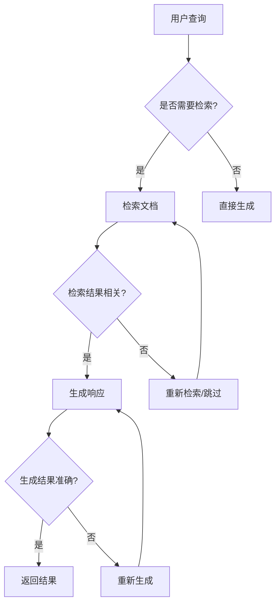
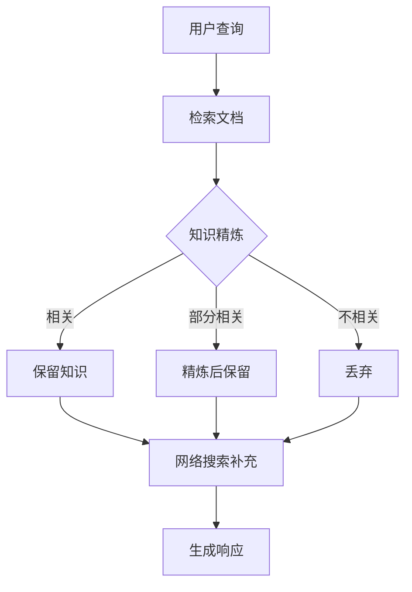

# RAG 技术进阶实战

> 📅 **更新时间**: 2026-06-17

---

## 目录

- [1. RAG 技术演进](#1-rag-技术演进)
- [2. 文档处理与分割](#2-文档处理与分割)
- [3. 向量数据库选型](#3-向量数据库选型)
- [4. 高级检索策略](#4-高级检索策略)
- [5. 查询优化](#5-查询优化)
- [6. Agentic RAG](#6-agentic-rag)
- [7. GraphRAG](#7-graphrag)
- [8. RAG 评估](#8-rag-评估)
- [9. 实战案例](#9-实战案例)
- [10. 最佳实践与陷阱](#10-最佳实践与陷阱)
- [11. 参考资料](#11-参考资料)

---

## 1. RAG 技术演进

### 1.1 Naive RAG 的局限

基础 RAG 架构（2023-2024）存在的问题：

```
Naive RAG 流程
文档 → 分割 → 向量化 → 存储 → 检索 → 生成
```

**局限性**：

| 问题 | 描述 | 影响 |
|------|------|------|
| **分割不当** | 固定长度分割破坏语义 | 检索质量差 |
| **检索不精** | 仅向量相似度，缺乏关键词匹配 | 遗漏相关文档 |
| **上下文冗余** | 检索到不相关内容 | 干扰模型生成 |
| **缺乏重排** | Top-K 直接用于生成 | 次优结果 |
| **无法追溯** | 没有引用来源验证 | 幻觉风险 |

### 1.2 Advanced RAG 架构

2025-2026 年 Advanced RAG 核心改进：

```
Advanced RAG 架构
┌──────────────────────────────────────────────────────┐
│                   查询优化层                           │
│  ┌─────────────┐  ┌─────────────┐  ┌──────────────┐  │
│  │Query Rewriting│ │Query Expansion│ │HyDE         │  │
│  └─────────────┘  └─────────────┘  └──────────────┘  │
└──────────────────────┬───────────────────────────────┘
                       │
┌──────────────────────▼───────────────────────────────┐
│                   检索层                               │
│  ┌─────────────┐  ┌─────────────┐  ┌──────────────┐  │
│  │Vector Search │  │BM25 Search  │  │Hybrid Search │  │
│  └─────────────┘  └─────────────┘  └──────────────┘  │
└──────────────────────┬───────────────────────────────┘
                       │
┌──────────────────────▼───────────────────────────────┐
│                   重排层                               │
│  ┌──────────────────────────────────────────────┐    │
│  │         Cross-Encoder Reranker                │    │
│  └──────────────────────────────────────────────┘    │
└──────────────────────┬───────────────────────────────┘
                       │
┌──────────────────────▼───────────────────────────────┐
│                   后处理层                             │
│  ┌─────────────┐  ┌─────────────┐  ┌──────────────┐  │
│  │Context      │  │Source       │  │Citation      │  │
│  │Compression  │  │Verification │  │Generation    │  │
│  └─────────────┘  └─────────────┘  └──────────────┘  │
└──────────────────────┬───────────────────────────────┘
                       │
┌──────────────────────▼───────────────────────────────┐
│                   生成层                               │
│  ┌──────────────────────────────────────────────┐    │
│  │         LLM with Enhanced Context             │    │
│  └──────────────────────────────────────────────┘    │
└──────────────────────────────────────────────────────┘
```

### 1.3 Agentic RAG 与 GraphRAG

**Agentic RAG**（2025）：
- Agent 自主决定检索策略
- 多步检索与反思
- 工具增强检索

**GraphRAG**（2025-2026）：
- 知识图谱 + 向量检索
- 关系推理能力
- Microsoft GraphRAG 引领

### 1.4 RAG 评估指标

| 指标 | 描述 | 计算方法 |
|------|------|----------|
| **Context Precision** | 检索上下文的相关性 | 相关文档 / 总检索文档 |
| **Context Recall** | 检索覆盖度 | 检索到的相关文档 / 所有相关文档 |
| **Faithfulness** | 生成内容忠于上下文 | 事实一致性检查 |
| **Answer Relevance** | 答案与问题相关性 | 语义相似度 |
| **Answer Correctness** | 答案准确性 | 与标准答案对比 |

## 2. 文档处理与分割

### 2.1 字符分割

```python
from langchain.text_splitter import CharacterTextSplitter

def character_splitting(documents):
    """字符级别分割"""
    splitter = CharacterTextSplitter(
        separator="\n\n",  # 分隔符
        chunk_size=1000,   # 块大小（字符）
        chunk_overlap=200, # 重叠
        length_function=len
    )
    
    chunks = splitter.split_documents(documents)
    
    print(f"分割前：{len(documents)} 文档")
    print(f"分割后：{len(chunks)} 块")
    
    return chunks
```

### 2.2 递归字符分割

```python
from langchain.text_splitter import RecursiveCharacterTextSplitter

def recursive_character_splitting(documents):
    """递归字符分割（推荐）"""
    splitter = RecursiveCharacterTextSplitter(
        # 分隔符优先级
        separators=[
            "\n\n",      # 段落
            "\n",        # 换行
            "。",         # 句号（中文）
            ".",         # 句号（英文）
            "！",        # 感叹号（中文）
            "?",         # 问号
            "？",        # 问号（中文）
            "；",         # 分号
            ";",         # 分号（英文）
            "，",         # 逗号
            ",",         # 逗号（英文）
            " "          # 空格
        ],
        chunk_size=1000,
        chunk_overlap=200,
        length_function=len,
        is_separator_regex=False
    )
    
    chunks = splitter.split_documents(documents)
    
    return chunks
```

### 2.3 语义分割

```python
from langchain_experimental.text_splitter import SemanticChunker
from langchain_openai import OpenAIEmbeddings

def semantic_splitting(documents):
    """语义分割（基于嵌入相似度）"""
    embeddings = OpenAIEmbeddings(model="text-embedding-3-small")
    
    chunker = SemanticChunker(
        embeddings=embeddings,
        breakpoint_threshold_type="percentile",  # 百分位阈值
        breakpoint_threshold_amount=90,          # 90 百分位
        buffer_size=1                            # 缓冲区大小
    )
    
    # 分割文本
    texts = [doc.page_content for doc in documents]
    chunks = chunker.create_documents(texts)
    
    return chunks

# 基于 LLM 的语义分割
def llm_based_splitting(text, llm):
    """使用 LLM 识别语义边界"""
    prompt = f"""将以下文本按主题分割成多个段落。

文本：
{text}

要求：
1. 保持每个段落的语义完整性
2. 用 <SPLIT> 标记分隔点
3. 不要修改原文本内容

分割结果："""
    
    response = llm.invoke(prompt)
    
    # 解析分割结果
    chunks = response.content.split("<SPLIT>")
    
    return [chunk.strip() for chunk in chunks if chunk.strip()]
```

### 2.4 LLM 辅助分割

```python
def intelligent_document_splitting(documents, llm):
    """智能文档分割"""
    all_chunks = []
    
    for doc in documents:
        # 1. 检测文档类型
        doc_type = detect_document_type(doc.page_content)
        
        # 2. 选择分割策略
        if doc_type == "code":
            chunks = split_code(doc.page_content)
        elif doc_type == "markdown":
            chunks = split_markdown(doc.page_content)
        elif doc_type == "academic":
            chunks = split_academic_paper(doc.page_content, llm)
        else:
            chunks = recursive_character_splitting([doc])
        
        # 3. 添加元数据
        for chunk in chunks:
            chunk.metadata.update({
                "source": doc.metadata.get("source", "unknown"),
                "doc_type": doc_type,
                "chunk_id": len(all_chunks)
            })
        
        all_chunks.extend(chunks)
    
    return all_chunks

def split_code(code_text):
    """代码分割（按函数/类）"""
    import re
    
    # 按函数定义分割
    pattern = r'(def \w+|class \w+)'
    splits = re.split(pattern, code_text)
    
    chunks = []
    for i in range(1, len(splits), 2):
        if i + 1 < len(splits):
            chunk = splits[i] + splits[i + 1]
            chunks.append(chunk)
    
    return chunks

def split_markdown(md_text):
    """Markdown 分割（按标题）"""
    import re
    
    # 按标题分割
    pattern = r'(#+\s+.+)'
    splits = re.split(pattern, md_text)
    
    chunks = []
    for i in range(1, len(splits), 2):
        if i + 1 < len(splits):
            chunk = splits[i] + splits[i + 1]
            chunks.append(chunk)
    
    return chunks
```

### 2.5 代码文档分割

```python
from tree_sitter import Language, Parser

def tree_sitter_code_splitting(code_text, language="python"):
    """基于 AST 的代码分割"""
    # 1. 解析代码
    parser = Parser()
    # 设置语言（需要安装 tree-sitter）
    
    tree = parser.parse(bytes(code_text, "utf8"))
    root_node = tree.root_node
    
    # 2. 提取函数和类
    chunks = []
    
    def traverse_node(node):
        if node.type in ['function_definition', 'class_definition']:
            # 提取完整函数/类代码
            chunk = code_text[
                node.start_byte:node.end_byte
            ].decode('utf-8')
            chunks.append(chunk)
        else:
            for child in node.children:
                traverse_node(child)
    
    traverse_node(root_node)
    
    return chunks
```

### 2.6 实战：分割策略选择

```python
def choose_splitting_strategy(document_type, document_size):
    """选择分割策略"""
    if document_type == "code":
        return "tree_sitter"
    elif document_type == "markdown":
        return "recursive_character"
    elif document_type == "academic":
        return "semantic"
    elif document_size < 5000:
        return "recursive_character"
    else:
        return "semantic"

class DocumentProcessor:
    """文档处理流水线"""
    
    def __init__(self, llm, embeddings):
        self.llm = llm
        self.embeddings = embeddings
    
    def process(self, documents):
        """处理文档"""
        # 1. 清洗
        cleaned = self.clean_documents(documents)
        
        # 2. 分割
        strategy = choose_splitting_strategy(
            self.detect_type(cleaned[0]),
            len(cleaned[0].page_content)
        )
        
        if strategy == "recursive_character":
            chunks = recursive_character_splitting(cleaned)
        elif strategy == "semantic":
            chunks = semantic_splitting(cleaned)
        elif strategy == "tree_sitter":
            chunks = tree_sitter_code_splitting(cleaned[0].page_content)
        else:
            chunks = intelligent_document_splitting(cleaned, self.llm)
        
        # 3. 向量化
        vectorized = self.embed_documents(chunks)
        
        # 4. 存储
        self.store_vectors(vectorized)
        
        return chunks
```

## 3. 向量数据库选型

### 3.1 Pinecone（托管服务）

**特点**：
- 全托管服务，无需运维
- 自动扩展，高可用
- 支持混合搜索（向量 + 元数据）
- 企业级安全

```python
from langchain_pinecone import PineconeVectorStore
from langchain_openai import OpenAIEmbeddings

def setup_pinecone():
    """配置 Pinecone"""
    import pinecone
    
    # 初始化
    pc = pinecone.Pinecone(api_key="your-api-key")
    
    # 创建索引
    if "my-index" not in pc.list_indexes().names():
        pc.create_index(
            name="my-index",
            dimension=1536,  # OpenAI embedding 维度
            metric="cosine",
            spec=pinecone.ServerlessSpec(cloud="aws", region="us-east-1")
        )
    
    # 连接索引
    index = pc.Index("my-index")
    
    # 创建向量存储
    embeddings = OpenAIEmbeddings()
    vectorstore = PineconeVectorStore(index=index, embedding=embeddings)
    
    return vectorstore

# 添加文档
def add_to_pinecone(vectorstore, documents):
    """添加文档到 Pinecone"""
    vectorstore.add_documents(documents)

# 搜索
def search_pinecone(vectorstore, query, top_k=5):
    """搜索 Pinecone"""
    results = vectorstore.similarity_search(query, k=top_k)
    return results
```

### 3.2 Milvus（开源分布式）

**特点**：
- 开源分布式向量数据库
- 支持十亿级向量
- GPU 加速
- 混合搜索

```python
from langchain_milvus import MilvusVectorStore

def setup_milvus():
    """配置 Milvus"""
    vectorstore = MilvusVectorStore(
        host="localhost",
        port=19530,
        collection_name="documents",
        embedding_function=OpenAIEmbeddings(),
        auto_id=True,
        drop_old=False
    )
    
    return vectorstore

# 大规模数据导入
def batch_insert_milvus(vectorstore, documents, batch_size=1000):
    """批量插入 Milvus"""
    for i in range(0, len(documents), batch_size):
        batch = documents[i:i+batch_size]
        vectorstore.add_documents(batch)
        print(f"已插入 {min(i+batch_size, len(documents))}/{len(documents)}")
```

### 3.3 Weaviate（混合搜索）

**特点**：
- 内置混合搜索（BM25 + 向量）
- GraphQL 接口
- 模块化架构

```python
from langchain_weaviate import WeaviateVectorStore

def setup_weaviate():
    """配置 Weaviate"""
    import weaviate
    
    client = weaviate.Client(
        url="http://localhost:8080",
        additional_headers={
            "X-OpenAI-Api-Key": "your-api-key"
        }
    )
    
    vectorstore = WeaviateVectorStore(
        client=client,
        index_name="Document",
        text_key="content",
        embedding=OpenAIEmbeddings(),
        by_text=False
    )
    
    return vectorstore

# 混合搜索
def hybrid_search_weaviate(vectorstore, query, alpha=0.75):
    """混合搜索（向量 + 关键词）"""
    results = vectorstore.similarity_search(
        query,
        k=5,
        search_type="hybrid",
        alpha=alpha  # 0.75 = 75% 向量，25% 关键词
    )
    return results
```

### 3.4 Chroma（轻量级）

**特点**：
- 轻量级，适合开发
- 本地部署，无需外部服务
- 简单易用

```python
from langchain_chroma import Chroma

def setup_chroma():
    """配置 Chroma"""
    vectorstore = Chroma(
        collection_name="documents",
        embedding_function=OpenAIEmbeddings(),
        persist_directory="./chroma_db"
    )
    
    return vectorstore

# 持久化
def persist_chroma(vectorstore):
    """保存 Chroma 数据"""
    vectorstore.persist()
```

### 3.5 Qdrant（高性能）

**特点**：
- Rust 编写，高性能
- 支持过滤搜索
- 分布式部署

```python
from langchain_qdrant import QdrantVectorStore

def setup_qdrant():
    """配置 Qdrant"""
    from qdrant_client import QdrantClient
    
    client = QdrantClient(
        url="http://localhost:6333",
        prefer_grpc=True
    )
    
    vectorstore = QdrantVectorStore(
        client=client,
        collection_name="documents",
        embedding=OpenAIEmbeddings()
    )
    
    return vectorstore

# 带过滤的搜索
def filtered_search_qdrant(vectorstore, query, category):
    """带过滤的搜索"""
    from qdrant_client.models import Filter, FieldCondition, MatchValue
    
    filter = Filter(
        must=[
            FieldCondition(
                key="category",
                match=MatchValue(value=category)
            )
        ]
    )
    
    results = vectorstore.similarity_search(
        query,
        k=5,
        filter=filter
    )
    
    return results
```

### 3.6 对比矩阵与选型指南

| 特性 | Pinecone | Milvus | Weaviate | Chroma | Qdrant |
|------|----------|--------|----------|--------|--------|
| **部署** | 托管 | 自托管 | 自托管 | 本地 | 自托管 |
| **规模** | 十亿级 | 十亿级 | 亿级 | 百万级 | 十亿级 |
| **混合搜索** | ✅ | ✅ | ✅ | ❌ | ✅ |
| **过滤** | ✅ | ✅ | ✅ | 基础 | ✅ |
| **GPU 加速** | ✅ | ✅ | ❌ | ❌ | ✅ |
| **运维成本** | 低 | 高 | 中 | 低 | 中 |
| **适用场景** | 生产 | 大规模 | 混合搜索 | 开发 | 高性能 |

**选型决策树**：

```python
def choose_vector_database(requirements):
    """选择向量数据库"""
    if requirements['managed']:
        return "Pinecone"
    
    if requirements['scale'] > 100_000_000:
        return "Milvus"
    
    if requirements['hybrid_search']:
        return "Weaviate"
    
    if requirements['development']:
        return "Chroma"
    
    if requirements['performance']:
        return "Qdrant"
    
    return "Chroma"  # 默认
```

## 4. 高级检索策略

### 4.1 Hybrid Search（BM25 + 向量）

```python
from langchain.retrievers import EnsembleRetriever
from langchain_community.retrievers import BM25Retriever
from langchain_chroma import Chroma

def hybrid_search_setup(documents):
    """配置混合搜索"""
    # 1. BM25 检索器（关键词）
    bm25_retriever = BM25Retriever.from_documents(documents)
    bm25_retriever.k = 5
    
    # 2. 向量检索器
    embeddings = OpenAIEmbeddings()
    chroma = Chroma.from_documents(documents, embeddings)
    vector_retriever = chroma.as_retriever(search_kwargs={"k": 5})
    
    # 3. 集成检索器
    ensemble_retriever = EnsembleRetriever(
        retrievers=[bm25_retriever, vector_retriever],
        weights=[0.3, 0.7]  # BM25 30%, 向量 70%
    )
    
    return ensemble_retriever

# 搜索
def hybrid_search(ensemble_retriever, query):
    """执行混合搜索"""
    results = ensemble_retriever.invoke(query)
    return results
```

### 4.2 Reranking（Cohere、BGE-Reranker）

```python
from langchain.retrievers import ContextualCompressionRetriever
from langchain.retrievers.document_compressors import CohereRerank

def setup_reranking(base_retriever):
    """配置重排序"""
    # 1. Cohere Rerank
    cohere_rerank = CohereRerank(
        model="rerank-english-v3.0",
        cohere_api_key="your-api-key",
        top_n=5
    )
    
    # 2. 压缩检索器
    compression_retriever = ContextualCompressionRetriever(
        base_compressor=cohere_rerank,
        base_retriever=base_retriever
    )
    
    return compression_retriever

# 使用 BGE-Reranker
from FlagEmbedding import FlagReranker

def bge_reranker_setup(base_retriever):
    """BGE Reranker"""
    reranker = FlagReranker(
        'BAAI/bge-reranker-v2-m3',
        use_fp16=True
    )
    
    class BGEReranker(BaseDocumentCompressor):
        def compress_documents(self, documents, query, **kwargs):
            # 计算相关性分数
            pairs = [(query, doc.page_content) for doc in documents]
            scores = reranker.compute_score(pairs)
            
            # 排序
            scored_docs = list(zip(documents, scores))
            scored_docs.sort(key=lambda x: x[1], reverse=True)
            
            return [doc for doc, _ in scored_docs[:5]]
    
    compression_retriever = ContextualCompressionRetriever(
        base_compressor=BGEReranker(),
        base_retriever=base_retriever
    )
    
    return compression_retriever
```

### 4.3 Query Expansion

```python
def query_expansion(original_query, llm, num_expansions=3):
    """查询扩展"""
    prompt = f"""基于以下查询，生成 {num_expansions} 个相关但不同的查询。

原始查询：{original_query}

要求：
1. 保持原始意图
2. 使用不同的措辞
3. 覆盖不同的角度

相关查询（每行一个）："""
    
    response = llm.invoke(prompt)
    
    # 解析查询
    expansions = response.content.strip().split('\n')
    
    return [original_query] + expansions[:num_expansions]

# 多查询检索
def multi_query_retrieval(base_retriever, query, llm):
    """多查询检索"""
    # 1. 扩展查询
    expanded_queries = query_expansion(query, llm)
    
    # 2. 并行检索
    all_results = []
    for eq in expanded_queries:
        results = base_retriever.invoke(eq)
        all_results.extend(results)
    
    # 3. 去重
    unique_results = remove_duplicates(all_results)
    
    return unique_results
```

### 4.4 HyDE（Hypothetical Document Embeddings）

```python
def hyde_retrieval(query, llm, vectorstore, top_k=5):
    """
    HyDE 检索
    
    1. 生成假设文档
    2. 向量化假设文档
    3. 检索相似文档
    """
    # 1. 生成假设答案
    hyde_prompt = f"""请详细回答以下问题：

问题：{query}

回答："""
    
    hypothetical_doc = llm.invoke(hyde_prompt).content
    
    # 2. 使用假设文档检索
    results = vectorstore.similarity_search(
        hypothetical_doc,
        k=top_k
    )
    
    return results
```

### 4.5 Step-back Prompting

```python
def step_back_prompting(query, llm, retriever):
    """
    Step-back Prompting
    
    1. 提出更通用的问题
    2. 检索通用知识
    3. 结合具体问题回答
    """
    # 1. 生成 step-back 问题
    stepback_prompt = f"""基于以下具体问题，提出一个更通用、更基础的问题。

具体问题：{query}

通用问题："""
    
    general_query = llm.invoke(stepback_prompt).content
    
    # 2. 检索通用知识
    general_docs = retriever.invoke(general_query)
    
    # 3. 检索具体知识
    specific_docs = retriever.invoke(query)
    
    # 4. 结合回答
    all_docs = general_docs + specific_docs
    
    return all_docs
```

### 4.6 Multi-query Retrieval

```python
class MultiQueryRetriever:
    """多查询检索器"""
    
    def __init__(self, base_retriever, llm):
        self.base_retriever = base_retriever
        self.llm = llm
    
    def invoke(self, query, num_queries=3):
        """执行多查询检索"""
        # 1. 生成多个查询
        queries = self._generate_queries(query, num_queries)
        
        # 2. 并行检索
        all_docs = []
        for q in queries:
            docs = self.base_retriever.invoke(q)
            all_docs.extend(docs)
        
        # 3. 去重和排序
        unique_docs = self._deduplicate(all_docs)
        
        return unique_docs[:5]
    
    def _generate_queries(self, original_query, num):
        """生成多个查询"""
        prompt = f"""为以下查询生成 {num} 个不同角度的查询：

原始查询：{original_query}

不同角度的查询（每行一个）："""
        
        response = self.llm.invoke(prompt)
        queries = response.content.strip().split('\n')
        
        return [original_query] + queries[:num]
    
    def _deduplicate(self, docs):
        """去重"""
        seen = set()
        unique = []
        
        for doc in docs:
            if doc.page_content not in seen:
                seen.add(doc.page_content)
                unique.append(doc)
        
        return unique
```

## 5. 查询优化

### 5.1 Query Transformation

```python
def query_transformation(query, llm):
    """查询转换"""
    # 1. 拼写纠正
    corrected = self._spell_check(query)
    
    # 2. 查询重写
    rewritten = self._rewrite_query(corrected, llm)
    
    # 3. 查询分解
    decomposed = self._decompose_query(rewritten, llm)
    
    return decomposed

def _rewrite_query(query, llm):
    """重写查询"""
    prompt = f"""将以下查询重写为更清晰、更具体的形式：

原始查询：{query}

重写后的查询："""
    
    return llm.invoke(prompt).content
```

### 5.2 Sub-question Decomposition

```python
def decompose_complex_query(complex_query, llm):
    """复杂查询分解"""
    prompt = f"""将以下复杂问题分解为多个子问题：

复杂问题：{complex_query}

子问题（编号列表）：
1."""
    
    response = llm.invoke(prompt)
    
    # 解析子问题
    sub_questions = []
    for line in response.content.split('\n'):
        if line.strip() and line[0].isdigit():
            sub_questions.append(line.split('. ', 1)[1])
    
    return sub_questions

# 多跳问答
def multi_hop_qa(complex_query, llm, retriever):
    """多跳问答"""
    # 1. 分解问题
    sub_questions = decompose_complex_query(complex_query, llm)
    
    # 2. 逐个回答子问题
    sub_answers = []
    for sq in sub_questions:
        docs = retriever.invoke(sq)
        context = "\n".join([d.page_content for d in docs[:3]])
        
        answer = llm.invoke(f"""基于以下信息回答问题：

上下文：{context}

问题：{sq}

回答：""").content
        
        sub_answers.append(answer)
    
    # 3. 综合回答
    final_answer = llm.invoke(f"""基于以下子问题的答案，回答原始问题：

子问题和答案：
{chr(10).join([f"Q: {q}\nA: {a}" for q, a in zip(sub_questions, sub_answers)])}

原始问题：{complex_query}

最终答案：""").content
    
    return final_answer
```

### 5.3 Contextual Compression

```python
from langchain.retrievers.document_compressors import LLMChainExtractor

def contextual_compression_setup(llm, base_retriever):
    """上下文压缩"""
    # 1. LLM 提取器
    extractor = LLMChainExtractor.from_llm(llm)
    
    # 2. 压缩检索器
    compression_retriever = ContextualCompressionRetriever(
        base_compressor=extractor,
        base_retriever=base_retriever
    )
    
    return compression_retriever

# 使用
def search_with_compression(compression_retriever, query):
    """带压缩的搜索"""
    results = compression_retriever.invoke(query)
    
    # 结果更简洁，只包含相关信息
    return results
```

### 5.4 Metadata Filtering

```python
def metadata_filtered_search(vectorstore, query, filters):
    """带元数据过滤的搜索"""
    # 过滤条件
    filter_dict = {
        "source": filters.get("source"),
        "category": filters.get("category"),
        "date": filters.get("date_range")
    }
    
    # 搜索
    results = vectorstore.similarity_search(
        query,
        k=5,
        filter=filter_dict
    )
    
    return results
```

## 6. Agentic RAG

### 6.1 Self-RAG（自我反思）

```python
def self_rag(query, retriever, llm):
    """
    Self-RAG
    
    1. 检索文档
    2. 评估相关性
    3. 生成答案
    4. 评估支持度
    5. 迭代改进
    """
    # 1. 初始检索
    docs = retriever.invoke(query)
    
    # 2. 评估相关性
    relevance_scores = []
    for doc in docs:
        relevance = llm.invoke(f"""评估以下文档与问题的相关性：

问题：{query}
文档：{doc.page_content}

相关性分数（1-5）：""").content
        
        relevance_scores.append(int(relevance))
    
    # 3. 筛选相关文档
    relevant_docs = [
        doc for doc, score in zip(docs, relevance_scores)
        if score >= 4
    ]
    
    # 4. 生成答案
    context = "\n".join([d.page_content for d in relevant_docs])
    
    answer = llm.invoke(f"""基于以下参考资料回答问题：

参考资料：{context}

问题：{query}

回答：""").content
    
    # 5. 评估支持度
    support = llm.invoke(f"""评估以下答案是否得到参考资料的支持：

答案：{answer}
参考资料：{context}

是否完全支持？（是/否）：""").content
    
    if support == "否":
        # 需要重新检索
        return self_rag_with_expanded_search(query, retriever, llm)
    
    return answer
```

### 6.2 Corrective RAG

```python
def corrective_rag(query, retriever, llm):
    """
    Corrective RAG
    
    1. 检索文档
    2. 判断是否需要纠正
    3. 纠正检索策略
    4. 生成答案
    """
    # 1. 初始检索
    docs = retriever.invoke(query)
    
    # 2. 评估检索质量
    quality = llm.invoke(f"""评估检索结果的质量：

问题：{query}
检索结果：{docs[0].page_content if docs else '无'}

质量评价（高/中/低）：""").content
    
    # 3. 纠正策略
    if quality == "低":
        # 扩展搜索
        docs = expanded_search(query, retriever, llm)
    elif quality == "中":
        # 重排序
        docs = rerank_documents(query, docs, llm)
    
    # 4. 生成答案
    context = "\n".join([d.page_content for d in docs[:5]])
    
    answer = llm.invoke(f"""基于参考资料回答问题：

参考资料：{context}

问题：{query}

回答：""").content
    
    return answer
```

### 6.3 Adaptive RAG

```python
def adaptive_rag(query, retriever, llm):
    """
    Adaptive RAG
    
    根据问题类型自适应选择检索策略
    """
    # 1. 分类问题类型
    question_type = classify_question(query, llm)
    
    # 2. 选择策略
    if question_type == "factual":
        # 事实性问题：直接检索
        docs = retriever.invoke(query)
    elif question_type == "analytical":
        # 分析性问题：多步检索
        docs = multi_step_retrieval(query, retriever, llm)
    elif question_type == "creative":
        # 创造性问题：HyDE
        docs = hyde_retrieval(query, llm, retriever)
    else:
        # 默认：混合搜索
        docs = hybrid_search(query, retriever)
    
    # 3. 生成答案
    context = "\n".join([d.page_content for d in docs[:5]])
    
    answer = llm.invoke(f"""基于参考资料回答：

参考资料：{context}

问题：{query}

回答：""").content
    
    return answer
```

### 6.4 工具增强 RAG

```python
class ToolEnhancedRAG:
    """工具增强的 RAG"""
    
    def __init__(self, retriever, llm, tools):
        self.retriever = retriever
        self.llm = llm
        self.tools = tools
    
    def query(self, question):
        """执行查询"""
        # 1. 决定是否需要工具
        need_tools = self._decide_tools(question)
        
        if need_tools:
            # 2. 调用工具
            tool_results = self._call_tools(question)
            
            # 3. 结合工具结果和检索
            docs = self.retriever.invoke(question)
            context = tool_results + "\n" + "\n".join([d.page_content for d in docs])
        else:
            # 直接检索
            docs = self.retriever.invoke(question)
            context = "\n".join([d.page_content for d in docs])
        
        # 4. 生成答案
        answer = self.llm.invoke(f"""基于以下信息回答问题：

信息：{context}

问题：{question}

回答：""").content
        
        return answer
    
    def _decide_tools(self, question):
        """决定是否需要工具"""
        # 检查是否包含需要工具的关键字
        tool_keywords = ["计算", "当前", "最新", "实时"]
        
        for keyword in tool_keywords:
            if keyword in question:
                return True
        
        return False
    
    def _call_tools(self, question):
        """调用工具"""
        results = []
        
        for tool in self.tools:
            if tool.can_handle(question):
                result = tool.execute(question)
                results.append(result)
        
        return "\n".join(results)
```

## 7. GraphRAG

### 7.1 知识图谱构建

```python
from langchain.graphs import Neo4jGraph
from langchain_experimental.graph_transformers import LLMGraphTransformer

def build_knowledge_graph(documents, llm):
    """构建知识图谱"""
    # 1. 初始化图数据库
    graph = Neo4jGraph(
        url="bolt://localhost:7687",
        username="neo4j",
        password="password"
    )
    
    # 2. 使用 LLM 提取实体和关系
    llm_transformer = LLMGraphTransformer(llm=llm)
    
    # 3. 转换文档为图
    graph_documents = llm_transformer.convert_to_graph_documents(documents)
    
    # 4. 添加到图数据库
    graph.add_graph_documents(graph_documents)
    
    return graph
```

### 7.2 图谱检索

```python
def graph_retrieval(query, graph, llm):
    """图谱检索"""
    # 1. 从查询中提取实体
    entities = extract_entities(query, llm)
    
    # 2. 查询图谱
    cypher_query = f"""
    MATCH (n)
    WHERE n.name IN {entities}
    MATCH (n)-[r]->(m)
    RETURN n, r, m
    LIMIT 10
    """
    
    results = graph.query(cypher_query)
    
    # 3. 格式化结果
    context = format_graph_results(results)
    
    return context
```

### 7.3 图谱与向量融合

```python
def hybrid_graph_vector_retrieval(query, graph, vectorstore, llm):
    """图谱与向量融合检索"""
    # 1. 图谱检索
    graph_context = graph_retrieval(query, graph, llm)
    
    # 2. 向量检索
    vector_docs = vectorstore.similarity_search(query, k=5)
    vector_context = "\n".join([d.page_content for d in vector_docs])
    
    # 3. 融合
    combined_context = f"""知识图谱信息：
{graph_context}

向量检索信息：
{vector_context}"""
    
    return combined_context
```

### 7.4 Microsoft GraphRAG 实践

```python
# Microsoft GraphRAG 示例
def microsoft_graphrag(query, documents):
    """Microsoft GraphRAG 实现"""
    # 1. 文本分块
    chunks = chunk_documents(documents)
    
    # 2. 提取实体和关系
    elements = extract_entities_and_relations(chunks)
    
    # 3. 构建社区层次结构
    communities = build_community_hierarchy(elements)
    
    # 4. 生成社区摘要
    community_summaries = generate_community_summaries(communities)
    
    # 5. 查询处理
    response = query_graphrag(query, community_summaries)
    
    return response
```

## 8. RAG 评估

### 8.1 RAGAS 框架

```python
from ragas import evaluate
from ragas.metrics import (
    faithfulness,
    answer_relevancy,
    context_precision,
    context_recall
)

def evaluate_rag_system(questions, ground_truths, answers, contexts):
    """评估 RAG 系统"""
    # 1. 准备数据
    dataset = {
        "question": questions,
        "answer": answers,
        "contexts": contexts,
        "ground_truth": ground_truths
    }
    
    # 2. 评估
    result = evaluate(
        dataset,
        metrics=[
            faithfulness,
            answer_relevancy,
            context_precision,
            context_recall
        ]
    )
    
    # 3. 输出结果
    print(f"Faithfulness: {result['faithfulness']:.4f}")
    print(f"Answer Relevancy: {result['answer_relevancy']:.4f}")
    print(f"Context Precision: {result['context_precision']:.4f}")
    print(f"Context Recall: {result['context_recall']:.4f}")
    
    return result
```

### 8.2 ARES 评估

```python
from ares import RAGEvaluator

def ares_evaluation(questions, answers, contexts):
    """ARES 评估"""
    evaluator = RAGEvaluator()
    
    # 评估
    results = evaluator.evaluate(
        questions=questions,
        answers=answers,
        contexts=contexts
    )
    
    return results
```

### 8.3 关键指标

```python
def calculate_rag_metrics(questions, answers, contexts, ground_truths):
    """计算 RAG 指标"""
    metrics = {}
    
    # 1. Faithfulness（忠实度）
    metrics['faithfulness'] = calculate_faithfulness(answers, contexts)
    
    # 2. Answer Relevance（答案相关性）
    metrics['answer_relevance'] = calculate_answer_relevance(
        questions, answers
    )
    
    # 3. Context Precision（上下文精确度）
    metrics['context_precision'] = calculate_context_precision(
        questions, contexts
    )
    
    # 4. Context Recall（上下文召回率）
    metrics['context_recall'] = calculate_context_recall(
        contexts, ground_truths
    )
    
    # 5. Answer Correctness（答案正确性）
    metrics['answer_correctness'] = calculate_answer_correctness(
        answers, ground_truths
    )
    
    return metrics

def calculate_faithfulness(answers, contexts):
    """计算忠实度"""
    # 检查答案是否基于上下文
    faithful_count = 0
    
    for answer, context in zip(answers, contexts):
        # 使用 LLM 判断
        is_faithful = llm_judge_faithfulness(answer, context)
        if is_faithful:
            faithful_count += 1
    
    return faithful_count / len(answers)
```

### 8.4 优化迭代流程

```python
def optimize_rag_system(base_config, evaluation_results):
    """优化 RAG 系统"""
    optimized_config = base_config.copy()
    
    # 1. 如果 Context Precision 低
    if evaluation_results['context_precision'] < 0.7:
        # 改进检索策略
        optimized_config['retrieval_strategy'] = 'hybrid'
        optimized_config['add_reranking'] = True
    
    # 2. 如果 Faithfulness 低
    if evaluation_results['faithfulness'] < 0.8:
        # 改进 Prompt
        optimized_config['prompt_template'] = 'strict_context'
        optimized_config['add_citation'] = True
    
    # 3. 如果 Context Recall 低
    if evaluation_results['context_recall'] < 0.7:
        # 增加检索数量
        optimized_config['top_k'] = 10
        optimized_config['add_query_expansion'] = True
    
    # 4. 如果 Answer Relevance 低
    if evaluation_results['answer_relevance'] < 0.8:
        # 改进答案生成
        optimized_config['add_contextual_compression'] = True
    
    return optimized_config
```

## 9. 实战案例

### 9.1 企业知识库问答

```python
class EnterpriseQA:
    """企业知识库问答系统"""
    
    def __init__(self):
        # 1. 初始化组件
        self.llm = ChatOpenAI(model="gpt-5.2", temperature=0)
        self.embeddings = OpenAIEmbeddings()
        
        # 2. 向量存储
        self.vectorstore = Chroma(
            collection_name="enterprise_kb",
            embedding_function=self.embeddings,
            persist_directory="./chroma_kb"
        )
        
        # 3. 检索器
        self.retriever = self._setup_retriever()
        
        # 4. RAG 链
        self.rag_chain = self._setup_rag_chain()
    
    def _setup_retriever(self):
        """配置检索器"""
        # 混合搜索
        bm25 = BM25Retriever.from_vectorstore(self.vectorstore)
        vector = self.vectorstore.as_retriever(search_kwargs={"k": 5})
        
        ensemble = EnsembleRetriever(
            retrievers=[bm25, vector],
            weights=[0.3, 0.7]
        )
        
        # 重排序
        reranker = CohereRerank(model="rerank-english-v3.0")
        
        compression_retriever = ContextualCompressionRetriever(
            base_compressor=reranker,
            base_retriever=ensemble
        )
        
        return compression_retriever
    
    def _setup_rag_chain(self):
        """配置 RAG 链"""
        prompt = ChatPromptTemplate.from_template("""
        你是企业知识助手。基于提供的参考资料回答问题。

        参考资料：
        {context}

        问题：{question}

        回答：
        """)
        
        def format_docs(docs):
            return "\n\n".join([d.page_content for d in docs])
        
        rag_chain = (
            {"context": self.retriever | format_docs, "question": RunnablePassthrough()}
            | prompt
            | self.llm
            | StrOutputParser()
        )
        
        return rag_chain
    
    def query(self, question, filters=None):
        """执行查询"""
        # 1. 应用过滤
        if filters:
            self.retriever.search_kwargs['filter'] = filters
        
        # 2. 执行 RAG
        answer = self.rag_chain.invoke(question)
        
        # 3. 返回结果
        return {
            "answer": answer,
            "sources": self._get_sources(question)
        }
    
    def ingest_document(self, file_path):
        """导入文档"""
        # 1. 读取文档
        loader = PyPDFLoader(file_path)
        documents = loader.load()
        
        # 2. 分割
        splitter = RecursiveCharacterTextSplitter(
            chunk_size=1000,
            chunk_overlap=200
        )
        chunks = splitter.split_documents(documents)
        
        # 3. 添加元数据
        for chunk in chunks:
            chunk.metadata['source'] = file_path
            chunk.metadata['ingested_at'] = datetime.now().isoformat()
        
        # 4. 存储
        self.vectorstore.add_documents(chunks)
```

### 9.2 代码检索与补全

```python
class CodeRAG:
    """代码检索增强生成"""
    
    def __init__(self):
        self.llm = ChatOpenAI(model="gpt-5.2")
        self.embeddings = HuggingFaceEmbeddings(
            model_name="BAAI/bge-large-en"
        )
        
        # 代码专用向量库
        self.vectorstore = Chroma(
            collection_name="code_kb",
            embedding_function=self.embeddings
        )
    
    def search_code(self, query, language="python"):
        """搜索代码"""
        # 1. 检索相似代码
        results = self.vectorstore.similarity_search(
            query,
            k=5,
            filter={"language": language}
        )
        
        # 2. 返回结果
        return results
    
    def code_completion(self, context, partial_code):
        """代码补全"""
        # 1. 检索相关代码片段
        snippets = self.search_code(partial_code)
        
        # 2. 构建上下文
        code_context = "\n\n".join([s.page_content for s in snippets])
        
        # 3. 生成补全
        prompt = f"""基于以下相关代码示例，完成当前代码：

相关代码：
{code_context}

当前代码：
{context}{partial_code}

完成代码："""
        
        completion = self.llm.invoke(prompt).content
        
        return completion
```

### 9.3 多语言 RAG

```python
class MultilingualRAG:
    """多语言 RAG 系统"""
    
    def __init__(self):
        # 多语言嵌入模型
        self.embeddings = HuggingFaceEmbeddings(
            model_name="sentence-transformers/paraphrase-multilingual-MiniLM-L12-v2"
        )
        
        self.vectorstore = Chroma(
            collection_name="multilingual_kb",
            embedding_function=self.embeddings
        )
        
        self.llm = ChatOpenAI(model="gpt-5.2")
    
    def query(self, question, language="auto"):
        """多语言查询"""
        # 1. 检测语言
        if language == "auto":
            language = detect_language(question)
        
        # 2. 检索（跨语言）
        results = self.vectorstore.similarity_search(question, k=5)
        
        # 3. 生成答案（指定语言）
        context = "\n".join([d.page_content for d in results])
        
        prompt = f"""基于参考资料，用 {language} 回答问题。

参考资料：{context}

问题：{question}

回答（使用{language}）："""
        
        answer = self.llm.invoke(prompt).content
        
        return answer
```

### 9.4 生产环境部署

```python
# FastAPI 部署示例
from fastapi import FastAPI
from pydantic import BaseModel

app = FastAPI()

# 初始化 RAG 系统
rag_system = EnterpriseQA()

class QueryRequest(BaseModel):
    question: str
    filters: dict = None

class QueryResponse(BaseModel):
    answer: str
    sources: list

@app.post("/api/rag/query", response_model=QueryResponse)
async def rag_query(request: QueryRequest):
    """RAG 查询 API"""
    result = rag_system.query(request.question, request.filters)
    
    return QueryResponse(
        answer=result['answer'],
        sources=result['sources']
    )

@app.post("/api/rag/ingest")
async def ingest_document(file: UploadFile):
    """导入文档 API"""
    # 保存临时文件
    temp_file = f"/tmp/{file.filename}"
    with open(temp_file, "wb") as f:
        content = await file.read()
        f.write(content)
    
    # 导入
    rag_system.ingest_document(temp_file)
    
    # 清理
    os.remove(temp_file)
    
    return {"status": "success"}

# 启动服务
# uvicorn main:app --host 0.0.0.0 --port 8000
```

## 10. 最佳实践与陷阱

### 10.1 最佳实践

```
RAG 最佳实践清单
├── 1. 文档处理
│   ✅ 使用递归字符分割
│   ✅ 保持语义完整性
│   ✅ 添加丰富元数据
│   ✅ 代码使用 AST 分割
│
├── 2. 检索优化
│   ✅ 混合搜索（BM25 + 向量）
│   ✅ 重排序（Cohere/BGE）
│   ✅ 查询扩展
│   ✅ 元数据过滤
│
├── 3. 生成优化
│   ✅ 上下文压缩
│   ✅ 引用来源
│   ✅ 幻觉检测
│   ✅ 流式输出
│
├── 4. 评估监控
│   ✅ 使用 RAGAS 评估
│   ✅ 监控关键指标
│   ✅ A/B 测试
│   ✅ 用户反馈收集
│
└── 5. 生产部署
    ✅ 缓存常见查询
    ✅ 限流与降级
    ✅ 错误处理
    ✅ 日志追踪
```

### 10.2 常见陷阱

| 陷阱 | 描述 | 解决方案 |
|------|------|----------|
| **分割过粗** | 块太大，包含不相关信息 | 使用递归分割，1000 字符 |
| **分割过细** | 块太小，丢失上下文 | 增加 overlap，200 字符 |
| **仅向量搜索** | 忽略关键词匹配 | 使用混合搜索 |
| **无重排序** | Top-K 质量不稳定 | 添加 Cross-Encoder 重排 |
| **幻觉** | 生成不在上下文中的内容 | 严格 Prompt，验证支持度 |
| **评估不足** | 没有系统评估 | 使用 RAGAS 定期评估 |

## 11. 参考资料

### 11.1 技术与教程

- Advanced RAG techniques: https://neo4j.com/blog/genai/advanced-rag-techniques/
- Advanced RAG & GraphRAG: https://medium.com/@QuarkAndCode/advanced-rag-graphrag-techniques-for-reliable-llm-apps
- RAG Using Knowledge Graph: https://procogia.com/rag-using-knowledge-graph-mastering-advanced-techniques-part-2/

### 11.2 对比与分析

- Vector DB vs Knowledge Graph in 2026: https://futureagi.com/blog/vector-databases-knowledge-graphs-rag-2025/
- Graph RAG vs Standard RAG: https://www.birjob.com/blog/graph-rag-knowledge-graphs-vs-vector-search
- Benchmarking Vector, Graph and Hybrid Retrieval: https://arxiv.org/html/2507.03608v1

### 11.3 工具与库

- RAGAS: https://github.com/explodinggradients/ragas
- LangChain: https://python.langchain.com/
- LlamaIndex: https://www.llamaindex.ai/

## Self-RAG 与 CRAG 实战

> 📌 **说明**: Self-RAG 和 Corrective RAG (CRAG) 是 Agentic RAG 的进阶模式，通过 Agent 的自我评估和校正，显著提升检索质量。

### Self-RAG：自反思检索增强生成

Self-RAG 的核心思想是让模型在生成过程中**自我评估**是否需要检索、检索结果是否相关、生成结果是否准确。

#### Self-RAG 架构图



#### LangGraph Self-RAG 实现

```python
# 🚀 生产级可执行代码
from typing import TypedDict, Literal, List, Annotated
from langchain_core.prompts import ChatPromptTemplate
from langchain_openai import ChatOpenAI
from langgraph.graph import StateGraph, END

# 定义状态
class SelfRAGState(TypedDict):
    query: str
    documents: List[str]
    generation: str
    retrieval_needed: Literal["yes", "no"]
    relevance: Literal["relevant", "irrelevant"]
    support: Literal["fully", "partially", "no"]

llm = ChatOpenAI(model="gpt-4", temperature=0)

# 节点1：判断是否需要检索
def retrieve_decision(state: SelfRAGState) -> SelfRAGState:
    """决定是否需要检索"""
    prompt = ChatPromptTemplate.from_messages([
        ("system", "判断用户查询是否需要检索外部知识。输出 yes 或 no。"),
        ("human", "查询：{query}")
    ])
    
    chain = prompt | llm
    response = chain.invoke({"query": state["query"]})
    
    return {
        **state,
        "retrieval_needed": "yes" if "yes" in response.content.lower() else "no"
    }

# 节点2：检索
def retrieve(state: SelfRAGState) -> SelfRAGState:
    """执行检索"""
    # 实际实现应连接向量数据库
    # 这里使用模拟检索
    mock_docs = [
        f"文档1：关于 {state['query']} 的信息...",
        f"文档2：更多关于 {state['query']} 的细节..."
    ]
    return {**state, "documents": mock_docs}

# 节点3：评估相关性
def relevance_evaluation(state: SelfRAGState) -> SelfRAGState:
    """评估检索结果是否相关"""
    prompt = ChatPromptTemplate.from_messages([
        ("system", "评估检索结果是否与查询相关。输出 relevant 或 irrelevant。"),
        ("human", "查询：{query}\n\n文档：{documents}")
    ])
    
    chain = prompt | llm
    response = chain.invoke({
        "query": state["query"],
        "documents": "\n".join(state["documents"])
    })
    
    return {
        **state,
        "relevance": "relevant" if "relevant" in response.content.lower() else "irrelevant"
    }

# 节点4：生成
def generate(state: SelfRAGState) -> SelfRAGState:
    """生成响应"""
    prompt = ChatPromptTemplate.from_messages([
        ("system", "基于以下文档回答问题。如果文档不足，说明无法回答。"),
        ("human", "问题：{query}\n\n文档：{documents}")
    ])
    
    chain = prompt | llm
    response = chain.invoke({
        "query": state["query"],
        "documents": "\n".join(state["documents"])
    })
    
    return {**state, "generation": response.content}

# 条件边函数
def should_retrieve(state: SelfRAGState) -> str:
    return "retrieve" if state["retrieval_needed"] == "yes" else "generate"

def is_relevant(state: SelfRAGState) -> str:
    return "generate" if state["relevance"] == "relevant" else "retrieve"

# 构建图
builder = StateGraph(SelfRAGState)

# 添加节点
builder.add_node("retrieve_decision", retrieve_decision)
builder.add_node("retrieve", retrieve)
builder.add_node("relevance_eval", relevance_evaluation)
builder.add_node("generate", generate)

# 添加边
builder.add_edge("__start__", "retrieve_decision")
builder.add_conditional_edges(
    "retrieve_decision",
    should_retrieve,
    {"retrieve": "retrieve", "generate": "generate"}
)
builder.add_edge("retrieve", "relevance_eval")
builder.add_conditional_edges(
    "relevance_eval",
    is_relevant,
    {"generate": "generate", "retrieve": "retrieve"}
)
builder.add_edge("generate", END)

# 编译
self_rag = builder.compile()

# 使用示例
result = self_rag.invoke({"query": "什么是 Transformer 架构？"})
print(f"生成结果：{result['generation']}")
```

### CRAG：校正性检索增强生成

CRAG (Corrective RAG) 的核心思想是在检索后增加**知识精炼**步骤，过滤不相关信息，并通过网络搜索补充知识。

#### CRAG 架构图



#### LangGraph CRAG 实现

```python
# 🚀 生产级可执行代码
from typing import TypedDict, List, Literal
from langchain_core.prompts import ChatPromptTemplate
from langchain_openai import ChatOpenAI
from langgraph.graph import StateGraph, END

class CRAGState(TypedDict):
    query: str
    retrieved_docs: List[str]
    refined_docs: List[str]
    web_results: List[str]
    knowledge_score: Literal["correct", "incorrect", "ambiguous"]
    final_answer: str

llm = ChatOpenAI(model="gpt-4", temperature=0)

# 节点1：检索
def retrieve_docs(state: CRAGState) -> CRAGState:
    """检索文档"""
    # 实际应连接向量数据库
    mock_docs = [
        f"相关文档：关于 {state['query']} 的正确信息",
        "不相关文档：完全无关的内容",
        f"部分相关：部分关于 {state['query']} 的信息"
    ]
    return {**state, "retrieved_docs": mock_docs}

# 节点2：知识精炼
def refine_knowledge(state: CRAGState) -> CRAGState:
    """精炼检索结果"""
    prompt = ChatPromptTemplate.from_messages([
        ("system", """评估每个文档与查询的相关性。
输出 JSON 数组，每个元素包含：
- content: 文档内容
- score: relevant/irrelevant/partial"""),
        ("human", "查询：{query}\n\n文档列表：{docs}")
    ])
    
    chain = prompt | llm
    response = chain.invoke({
        "query": state["query"],
        "docs": "\n".join(state["retrieved_docs"])
    })
    
    # 解析结果，保留相关和部分相关
    refined = []
    # 实际应解析 JSON，这里简化
    for doc in state["retrieved_docs"]:
        if "不相关" not in doc:
            refined.append(doc)
    
    return {**state, "refined_docs": refined}

# 节点3：网络搜索补充
def web_search(state: CRAGState) -> CRAGState:
    """网络搜索补充知识"""
    # 实际应调用搜索 API（如 Tavily、Serper）
    mock_results = [
        f"网络搜索结果1：关于 {state['query']} 的最新信息",
        f"网络搜索结果2：更多补充资料"
    ]
    return {**state, "web_results": mock_results}

# 节点4：评估知识质量
def evaluate_knowledge(state: CRAGState) -> CRAGState:
    """评估知识质量"""
    prompt = ChatPromptTemplate.from_messages([
        ("system", "评估以下知识是否足以回答问题。输出 correct/incorrect/ambiguous。"),
        ("human", "问题：{query}\n\n精炼后的知识：{refined}\n\n网络搜索：{web}")
    ])
    
    chain = prompt | llm
    response = chain.invoke({
        "query": state["query"],
        "refined": "\n".join(state["refined_docs"]),
        "web": "\n".join(state["web_results"])
    })
    
    score = response.content.lower().strip()
    if "correct" in score:
        knowledge_score = "correct"
    elif "incorrect" in score:
        knowledge_score = "incorrect"
    else:
        knowledge_score = "ambiguous"
    
    return {**state, "knowledge_score": knowledge_score}

# 节点5：生成
def generate_answer(state: CRAGState) -> CRAGState:
    """生成最终答案"""
    prompt = ChatPromptTemplate.from_messages([
        ("system", "基于提供的知识回答问题。如果知识不足，说明无法确定。"),
        ("human", "问题：{query}\n\n知识：{knowledge}")
    ])
    
    knowledge = state["refined_docs"] + state["web_results"]
    chain = prompt | llm
    response = chain.invoke({
        "query": state["query"],
        "knowledge": "\n".join(knowledge)
    })
    
    return {**state, "final_answer": response.content}

# 条件边函数
def knowledge_check(state: CRAGState) -> str:
    if state["knowledge_score"] == "correct":
        return "generate"
    elif state["knowledge_score"] == "incorrect":
        return "web_search"  # 知识不正确，重新搜索
    else:
        return "web_search"  # 知识模糊，补充搜索

# 构建图
builder = StateGraph(CRAGState)

builder.add_node("retrieve", retrieve_docs)
builder.add_node("refine", refine_knowledge)
builder.add_node("web_search", web_search)
builder.add_node("evaluate", evaluate_knowledge)
builder.add_node("generate", generate_answer)

builder.add_edge("__start__", "retrieve")
builder.add_edge("retrieve", "refine")
builder.add_edge("refine", "evaluate")
builder.add_conditional_edges(
    "evaluate",
    knowledge_check,
    {"generate": "generate", "web_search": "web_search"}
)
builder.add_edge("web_search", "generate")
builder.add_edge("generate", END)

crag = builder.compile()

# 使用示例
result = crag.invoke({"query": "2026年最新的 AI 技术趋势是什么？"})
print(f"最终答案：{result['final_answer']}")
```

#### Self-RAG vs CRAG 对比

| 特性 | Self-RAG | CRAG |
|------|---------|------|
| **核心机制** | 自我评估检索必要性 | 知识精炼 + 网络补充 |
| **检索决策** | 模型判断是否需要检索 | 始终检索，但精炼过滤 |
| **知识补充** | 重新检索相同源 | 网络搜索补充 |
| **适用场景** | 检索成本高、需按需检索 | 知识可能过时、需多源验证 |
| **Token 消耗** | 较低（按需） | 中等（始终检索+精炼） |
| **准确率** | 高 | 最高（多源验证） |

#### 实战建议

1. **首选 Self-RAG**：当检索成本高（如大型知识库）或查询可能不需要检索时
2. **选择 CRAG**：当知识可能过时、需要最新信息、或检索结果质量不稳定时
3. **混合使用**：先用 Self-RAG 判断是否需要检索，再用 CRAG 精炼和补充

#### 参考资料

1. Self-RAG 论文：https://arxiv.org/abs/2310.11511
2. CRAG 论文：https://arxiv.org/abs/2401.15884
3. LangGraph 官方示例：https://langchain-ai.github.io/langgraph/
