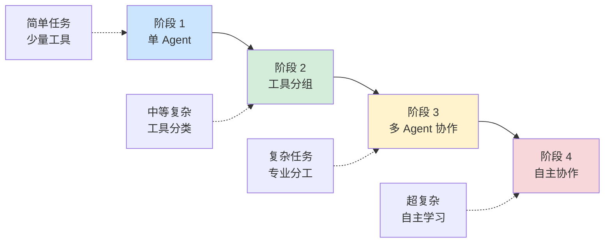

# 工作流编排与 LangGraph

> 📅 **更新时间**: 2026-06-17  

---

## 目录

- [1. 评估与测试](#1-评估与测试)
- [2. 总览](#2-总览)
- [3. 按分类](#3-按分类)
- [4. 生产级最佳实践](#4-生产级最佳实践)
- [5. 实战项目](#5-实战项目)
- [6. 从单 Agent 到多 Agent](#6-从单-agent-到多-agent)
- [7. 单 Agent 的局限性](#7-单-agent-的局限性)
- [8. 何时需要使用多 Agent 架构](#8-何时需要使用多-agent-架构)
- [9. 单 Agent 到多 Agent 迁移 Checklist](#9-单-agent-到多-agent-迁移-checklist)
- [10. 总结](#10-总结)

---

## 1. 评估与测试

### 1.1 Agent 能力评估

#### 评估指标体系

```python
# Agent 评估指标体系

from typing import List, Dict
from dataclasses import dataclass
from datetime import datetime

@dataclass
class AgentMetrics:
    """Agent 评估指标"""
    # 工具使用
    tool_accuracy: float = 0.0  # 工具使用准确率
    tool_selection_precision: float = 0.0  # 工具选择精确率
    tool_call_efficiency: float = 0.0  # 工具调用效率
    
    # 任务完成
    task_completion_rate: float = 0.0  # 任务完成率
    average_iterations: float = 0.0  # 平均迭代次数
    average_execution_time: float = 0.0  # 平均执行时间
    
    # 输出质量
    output_accuracy: float = 0.0  # 输出准确率
    output_completeness: float = 0.0  # 输出完整性
    output_relevance: float = 0.0  # 输出相关性
    
    # 错误处理
    error_rate: float = 0.0  # 错误率
    recovery_success_rate: float = 0.0  # 错误恢复成功率
    
    # 资源使用
    average_tokens: float = 0.0  # 平均 token 消耗
    cost_per_task: float = 0.0  # 单任务成本
    
    def to_dict(self) -> dict:
        return {
            "tool_accuracy": self.tool_accuracy,
            "tool_selection_precision": self.tool_selection_precision,
            "task_completion_rate": self.task_completion_rate,
            "average_iterations": self.average_iterations,
            "error_rate": self.error_rate,
            "output_accuracy": self.output_accuracy
        }

class AgentEvaluator:
    """Agent 评估器"""
    
    def __init__(self, llm):
        self.llm = llm
        self.evaluation_history: List[dict] = []
    
    def evaluate_single_task(
        self,
        task: str,
        expected_output: str,
        actual_output: str,
        execution_info: dict
    ) -> dict:
        """评估单个任务"""
        prompt = f"""
请评估 Agent 的任务执行质量：

任务：{task}
期望输出：{expected_output}
实际输出：{actual_output}
执行信息：{execution_info}

评估维度（0-1 分）：
1. **准确性**：输出是否准确无误
2. **完整性**：是否覆盖所有要求
3. **相关性**：输出是否与任务相关
4. **效率**：执行效率如何

输出 JSON：
```json
{{
    "accuracy": 0.9,
    "completeness": 0.8,
    "relevance": 0.95,
    "efficiency": 0.7,
    "overall_score": 0.84,
    "feedback": "具体反馈"
}}
```
"""
        
        response = self.llm.invoke([HumanMessage(content=prompt)])
        
        try:
            json_str = response.content.split("```json")[1].split("```")[0]
            evaluation = json.loads(json_str.strip())
            
            # 记录
            self.evaluation_history.append({
                "task": task,
                "evaluation": evaluation,
                "timestamp": datetime.now().isoformat()
            })
            
            return evaluation
        except:
            return {"overall_score": 0, "feedback": "评估失败"}
    
    def aggregate_metrics(self) -> AgentMetrics:
        """聚合指标"""
        if not self.evaluation_history:
            return AgentMetrics()
        
        # 计算平均值
        scores = {
            "tool_accuracy": [],
            "task_completion_rate": [],
            "output_accuracy": [],
            "error_rate": []
        }
        
        for record in self.evaluation_history:
            eval_data = record["evaluation"]
            scores["task_completion_rate"].append(eval_data.get("overall_score", 0))
            scores["output_accuracy"].append(eval_data.get("accuracy", 0))
        
        metrics = AgentMetrics()
        metrics.task_completion_rate = sum(scores["task_completion_rate"]) / len(scores["task_completion_rate"])
        metrics.output_accuracy = sum(scores["output_accuracy"]) / len(scores["output_accuracy"])
        
        return metrics

# 使用示例
evaluator = AgentEvaluator(llm)

# 评估任务
evaluation = evaluator.evaluate_single_task(
    task="计算 2^10",
    expected_output="1024",
    actual_output="1024",
    execution_info={
        "iterations": 2,
        "tool_calls": 1,
        "execution_time": 3.5
    }
)

print(f"总体评分：{evaluation['overall_score']}")
print(f"反馈：{evaluation['feedback']}")
```

#### 基准测试套件

```python
# 基准测试套件

from typing import List, Callable
import json

class BenchmarkTask:
    """基准测试任务"""
    def __init__(
        self,
        name: str,
        description: str,
        input_data: dict,
        expected_output: str,
        category: str,
        difficulty: int = 1
    ):
        self.name = name
        self.description = description
        self.input_data = input_data
        self.expected_output = expected_output
        self.category = category
        self.difficulty = difficulty

class BenchmarkSuite:
    """基准测试套件"""
    
    def __init__(self):
        self.tasks: List[BenchmarkTask] = []
        self.results: List[dict] = []
    
    def add_task(self, task: BenchmarkTask):
        """添加测试任务"""
        self.tasks.append(task)
    
    def load_standard_benchmarks(self):
        """加载标准基准测试"""
        # 工具使用测试
        self.add_task(BenchmarkTask(
            name="calculator_basic",
            description="基础计算",
            input_data={"input": "计算 256 * 128"},
            expected_output="32768",
            category="tool_use",
            difficulty=1
        ))
        
        self.add_task(BenchmarkTask(
            name="search_fact",
            description="事实查询",
            input_data={"input": "爱因斯坦哪一年获得诺贝尔奖？"},
            expected_output="1921 年",
            category="tool_use",
            difficulty=2
        ))
        
        # 多步推理测试
        self.add_task(BenchmarkTask(
            name="multi_step_reasoning",
            description="多步推理",
            input_data={"input": "如果 3 个人 3 天完成 3 个项目，9 个人 9 天完成多少？"},
            expected_output="27 个项目",
            category="reasoning",
            difficulty=3
        ))
        
        # 错误处理测试
        self.add_task(BenchmarkTask(
            name="error_handling",
            description="错误处理",
            input_data={"input": "查询一个不存在的城市天气"},
            expected_output="友好的错误提示",
            category="error_handling",
            difficulty=2
        ))
    
    def run_benchmark(self, agent_executor) -> dict:
        """运行基准测试"""
        results = {
            "total_tasks": len(self.tasks),
            "passed": 0,
            "failed": 0,
            "by_category": {},
            "by_difficulty": {},
            "details": []
        }
        
        for task in self.tasks:
            # 执行任务
            try:
                result = agent_executor.invoke({"input": task.input_data["input"]})
                actual_output = result.get("output", "")
                
                # 评估
                passed = self._evaluate_output(
                    task.expected_output,
                    actual_output
                )
                
                if passed:
                    results["passed"] += 1
                else:
                    results["failed"] += 1
                
                # 按分类统计
                if task.category not in results["by_category"]:
                    results["by_category"][task.category] = {"passed": 0, "total": 0}
                results["by_category"][task.category]["total"] += 1
                if passed:
                    results["by_category"][task.category]["passed"] += 1
                
                # 按难度统计
                if task.difficulty not in results["by_difficulty"]:
                    results["by_difficulty"][task.difficulty] = {"passed": 0, "total": 0}
                results["by_difficulty"][task.difficulty]["total"] += 1
                if passed:
                    results["by_difficulty"][task.difficulty]["passed"] += 1
                
                # 详细结果
                results["details"].append({
                    "task": task.name,
                    "category": task.category,
                    "difficulty": task.difficulty,
                    "passed": passed,
                    "expected": task.expected_output,
                    "actual": actual_output[:200]
                })
                
            except Exception as e:
                results["failed"] += 1
                results["details"].append({
                    "task": task.name,
                    "category": task.category,
                    "difficulty": task.difficulty,
                    "passed": False,
                    "error": str(e)
                })
        
        return results
    
    def _evaluate_output(self, expected: str, actual: str) -> bool:
        """评估输出（简化版）"""
        # 简化：检查关键词
        expected_keywords = set(expected.lower().split())
        actual_lower = actual.lower()
        
        # 如果包含所有关键词，认为通过
        return all(kw in actual_lower for kw in expected_keywords if len(kw) > 2)
    
    def generate_report(self, results: dict) -> str:
        """生成测试报告"""
        total = results["total_tasks"]
        passed = results["passed"]
        pass_rate = passed / total if total > 0 else 0
        
        report = f"""
# 基准测试报告

## 2. 总览
- 总任务数：{total}
- 通过：{passed}
- 失败：{results['failed']}
- 通过率：{pass_rate:.2%}

## 3. 按分类
"""
        
        for category, stats in results["by_category"].items():
            cat_pass_rate = stats["passed"] / stats["total"]
            report += f"- {category}: {stats['passed']}/{stats['total']} ({cat_pass_rate:.2%})\n"
        
        report += "\n## 按难度\n"
        for difficulty, stats in sorted(results["by_difficulty"].items()):
            diff_pass_rate = stats["passed"] / stats["total"]
            report += f"- 难度 {difficulty}: {stats['passed']}/{stats['total']} ({diff_pass_rate:.2%})\n"
        
        return report

# 使用示例
suite = BenchmarkSuite()
suite.load_standard_benchmarks()

# 运行测试（需要 agent_executor）
# results = suite.run_benchmark(agent_executor)
# report = suite.generate_report(results)
# print(report)
```

### 1.2 监控与调试

#### 执行轨迹可视化

```python
# 执行轨迹记录与可视化

from typing import List
import json
from datetime import datetime

class ExecutionTracer:
    """执行轨迹记录器"""
    
    def __init__(self):
        self.traces: List[dict] = []
        self.current_trace: List[dict] = []
    
    def start_trace(self, task: str):
        """开始追踪"""
        self.current_trace = [{
            "event": "start",
            "task": task,
            "timestamp": datetime.now().isoformat()
        }]
    
    def record_tool_call(self, tool_name: str, input_data: dict, output: str):
        """记录工具调用"""
        self.current_trace.append({
            "event": "tool_call",
            "tool": tool_name,
            "input": input_data,
            "output": output[:200],
            "timestamp": datetime.now().isoformat()
        })
    
    def record_llm_call(self, prompt_length: int, response: str, tokens: int):
        """记录 LLM 调用"""
        self.current_trace.append({
            "event": "llm_call",
            "prompt_length": prompt_length,
            "response": response[:200],
            "tokens": tokens,
            "timestamp": datetime.now().isoformat()
        })
    
    def record_error(self, error: str, recovery: str = None):
        """记录错误"""
        self.current_trace.append({
            "event": "error",
            "error": error,
            "recovery": recovery,
            "timestamp": datetime.now().isoformat()
        })
    
    def end_trace(self, result: str):
        """结束追踪"""
        self.current_trace.append({
            "event": "end",
            "result": result,
            "timestamp": datetime.now().isoformat()
        })
        
        # 保存
        self.traces.append(self.current_trace.copy())
        self.current_trace = []
    
    def visualize_trace(self, trace_index: int = -1) -> str:
        """可视化轨迹"""
        trace = self.traces[trace_index]
        
        visualization = "执行轨迹：\n"
        visualization += "=" * 60 + "\n"
        
        for i, event in enumerate(trace):
            timestamp = event["timestamp"].split("T")[1].split(".")[0]
            
            if event["event"] == "start":
                visualization += f"[{timestamp}] 🚀 开始任务：{event['task']}\n"
            elif event["event"] == "tool_call":
                visualization += f"[{timestamp}] 🔧 调用工具：{event['tool']}\n"
                visualization += f"   输入：{json.dumps(event['input'], ensure_ascii=False)[:100]}\n"
            elif event["event"] == "llm_call":
                visualization += f"[{timestamp}] 🧠 LLM 调用（{event['tokens']} tokens）\n"
            elif event["event"] == "error":
                visualization += f"[{timestamp}] ❌ 错误：{event['error']}\n"
                if event.get("recovery"):
                    visualization += f"   恢复：{event['recovery']}\n"
            elif event["event"] == "end":
                visualization += f"[{timestamp}] ✅ 完成：{event['result'][:100]}\n"
            
            visualization += "-" * 60 + "\n"
        
        return visualization
    
    def get_statistics(self) -> dict:
        """获取统计信息"""
        if not self.traces:
            return {}
        
        total_traces = len(self.traces)
        total_tool_calls = 0
        total_llm_calls = 0
        total_errors = 0
        total_tokens = 0
        
        for trace in self.traces:
            for event in trace:
                if event["event"] == "tool_call":
                    total_tool_calls += 1
                elif event["event"] == "llm_call":
                    total_llm_calls += 1
                    total_tokens += event.get("tokens", 0)
                elif event["event"] == "error":
                    total_errors += 1
        
        return {
            "total_traces": total_traces,
            "total_tool_calls": total_tool_calls,
            "total_llm_calls": total_llm_calls,
            "total_errors": total_errors,
            "total_tokens": total_tokens,
            "avg_tool_calls_per_trace": total_tool_calls / total_traces,
            "error_rate": total_errors / total_traces if total_traces > 0 else 0
        }

# 使用示例
tracer = ExecutionTracer()

# 模拟执行轨迹
tracer.start_trace("查询天气并生成报告")
tracer.record_llm_call(500, "Thought: 我需要查询天气", 100)
tracer.record_tool_call("weather_api", {"city": "北京"}, "晴天，25°C")
tracer.record_llm_call(300, "Final Answer: 北京天气...", 80)
tracer.end_trace("报告生成成功")

# 可视化
print(tracer.visualize_trace())
print(f"统计：{tracer.get_statistics()}")
```

#### 性能分析

```python
# Agent 性能分析工具

import time
from functools import wraps
from collections import defaultdict

class PerformanceProfiler:
    """性能分析器"""
    
    def __init__(self):
        self.profiles: dict = defaultdict(list)
    
    def profile(self, func_name: str):
        """性能分析装饰器"""
        def decorator(func):
            @wraps(func)
            def wrapper(*args, **kwargs):
                start_time = time.time()
                try:
                    result = func(*args, **kwargs)
                    elapsed = time.time() - start_time
                    
                    self.profiles[func_name].append({
                        "duration": elapsed,
                        "success": True,
                        "timestamp": time.time()
                    })
                    
                    return result
                except Exception as e:
                    elapsed = time.time() - start_time
                    
                    self.profiles[func_name].append({
                        "duration": elapsed,
                        "success": False,
                        "error": str(e),
                        "timestamp": time.time()
                    })
                    
                    raise
            return wrapper
        return decorator
    
    def get_profile_stats(self, func_name: str) -> dict:
        """获取函数性能统计"""
        if func_name not in self.profiles:
            return {}
        
        profiles = self.profiles[func_name]
        durations = [p["duration"] for p in profiles]
        
        import numpy as np
        return {
            "call_count": len(profiles),
            "success_count": sum(1 for p in profiles if p["success"]),
            "failure_count": sum(1 for p in profiles if not p["success"]),
            "avg_duration": float(np.mean(durations)),
            "min_duration": float(np.min(durations)),
            "max_duration": float(np.max(durations)),
            "p50_duration": float(np.percentile(durations, 50)),
            "p95_duration": float(np.percentile(durations, 95)),
            "p99_duration": float(np.percentile(durations, 99))
        }
    
    def get_all_stats(self) -> dict:
        """获取所有函数性能统计"""
        return {
            func_name: self.get_profile_stats(func_name)
            for func_name in self.profiles.keys()
        }

# 使用示例
profiler = PerformanceProfiler()

@profiler.profile("llm_call")
def mock_llm_call():
    """模拟 LLM 调用"""
    import time
    time.sleep(0.5)  # 模拟延迟
    return "response"

@profiler.profile("tool_execution")
def mock_tool_execution():
    """模拟工具执行"""
    import time
    time.sleep(0.2)
    return "result"

# 执行多次
for _ in range(10):
    mock_llm_call()
    mock_tool_execution()

# 查看统计
llm_stats = profiler.get_profile_stats("llm_call")
print(f"LLM 调用统计：")
print(f"  调用次数：{llm_stats['call_count']}")
print(f"  平均耗时：{llm_stats['avg_duration']:.3f}秒")
print(f"  P95 耗时：{llm_stats['p95_duration']:.3f}秒")
```

### 1.3 日志记录

```python
# 完善的日志记录系统

import logging
from logging.handlers import RotatingFileHandler
from pathlib import Path

def setup_agent_logger(
    log_dir: str = "./logs",
    log_level: int = logging.INFO,
    max_bytes: int = 10 * 1024 * 1024,  # 10MB
    backup_count: int = 5
) -> logging.Logger:
    """配置 Agent 日志"""
    Path(log_dir).mkdir(parents=True, exist_ok=True)
    
    logger = logging.getLogger("agent")
    logger.setLevel(log_level)
    
    # 控制台处理器
    console_handler = logging.StreamHandler()
    console_handler.setLevel(log_level)
    console_formatter = logging.Formatter(
        '%(asctime)s - %(name)s - %(levelname)s - %(message)s'
    )
    console_handler.setFormatter(console_formatter)
    logger.addHandler(console_handler)
    
    # 文件处理器（自动轮转）
    file_handler = RotatingFileHandler(
        f"{log_dir}/agent.log",
        maxBytes=max_bytes,
        backupCount=backup_count
    )
    file_handler.setLevel(log_level)
    file_formatter = logging.Formatter(
        '%(asctime)s - %(name)s - %(levelname)s - [%(filename)s:%(lineno)d] - %(message)s'
    )
    file_handler.setFormatter(file_formatter)
    logger.addHandler(file_handler)
    
    # 错误日志（单独文件）
    error_handler = RotatingFileHandler(
        f"{log_dir}/agent_error.log",
        maxBytes=max_bytes,
        backupCount=backup_count
    )
    error_handler.setLevel(logging.ERROR)
    error_handler.setFormatter(file_formatter)
    logger.addHandler(error_handler)
    
    return logger

# 使用示例
logger = setup_agent_logger()

logger.info("Agent 启动")
logger.debug(f"配置：max_iterations=10")
logger.warning("工具调用失败，准备重试")
logger.error("数据库连接失败", exc_info=True)
```

---

## 4. 生产级最佳实践

### 2.1 错误处理

#### 优雅降级

```python
# 优雅降级策略

from typing import Optional

class GracefulDegradation:
    """优雅降级管理器"""
    
    def __init__(self, llm):
        self.llm = llm
        self.degradation_levels = [
            "full_functionality",  # 完整功能
            "limited_tools",       # 有限工具
            "llm_only",           # 仅 LLM
            "cached_response",    # 缓存响应
            "error_message"       # 错误消息
        ]
    
    def execute_with_degradation(self, agent_executor, user_input: str) -> dict:
        """带降级的执行"""
        # Level 0: 完整功能
        try:
            result = agent_executor.invoke({"input": user_input})
            return {
                "success": True,
                "result": result,
                "degradation_level": "full_functionality"
            }
        except Exception as e:
            logger.warning(f"完整功能失败：{e}")
        
        # Level 1: 有限工具（移除复杂工具）
        try:
            limited_executor = self._create_limited_executor()
            result = limited_executor.invoke({"input": user_input})
            return {
                "success": True,
                "result": result,
                "degradation_level": "limited_tools",
                "warning": "部分工具不可用"
            }
        except Exception as e:
            logger.warning(f"有限工具失败：{e}")
        
        # Level 2: 仅 LLM
        try:
            response = self.llm.invoke([HumanMessage(content=user_input)])
            return {
                "success": True,
                "result": {"output": response.content},
                "degradation_level": "llm_only",
                "warning": "工具不可用，仅使用 LLM"
            }
        except Exception as e:
            logger.error(f"LLM 失败：{e}")
        
        # Level 3: 缓存响应
        cached = self._get_cached_response(user_input)
        if cached:
            return {
                "success": True,
                "result": {"output": cached},
                "degradation_level": "cached_response",
                "warning": "使用缓存响应"
            }
        
        # Level 4: 错误消息
        return {
            "success": False,
            "result": {
                "output": "抱歉，服务暂时不可用，请稍后重试。"
            },
            "degradation_level": "error_message",
            "error": "所有降级策略都失败"
        }
    
    def _create_limited_executor(self):
        """创建有限工具执行器"""
        # 移除复杂工具，保留基础工具
        limited_tools = [tool for tool in tools if tool.name in ["search", "calculator"]]
        limited_agent = create_react_agent(llm, limited_tools, prompt)
        return AgentExecutor(agent=limited_agent, tools=limited_tools)
    
    def _get_cached_response(self, user_input: str) -> Optional[str]:
        """获取缓存响应"""
        # 实现缓存查找逻辑
        return None

# 使用示例
degradation_mgr = GracefulDegradation(llm)
result = degradation_mgr.execute_with_degradation(executor, "用户请求")

print(f"成功：{result['success']}")
print(f"降级级别：{result['degradation_level']}")
if result.get("warning"):
    print(f"警告：{result['warning']}")
```

#### 用户反馈

```python
# 用户反馈收集与处理

from typing import Optional

class FeedbackCollector:
    """反馈收集器"""
    
    def __init__(self):
        self.feedbacks: List[dict] = []
    
    def collect_feedback(
        self,
        task: str,
        response: str,
        rating: int,  # 1-5
        comment: str = "",
        user_id: str = ""
    ):
        """收集反馈"""
        feedback = {
            "task": task,
            "response": response,
            "rating": rating,
            "comment": comment,
            "user_id": user_id,
            "timestamp": time.time()
        }
        
        self.feedbacks.append(feedback)
        
        # 低评分触发告警
        if rating <= 2:
            self._trigger_alert(feedback)
    
    def get_feedback_stats(self) -> dict:
        """获取反馈统计"""
        if not self.feedbacks:
            return {}
        
        ratings = [f["rating"] for f in self.feedbacks]
        
        import numpy as np
        return {
            "total_feedbacks": len(self.feedbacks),
            "average_rating": float(np.mean(ratings)),
            "rating_distribution": {
                str(i): ratings.count(i) for i in range(1, 6)
            },
            "low_rating_rate": sum(1 for r in ratings if r <= 2) / len(ratings)
        }
    
    def get_improvement_suggestions(self) -> List[str]:
        """获取改进建议（从低评分反馈）"""
        low_feedbacks = [f for f in self.feedbacks if f["rating"] <= 2]
        
        if not low_feedbacks:
            return ["当前反馈都很积极"]
        
        # LLM 分析
        analysis_prompt = f"""
分析以下用户反馈，提取主要问题和改进建议：

{json.dumps(low_feedbacks[:10], ensure_ascii=False, indent=2)}

输出 JSON 数组：
["改进建议 1", "改进建议 2"]
"""
        
        response = llm.invoke([HumanMessage(content=analysis_prompt)])
        
        try:
            json_str = response.content.split("```json")[1].split("```")[0]
            return json.loads(json_str.strip())
        except:
            return ["分析失败"]
    
    def _trigger_alert(self, feedback: dict):
        """触发告警"""
        logger.warning(
            f"收到低评分反馈：{feedback['rating']}星\n"
            f"任务：{feedback['task']}\n"
            f"评论：{feedback['comment']}"
        )

# 使用示例
feedback_collector = FeedbackCollector()

# 收集反馈
feedback_collector.collect_feedback(
    task="查询天气",
    response="北京晴天，25°C",
    rating=4,
    comment="回答简洁，但可以更多信息",
    user_id="user_001"
)

# 查看统计
stats = feedback_collector.get_feedback_stats()
print(f"平均评分：{stats.get('average_rating', 0):.2f}")

# 获取改进建议
suggestions = feedback_collector.get_improvement_suggestions()
print(f"改进建议：{suggestions}")
```

### 2.2 安全控制

#### 工具权限

```python
# 工具权限管理

from enum import Enum
from typing import Set

class PermissionLevel(Enum):
    READ = "read"
    WRITE = "write"
    ADMIN = "admin"
    DANGEROUS = "dangerous"

class ToolPermissionManager:
    """工具权限管理器"""
    
    def __init__(self):
        self.tool_permissions: dict = {
            "search": PermissionLevel.READ,
            "calculator": PermissionLevel.READ,
            "weather": PermissionLevel.READ,
            "database_query": PermissionLevel.READ,
            "database_update": PermissionLevel.WRITE,
            "database_delete": PermissionLevel.ADMIN,
            "file_read": PermissionLevel.READ,
            "file_write": PermissionLevel.WRITE,
            "file_delete": PermissionLevel.DANGEROUS,
            "system_command": PermissionLevel.DANGEROUS
        }
        
        self.user_permissions: dict = {}  # 用户权限
    
    def set_user_permission(self, user_id: str, max_level: PermissionLevel):
        """设置用户权限"""
        self.user_permissions[user_id] = max_level
    
    def check_permission(self, user_id: str, tool_name: str) -> bool:
        """检查权限"""
        if tool_name not in self.tool_permissions:
            return False
        
        required_level = self.tool_permissions[tool_name]
        user_level = self.user_permissions.get(user_id, PermissionLevel.READ)
        
        # 权限等级排序
        permission_order = [
            PermissionLevel.READ,
            PermissionLevel.WRITE,
            PermissionLevel.ADMIN,
            PermissionLevel.DANGEROUS
        ]
        
        user_level_idx = permission_order.index(user_level)
        required_level_idx = permission_order.index(required_level)
        
        return user_level_idx >= required_level_idx
    
    def filter_tools_by_permission(self, user_id: str, tools: list) -> list:
        """根据权限过滤工具"""
        return [
            tool for tool in tools
            if self.check_permission(user_id, tool.name)
        ]

# 使用示例
permission_mgr = ToolPermissionManager()

# 设置用户权限
permission_mgr.set_user_permission("user_basic", PermissionLevel.READ)
permission_mgr.set_user_permission("user_admin", PermissionLevel.ADMIN)

# 检查权限
can_search = permission_mgr.check_permission("user_basic", "search")
can_delete = permission_mgr.check_permission("user_basic", "file_delete")

print(f"普通用户可搜索：{can_search}")
print(f"普通用户可删除：{can_delete}")
```

#### 输入验证

```python
# 输入验证与过滤

import re
from typing import Set

class InputValidator:
    """输入验证器"""
    
    def __init__(self):
        self.blocked_patterns = [
            r"DELETE\s+FROM",  # SQL 注入
            r"DROP\s+TABLE",
            r"<script>",  # XSS
            r"javascript:",
            r"rm\s+-rf",  # 危险命令
            r"sudo\s+"
        ]
        
        self.max_input_length = 1000
        self.blocked_keywords = [
            "password", "secret", "token",  # 敏感词
            "delete all", "drop database"
        ]
    
    def validate(self, user_input: str) -> dict:
        """验证输入"""
        issues = []
        
        # 长度检查
        if len(user_input) > self.max_input_length:
            issues.append(f"输入过长（最大 {self.max_input_length} 字符）")
        
        # 模式检查
        for pattern in self.blocked_patterns:
            if re.search(pattern, user_input, re.IGNORECASE):
                issues.append(f"检测到危险模式：{pattern}")
        
        # 关键词检查
        input_lower = user_input.lower()
        for keyword in self.blocked_keywords:
            if keyword in input_lower:
                issues.append(f"检测到敏感词：{keyword}")
        
        return {
            "valid": len(issues) == 0,
            "issues": issues,
            "sanitized_input": self._sanitize(user_input)
        }
    
    def _sanitize(self, text: str) -> str:
        """清理输入"""
        # 移除危险字符
        text = re.sub(r'[<>"\']', '', text)
        # 限制长度
        return text[:self.max_input_length]

# 使用示例
validator = InputValidator()

# 正常输入
result1 = validator.validate("查询北京天气")
print(f"有效：{result1['valid']}")

# 恶意输入
result2 = validator.validate("DELETE FROM users; DROP TABLE")
print(f"有效：{result2['valid']}")
print(f"问题：{result2['issues']}")
```

#### 输出审核

```python
# 输出内容审核

class OutputModerator:
    """输出审核器"""
    
    def __init__(self, llm):
        self.llm = llm
    
    def moderate(self, output: str) -> dict:
        """审核输出"""
        prompt = f"""
请审核以下 AI 输出是否合适：

{output}

审核标准：
1. 是否包含不当内容（暴力、色情、歧视）
2. 是否泄露敏感信息
3. 是否有事实错误
4. 是否有潜在风险

输出 JSON：
```json
{{
    "safe": true/false,
    "issues": ["问题列表"],
    "confidence": 0.9,
    "suggestion": "修改建议"
}}
```
"""
        
        response = self.llm.invoke([HumanMessage(content=prompt)])
        
        try:
            json_str = response.content.split("```json")[1].split("```")[0]
            return json.loads(json_str.strip())
        except:
            return {
                "safe": True,
                "issues": [],
                "confidence": 0.5,
                "suggestion": ""
            }

# 使用示例
moderator = OutputModerator(llm)

output = "这是一个正常的回答"
moderation = moderator.moderate(output)

if not moderation["safe"]:
    print(f"输出不安全：{moderation['issues']}")
    print(f"建议：{moderation['suggestion']}")
```

### 2.3 性能优化

#### 缓存策略

```python
# 多级缓存策略

from typing import Optional
import time
import hashlib

class MultiLevelCache:
    """多级缓存"""
    
    def __init__(self):
        # L1：内存缓存（最快，容量小）
        self.l1_cache: dict = {}
        self.l1_max_size = 100
        self.l1_ttl = 300  # 5 分钟
        
        # L2：本地文件缓存（较快，容量中）
        self.l2_cache_dir = "./cache/l2"
        Path(self.l2_cache_dir).mkdir(parents=True, exist_ok=True)
        self.l2_ttl = 3600  # 1 小时
        
        # L3：远程缓存（慢，容量大）
        # 可以使用 Redis 等
        
        self.stats = {"l1_hits": 0, "l2_hits": 0, "misses": 0}
    
    def get(self, key: str) -> Optional[str]:
        """获取缓存"""
        # L1 查找
        if key in self.l1_cache:
            cache_data = self.l1_cache[key]
            if time.time() - cache_data["timestamp"] < self.l1_ttl:
                self.stats["l1_hits"] += 1
                return cache_data["value"]
            else:
                del self.l1_cache[key]
        
        # L2 查找
        l2_value = self._get_from_l2(key)
        if l2_value:
            self.stats["l2_hits"] += 1
            # 升级到 L1
            self._set_to_l1(key, l2_value)
            return l2_value
        
        self.stats["misses"] += 1
        return None
    
    def set(self, key: str, value: str):
        """设置缓存"""
        self._set_to_l1(key, value)
        self._set_to_l2(key, value)
    
    def _set_to_l1(self, key: str, value: str):
        """设置 L1 缓存"""
        # 检查大小限制
        if len(self.l1_cache) >= self.l1_max_size:
            # 删除最旧的
            oldest_key = min(
                self.l1_cache.keys(),
                key=lambda k: self.l1_cache[k]["timestamp"]
            )
            del self.l1_cache[oldest_key]
        
        self.l1_cache[key] = {
            "value": value,
            "timestamp": time.time()
        }
    
    def _get_from_l2(self, key: str) -> Optional[str]:
        """从 L2 获取"""
        file_path = f"{self.l2_cache_dir}/{self._hash_key(key)}.json"
        
        if not Path(file_path).exists():
            return None
        
        try:
            with open(file_path, "r") as f:
                data = json.load(f)
            
            if time.time() - data["timestamp"] < self.l2_ttl:
                return data["value"]
            else:
                Path(file_path).unlink()
                return None
        except:
            return None
    
    def _set_to_l2(self, key: str, value: str):
        """设置 L2 缓存"""
        file_path = f"{self.l2_cache_dir}/{self._hash_key(key)}.json"
        
        data = {
            "value": value,
            "timestamp": time.time()
        }
        
        with open(file_path, "w") as f:
            json.dump(data, f)
    
    def _hash_key(self, key: str) -> str:
        """哈希键"""
        return hashlib.md5(key.encode()).hexdigest()
    
    def get_stats(self) -> dict:
        """获取统计"""
        total = self.stats["l1_hits"] + self.stats["l2_hits"] + self.stats["misses"]
        hit_rate = (self.stats["l1_hits"] + self.stats["l2_hits"]) / total if total > 0 else 0
        
        return {
            **self.stats,
            "total_requests": total,
            "hit_rate": hit_rate
        }

# 使用示例
cache = MultiLevelCache()

# 设置缓存
cache.set("query:天气", "北京晴天")

# 获取缓存
value = cache.get("query:天气")
print(f"缓存值：{value}")

# 查看统计
print(f"缓存统计：{cache.get_stats()}")
```

#### 并发控制

```python
# 并发控制与限流

import asyncio
from asyncio import Semaphore
from typing import Callable

class ConcurrencyController:
    """并发控制器"""
    
    def __init__(self, max_concurrent: int = 10, rate_limit: int = 100):
        self.semaphore = Semaphore(max_concurrent)
        self.rate_limit = rate_limit  # 每分钟请求数
        self.request_times: list = []
    
    async def execute_with_limit(self, func: Callable, *args, **kwargs):
        """限流执行"""
        # 并发控制
        async with self.semaphore:
            # 速率限制
            await self._wait_for_rate_limit()
            
            # 执行
            if asyncio.iscoroutinefunction(func):
                return await func(*args, **kwargs)
            else:
                loop = asyncio.get_event_loop()
                return await loop.run_in_executor(None, func, *args, **kwargs)
    
    async def _wait_for_rate_limit(self):
        """等待速率限制"""
        now = time.time()
        
        # 清理 1 分钟前的记录
        self.request_times = [t for t in self.request_times if now - t < 60]
        
        # 检查是否超限
        if len(self.request_times) >= self.rate_limit:
            wait_time = 60 - (now - self.request_times[0])
            if wait_time > 0:
                await asyncio.sleep(wait_time)
        
        self.request_times.append(now)

# 使用示例
controller = ConcurrencyController(max_concurrent=5, rate_limit=60)

async def concurrent_execution():
    """并发执行示例"""
    async def task(i):
        async def mock_api():
            await asyncio.sleep(1)
            return f"结果 {i}"
        
        return await controller.execute_with_limit(mock_api)
    
    # 并发执行 20 个任务
    tasks = [task(i) for i in range(20)]
    results = await asyncio.gather(*tasks)
    
    print(f"完成 {len(results)} 个任务")

# asyncio.run(concurrent_execution())
```

### 2.4 可观测性

#### 链路追踪

```python
# 完整的链路追踪

from typing import Optional
import uuid

class TraceSpan:
    """追踪 Span"""
    def __init__(self, name: str, parent_id: Optional[str] = None):
        self.trace_id = str(uuid.uuid4())
        self.span_id = str(uuid.uuid4())
        self.parent_id = parent_id
        self.name = name
        self.start_time = time.time()
        self.end_time: Optional[float] = None
        self.attributes: dict = {}
        self.status: str = "ok"
        self.error: Optional[str] = None
    
    def end(self):
        """结束 Span"""
        self.end_time = time.time()
    
    def duration(self) -> float:
        """获取持续时间"""
        if self.end_time:
            return self.end_time - self.start_time
        return time.time() - self.start_time
    
    def to_dict(self) -> dict:
        return {
            "trace_id": self.trace_id,
            "span_id": self.span_id,
            "parent_id": self.parent_id,
            "name": self.name,
            "start_time": self.start_time,
            "end_time": self.end_time,
            "duration": self.duration(),
            "attributes": self.attributes,
            "status": self.status,
            "error": self.error
        }

class Tracer:
    """链路追踪器"""
    
    def __init__(self):
        self.spans: List[TraceSpan] = []
        self.current_span: Optional[TraceSpan] = None
    
    def start_span(self, name: str) -> TraceSpan:
        """开始 Span"""
        parent_id = self.current_span.span_id if self.current_span else None
        span = TraceSpan(name, parent_id)
        self.spans.append(span)
        self.current_span = span
        return span
    
    def end_span(self):
        """结束当前 Span"""
        if self.current_span:
            self.current_span.end()
            # 回到父 Span
            parent_id = self.current_span.parent_id
            if parent_id:
                self.current_span = next(
                    (s for s in self.spans if s.span_id == parent_id),
                    None
                )
            else:
                self.current_span = None
    
    def visualize_trace(self, trace_id: str) -> str:
        """可视化链路"""
        spans = [s for s in self.spans if s.trace_id == trace_id]
        
        visualization = f"Trace: {trace_id}\n"
        visualization += "=" * 60 + "\n"
        
        for span in spans:
            indent = "  " * (self._get_depth(span))
            status_icon = "✓" if span.status == "ok" else "✗"
            
            visualization += f"{indent}{status_icon} {span.name}\n"
            visualization += f"{indent}  耗时：{span.duration()*1000:.2f}ms\n"
            
            if span.error:
                visualization += f"{indent}  错误：{span.error}\n"
        
        return visualization
    
    def _get_depth(self, span: TraceSpan) -> int:
        """获取 Span 深度"""
        depth = 0
        current = span
        while current.parent_id:
            depth += 1
            current = next(
                (s for s in self.spans if s.span_id == current.parent_id),
                None
            )
        return depth

# 使用示例
tracer = Tracer()

# 模拟链路
root_span = tracer.start_span("agent_execution")
llm_span = tracer.start_span("llm_call")
tracer.end_span()
tool_span = tracer.start_span("tool_execution")
tracer.end_span()
tracer.end_span()

# 可视化
print(tracer.visualize_trace(root_span.trace_id))
```

#### 告警机制

```python
# 智能告警系统

from typing import Callable

class AlertManager:
    """告警管理器"""
    
    def __init__(self):
        self.alert_rules: list = []
        self.alert_history: list = []
    
    def add_rule(
        self,
        name: str,
        condition: Callable,
        severity: str = "warning",
        callback: Callable = None
    ):
        """添加告警规则"""
        self.alert_rules.append({
            "name": name,
            "condition": condition,
            "severity": severity,
            "callback": callback
        })
    
    def check_rules(self, metrics: dict):
        """检查规则"""
        for rule in self.alert_rules:
            if rule["condition"](metrics):
                self._trigger_alert(rule, metrics)
    
    def _trigger_alert(self, rule: dict, metrics: dict):
        """触发告警"""
        alert = {
            "rule": rule["name"],
            "severity": rule["severity"],
            "metrics": metrics,
            "timestamp": time.time()
        }
        
        self.alert_history.append(alert)
        
        # 记录日志
        logger.error(
            f"告警触发：{rule['name']} "
            f"（{rule['severity']}）"
        )
        
        # 执行回调
        if rule.get("callback"):
            rule["callback"](alert)
    
    def get_recent_alerts(self, hours: int = 24) -> list:
        """获取近期告警"""
        cutoff = time.time() - hours * 3600
        return [a for a in self.alert_history if a["timestamp"] > cutoff]

# 使用示例
alert_mgr = AlertManager()

# 添加规则
alert_mgr.add_rule(
    name="high_error_rate",
    condition=lambda m: m.get("error_rate", 0) > 0.1,
    severity="critical",
    callback=lambda alert: print(f"严重告警：{alert}")
)

alert_mgr.add_rule(
    name="slow_response",
    condition=lambda m: m.get("avg_response_time", 0) > 5.0,
    severity="warning"
)

# 检查规则
metrics = {
    "error_rate": 0.15,
    "avg_response_time": 6.5
}

alert_mgr.check_rules(metrics)
```

---

## 5. 实战项目

### 3.1 智能客服 Agent

#### 完整实现

```python
# 智能客服 Agent 完整实现

from langchain_openai import ChatOpenAI
from langchain_core.tools import Tool, StructuredTool
from langchain.agents import create_react_agent, AgentExecutor
from langchain_core.prompts import ChatPromptTemplate, MessagesPlaceholder
from langchain_core.messages import HumanMessage, AIMessage, SystemMessage
from pydantic import BaseModel, Field
from typing import List, Optional
import json

llm = ChatOpenAI(model="gpt-5.2", temperature=0.3)

# 1. 定义客服工具

class FAQSearchInput(BaseModel):
    """FAQ 搜索输入"""
    query: str = Field(description="用户问题")
    category: str = Field(description="问题类别", default="all")

def search_faq(query: str, category: str = "all") -> str:
    """搜索 FAQ 知识库"""
    # 模拟 FAQ 数据库
    faq_db = {
        "退货": "退货政策：购买后 30 天内可以无理由退货",
        "物流": "物流查询：请提供订单号，我们为您查询物流信息",
        "支付": "支付方式：支持支付宝、微信、信用卡",
        "发票": "发票申请：订单完成后可申请电子发票"
    }
    
    # 简单匹配
    for key, value in faq_db.items():
        if key in query:
            return value
    
    return "未找到相关信息，转人工客服"

faq_tool = StructuredTool.from_function(
    func=search_faq,
    name="search_faq",
    description="搜索常见问题解答",
    args_schema=FAQSearchInput
)

class OrderQueryInput(BaseModel):
    """订单查询输入"""
    order_id: str = Field(description="订单号")

def query_order(order_id: str) -> str:
    """查询订单状态"""
    # 模拟订单查询
    orders = {
        "ORD001": {"status": "已发货", "tracking": "SF123456"},
        "ORD002": {"status": "处理中", "tracking": None}
    }
    
    order = orders.get(order_id)
    if order:
        return json.dumps(order, ensure_ascii=False)
    return "订单不存在"

order_tool = StructuredTool.from_function(
    func=query_order,
    name="query_order",
    description="查询订单状态",
    args_schema=OrderQueryInput
)

def create_ticket(issue: str, user_id: str) -> str:
    """创建工单"""
    ticket_id = f"TKT{int(time.time())}"
    return f"工单已创建：{ticket_id}，客服将在 24 小时内联系您"

ticket_tool = Tool(
    name="create_ticket",
    func=lambda x: create_ticket(x, "user_001"),
    description="创建客服工单"
)

# 2. 客服 Prompt

customer_service_prompt = ChatPromptTemplate.from_messages([
    ("system", """你是一个专业的电商客服助手。你的职责：

1. **友好接待**：热情、礼貌地回答用户问题
2. **问题解答**：使用工具查询并回答用户问题
3. **订单管理**：帮助用户查询订单状态
4. **工单创建**：无法解决的问题创建工单

行为准则：
- 始终保持友好和耐心
- 不确定时使用工具查询
- 无法解决时及时转人工
- 不要编造信息

可用工具：{tools}"""),
    MessagesPlaceholder(variable_name="chat_history"),
    ("human", "{input}"),
    MessagesPlaceholder(variable_name="agent_scratchpad")
])

# 3. 创建 Agent

tools = [faq_tool, order_tool, ticket_tool]

agent = create_react_agent(
    llm=llm,
    tools=tools,
    prompt=customer_service_prompt
)

customer_service_executor = AgentExecutor(
    agent=agent,
    tools=tools,
    verbose=True,
    handle_parsing_errors=True,
    max_iterations=5
)

# 4. 对话管理

class CustomerServiceSession:
    """客服会话管理"""
    
    def __init__(self, executor: AgentExecutor):
        self.executor = executor
        self.chat_history = []
    
    def chat(self, user_input: str) -> str:
        """对话"""
        result = self.executor.invoke({
            "input": user_input,
            "chat_history": self.chat_history
        })
        
        # 更新历史
        self.chat_history.append(HumanMessage(content=user_input))
        self.chat_history.append(AIMessage(content=result["output"]))
        
        # 保留最近 10 条
        if len(self.chat_history) > 10:
            self.chat_history = self.chat_history[-10:]
        
        return result["output"]

# 5. 使用示例
session = CustomerServiceSession(customer_service_executor)

# 模拟对话
print(session.chat("你好，我想咨询退货政策"))
print(session.chat("我的订单 ORD001 状态如何？"))
print(session.chat("我要投诉"))
```

### 3.2 数据分析 Agent

```python
# 数据分析 Agent

import pandas as pd
from langchain_core.tools import Tool
from langchain.agents import create_react_agent, AgentExecutor
import matplotlib.pyplot as plt

# 1. 数据分析工具

def query_database(sql: str) -> str:
    """查询数据库"""
    # 模拟数据库
    data = {
        "月份": ["1月", "2月", "3月", "4月", "5月", "6月"],
        "销售额": [100, 120, 150, 180, 200, 250],
        "订单数": [50, 60, 75, 90, 100, 125]
    }
    df = pd.DataFrame(data)
    
    # 简单 SQL 解析（简化版）
    if "SUM" in sql or "总" in sql:
        return f"总销售额：{df['销售额'].sum()}万元"
    elif "AVG" in sql or "平均" in sql:
        return f"平均月销售额：{df['销售额'].mean():.2f}万元"
    elif "MAX" in sql or "最高" in sql:
        max_month = df.loc[df["销售额"].idxmax()]
        return f"最高销售月份：{max_month['月份']}，销售额：{max_month['销售额']}万元"
    else:
        return df.to_string(index=False)

db_tool = Tool(
    name="query_database",
    func=query_database,
    description="查询销售数据库，支持 SQL 语句"
)

def generate_chart(data_description: str) -> str:
    """生成图表"""
    # 模拟图表生成
    data = {
        "月份": ["1月", "2月", "3月", "4月", "5月", "6月"],
        "销售额": [100, 120, 150, 180, 200, 250]
    }
    df = pd.DataFrame(data)
    
    plt.figure(figsize=(10, 6))
    plt.bar(df["月份"], df["销售额"])
    plt.title("月度销售额")
    plt.xlabel("月份")
    plt.ylabel("销售额（万元）")
    
    chart_path = "./chart.png"
    plt.savefig(chart_path)
    plt.close()
    
    return f"图表已生成：{chart_path}"

chart_tool = Tool(
    name="generate_chart",
    func=generate_chart,
    description="生成数据可视化图表"
)

def statistical_analysis(analysis_type: str) -> str:
    """统计分析"""
    data = [100, 120, 150, 180, 200, 250]
    
    import numpy as np
    
    if analysis_type == "描述性统计":
        return f"""
描述性统计结果：
- 平均值：{np.mean(data):.2f}
- 中位数：{np.median(data):.2f}
- 标准差：{np.std(data):.2f}
- 最小值：{np.min(data)}
- 最大值：{np.max(data)}
"""
    elif analysis_type == "趋势分析":
        # 简单线性回归
        x = np.arange(len(data))
        slope = np.polyfit(x, data, 1)[0]
        return f"销售呈{'上升' if slope > 0 else '下降'}趋势，增长率：{slope:.2f}/月"
    else:
        return "未知分析类型"

stats_tool = Tool(
    name="statistical_analysis",
    func=statistical_analysis,
    description="执行统计分析"
)

# 2. 创建数据分析 Agent

data_analyst_prompt = ChatPromptTemplate.from_messages([
    ("system", """你是一个专业的数据分析师。你可以：

1. 查询数据库获取数据
2. 执行统计分析
3. 生成可视化图表
4. 撰写分析报告

请根据用户需求，灵活运用工具进行数据分析。"""),
    ("human", "{input}"),
    MessagesPlaceholder(variable_name="agent_scratchpad")
])

tools = [db_tool, chart_tool, stats_tool]

agent = create_react_agent(llm, tools, data_analyst_prompt)
data_analyst_executor = AgentExecutor(agent=agent, tools=tools, verbose=True)

# 3. 使用示例
# result = data_analyst_executor.invoke({
#     "input": "分析 2024 年上半年销售趋势，生成图表"
# })
```

### 3.3 代码助手 Agent

```python
# 代码助手 Agent

from langchain_core.tools import Tool
import subprocess
import tempfile
from pathlib import Path

# 1. 代码工具

def execute_python(code: str) -> str:
    """执行 Python 代码"""
    try:
        # 创建临时文件
        with tempfile.NamedTemporaryFile(mode='w', suffix='.py', delete=False) as f:
            f.write(code)
            temp_path = f.name
        
        # 执行
        result = subprocess.run(
            ['python', temp_path],
            capture_output=True,
            text=True,
            timeout=10
        )
        
        # 清理
        Path(temp_path).unlink()
        
        if result.returncode == 0:
            return f"执行成功：\n{result.stdout}"
        else:
            return f"执行失败：\n{result.stderr}"
    except Exception as e:
        return f"错误：{str(e)}"

code_executor = Tool(
    name="execute_python",
    func=execute_python,
    description="执行 Python 代码并返回结果"
)

def lint_code(code: str) -> str:
    """代码检查"""
    try:
        # 使用 py_compile 检查语法
        import py_compile
        with tempfile.NamedTemporaryFile(mode='w', suffix='.py', delete=False) as f:
            f.write(code)
            temp_path = f.name
        
        py_compile.compile(temp_path, doraise=True)
        Path(temp_path).unlink()
        
        return "代码语法正确"
    except py_compile.PyCompileError as e:
        return f"语法错误：\n{str(e)}"
    except Exception as e:
        return f"检查失败：{str(e)}"

code_linter = Tool(
    name="lint_code",
    func=lint_code,
    description="检查 Python 代码语法"
)

def search_documentation(query: str) -> str:
    """搜索文档"""
    # 模拟文档搜索
    docs = {
        "list": "Python list 是有序的可变序列，支持索引、切片等操作",
        "dict": "Python dict 是键值对映射，支持快速查找",
        "decorator": "装饰器是修改函数行为的设计模式"
    }
    
    for key, value in docs.items():
        if key in query.lower():
            return value
    
    return "未找到相关文档"

doc_search = Tool(
    name="search_documentation",
    func=search_documentation,
    description="搜索 Python 文档"
)

# 2. 创建代码助手 Agent

coding_assistant_prompt = ChatPromptTemplate.from_messages([
    ("system", """你是一个专业的 Python 编程助手。你可以：

1. **代码执行**：运行 Python 代码验证逻辑
2. **代码检查**：检查代码语法和潜在问题
3. **文档查询**：查询 Python 官方文档
4. **Bug 修复**：帮助调试和修复代码
5. **代码优化**：提供性能优化建议

工作流程：
1. 理解用户需求
2. 编写或修改代码
3. 使用工具验证
4. 给出建议

注意：
- 代码要符合 PEP 8 规范
- 添加必要的注释
- 提供使用示例"""),
    ("human", "{input}"),
    MessagesPlaceholder(variable_name="agent_scratchpad")
])

tools = [code_executor, code_linter, doc_search]

agent = create_react_agent(llm, tools, coding_assistant_prompt)
coding_assistant_executor = AgentExecutor(agent=agent, tools=tools, verbose=True)

# 3. 使用示例
# result = coding_assistant_executor.invoke({
#     "input": "写一个函数计算列表中所有偶数的和"
# })
```

---

## 6. 从单 Agent 到多 Agent

### 4.1 单 Agent 局限性

#### 能力边界

```markdown
## 7. 单 Agent 的局限性

尽管单 Agent 能够处理很多任务，但它存在以下根本性局限：

### 1. 上下文窗口限制
- LLM 的上下文窗口有限（通常 4K-128K tokens）
- 复杂任务可能超出上下文限制
- 记忆管理会增加复杂度

### 2. 串行执行瓶颈
- 单 Agent 本质上是串行执行
- 无法并行处理多个子任务
- 长任务执行时间较长

### 3. 专业化不足
- 一个 Agent 难以在多个领域都达到专家级别
- 工具集过大会导致选择困难
- Prompt 过于复杂影响效果

### 4. 错误传播
- 单 Agent 的错误会影响整个任务
- 缺乏交叉验证机制
- 错误恢复能力有限

### 5. 可维护性差
- 大型单 Agent 难以维护和调试
- 工具增加会导致性能下降
- 难以扩展和复用
```

#### 性能对比表

```python
# 单 Agent vs 多 Agent 性能对比

comparison_data = {
    "metric": ["执行时间", "准确率", "可扩展性", "维护成本", "容错能力"],
    "single_agent": ["慢（串行）", "中等", "差", "高", "弱"],
    "multi_agent": ["快（并行）", "高（交叉验证）", "好", "低", "强"]
}

import pandas as pd
df = pd.DataFrame(comparison_data)
print(df)
```

### 4.2 何时需要多 Agent

```markdown
## 8. 何时需要使用多 Agent 架构

### 场景 1：复杂任务分解
**特征**：
- 任务包含多个独立子任务
- 子任务可以并行执行
- 不同子任务需要不同专业技能

**示例**：
- 市场调研（需要搜索、分析、报告生成）
- 软件开发（需要设计、编码、测试、文档）
- 数据分析（需要清洗、分析、可视化）

### 场景 2：大规模数据处理
**特征**：
- 数据量超出单 Agent 处理能力
- 需要分布式处理
- 实时性要求高

**示例**：
- 日志分析
- 实时推荐系统
- 大规模数据清洗

### 场景 3：多领域协作
**特征**：
- 任务涉及多个专业领域
- 每个领域需要专家级知识
- 需要跨领域协调

**示例**：
- 医疗诊断（需要影像、病理、临床专家）
- 法律咨询（需要不同法律领域专家）
- 投资分析（需要行业、财务、市场分析师）

### 场景 4：高可靠性要求
**特征**：
- 任务对准确性要求极高
- 需要交叉验证
- 错误成本高

**示例**：
- 金融交易
- 医疗建议
- 安全审计
```

### 4.3 迁移路径

#### 渐进式迁移

```python
# 从单 Agent 到多 Agent 的渐进式迁移

# 阶段 1：单 Agent + 工具共享
class Stage1_SharedTools:
    """阶段 1：单 Agent，工具共享"""
    def __init__(self):
        self.llm = llm
        self.tools = all_tools  # 所有工具
        self.agent = create_react_agent(llm, tools, prompt)
    
    # 优点：简单
    # 缺点：工具选择困难

# 阶段 2：多 Agent + 工具分组
class Stage2_ToolsGrouping:
    """阶段 2：多 Agent，工具分组"""
    def __init__(self):
        # 搜索 Agent
        self.search_agent = create_react_agent(llm, search_tools, search_prompt)
        # 分析 Agent
        self.analysis_agent = create_react_agent(llm, analysis_tools, analysis_prompt)
        # 报告 Agent
        self.report_agent = create_react_agent(llm, report_tools, report_prompt)
    
    def execute(self, task):
        # 协调器调用不同 Agent
        pass
    
    # 优点：专业化
    # 缺点：需要协调器

# 阶段 3：完全多 Agent 协作
class Stage3_FullMultiAgent:
    """阶段 3：完全多 Agent 协作"""
    def __init__(self):
        # 使用 LangGraph 构建多 Agent 图
        self.graph = self._build_multi_agent_graph()
    
    def _build_multi_agent_graph(self):
        """构建多 Agent 协作图"""
        from langgraph.graph import StateGraph
        
        class MultiAgentState(TypedDict):
            task: str
            results: dict
            current_agent: str
        
        builder = StateGraph(MultiAgentState)
        
        # 添加 Agent 节点
        builder.add_node("search_agent", self.search_node)
        builder.add_node("analysis_agent", self.analysis_node)
        builder.add_node("report_agent", self.report_node)
        builder.add_node("coordinator", self.coordinator_node)
        
        # 添加边
        builder.add_edge(START, "coordinator")
        builder.add_conditional_edges(
            "coordinator",
            self.route_to_agent,
            {
                "search": "search_agent",
                "analysis": "analysis_agent",
                "report": "report_agent"
            }
        )
        
        builder.add_edge("search_agent", "coordinator")
        builder.add_edge("analysis_agent", "coordinator")
        builder.add_edge("report_agent", "END")
        
        return builder.compile()
    
    def search_node(self, state):
        """搜索节点"""
        result = self.search_agent.invoke({"input": state["task"]})
        state["results"]["search"] = result["output"]
        return state
    
    def analysis_node(self, state):
        """分析节点"""
        result = self.analysis_agent.invoke({
            "input": f"分析数据：{state['results']['search']}"
        })
        state["results"]["analysis"] = result["output"]
        return state
    
    def report_node(self, state):
        """报告节点"""
        result = self.report_agent.invoke({
            "input": f"基于分析生成报告：{state['results']['analysis']}"
        })
        state["results"]["report"] = result["output"]
        return state
    
    def coordinator_node(self, state):
        """协调器节点"""
        # 决定下一步
        if "search" not in state["results"]:
            return {"current_agent": "search"}
        elif "analysis" not in state["results"]:
            return {"current_agent": "analysis"}
        else:
            return {"current_agent": "report"}
    
    def route_to_agent(self, state):
        """路由到对应 Agent"""
        return state["current_agent"]

# 阶段 4：自主协作
class Stage4_AutonomousCollaboration:
    """阶段 4：Agent 自主协作"""
    # Agent 可以自主决定何时请求其他 Agent 帮助
    # 使用 CrewAI、AutoGen 等框架
    pass
```

#### 架构演进图



#### 迁移 checklist

```markdown
## 9. 单 Agent 到多 Agent 迁移 Checklist

### 准备阶段
- [ ] 识别任务中的独立子任务
- [ ] 分析子任务间的依赖关系
- [ ] 评估并行执行的可能性
- [ ] 确定需要的 Agent 角色

### 设计阶段
- [ ] 定义每个 Agent 的职责
- [ ] 设计 Agent 间的通信机制
- [ ] 规划工具分配策略
- [ ] 设计协调器逻辑

### 实施阶段
- [ ] 实现各个 Agent
- [ ] 实现协调器
- [ ] 实现状态传递
- [ ] 实现错误处理

### 测试阶段
- [ ] 单元测试各个 Agent
- [ ] 集成测试协作流程
- [ ] 性能测试并行效果
- [ ] 压力测试高并发场景

### 上线阶段
- [ ] 灰度发布
- [ ] 监控关键指标
- [ ] 收集用户反馈
- [ ] 持续优化

### 关键指标
- **执行时间**：对比单 Agent 的加速比
- **准确率**：多 Agent 是否提高了准确性
- **资源消耗**：Token 消耗、成本
- **可维护性**：代码复杂度、调试难度
```

---

## 10. 总结

本文全面介绍了单 Agent 开发的核心知识和最佳实践：

### 核心要点回顾

1. **Agent 基础**：理解了 Agent 的定义、组件和架构模式
2. **工作流**：掌握了感知-思考-行动循环和任务分解
3. **LangChain 开发**：学会了使用 LangChain 构建 Agent
4. **LangGraph 状态图**：掌握了状态图、人类在环、检查点
5. **记忆系统**：理解了短期记忆和长期记忆的设计
6. **工具使用**：深入实践了工具定义、选择、优化
7. **规划推理**：应用了多种思维链和推理技术
8. **评估测试**：建立了完整的评估和监控体系
9. **生产实践**：掌握了错误处理、安全、性能优化
10. **实战项目**：完成了客服、数据分析、代码助手

### 下一步学习

- **多 Agent 协作**：学习《多 Agent 协作系统开发》
- **高级框架**：CrewAI、AutoGen、MetaGPT
- **部署运维**：Agent 服务的部署和监控
- **前沿技术**：Agent 自进化、Agent 记忆优化

### 参考资源

- [LangChain 官方文档](https://python.langchain.com/)
- [LangGraph 文档](https://langchain-ai.github.io/langgraph/)
- [datawhalechina/hello-agents](https://github.com/datawhalechina/hello-agents)
- [Microsoft AI Agents for Beginners](https://github.com/microsoft/ai-agents-for-beginners)

---

> **作者提示**：单 Agent 是 Agent 开发的基础，掌握单 Agent 后再学习多 Agent 会更加顺畅。建议在实战中不断迭代和优化，积累经验后再尝试复杂的多 Agent 架构。
