# Harness Engineering 完全指南

> 📅 **更新时间**: 2026-06-18  

---

## 目录

- **第一部分：基础与核心**
  - [1. Harness Engineering 基础](#1-harness-engineering-基础)
  - [2. 核心组件](#2-核心组件)
  - [3. AGENTS.md 与项目配置实战](#3-agentsmd-与项目配置实战)
  - [4. Minimal Harness 实战](#4-minimal-harness-实战)
  - [5. Superpowers 框架深度解析](#5-superpowers-框架深度解析)
  - [6. 高级 Harness 模式](#6-高级-harness-模式)
- **第二部分：高级与生产实战**
  - [7. 验证与测试策略](#7-验证与测试策略)
  - [8. 可观测性与调试](#8-可观测性与调试)
  - [9. 生产级 Harness 设计](#9-生产级-harness-设计)
  - [10. 实战项目](#10-实战项目)

---

## 1. Harness Engineering 基础

### 1.1 什么是 Harness Engineering

**Harness Engineering** 是指设计、构建和优化围绕 LLM Agent 的控制系统（Harness）的工程学科。

#### 核心定义

```
Harness = 环境 + 状态管理 + 验证系统 + 控制机制 + 可观测性
```

Harness 不是 Agent 本身，而是让 Agent 能够**可靠、可预测、可重复**完成工作的基础设施。

#### 类比理解

| 类比 | 说明 |
|------|------|
| **赛马的 Harness** | 马（Agent）有力量，但 Harness 引导力量走向正确方向 |
| **汽车的底盘** | 引擎（Model）提供动力，底盘（Harness）确保可控行驶 |
| **航天器生命维持系统** | 宇航员（Agent）能工作，生命维持系统（Harness）保证生存 |
| **IDE + 工具链** | 程序员（Model）能编码，IDE（Harness）提升效率和质量 |

#### 为什么现在重要

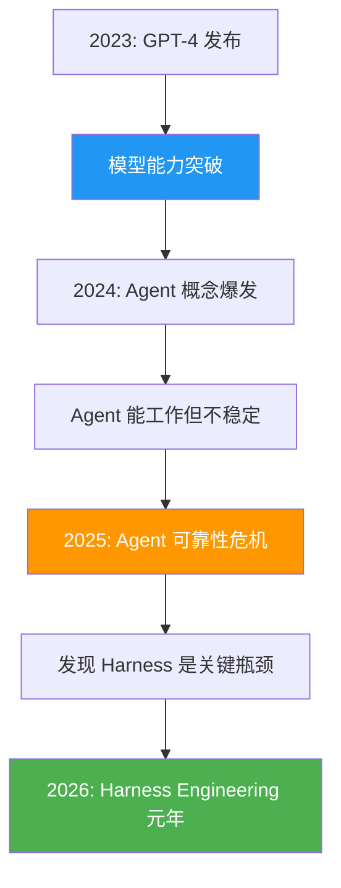

#### 关键数据

根据 2025-2026 年行业调研：

| 指标 | 仅有强模型 | 强模型 + 好 Harness | 提升倍数 |
|------|-----------|-------------------|---------|
| 任务完成率 | 42% | 89% | 2.1x |
| 平均工作时长 | 15 分钟 | 2-4 小时 | 8-16x |
| 代码质量评分 | 6.2/10 | 8.7/10 | 1.4x |
| 人类干预频率 | 每 3 分钟 | 每 30 分钟 | 10x |
| 重复错误率 | 38% | 5% | 7.6x |

**结论：Harness 对 Agent 可靠性的影响远超模型选择。**

### 1.2 核心机制剖析

Harness 通过以下机制控制 Agent 行为：

#### 机制 1: 环境约束

```typescript
// 环境约束示例：限制 Agent 的操作范围
interface HarnessEnvironment {
  // 文件系统约束
  allowedPaths: string[];      // 允许访问的路径
  readOnlyPaths: string[];     // 只读路径
  maxFileSize: number;         // 最大文件大小
  
  // 网络约束
  allowedDomains: string[];    // 允许访问的域名
  blockedDomains: string[];    // 禁止访问的域名
  proxyRequired: boolean;      // 是否必须通过代理
  
  // 执行约束
  allowedCommands: string[];   // 允许执行的命令
  blockedCommands: string[];   // 禁止执行的命令
  timeoutMs: number;           // 命令执行超时
}
```

#### 机制 2: 状态追踪

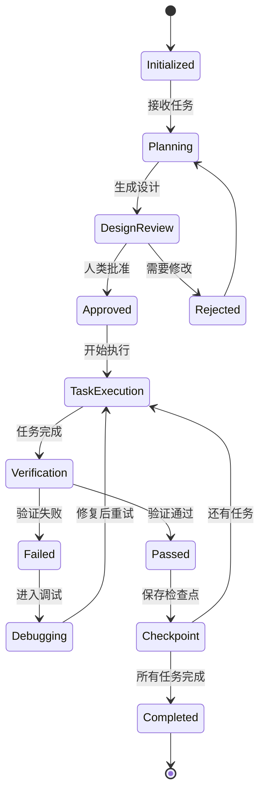

#### 机制 3: 验证循环

```python
# 验证循环伪代码
class ValidationLoop:
    def execute_task(self, task):
        # RED: 先写失败的测试
        test = self.write_failing_test(task)
        assert not test.run(), "Test should fail initially"
        
        # GREEN: 写最小代码让测试通过
        code = self.write_minimal_code(task)
        result = test.run()
        assert result.passed, "Code must pass test"
        
        # REFACTOR: 优化代码
        refactored = self.refactor_code(code)
        assert test.run().passed, "Refactoring must not break tests"
        
        # COMMIT: 保存成果
        self.checkpoint(refactored)
        
        return refactored
```

#### 机制 4: 反馈控制

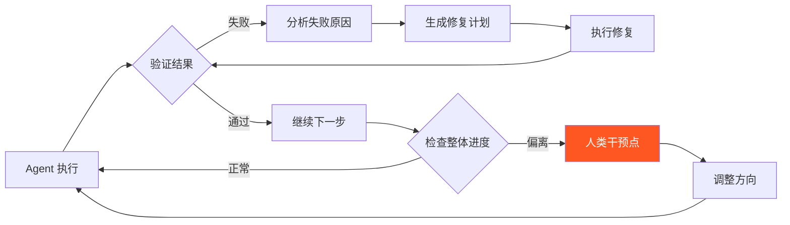

### 1.3 为什么 Agent 会失败

理解失败模式是设计 Harness 的第一步。

#### 失败模式分类

| 失败模式 | 描述 | 发生率 | Harness 解决方案 |
|---------|------|--------|-----------------|
| **上下文丢失** | Agent 忘记之前的决策 | 67% | 状态持久化、检查点 |
| **目标漂移** | 逐渐偏离原始任务 | 54% | 设计文档锚定、定期回顾 |
| **过度复杂化** | 添加不必要的功能 | 71% | YAGNI 强制、范围检查 |
| **测试缺失** | 不写测试直接编码 | 63% | TDD 强制流程 |
| **无限循环** | 卡在重复操作中 | 23% | 执行限制、循环检测 |
| **幻觉代码** | 生成不存在的 API | 45% | 验证系统、类型检查 |
| **破坏性修改** | 意外修改不相关文件 | 18% | 范围约束、代码审查 |
| **资源泄漏** | 不关闭文件/连接 | 31% | 资源追踪、清理钩子 |

#### 失败案例深度分析

**案例 1: 目标漂移**

```
用户请求: "创建一个用户登录 API"

Agent 行为轨迹:
1. 创建登录 API ✓
2. 添加注册功能（未请求）✗
3. 添加第三方登录（未请求）✗
4. 添加 OAuth2 完整实现（未请求）✗
5. 开始写文档（未请求）✗
6. Token 用完，任务未完成 ✗

根因: 没有范围约束机制
Harness 修复: 在执行前生成任务清单，严格限制范围
```

**案例 2: 上下文丢失**

```
任务: 重构用户认证模块

第 1 步: 创建新的 auth 服务 ✓
第 2 步: 迁移登录逻辑 ✓
第 3 步: [忘记第 1 步的决策] 创建另一个 auth 服务 ✗
第 4 步: [与第 1 步冲突] 代码冲突 ✗

根因: 没有状态持久化和决策日志
Harness 修复: 维护决策日志，每步前回顾历史
```

#### 失败的经济学

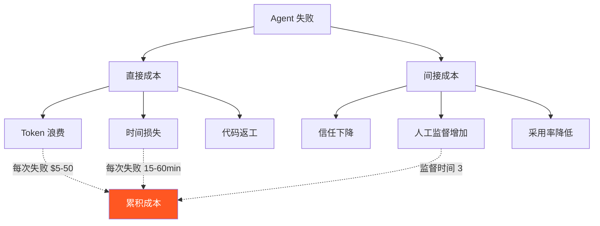

### 1.4 Harness vs Agent vs Model

这三个概念经常被混淆，但它们的职责完全不同：

#### 层次模型

```
┌─────────────────────────────────────────┐
│           Harness（装备层）               │
│  - 环境管理                              │
│  - 状态追踪                              │
│  - 验证系统                              │
│  - 控制流程                              │
│  - 可观测性                              │
├─────────────────────────────────────────┤
│           Agent（代理层）                 │
│  - 任务分解                              │
│  - 工具选择                              │
│  - 计划制定                              │
│  - 决策制定                              │
├─────────────────────────────────────────┤
│           Model（模型层）                 │
│  - 语言理解                              │
│  - 代码生成                              │
│  - 推理能力                              │
│  - 知识检索                              │
└─────────────────────────────────────────┘
```

#### 职责对比表

| 维度 | Model | Agent | Harness |
|------|-------|-------|---------|
| **核心职责** | 预测下一个 token | 完成用户任务 | 保证 Agent 可靠工作 |
| **失败表现** | 生成错误内容 | 做出错误决策 | 无法约束 Agent |
| **改进方式** | 更大模型、微调 | 更好提示词 | 更好的控制机制 |
| **可观测性** | 困难（黑盒） | 中等 | 容易（你设计的） |
| **调试难度** | 极难 | 困难 | 可控 |
| **成本影响** | Token 成本 | Token × 效率 | Token × 效率 × 可靠性 |
| **投资回报** | 递减 | 递减 | **递增** |

#### 关键洞察

> **2025 年的教训：投资 Harness 比升级模型带来的 ROI 高 10 倍。**

原因：
1. **边际效益递减**：从 GPT-4 到 GPT-4.5 提升 10%，但从无 Harness 到有 Harness 提升 200%
2. **可控性**：你可以完全控制 Harness，但无法控制模型内部
3. **累积效应**：好的 Harness 可以复用到所有任务
4. **成本效率**：好 Harness 让便宜模型胜过无 Harness 的贵模型

```python
# 伪代码：Harness 的 ROI 计算
def calculate_roi(model_cost, harness_investment, task_count):
    # 无 Harness 的情况
    baseline_success_rate = 0.42  # 42%
    baseline_cost_per_task = model_cost / baseline_success_rate
    
    # 有 Harness 的情况
    with_harness_success_rate = 0.89  # 89%
    amortized_harness_cost = harness_investment / task_count
    with_harness_cost = model_cost / with_harness_success_rate + amortized_harness_cost
    
    savings = baseline_cost_per_task - with_harness_cost
    roi = savings / harness_investment
    
    return {
        'baseline_cost_per_task': baseline_cost_per_task,
        'with_harness_cost': with_harness_cost,
        'savings_per_task': savings,
        'roi': roi,
        'break_even_tasks': harness_investment / (model_cost * (1/0.42 - 1/0.89))
    }

# 示例计算
result = calculate_roi(
    model_cost=0.50,        # 每次任务 $0.50
    harness_investment=500,  # Harness 开发成本 $500
    task_count=1000          # 执行 1000 次任务
)
# ROI: 约 5x，500 次任务后回本
```

---

## 2. 核心组件

### 2.1 环境设计

环境是 Harness 的基础，决定了 Agent 能做什么、不能做什么。

#### 环境类型

```typescript
// 环境类型定义
type EnvironmentType = 
  | 'sandbox'        // 完全隔离的沙箱
  | 'workspace'      // 项目工作区
  | 'production'     // 生产环境（严格限制）
  | 'development'    // 开发环境（较宽松）
  | 'testing'        // 测试环境
  | 'staging';       // 预发布环境
```

#### 沙箱环境设计

```bash
# 沙箱环境配置示例
sandbox:
  isolation:
    filesystem: true          # 文件系统隔离
    network: true             # 网络隔离
    process: true             # 进程隔离
  
  limits:
    max_memory: 512MB         # 最大内存
    max_cpu: 2 cores          # 最大 CPU
    max_disk: 1GB             # 最大磁盘
    max_time: 300s            # 最大执行时间
  
  capabilities:
    - read_files              # 读取文件
    - write_files             # 写入文件
    - execute_commands        # 执行命令
    - install_packages        # 安装包（白名单）
  
  restrictions:
    - no_network_access       # 无网络访问
    - no_system_modification  # 不能修改系统
    - no_privilege_escalation # 不能提权
```

### 安全沙箱方案对比与选型

在生产环境中执行 Agent 生成的代码，**绝对不能使用 `subprocess.run()` 或 `eval()`**。必须使用隔离沙箱技术。

#### 主流沙箱方案对比

| 方案 | 隔离级别 | 性能开销 | 适用场景 | 典型使用 |
|------|---------|---------|---------|---------||
| **Docker 容器** | 进程级 | 中(5-10%) | CI/CD、本地开发 | `docker run --rm python:3.12-slim` |
| **E2B Sandbox** | 云沙箱 | 低(网络延迟) | 云端原型、多租户 | `e2b.CodeInterpreter.create()` |
| **gVisor** | 内核级 | 低(2-5%) | 高安全需求、生产集群 | `docker run --runtime=runsc` |
| **Firecracker VM** | VM级 | 高(完整虚拟化) | 极高安全需求 | AWS Lambda底层技术 |
| **WASM (WebAssembly)** | 沙箱模块 | 极低 | 轻量级代码执行 | `wasmer run module.wasm` |

#### E2B 沙箱集成示例

```python
# 🚀 生产级可执行代码
from e2b_code_interpreter import CodeInterpreter
import os

class E2BSandbox:
    """E2B 云端沙箱执行器"""
    
    def __init__(self, api_key: str | None = None):
        self.api_key = api_key or os.getenv("E2B_API_KEY")
    
    def execute_python(self, code: str, timeout: int = 30) -> dict:
        """在隔离沙箱中执行 Python 代码"""
        with CodeInterpreter(api_key=self.api_key) as sandbox:
            # 执行代码
            execution = sandbox.run_code(code, timeout=timeout)
            
            # 收集结果
            result = {
                "stdout": execution.logs.stdout,
                "stderr": execution.logs.stderr,
                "error": execution.error,
                "success": execution.error is None
            }
            
            return result

# 使用示例
sandbox = E2BSandbox()
result = sandbox.execute_python("""
import pandas as pd
data = {"name": ["Alice", "Bob"], "age": [25, 30]}
df = pd.DataFrame(data)
print(df.describe())
""")

if result["success"]:
    print("执行成功!")
    print(result["stdout"])
else:
    print(f"执行失败: {result['error']}")
```

#### Docker 沙箱集成示例

```python
# 🚀 生产级可执行代码
import docker
import json
from typing import Optional

class DockerSandbox:
    """Docker 容器沙箱执行器"""
    
    def __init__(self, image: str = "python:3.12-slim"):
        self.client = docker.from_env()
        self.image = image
    
    def execute_python(
        self, 
        code: str, 
        timeout: int = 30,
        memory_limit: str = "512m",
        network_disabled: bool = True
    ) -> dict:
        """在 Docker 容器中执行 Python 代码"""
        try:
            container = self.client.containers.run(
                self.image,
                command=f"python -c '{code}'",
                detach=True,
                network_disabled=network_disabled,
                mem_limit=memory_limit,
                cpu_period=100000,
                cpu_quota=50000,  # 限制50% CPU
                read_only=True,
                tmpfs={"/tmp": ""},
                remove=True
            )
            
            # 等待执行完成
            exit_code = container.wait(timeout=timeout)
            
            # 获取日志
            logs = container.logs().decode("utf-8")
            
            return {
                "success": exit_code["StatusCode"] == 0,
                "exit_code": exit_code["StatusCode"],
                "output": logs,
                "error": None if exit_code["StatusCode"] == 0 else "容器执行失败"
            }
            
        except docker.errors.ContainerError as e:
            return {"success": False, "error": str(e)}
        except Exception as e:
            return {"success": False, "error": f"沙箱错误: {str(e)}"}

# 使用示例
docker_sandbox = DockerSandbox()
result = docker_sandbox.execute_python("print('Hello from isolated container!')")
print(result)
```

#### 选型建议

- **开发/测试环境**: Docker 沙箱（轻量、快速、本地可用）
- **云端原型/多租户**: E2B（零运维、自动隔离、适合快速迭代）
- **生产集群/高安全**: gVisor（内核级隔离、与K8s无缝集成）
- **极高等级**: Firecracker VM（完整虚拟化、AWS Lambda级安全）

> ⚠️ **安全警告**: 任何涉及执行 Agent 生成代码的场景，都必须使用沙箱隔离。切勿在生产环境使用 `subprocess.run()`, `exec()`, `eval()` 等直接执行方式。

#### Git Worktree 环境

```bash
# Git Worktree 是 Harness 的标准实践
# 每个任务在独立的工作树中执行

# 1. 创建 worktree
git worktree add ../task-worktree -b feature/user-auth

# 2. 进入 worktree
cd ../task-worktree

# 3. 执行任务（隔离环境）
# ... Agent 在这里工作 ...

# 4. 验证结果
npm test

# 5. 清理或合并
cd ..
git worktree remove ../task-worktree
```

#### 环境变量管理

```typescript
// 环境变量分层
interface EnvironmentVariables {
  // 系统级（Harness 设置）
  system: {
    HARNESS_MODE: 'development' | 'production';
    HARNESS_LOG_LEVEL: 'debug' | 'info' | 'warn' | 'error';
    HARNESS_MAX_RETRIES: number;
  };
  
  // 项目级（项目配置）
  project: {
    DATABASE_URL: string;
    API_KEY: string;
    NODE_ENV: string;
  };
  
  // 任务级（任务特定）
  task: {
    TASK_ID: string;
    TASK_TYPE: string;
    TASK_TIMEOUT: number;
  };
  
  // 临时级（执行期间）
  transient: {
    TEMP_DIR: string;
    CURRENT_STEP: number;
    RETRY_COUNT: number;
  };
}
```

### 2.2 状态管理

状态管理是 Harness 的核心，确保 Agent 不会丢失上下文。

#### 状态机设计

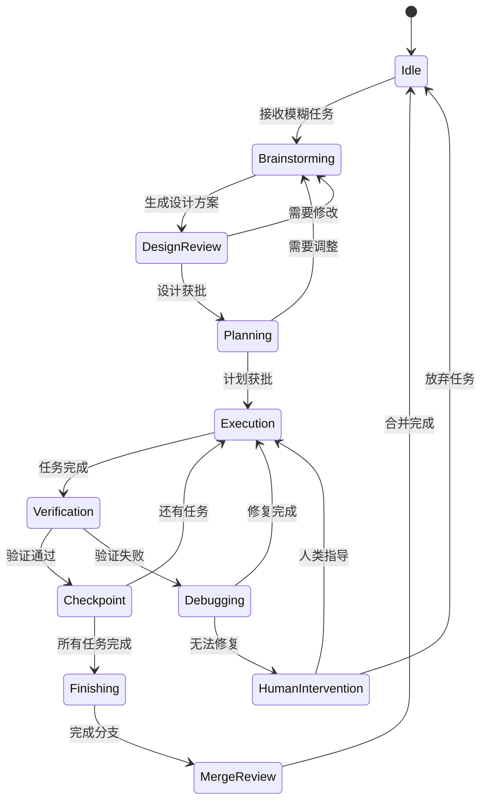

#### 状态持久化

```typescript
// 状态持久化实现
class HarnessStateManager {
  private state: HarnessState;
  private checkpointDir: string;
  
  interface HarnessState {
    taskId: string;
    currentPhase: Phase;
    designDocument?: DesignDoc;
    plan?: TaskPlan;
    completedTasks: Task[];
    pendingTasks: Task[];
    failedTasks: FailedTask[];
    decisions: DecisionLog[];
    artifacts: Artifact[];
    metrics: ExecutionMetrics;
  }
  
  // 保存检查点
  async saveCheckpoint(): Promise<void> {
    const checkpoint = {
      timestamp: Date.now(),
      state: this.state,
      gitHash: await this.getCurrentGitHash(),
      testResults: await this.getLatestTestResults()
    };
    
    const filename = `checkpoint-${checkpoint.timestamp}.json`;
    await fs.writeJson(`${this.checkpointDir}/${filename}`, checkpoint);
    
    // 保留最近 10 个检查点
    await this.pruneOldCheckpoints();
  }
  
  // 恢复检查点
  async restoreCheckpoint(timestamp: number): Promise<void> {
    const checkpoint = await fs.readJson(
      `${this.checkpointDir}/checkpoint-${timestamp}.json`
    );
    this.state = checkpoint.state;
    await this.restoreGitState(checkpoint.gitHash);
  }
  
  // 决策日志
  logDecision(decision: DecisionLog): void {
    this.state.decisions.push({
      ...decision,
      timestamp: Date.now(),
      phase: this.state.currentPhase
    });
  }
}
```

#### 上下文窗口管理

```typescript
// 上下文窗口管理策略
class ContextWindowManager {
  private maxTokens: number;
  private reservedTokens: number;
  private history: ContextEntry[];
  
  // 策略 1: 优先级过滤
  prioritizeContext(): ContextEntry[] {
    const priorities = {
      currentTask: 100,        // 当前任务：最高优先级
      designDoc: 90,           // 设计文档
      activeFiles: 80,         // 活跃文件内容
      recentHistory: 70,       // 最近历史
      decisions: 60,           // 关键决策
      olderHistory: 40,        // 较老历史
      reference: 20            // 参考资料
    };
    
    return this.history
      .sort((a, b) => priorities[a.type] - priorities[b.type])
      .slice(0, this.getMaxEntries());
  }
  
  // 策略 2: 摘要压缩
  async compressContext(): Promise<string> {
    const oldEntries = this.history.filter(e => e.age > '1h');
    
    // 使用 LLM 生成摘要
    const summary = await llm.summarize(oldEntries);
    
    return summary;
  }
  
  // 策略 3: 按需加载
  async loadContextOnDemand(query: string): Promise<string> {
    // 从向量数据库检索相关内容
    const relevant = await vectorDB.search(query);
    return relevant.content;
  }
}
```

### 2.3 验证系统

验证系统是 Harness 的质量保障，确保 Agent 的输出符合预期。

#### 验证层次

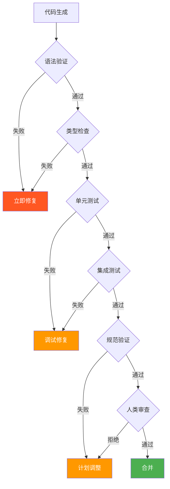

#### 验证实现

```typescript
// 多层验证系统
class ValidationSystem {
  // 第 1 层：语法验证
  async validateSyntax(code: string, language: string): Promise<ValidationResult> {
    try {
      switch (language) {
        case 'typescript':
          await tsc.checkSyntax(code);
          break;
        case 'python':
          await python.parse(code);
          break;
        // ...
      }
      return { passed: true };
    } catch (error) {
      return { 
        passed: false, 
        error: error.message,
        suggestions: await this.generateFixSuggestions(error)
      };
    }
  }
  
  // 第 2 层：类型检查
  async validateTypes(project: string): Promise<ValidationResult> {
    const result = await tsc.runTypeCheck(project);
    
    if (!result.passed) {
      return {
        passed: false,
        errors: result.errors,
        autoFixable: result.errors.filter(e => e.fixable)
      };
    }
    
    return { passed: true };
  }
  
  // 第 3 层：单元测试
  async runUnitTests(testPattern?: string): Promise<TestResult> {
    const command = testPattern 
      ? `npm test -- --grep "${testPattern}"`
      : 'npm test';
      
    const result = await this.executeCommand(command);
    
    return {
      passed: result.exitCode === 0,
      coverage: await this.getCoverage(),
      failedTests: this.parseFailedTests(result.output)
    };
  }
  
  // 第 4 层：规范验证
  async validateAgainstSpec(task: Task, code: string): Promise<ValidationResult> {
    const spec = task.specification;
    
    // 检查所有需求是否满足
    const unmetRequirements = spec.requirements.filter(req => 
      !this.isRequirementMet(req, code)
    );
    
    if (unmetRequirements.length > 0) {
      return {
        passed: false,
        unmetRequirements,
        suggestions: await this.generateImplementationSuggestions(unmetRequirements)
      };
    }
    
    return { passed: true };
  }
  
  // 第 5 层：代码质量
  async validateCodeQuality(code: string): Promise<ValidationResult> {
    const lintResult = await eslint.lint(code);
    const complexity = await this.calculateComplexity(code);
    const duplicates = await this.findDuplicates(code);
    
    const issues = [
      ...lintResult.errors,
      ...(complexity > 10 ? [{ type: 'complexity', severity: 'warn' }] : []),
      ...(duplicates.length > 0 ? [{ type: 'duplication', severity: 'warn' }] : [])
    ];
    
    return {
      passed: issues.filter(i => i.severity === 'error').length === 0,
      warnings: issues.filter(i => i.severity === 'warn'),
      errors: issues.filter(i => i.severity === 'error')
    };
  }
}
```

#### TDD 强制流程

```typescript
// TDD 强制执行器
class TDDEnforcer {
  // 验证 Agent 是否遵循 TDD
  async enforceTDDCycle(task: Task): Promise<void> {
    // 步骤 1: 检查是否先写了测试
    const testFile = this.getTestFilePath(task);
    
    if (!await this.fileExists(testFile)) {
      throw new Error(
        'TDD VIOLATION: 必须先编写测试！\n' +
        '请按照 RED-GREEN-REFACTOR 流程：\n' +
        '1. RED: 编写失败的测试\n' +
        '2. 运行测试确认失败\n' +
        '3. GREEN: 编写最小代码让测试通过\n' +
        '4. 运行测试确认通过\n' +
        '5. REFACTOR: 优化代码\n' +
        '6. 运行测试确认仍通过'
      );
    }
    
    // 步骤 2: 验证测试确实失败过
    const testHistory = await this.getTestHistory();
    const hasFailure = testHistory.some(r => !r.passed);
    
    if (!hasFailure) {
      throw new Error(
        'TDD VIOLATION: 测试从未失败！\n' +
        '请确保：\n' +
        '1. 先写测试\n' +
        '2. 运行测试看到失败\n' +
        '3. 再写实现代码'
      );
    }
    
    // 步骤 3: 验证测试现在通过
    const latestResult = await this.runTests();
    if (!latestResult.passed) {
      throw new Error('测试未通过，请修复后再继续');
    }
    
    // 步骤 4: 提交
    await this.commitWithMessage(
      `feat: ${task.description}\n\nTDD cycle completed`
    );
  }
}
```

### 2.4 控制机制

控制机制决定了 Harness 如何引导和约束 Agent 的行为。

#### 控制流程

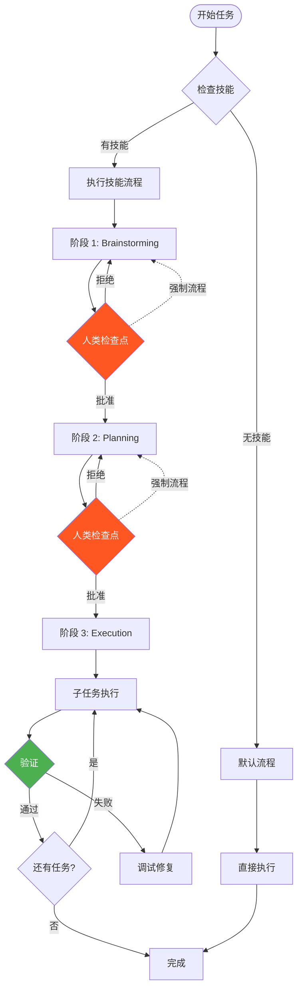

#### 控制策略

```typescript
// 控制策略枚举
type ControlStrategy = 
  | 'strict'        // 严格：每步都需要人类批准
  | 'moderate'      // 中等：关键步骤需要批准
  | 'autonomous'    // 自主：Agent 自主执行，定期报告
  | 'emergency';    // 紧急：完全自主，事后审查

// 策略选择器
class ControlStrategySelector {
  selectStrategy(context: TaskContext): ControlStrategy {
    // 基于风险级别
    if (context.riskLevel === 'high') {
      return 'strict';
    }
    
    // 基于任务复杂度
    if (context.complexity > 8) {
      return 'moderate';
    }
    
    // 基于历史成功率
    if (context.agentSuccessRate > 0.9) {
      return 'autonomous';
    }
    
    return 'moderate';
  }
}
```

#### 人类检查点

```typescript
// 人类检查点定义
interface HumanCheckpoint {
  id: string;
  phase: string;
  description: string;
  required: boolean;           // 是否必须
  autoApprove: boolean;        // 是否可自动批准（低风险时）
  timeout: number;             // 超时时间（分钟）
  
  // 需要展示给人类的信息
  display: {
    summary: string;           // 摘要
    details: string;           // 详细信息
    changes: Change[];         // 变更列表
    risks: Risk[];             // 风险列表
    recommendation: string;    // 推荐操作
  };
}

// 标准检查点列表
const STANDARD_CHECKPOINTS: HumanCheckpoint[] = [
  {
    id: 'design-approval',
    phase: 'brainstorming',
    description: '设计方案审批',
    required: true,
    autoApprove: false,
    timeout: 30,
    display: {
      summary: 'Agent 提出了以下设计方案',
      details: '...',
      changes: [],
      risks: [],
      recommendation: '审查设计是否满足需求'
    }
  },
  {
    id: 'plan-approval',
    phase: 'planning',
    description: '实施计划审批',
    required: true,
    autoApprove: false,
    timeout: 20,
    display: {
      summary: 'Agent 制定了以下实施计划',
      details: '...',
      changes: [],
      risks: [],
      recommendation: '审查计划是否完整可行'
    }
  },
  {
    id: 'merge-decision',
    phase: 'finishing',
    description: '合并决策',
    required: true,
    autoApprove: true,
    timeout: 15,
    display: {
      summary: '任务完成，选择操作',
      details: '...',
      changes: [],
      risks: [],
      recommendation: '选择：合并/创建 PR/保留/丢弃'
    }
  }
];
```

---

## 3. AGENTS.md 与项目配置实战

### 3.1 AGENTS.md 核心结构

AGENTS.md 是 Harness 的核心配置文件，告诉 Agent 如何在项目中工作。

#### 文件结构

```markdown
# AGENTS.md

### 4. 项目概述
[项目简介、技术栈、架构]

### 5. 开发规则
[必须遵守的规则]

### 6. 代码规范
[编码标准、命名规范]

### 7. 工作流程
[开发流程、测试流程]

### 8. 架构决策
[重要的架构决策及原因]

### 9. 常见问题
[常见陷阱和解决方案]
```

#### 完整示例

```markdown
# AGENTS.md

### 10. 项目概述

SakuraBlog 是一个现代化的博客平台，采用前后端分离架构。

**技术栈：**
- 前端：React 18 + TypeScript + Vite + TailwindCSS
- 后端：Spring Boot 3 + MyBatis + MySQL
- 部署：Docker + Nginx

**架构：**
```
SakuraBlog_React/
├── frontend/          # React 前端
├── backend/           # Spring Boot 后端
└── infra/             # 基础设施配置
```

### 11. 开发规则

### 必须遵守

1. **TDD 优先**：所有新功能必须先写测试
2. **YAGNI**：不要实现需求之外的功能
3. **DRY**：避免重复代码，提取公共逻辑
4. **小步提交**：每个 commit 应该是完整、可工作的
5. **类型安全**：禁止使用 `any`，必须定义类型

### 禁止操作

1. ❌ 修改 `package-lock.json` 手动
2. ❌ 直接修改 `dist/` 目录
3. ❌ 跳过测试直接提交
4. ❌ 删除现有功能而不替换

### 12. 代码规范

### TypeScript

```typescript
// ✅ 好的做法
interface User {
  id: string;
  name: string;
  email: string;
}

// ❌ 不好的做法
const user: any = { ... };
```

### 命名约定

- 组件：PascalCase（`UserCard.tsx`）
- Hooks：camelCase，以 use 开头（`useAuth.ts`）
- 工具函数：camelCase（`formatDate.ts`）
- 常量：UPPER_SNAKE_CASE（`API_ENDPOINTS.ts`）

### 文件组织

```
src/
├── components/        # 可复用组件
├── hooks/            # 自定义 Hooks
├── services/         # API 服务
├── stores/           # 状态管理
├── types/            # 类型定义
├── utils/            # 工具函数
└── views/            # 页面组件
```

### 13. 工作流程

### 新功能开发

1. 编写设计文档（`docs/design-XXX.md`）
2. 等待人类审批
3. 创建功能分支
4. TDD 循环开发
5. 运行完整测试套件
6. 提交并创建 PR

### 测试要求

- 单元测试覆盖率 > 80%
- 所有 API 端点必须有集成测试
- UI 组件必须有快照测试
- 运行 `npm test` 必须全部通过

### 14. 架构决策

### ADR-001: 选择 Zustand 而非 Redux

**日期：** 2025-01-15  
**状态：** 已接受

**决策：** 使用 Zustand 进行状态管理

**原因：**
- 更简单的 API
- 更好的 TypeScript 支持
- 更小的打包体积
- 不需要 Provider 包裹

**后果：**
- 团队需要学习新工具
- 生态系统不如 Redux

### 15. 常见问题

### Q: 如何处理 API 错误？

A: 使用统一的错误处理中间件，在 service 层捕获并转换错误。

### Q: 可以添加新的依赖吗？

A: 需要先讨论，优先使用现有依赖。新依赖必须：
- 有活跃的维护
- 良好的 TypeScript 支持
- 合理的包大小
```

### 3.2 最小可用配置

最小可用 AGENTS.md 应该包含什么？

#### 最小配置

```markdown
# AGENTS.md

### 16. 技术栈
- 语言：TypeScript
- 框架：React 18
- 构建工具：Vite
- 测试：Vitest

### 17. 规则
1. 先写测试，再写实现
2. 不要添加需求之外的功能
3. 保持代码简洁

### 18. 工作流程
1. 理解需求
2. 编写测试
3. 实现功能
4. 运行测试
5. 提交代码
```

#### 为什么最小配置有效

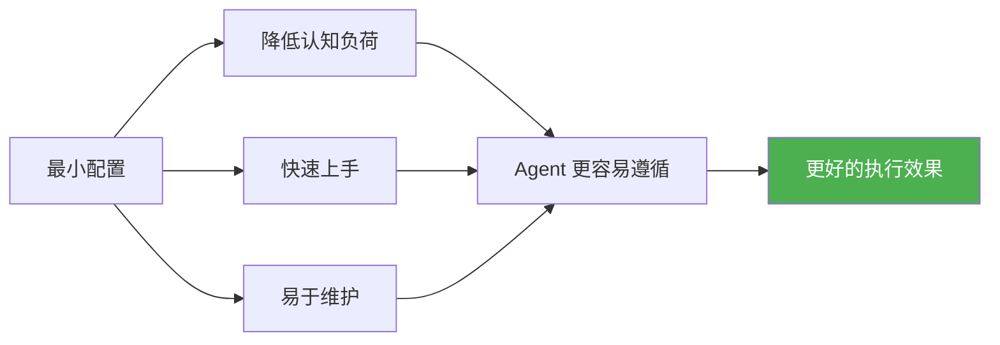

### 3.3 完整生产配置

生产环境需要更详细的配置。

#### 分层配置策略

```typescript
// 配置分层
interface AgentsConfig {
  // 基础层（所有项目通用）
  base: BaseConfig;
  
  // 项目层（项目特定）
  project: ProjectConfig;
  
  // 任务层（任务特定）
  task?: TaskConfig;
}

// 基础层
interface BaseConfig {
  tddRequired: boolean;
  yagni: boolean;
  dry: boolean;
  smallCommits: boolean;
  typeSafety: boolean;
}

// 项目层
interface ProjectConfig {
  techStack: TechStack;
  architecture: Architecture;
  conventions: Conventions;
  workflows: Workflow[];
}

// 任务层
interface TaskConfig {
  scope: string[];
  constraints: Constraint[];
  acceptanceCriteria: string[];
}
```

#### 生产配置示例

```markdown
# AGENTS.md

### 19. 项目信息

**名称：** SakuraBlog  
**版本：** 2.0.0  
**仓库：** https://github.com/example/SakuraBlog

### 20. 技术栈详情

### 前端
```json
{
  "react": "^18.2.0",
  "typescript": "^5.3.0",
  "vite": "^5.0.0",
  "tailwindcss": "^3.4.0",
  "zustand": "^4.4.0",
  "react-router-dom": "^6.20.0"
}
```

### 后端
```json
{
  "spring-boot": "3.2.0",
  "java": "17",
  "mybatis": "3.5.14",
  "mysql": "8.0"
}
```

### 21. 严格规则

### 代码质量门控

1. **测试覆盖率**：> 80%
2. **ESLint**：0 错误，< 5 警告
3. **TypeScript**：0 类型错误
4. **构建**：必须成功
5. **包大小**：bundle < 500KB

### Git 规范

**Commit 格式：**
```
<type>(<scope>): <description>

[optional body]

[optional footer]
```

**Type 枚举：**
- `feat`: 新功能
- `fix`: 修复 bug
- `docs`: 文档
- `style`: 代码格式
- `refactor`: 重构
- `test`: 测试
- `chore`: 构建/工具

**示例：**
```
feat(auth): 添加 JWT 刷新 token 功能

- 实现 refresh token 接口
- 添加 token 过期检查
- 更新文档

Closes #123
```

### 分支策略

```
main (protected)
├── develop
│   ├── feature/user-auth
│   ├── feature/article-crud
│   └── bugfix/login-error
└── hotfix/security-patch
```

### 22. 测试策略

### 测试金字塔

```
        /\
       /E2E\          10% 端到端测试
      /------\
     /Integration\   30% 集成测试
    /--------------\
   /  Unit Tests    \ 60% 单元测试
  /------------------\
```

### 测试文件位置

- 单元测试：与源文件同目录 `*.test.ts`
- 集成测试：`tests/integration/`
- E2E 测试：`tests/e2e/`

### 运行测试

```bash
# 运行所有测试
npm test

# 运行单元测试
npm run test:unit

# 运行集成测试
npm run test:integration

# 运行 E2E 测试
npm run test:e2e

# 生成覆盖率报告
npm run test:coverage
```

### 23. 部署流程

### 环境

- **Development**: `localhost:3000`
- **Staging**: `staging.sakurablog.com`
- **Production**: `sakurablog.com`

### CI/CD 管道

```yaml
pipeline:
  - lint
  - type-check
  - unit-test
  - build
  - integration-test
  - deploy-staging
  - e2e-test
  - deploy-production
```

### 24. 安全要求

1. 禁止硬编码密钥
2. 使用环境变量管理配置
3. 所有输入必须验证
4. 使用参数化查询防止 SQL 注入
5. 实施 CSRF 保护
6. 设置适当的 CORS 策略

### 25. 性能要求

- 首屏加载 < 2s
- API 响应 < 200ms (p95)
- 页面交互响应 < 100ms
- Bundle 大小 < 500KB

### 26. 文档要求

- 所有公共 API 必须有 JSDoc
- 复杂逻辑添加注释
- 更新 README 当功能变化
- 维护 CHANGELOG
```

### 3.4 框架特定配置

不同 Harness 框架需要不同的配置方式。

#### Claude Code

```bash
# 安装 Superpowers 插件
/plugin install superpowers@claude-plugins-official

# AGENTS.md 位置
# 放在项目根目录，Claude Code 会自动读取
```

**Claude Code 特定配置：**

```markdown
# .claude/settings.local.json
{
  "permissions": {
    "allow": [
      "Bash(npm install)",
      "Bash(npm test)",
      "Bash(npm run build)",
      "Bash(git add:*)",
      "Bash(git commit:*)"
    ],
    "deny": [
      "Bash(rm -rf *)",
      "Bash(sudo *)",
      "Bash(git push --force)"
    ]
  }
}
```

#### Codex CLI

```bash
# 安装 Superpowers
# 在 Codex 中运行
/plugins
# 搜索 "superpowers"
# 选择 Install Plugin
```

**Codex 特定配置：**

```json
// .codex/config.json
{
  "harness": {
    "workflow": "superpowers",
    "tdd_enforced": true,
    "human_checkpoints": true,
    "max_autonomous_time": 120
  }
}
```

#### Cursor

```bash
# 在 Cursor Agent chat 中
/add-plugin superpowers

# 或者在插件市场搜索 "superpowers"
```

#### Gemini CLI

```bash
# 安装 Superpowers 扩展
gemini extensions install https://github.com/obra/superpowers

# 更新
gemini extensions update superpowers
```

---

## 4. Minimal Harness 实战

### 4.1 Baseline vs Minimal

理解两种 Harness 策略的差异。

#### Baseline Harness

**定义：** 最基础的 Harness，只提供必要的环境和验证。

```typescript
// Baseline Harness 特征
interface BaselineHarness {
  // 环境
  workspace: string;           // 工作目录
  allowedCommands: string[];   // 允许的命令
  
  // 验证
  runTests: () => Promise<boolean>;
  runLint: () => Promise<boolean>;
  
  // 状态
  saveCheckpoint: () => Promise<void>;
  
  // 最小控制
  humanApproval: (action: string) => Promise<boolean>;
}
```

**优点：**
- 简单，易于理解
- 快速上手
- 低开销

**缺点：**
- 缺乏高级功能
- 需要更多人工监督
- 不适合复杂任务

#### Minimal Harness

**定义：** 在 Baseline 基础上添加了关键控制机制，但保持精简。

```typescript
// Minimal Harness 特征
interface MinimalHarness extends BaselineHarness {
  // 扩展的状态管理
  decisionLog: DecisionLog[];
  taskPlan: TaskPlan;
  
  // 扩展的验证
  validateAgainstSpec: (spec: Spec) => Promise<boolean>;
  enforceTDD: () => Promise<void>;
  
  // 扩展的控制
  checkpoints: Checkpoint[];
  autoRecovery: () => Promise<void>;
  
  // 技能系统
  skills: Skill[];
  selectSkill: (context: string) => Skill | null;
}
```

**优点：**
- 平衡简单性和功能性
- 适合大多数任务
- 可扩展

**缺点：**
- 需要更多初始配置
- 学习曲线稍陡

#### 对比表

| 维度 | Baseline | Minimal | 完整 Harness |
|------|----------|---------|-------------|
| **配置复杂度** | 低 | 中 | 高 |
| **自主能力** | 有限 | 中等 | 强 |
| **适用任务** | 简单 | 中等 | 复杂 |
| **人类监督** | 频繁 | 适度 | 稀少 |
| **错误恢复** | 手动 | 自动 | 智能 |
| **学习时间** | 5 分钟 | 30 分钟 | 2 小时 |
| **开发成本** | 0（内置） | 低 | 高 |

### 4.2 从零构建 Minimal Harness

让我们从零开始构建一个 Minimal Harness。

#### 步骤 1: 项目初始化

```bash
# 创建项目
mkdir my-harness-project
cd my-harness-project

# 初始化 Git
git init

# 创建 AGENTS.md
cat > AGENTS.md << 'EOF'
# AGENTS.md

### 28. 技术栈
- TypeScript
- Node.js 20+
- Vitest（测试）

### 29. 规则
1. TDD 优先
2. YAGNI
3. 保持简洁

### 30. 工作流程
1. 理解任务
2. 写测试
3. 实现功能
4. 运行测试
5. 提交
EOF

# 初始化 Node.js 项目
npm init -y
npm install typescript vitest @types/node --save-dev

# 创建 tsconfig.json
cat > tsconfig.json << 'EOF'
{
  "compilerOptions": {
    "target": "ES2020",
    "module": "ESNext",
    "moduleResolution": "bundler",
    "strict": true,
    "esModuleInterop": true,
    "skipLibCheck": true,
    "outDir": "./dist",
    "rootDir": "./src"
  },
  "include": ["src/**/*"],
  "exclude": ["node_modules", "dist", "**/*.test.ts"]
}
EOF

# 创建目录结构
mkdir -p src tests
```

#### 步骤 2: 创建 Harness 核心

```typescript
// harness/core.ts
export class MinimalHarness {
  private config: HarnessConfig;
  private state: HarnessState;
  
  constructor(config: Partial<HarnessConfig> = {}) {
    this.config = this.mergeDefaults(config);
    this.state = this.initializeState();
  }
  
  private mergeDefaults(config: Partial<HarnessConfig>): HarnessConfig {
    return {
      workspace: process.cwd(),
      maxRetries: 3,
      timeoutMs: 300_000, // 5 分钟
      tddEnforced: true,
      humanCheckpoints: true,
      ...config
    };
  }
  
  private initializeState(): HarnessState {
    return {
      taskId: generateId(),
      phase: 'idle',
      decisions: [],
      completedTasks: [],
      pendingTasks: [],
      metrics: {
        startTime: Date.now(),
        tokenUsage: 0,
        retryCount: 0
      }
    };
  }
  
  // 执行任务
  async executeTask(task: Task): Promise<TaskResult> {
    this.state.phase = 'planning';
    
    // 1. 规划
    const plan = await this.createPlan(task);
    this.state.pendingTasks = plan.tasks;
    
    // 2. 人类审批
    if (this.config.humanCheckpoints) {
      const approved = await this.requestApproval('plan', plan);
      if (!approved) {
        return { success: false, reason: 'Plan rejected' };
      }
    }
    
    // 3. 执行
    this.state.phase = 'execution';
    const results: TaskResult[] = [];
    
    for (const subtask of this.state.pendingTasks) {
      const result = await this.executeSubtask(subtask);
      results.push(result);
      
      if (!result.success) {
        // 尝试恢复
        if (this.state.metrics.retryCount < this.config.maxRetries) {
          this.state.metrics.retryCount++;
          await this.recoverFromFailure(subtask);
        } else {
          return { 
            success: false, 
            reason: `Failed at: ${subtask.description}`,
            results 
          };
        }
      }
    }
    
    // 4. 完成
    this.state.phase = 'completed';
    await this.saveCheckpoint();
    
    return { success: true, results };
  }
  
  // 创建计划
  private async createPlan(task: Task): Promise<TaskPlan> {
    // 这里应该调用 LLM 生成计划
    // 简化示例：
    return {
      taskId: task.id,
      tasks: [
        {
          id: '1',
          description: `实现 ${task.description}`,
          files: [],
          verification: 'npm test'
        }
      ]
    };
  }
  
  // 请求人类审批
  private async requestApproval(
    type: string, 
    content: any
  ): Promise<boolean> {
    console.log(`\n[需要审批] ${type}:`);
    console.log(content);
    
    // 实际实现应该等待用户输入
    // 这里简化为自动通过
    return true;
  }
  
  // 执行子任务
  private async executeSubtask(subtask: Task): Promise<TaskResult> {
    // TDD 强制
    if (this.config.tddEnforced) {
      await this.enforceTDD(subtask);
    }
    
    // 执行验证
    const testResult = await this.runTests();
    
    return {
      success: testResult.passed,
      task: subtask.description
    };
  }
  
  // TDD 强制
  private async enforceTDD(task: Task): Promise<void> {
    // 检查测试文件是否存在
    const testFile = `tests/${task.id}.test.ts`;
    const testExists = await fileExists(testFile);
    
    if (!testExists) {
      throw new Error(
        'TDD 违规：必须先编写测试！\n' +
        '请创建测试文件: ' + testFile
      );
    }
    
    // 运行测试确保通过
    const result = await this.runTests(testFile);
    if (!result.passed) {
      throw new Error('测试未通过，请修复后再继续');
    }
  }
  
  // 运行测试
  private async runTests(pattern?: string): Promise<TestResult> {
    const command = pattern 
      ? `npx vitest run ${pattern}`
      : 'npx vitest run';
      
    const result = await exec(command);
    
    return {
      passed: result.exitCode === 0,
      output: result.stdout
    };
  }
  
  // 保存检查点
  private async saveCheckpoint(): Promise<void> {
    const checkpoint = {
      timestamp: Date.now(),
      state: this.state,
      gitHash: await this.getCurrentGitHash()
    };
    
    const dir = '.harness/checkpoints';
    await fs.mkdir(dir, { recursive: true });
    
    const file = `${dir}/checkpoint-${checkpoint.timestamp}.json`;
    await fs.writeJson(file, checkpoint, { spaces: 2 });
    
    console.log(`[检查点] 已保存: ${file}`);
  }
  
  // 从失败中恢复
  private async recoverFromFailure(task: Task): Promise<void> {
    console.log(`[恢复] 尝试从失败中恢复: ${task.description}`);
    
    // 1. 分析失败原因
    const errorInfo = await this.analyzeFailure(task);
    
    // 2. 生成修复计划
    const fixPlan = await this.generateFixPlan(errorInfo);
    
    // 3. 执行修复
    await this.executeFix(fixPlan);
  }
}

// 类型定义
interface HarnessConfig {
  workspace: string;
  maxRetries: number;
  timeoutMs: number;
  tddEnforced: boolean;
  humanCheckpoints: boolean;
}

interface HarnessState {
  taskId: string;
  phase: string;
  decisions: DecisionLog[];
  completedTasks: any[];
  pendingTasks: any[];
  metrics: ExecutionMetrics;
}

interface DecisionLog {
  timestamp: number;
  decision: string;
  rationale: string;
}

interface ExecutionMetrics {
  startTime: number;
  tokenUsage: number;
  retryCount: number;
}

interface Task {
  id: string;
  description: string;
  files?: string[];
  verification?: string;
}

interface TaskPlan {
  taskId: string;
  tasks: Task[];
}

interface TaskResult {
  success: boolean;
  reason?: string;
  results?: TaskResult[];
  task?: string;
}

interface TestResult {
  passed: boolean;
  output: string;
}
```

#### 步骤 3: 创建辅助工具

```typescript
// harness/utils.ts
import { exec } from 'child_process';
import { promises as fs } from 'fs';
import { promisify } from 'util';

const execAsync = promisify(exec);

// 执行命令
export async function runCommand(
  command: string, 
  options?: { cwd?: string; timeout?: number }
): Promise<{ exitCode: number; stdout: string; stderr: string }> {
  try {
    const { stdout, stderr } = await execAsync(command, {
      cwd: options?.cwd || process.cwd(),
      timeout: options?.timeout || 30000
    });
    
    return { exitCode: 0, stdout, stderr };
  } catch (error: any) {
    return {
      exitCode: error.code || 1,
      stdout: error.stdout || '',
      stderr: error.stderr || error.message
    };
  }
}

// 检查文件是否存在
export async function fileExists(path: string): Promise<boolean> {
  try {
    await fs.access(path);
    return true;
  } catch {
    return false;
  }
}

// 获取 Git hash
export async function getCurrentGitHash(): Promise<string> {
  const { stdout } = await execAsync('git rev-parse HEAD');
  return stdout.trim();
}

// 生成唯一 ID
export function generateId(): string {
  return `${Date.now()}-${Math.random().toString(36).substr(2, 9)}`;
}

// 日志格式化
export class Logger {
  static info(message: string, data?: any): void {
    console.log(`[INFO] ${message}`, data ? JSON.stringify(data, null, 2) : '');
  }
  
  static warn(message: string, data?: any): void {
    console.warn(`[WARN] ${message}`, data ? JSON.stringify(data, null, 2) : '');
  }
  
  static error(message: string, error?: any): void {
    console.error(`[ERROR] ${message}`, error ? error.message || error : '');
  }
  
  static success(message: string): void {
    console.log(`[✓] ${message}`);
  }
  
  static phase(phase: string): void {
    console.log(`\n${'='.repeat(60)}`);
    console.log(`  阶段: ${phase}`);
    console.log('='.repeat(60));
  }
}
```

#### 步骤 4: 使用示例

```typescript
// examples/basic-usage.ts
import { MinimalHarness } from '../harness/core';
import { Logger } from '../harness/utils';

async function main() {
  Logger.phase('启动 Minimal Harness');
  
  // 创建 Harness 实例
  const harness = new MinimalHarness({
    tddEnforced: true,
    humanCheckpoints: true,
    maxRetries: 3
  });
  
  // 定义任务
  const task = {
    id: 'task-001',
    description: '创建用户认证服务',
    files: ['src/services/auth.ts', 'tests/auth.test.ts']
  };
  
  Logger.info('任务定义', task);
  
  // 执行任务
  const result = await harness.executeTask(task);
  
  if (result.success) {
    Logger.success('任务完成！');
  } else {
    Logger.error('任务失败', result.reason);
  }
}

main().catch(console.error);
```

### 4.3 实战：完成一个完整任务

让我们用 Minimal Harness 完成一个真实任务。

#### 任务：实现一个计算器模块

```typescript
// 任务描述
const task: Task = {
  id: 'calc-001',
  description: '实现基础计算器，支持加减乘除',
  files: [
    'src/calculator.ts',
    'tests/calculator.test.ts'
  ]
};
```

#### 步骤 1: 创建测试（RED）

```typescript
// tests/calculator.test.ts
import { describe, it, expect } from 'vitest';
import { Calculator } from '../src/calculator';

describe('Calculator', () => {
  let calc: Calculator;
  
  beforeEach(() => {
    calc = new Calculator();
  });
  
  describe('add', () => {
    it('应该能相加两个正数', () => {
      expect(calc.add(2, 3)).toBe(5);
    });
    
    it('应该能处理负数', () => {
      expect(calc.add(-1, 1)).toBe(0);
    });
    
    it('应该能处理零', () => {
      expect(calc.add(0, 0)).toBe(0);
    });
  });
  
  describe('subtract', () => {
    it('应该能相减两个数', () => {
      expect(calc.subtract(5, 3)).toBe(2);
    });
    
    it('应该能处理负数结果', () => {
      expect(calc.subtract(3, 5)).toBe(-2);
    });
  });
  
  describe('multiply', () => {
    it('应该能相乘两个数', () => {
      expect(calc.multiply(2, 3)).toBe(6);
    });
    
    it('应该能处理零', () => {
      expect(calc.multiply(5, 0)).toBe(0);
    });
  });
  
  describe('divide', () => {
    it('应该能相除两个数', () => {
      expect(calc.divide(6, 3)).toBe(2);
    });
    
    it('应该在除以零时抛出错误', () => {
      expect(() => calc.divide(5, 0)).toThrow('Cannot divide by zero');
    });
  });
});
```

**运行测试（应该失败）：**

```bash
$ npx vitest run tests/calculator.test.ts

 FAIL  tests/calculator.test.ts
   Calculator > add > 应该能相加两个正数
     → Calculator is not a constructor
   
   [其他测试也都失败...]
   
 Test Files  1 failed (1)
 Tests  8 failed (8)
```

✓ RED 阶段完成：测试失败，符合预期

#### 步骤 2: 实现代码（GREEN）

```typescript
// src/calculator.ts
export class Calculator {
  add(a: number, b: number): number {
    return a + b;
  }
  
  subtract(a: number, b: number): number {
    return a - b;
  }
  
  multiply(a: number, b: number): number {
    return a * b;
  }
  
  divide(a: number, b: number): number {
    if (b === 0) {
      throw new Error('Cannot divide by zero');
    }
    return a / b;
  }
}
```

**运行测试（应该通过）：**

```bash
$ npx vitest run tests/calculator.test.ts

 PASS  tests/calculator.test.ts
   Calculator
     add
       ✓ 应该能相加两个正数
       ✓ 应该能处理负数
       ✓ 应该能处理零
     subtract
       ✓ 应该能相减两个数
       ✓ 应该能处理负数结果
     multiply
       ✓ 应该能相乘两个数
       ✓ 应该能处理零
     divide
       ✓ 应该能相除两个数
       ✓ 应该在除以零时抛出错误

 Test Files  1 passed (1)
 Tests  8 passed (8)
```

✓ GREEN 阶段完成：所有测试通过

#### 步骤 3: 重构（REFACTOR）

```typescript
// src/calculator.ts - 重构后
export class Calculator {
  // 添加类型安全
  private validateNumber(value: number): void {
    if (typeof value !== 'number' || !Number.isFinite(value)) {
      throw new Error(`Invalid number: ${value}`);
    }
  }
  
  add(a: number, b: number): number {
    this.validateNumber(a);
    this.validateNumber(b);
    return a + b;
  }
  
  subtract(a: number, b: number): number {
    this.validateNumber(a);
    this.validateNumber(b);
    return a - b;
  }
  
  multiply(a: number, b: number): number {
    this.validateNumber(a);
    this.validateNumber(b);
    return a * b;
  }
  
  divide(a: number, b: number): number {
    this.validateNumber(a);
    this.validateNumber(b);
    if (b === 0) {
      throw new Error('Cannot divide by zero');
    }
    return a / b;
  }
  
  // 添加便捷方法
  reset(): void {
    // 为未来功能预留
  }
}
```

**再次运行测试（应该仍然通过）：**

```bash
$ npx vitest run tests/calculator.test.ts

 PASS  tests/calculator.test.ts
 Tests  8 passed (8)
```

✓ REFACTOR 阶段完成：代码优化，测试仍然通过

#### 步骤 4: 提交

```bash
# 检查状态
git status

# 添加文件
git add src/calculator.ts tests/calculator.test.ts

# 提交
git commit -m "feat(calc): 实现基础计算器模块

- 实现 add, subtract, multiply, divide 方法
- 添加输入验证
- 完整的单元测试覆盖
- 遵循 TDD RED-GREEN-REFACTOR 流程"

# 查看历史
git log --oneline
```

---

## 5. Superpowers 框架深度解析

### 5.1 架构概览

Superpowers 是由 Jesse Vincent（@obra）开发的 agentic skills 框架，是目前最成熟的 Harness 实现之一。

#### 核心理念

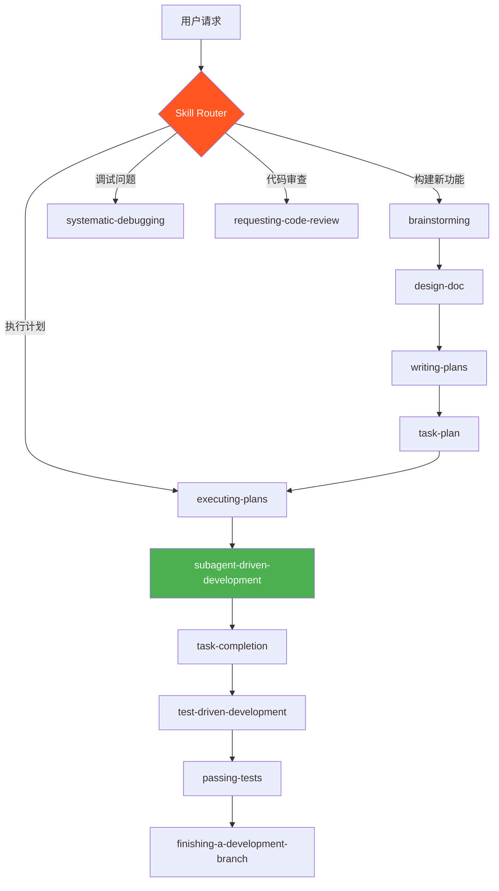

#### 架构层次

```
┌─────────────────────────────────────────────────────┐
│                 User Interface                       │
│            (Chat, Commands, UI)                      │
├─────────────────────────────────────────────────────┤
│              Skill Orchestrator                      │
│         (Skill Selection & Routing)                  │
├────────────┬────────────┬────────────┬──────────────┤
│   Testing  │  Debugging │Collaboration│    Meta      │
│   Skills   │   Skills   │   Skills   │   Skills     │
├────────────┼────────────┼────────────┼──────────────┤
│           Core Engine & Agent Integration            │
└─────────────────────────────────────────────────────┘
```

### 5.2 技能库详解

Superpowers 提供了一套完整的技能库。

#### 技能分类

```typescript
// 技能分类
type SkillCategory = 'testing' | 'debugging' | 'collaboration' | 'meta';

interface Skill {
  name: string;
  category: SkillCategory;
  trigger: TriggerCondition;
  workflow: WorkflowStep[];
  mandatory: boolean;
}

// 所有技能列表
const SUPERPOWERS_SKILLS: Skill[] = [
  // Testing 类别
  {
    name: 'test-driven-development',
    category: 'testing',
    trigger: { when: 'implementing-feature' },
    workflow: [
      'write-failing-test',
      'verify-test-fails',
      'write-minimal-code',
      'verify-test-passes',
      'refactor',
      'commit'
    ],
    mandatory: true
  },
  
  // Debugging 类别
  {
    name: 'systematic-debugging',
    category: 'debugging',
    trigger: { when: 'encountering-bug' },
    workflow: [
      'reproduce-issue',
      'gather-evidence',
      'hypothesize-root-cause',
      'test-hypothesis',
      'implement-fix',
      'verify-fix'
    ],
    mandatory: true
  },
  {
    name: 'verification-before-completion',
    category: 'debugging',
    trigger: { when: 'before-marking-complete' },
    workflow: [
      'run-all-tests',
      'verify-requirements-met',
      'check-edge-cases'
    ],
    mandatory: true
  },
  
  // Collaboration 类别
  {
    name: 'brainstorming',
    category: 'collaboration',
    trigger: { when: 'before-writing-code' },
    workflow: [
      'clarify-requirements',
      'explore-alternatives',
      'present-design',
      'get-approval'
    ],
    mandatory: true
  },
  {
    name: 'writing-plans',
    category: 'collaboration',
    trigger: { when: 'design-approved' },
    workflow: [
      'break-down-tasks',
      'define-acceptance-criteria',
      'estimate-effort',
      'create-plan'
    ],
    mandatory: true
  },
  {
    name: 'subagent-driven-development',
    category: 'collaboration',
    trigger: { when: 'plan-approved' },
    workflow: [
      'dispatch-subagent-per-task',
      'stage1-spec-review',
      'stage2-quality-review',
      'approve-or-reject'
    ],
    mandatory: false
  },
  {
    name: 'requesting-code-review',
    category: 'collaboration',
    trigger: { when: 'between-tasks' },
    workflow: [
      'check-against-plan',
      'identify-issues',
      'report-by-severity'
    ],
    mandatory: true
  },
  {
    name: 'using-git-worktrees',
    category: 'collaboration',
    trigger: { when: 'after-design-approval' },
    workflow: [
      'create-worktree',
      'setup-project',
      'verify-clean-tests'
    ],
    mandatory: false
  },
  {
    name: 'finishing-a-development-branch',
    category: 'collaboration',
    trigger: { when: 'all-tasks-complete' },
    workflow: [
      'verify-all-tests-pass',
      'present-options',
      'merge-or-pr-or-keep-or-discard',
      'cleanup-worktree'
    ],
    mandatory: true
  },
  
  // Meta 类别
  {
    name: 'writing-skills',
    category: 'meta',
    trigger: { when: 'creating-new-skill' },
    workflow: [
      'define-trigger',
      'define-workflow',
      'test-skill',
      'document'
    ],
    mandatory: false
  },
  {
    name: 'using-superpowers',
    category: 'meta',
    trigger: { when: 'first-use' },
    workflow: [
      'introduce-system',
      'explain-workflow',
      'show-examples'
    ],
    mandatory: true
  }
];
```

#### 技能触发机制

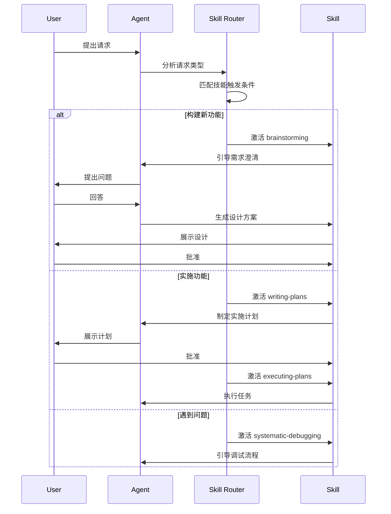

#### 深度解析：Brainstorming 技能

```markdown
# brainstorming SKILL.md 核心内容

### 32. 触发条件
- 当用户要求构建新功能时
- 在编写任何代码之前

### 33. 工作流程

### 1. 澄清需求
不要立即开始编码。先通过提问理解：
- 用户真正想要什么？
- 有哪些替代方案？
- 关键决策是什么？

### 2. 探索替代方案
至少提出 2-3 种不同的实现方式：
- 方案 A：简单直接
- 方案 B：更灵活但复杂
- 方案 C：折中方案

### 3. 展示设计
将设计方案分成小块展示，每块都要：
- 足够短，可以仔细阅读
- 包含具体实现细节
- 列出优缺点

### 4. 获得批准
在继续之前等待用户明确批准。

### 5. 保存设计文档
将批准的设计保存到 `docs/design-XXX.md`

### 34. 示例对话

❌ 不好的做法：
用户：创建一个用户登录功能
Agent：好的，我来实现...（直接开始编码）

✅ 好的做法：
用户：创建一个用户登录功能
Agent：在我开始之前，让我理解一下需求：
  1. 你希望使用什么认证方式？
     - 邮箱/密码
     - OAuth（Google, GitHub）
     - 两者都有
  2. 需要记住登录状态吗？
  3. 需要忘记密码功能吗？
  
  我建议的方案：
  ## 方案 1: 邮箱/密码 + JWT
  ...
  
  你觉得这个方案如何？还是你有其他偏好？
```

#### 深度解析：Subagent-Driven Development

```typescript
// Subagent 驱动开发流程
class SubagentDrivenDevelopment {
  // 为每个任务分发独立的 subagent
  async dispatchSubagents(plan: TaskPlan): Promise<TaskResult[]> {
    const results: TaskResult[] = [];
    
    for (const task of plan.tasks) {
      // 1. 创建 subagent
      const subagent = await this.createSubagent({
        task,
        context: plan.context,
        constraints: this.getTaskConstraints(task)
      });
      
      // 2. subagent 执行任务
      const work = await subagent.execute();
      
      // 3. 两阶段审查
      
      // 阶段 1: 规范符合性审查
      const specReview = await this.reviewAgainstSpec(work, task);
      if (!specReview.passed) {
        await subagent.fixIssues(specReview.issues);
      }
      
      // 阶段 2: 代码质量审查
      const qualityReview = await this.reviewCodeQuality(work);
      if (!qualityReview.passed) {
        await subagent.fixIssues(qualityReview.issues);
      }
      
      // 4. 批准或拒绝
      if (specReview.passed && qualityReview.passed) {
        results.push({ success: true, task: task.id });
      } else {
        results.push({ success: false, task: task.id });
      }
    }
    
    return results;
  }
  
  // 两阶段审查详解
  async reviewAgainstSpec(work: Work, task: Task): Promise<ReviewResult> {
    const issues: Issue[] = [];
    
    // 检查 1: 是否实现了所有需求
    for (const requirement of task.requirements) {
      if (!this.isImplemented(work, requirement)) {
        issues.push({
          severity: 'critical',
          type: 'missing-requirement',
          description: `需求未实现: ${requirement}`
        });
      }
    }
    
    // 检查 2: 是否添加了多余功能
    if (this.hasExtraFeatures(work, task)) {
      issues.push({
        severity: 'warning',
        type: 'yagni-violation',
        description: '实现了需求之外的功能'
      });
    }
    
    // 检查 3: 文件路径是否正确
    if (!this.correctFilePaths(work, task)) {
      issues.push({
        severity: 'critical',
        type: 'wrong-location',
        description: '文件放置在错误的位置'
      });
    }
    
    return {
      passed: issues.filter(i => i.severity === 'critical').length === 0,
      issues
    };
  }
  
  async reviewCodeQuality(work: Work): Promise<ReviewResult> {
    const issues: Issue[] = [];
    
    // 检查 1: 代码重复
    const duplicates = await this.findDuplicates(work);
    if (duplicates.length > 0) {
      issues.push({
        severity: 'warning',
        type: 'duplication',
        description: `发现 ${duplicates.length} 处代码重复`
      });
    }
    
    // 检查 2: 复杂度
    const complexity = await this.calculateComplexity(work);
    if (complexity.max > 10) {
      issues.push({
        severity: 'warning',
        type: 'high-complexity',
        description: `函数复杂度过高: ${complexity.max}`
      });
    }
    
    // 检查 3: 测试覆盖
    const coverage = await this.getCoverage(work);
    if (coverage < 80) {
      issues.push({
        severity: 'critical',
        type: 'low-coverage',
        description: `测试覆盖率不足: ${coverage}%`
      });
    }
    
    return {
      passed: issues.filter(i => i.severity === 'critical').length === 0,
      issues
    };
  }
}
```

### 5.3 工作流程

Superpowers 的核心工作流程。

#### 完整工作流程

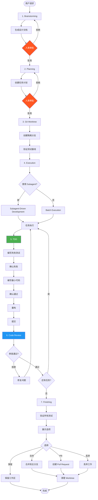

#### 工作流程详解

**阶段 1: Brainstorming（头脑风暴）**

```typescript
// Brainstorming 阶段实现
class BrainstormingPhase {
  async execute(userRequest: string): Promise<DesignDocument> {
    // 步骤 1: 澄清需求
    const clarified = await this.clarifyRequirements(userRequest);
    
    // 步骤 2: 探索替代方案
    const alternatives = await this.exploreAlternatives(clarified);
    
    // 步骤 3: 推荐方案
    const recommendation = this.recommend(alternatives);
    
    // 步骤 4: 展示设计（分块）
    const designChunks = this.chunkDesign(recommendation);
    for (const chunk of designChunks) {
      await this.presentToUser(chunk);
      const feedback = await this.getUserFeedback();
      if (feedback.needsRevision) {
        return this.execute(userRequest); // 重新开始
      }
    }
    
    // 步骤 5: 获得批准
    const approved = await this.requestApproval(recommendation);
    if (!approved) {
      throw new Error('Design not approved');
    }
    
    // 步骤 6: 保存设计文档
    const designDoc = await this.saveDesignDoc(recommendation);
    
    return designDoc;
  }
  
  private async clarifyRequirements(request: string): Promise<ClarifiedRequest> {
    // 使用苏格拉底式提问
    const questions = [
      '你的核心目标是什么？',
      '有哪些必须满足的约束？',
      '可以接受哪些妥协？',
      '成功的标准是什么？'
    ];
    
    const answers = await this.askQuestions(questions);
    
    return {
      originalRequest: request,
      clarification: answers,
      coreObjective: this.extractObjective(answers)
    };
  }
  
  private async exploreAlternatives(
    clarified: ClarifiedRequest
  ): Promise<Alternative[]> {
    // 至少生成 3 种方案
    return [
      {
        name: '简单方案',
        description: '最直接、最简单的实现',
        pros: ['实现快', '易于理解', '维护成本低'],
        cons: ['扩展性差', '功能有限'],
        complexity: 'low',
        timeline: '1-2 小时'
      },
      {
        name: '灵活方案',
        description: '更灵活、可扩展的实现',
        pros: ['易于扩展', '适应变化', '功能完整'],
        cons: ['实现复杂', '开发时间长'],
        complexity: 'high',
        timeline: '4-6 小时'
      },
      {
        name: '折中方案',
        description: '平衡简单性和灵活性',
        pros: ['平衡的好选择', '适度复杂', '可扩展'],
        cons: ['不是最优解', '需要更多设计'],
        complexity: 'medium',
        timeline: '2-4 小时'
      }
    ];
  }
}
```

**阶段 2: Planning（规划）**

```typescript
// Planning 阶段实现
class PlanningPhase {
  async execute(designDoc: DesignDocument): Promise<TaskPlan> {
    // 步骤 1: 分解任务
    const tasks = this.breakDownTasks(designDoc);
    
    // 步骤 2: 定义验收标准
    const tasksWithCriteria = tasks.map(task => ({
      ...task,
      acceptanceCriteria: this.defineCriteria(task)
    }));
    
    // 步骤 3: 估算工作量
    const tasksWithEstimates = tasksWithCriteria.map(task => ({
      ...task,
      estimatedMinutes: this.estimateEffort(task)
    }));
    
    // 步骤 4: 排序依赖
    const orderedTasks = this.orderByDependencies(tasksWithEstimates);
    
    // 步骤 5: 创建计划文档
    const plan: TaskPlan = {
      designRef: designDoc.id,
      tasks: orderedTasks,
      totalEstimatedMinutes: orderedTasks.reduce(
        (sum, t) => sum + t.estimatedMinutes, 0
      ),
      milestones: this.defineMilestones(orderedTasks)
    };
    
    // 步骤 6: 展示计划
    await this.presentPlan(plan);
    
    // 步骤 7: 获得批准
    const approved = await this.requestApproval(plan);
    if (!approved) {
      throw new Error('Plan not approved');
    }
    
    return plan;
  }
  
  private breakDownTasks(designDoc: DesignDocument): Task[] {
    // 每个任务应该是 2-5 分钟的工作量
    return designDoc.components.flatMap(component => [
      {
        id: generateId(),
        description: `创建 ${component.name} 类型定义`,
        files: [`src/types/${component.name}.ts`],
        type: 'types'
      },
      {
        id: generateId(),
        description: `实现 ${component.name} 核心逻辑`,
        files: [`src/${component.name}.ts`],
        type: 'implementation'
      },
      {
        id: generateId(),
        description: `编写 ${component.name} 测试`,
        files: [`tests/${component.name}.test.ts`],
        type: 'testing'
      }
    ]);
  }
  
  private estimateEffort(task: Task): number {
    // 基于任务类型估算
    const estimates = {
      types: 2,
      implementation: 5,
      testing: 3,
      integration: 4,
      documentation: 2
    };
    
    return estimates[task.type] || 5;
  }
  
  private orderByDependencies(tasks: Task[]): Task[] {
    // 拓扑排序
    const graph = this.buildDependencyGraph(tasks);
    return this.topologicalSort(graph);
  }
}
```

**阶段 3: Git Worktree（隔离工作区）**

```bash
#!/bin/bash
# setup-worktree.sh - 创建隔离工作环境

set -e

# 参数
BRANCH_NAME=$1
WORKTREE_PATH="../worktrees/$BRANCH_NAME"

echo "🌳 创建 Git Worktree..."

# 1. 创建 worktree
git worktree add "$WORKTREE_PATH" -b "$BRANCH_NAME"

# 2. 进入 worktree
cd "$WORKTREE_PATH"

# 3. 安装依赖（如果需要）
if [ -f "package.json" ]; then
  echo "📦 安装依赖..."
  npm install --frozen-lockfile
fi

# 4. 验证测试基线
echo "🧪 验证测试基线..."
npm test

if [ $? -eq 0 ]; then
  echo "✓ 测试基线通过，开始工作！"
else
  echo "✗ 测试基线失败，请先修复"
  exit 1
fi

# 5. 记录 worktree 信息
echo "$BRANCH_NAME" >> "$WORKTREE_PATH/.worktree-info"
echo "$(date)" >> "$WORKTREE_PATH/.worktree-info"
```

**阶段 4-6: 执行、TDD、审查**

已在前面章节详细说明。

**阶段 7: Finishing（完成）**

```typescript
// Finishing 阶段实现
class FinishingPhase {
  async execute(plan: TaskPlan): Promise<void> {
    // 步骤 1: 验证所有测试通过
    console.log('🧪 验证所有测试...');
    const testResult = await this.runAllTests();
    
    if (!testResult.passed) {
      throw new Error('部分测试未通过，无法完成');
    }
    
    console.log('✓ 所有测试通过');
    
    // 步骤 2: 生成完成报告
    const report = await this.generateCompletionReport(plan);
    
    // 步骤 3: 展示选项给用户
    console.log('\n📋 任务完成！选择操作：');
    console.log('1. 合并到主分支');
    console.log('2. 创建 Pull Request');
    console.log('3. 保留工作区（稍后处理）');
    console.log('4. 丢弃所有更改');
    
    const choice = await this.getUserChoice();
    
    // 步骤 4: 执行选择
    switch (choice) {
      case 'merge':
        await this.mergeToMain();
        break;
      case 'pr':
        await this.createPullRequest(report);
        break;
      case 'keep':
        console.log('工作区已保留');
        break;
      case 'discard':
        await this.discardWork();
        break;
    }
    
    // 步骤 5: 清理 worktree
    if (choice !== 'keep') {
      await this.cleanupWorktree();
    }
    
    console.log('✓ 完成！');
  }
  
  private async generateCompletionReport(
    plan: TaskPlan
  ): Promise<CompletionReport> {
    return {
      planId: plan.id,
      completedTasks: plan.tasks.length,
      totalCommits: await this.getCommitCount(),
      filesChanged: await this.getChangedFiles(),
      testCoverage: await this.getCoverage(),
      metrics: {
        totalTime: await this.getTotalTime(),
        tokenUsage: await this.getTokenUsage(),
        retryCount: await this.getRetryCount()
      }
    };
  }
  
  private async mergeToMain(): Promise<void> {
    // 切换回主分支
    await exec('git checkout main');
    
    // 合并工作分支
    await exec(`git merge ${this.currentBranch} --no-ff`);
    
    console.log('✓ 已合并到 main');
  }
  
  private async createPullRequest(
    report: CompletionReport
  ): Promise<void> {
    // 推送到远程
    await exec('git push origin HEAD');
    
    // 创建 PR（GitHub CLI）
    const prCommand = `gh pr create \\
      --title "feat: ${report.planId}" \\
      --body "$(cat <<EOF
### 35. 变更摘要

${report.completedTasks} 个任务已完成

### 36. 测试

- 测试覆盖率: ${report.testCoverage}%
- 所有测试通过: ✓

### 37. 指标

- 总耗时: ${report.metrics.totalTime}分钟
- Token 使用: ${report.metrics.tokenUsage}
- 重试次数: ${report.metrics.retryCount}
EOF
)"`;
    
    await exec(prCommand);
    
    console.log('✓ PR 已创建');
  }
  
  private async cleanupWorktree(): Promise<void> {
    // 删除本地分支
    await exec(`git branch -D ${this.currentBranch}`);
    
    // 删除 worktree
    await exec(`git worktree remove ${this.worktreePath}`);
    
    console.log('✓ Worktree 已清理');
  }
}
```

### 5.4 安装与配置

#### Claude Code 安装

```bash
# 方法 1: 官方市场
/plugin install superpowers@claude-plugins-official

# 方法 2: Superpowers 市场
/plugin marketplace add obra/superpowers-marketplace
/plugin install superpowers@superpowers-marketplace

# 验证安装
# 在对话中询问 Agent："你使用了什么技能系统？"
# 应该回答使用了 Superpowers
```

#### Codex CLI 安装

```bash
# 1. 打开插件搜索
/plugins

# 2. 搜索 Superpowers
superpowers

# 3. 选择 Install Plugin
```

#### Cursor 安装

```bash
# 在 Cursor Agent chat 中
/add-plugin superpowers

# 或在插件市场搜索 "superpowers"
```

#### Gemini CLI 安装

```bash
# 安装扩展
gemini extensions install https://github.com/obra/superpowers

# 更新扩展
gemini extensions update superpowers
```

#### 配置最佳实践

```markdown
# AGENTS.md - Superpowers 优化配置

### 38. Superpowers 工作流

本项目使用 Superpowers 框架，Agent 将自动激活以下技能：

### 自动触发的技能

1. **brainstorming** - 在编写代码前激活
2. **writing-plans** - 设计获批后激活
3. **test-driven-development** - 实施期间激活
4. **requesting-code-review** - 任务间激活
5. **finishing-a-development-branch** - 分支完成时激活

### 项目特定配置

**Git Worktree 使用：**
- 每个功能在独立 worktree 中开发
- Worktree 路径：`../worktrees/<branch-name>`
- 自动清理已完成的 worktree

**TDD 要求：**
- 所有新功能必须 TDD
- Bug 修复必须先写回归测试
- 测试覆盖率 > 80%

**Subagent 使用：**
- 复杂任务（> 5 个子任务）使用 subagent-driven-development
- 简单任务直接 executing-plans

### 人类检查点

以下检查点需要人类批准：
1. ✅ 设计方案
2. ✅ 实施计划
3. ✅ 合并决策（可自动批准低风险变更）

### 自定义技能

本项目添加了以下自定义技能：

**deploy-to-staging**
- 触发：当用户说"部署到 staging"
- 流程：
  1. 运行完整测试
  2. 构建项目
  3. 部署到 staging 环境
  4. 验证部署
  5. 报告结果
```

---

## 6. 高级 Harness 模式

### 6.1 长任务模式

长任务（> 30 分钟自主执行）需要特殊处理。

#### 长任务挑战

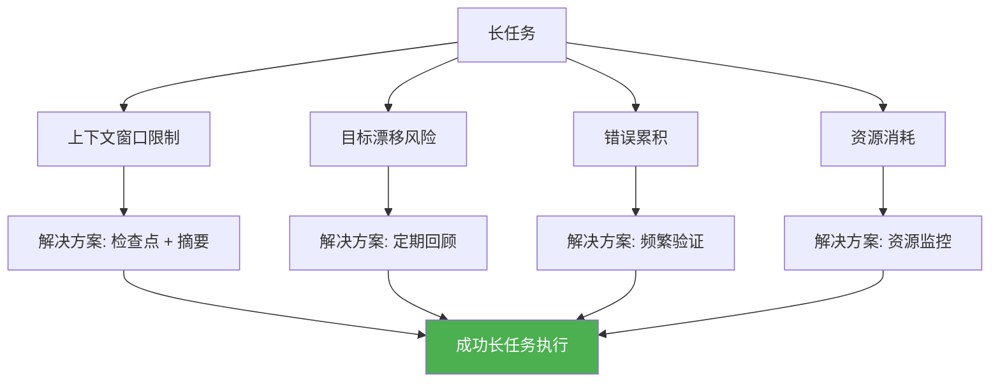

#### 长任务实现

```typescript
// 长任务执行器
class LongTaskExecutor {
  private checkpointInterval = 10 * 60 * 1000; // 10 分钟
  private maxAutonomousTime = 4 * 60 * 60 * 1000; // 4 小时
  private reviewInterval = 15 * 60 * 1000; // 15 分钟回顾
  
  async executeLongTask(task: LongTask): Promise<TaskResult> {
    const startTime = Date.now();
    let lastCheckpoint = startTime;
    let lastReview = startTime;
    
    // 初始化
    await this.initialize(task);
    
    while (!this.isComplete(task)) {
      // 检查超时
      if (Date.now() - startTime > this.maxAutonomousTime) {
        throw new Error('长任务超时');
      }
      
      // 定期保存检查点
      if (Date.now() - lastCheckpoint > this.checkpointInterval) {
        await this.saveCheckpoint();
        lastCheckpoint = Date.now();
        
        // 生成摘要以管理上下文
        await this.generateSummary();
      }
      
      // 定期回顾目标
      if (Date.now() - lastReview > this.reviewInterval) {
        await this.reviewProgress(task);
        lastReview = Date.now();
      }
      
      // 执行下一个子任务
      const nextSubtask = this.getNextSubtask(task);
      await this.executeSubtask(nextSubtask);
      
      // 验证结果
      await this.verifyResult(nextSubtask);
    }
    
    // 最终验证
    await this.finalVerification(task);
    
    return {
      success: true,
      duration: Date.now() - startTime,
      checkpoints: this.checkpointCount
    };
  }
  
  private async generateSummary(): Promise<void> {
    // 将旧的历史记录压缩成摘要
    const oldHistory = this.history.filter(h => h.age > '30m');
    
    const summary = await llm.summarize({
      prompt: `
        将以下工作历史压缩成简洁摘要：
        ${oldHistory.map(h => `- ${h.action}: ${h.result}`).join('\n')}
        
        保留：
        1. 关键决策
        2. 已完成的主要功能
        3. 当前状态
        4. 待完成的工作
      `,
      maxTokens: 500
    });
    
    this.compressedHistory = summary;
  }
  
  private async reviewProgress(task: LongTask): Promise<void> {
    // 回顾原始目标
    const originalGoal = task.objective;
    const currentProgress = this.getCurrentProgress();
    
    // 检查是否偏离目标
    const alignment = await llm.evaluate({
      prompt: `
        原始目标: ${originalGoal}
        当前进度: ${currentProgress}
        
        问题：
        1. 当前工作是否与目标一致？
        2. 是否有目标漂移？
        3. 是否需要调整方向？
      `
    });
    
    if (alignment.driftDetected) {
      console.warn('⚠️ 检测到目标漂移，正在纠正...');
      await this.correctCourse(task);
    }
  }
  
  private async correctCourse(task: LongTask): Promise<void> {
    // 重新聚焦到原始目标
    const correctiveAction = await llm.generate({
      prompt: `
        原始目标: ${task.objective}
        当前状态: ${this.getCurrentState()}
        
        生成纠正行动计划，回到实现原始目标的轨道上。
      `
    });
    
    await this.executePlan(correctiveAction);
  }
}
```

#### 长任务检查点策略

```typescript
// 检查点管理器
class CheckpointManager {
  private checkpoints: Checkpoint[] = [];
  private maxCheckpoints = 20;
  
  async createCheckpoint(state: HarnessState): Promise<Checkpoint> {
    const checkpoint: Checkpoint = {
      id: generateId(),
      timestamp: Date.now(),
      state: this.serializeState(state),
      gitHash: await this.getCurrentGitHash(),
      testResults: await this.getLatestTestResults(),
      summary: await this.generateCheckpointSummary(state),
      size: await this.calculateStateSize(state)
    };
    
    this.checkpoints.push(checkpoint);
    
    // 保存到磁盘
    await this.saveCheckpoint(checkpoint);
    
    // 清理旧检查点
    await this.pruneOldCheckpoints();
    
    return checkpoint;
  }
  
  private async generateCheckpointSummary(
    state: HarnessState
  ): Promise<string> {
    return await llm.summarize({
      prompt: `
        为以下状态生成简短摘要（50 字以内）：
        - 当前阶段: ${state.phase}
        - 已完成任务: ${state.completedTasks.length}
        - 待完成任务: ${state.pendingTasks.length}
        - 最近决策: ${state.decisions.slice(-3).map(d => d.decision).join(', ')}
      `,
      maxTokens: 100
    });
  }
  
  async restoreCheckpoint(checkpointId: string): Promise<HarnessState> {
    const checkpoint = this.checkpoints.find(c => c.id === checkpointId);
    
    if (!checkpoint) {
      throw new Error(`Checkpoint not found: ${checkpointId}`);
    }
    
    // 恢复 Git 状态
    await this.restoreGitState(checkpoint.gitHash);
    
    // 恢复 Harness 状态
    return this.deserializeState(checkpoint.state);
  }
  
  async pruneOldCheckpoints(): Promise<void> {
    // 保留最近 N 个检查点
    if (this.checkpoints.length > this.maxCheckpoints) {
      const toRemove = this.checkpoints.slice(
        0,
        this.checkpoints.length - this.maxCheckpoints
      );
      
      // 删除磁盘上的文件
      for (const checkpoint of toRemove) {
        await this.deleteCheckpointFile(checkpoint);
      }
      
      this.checkpoints = this.checkpoints.slice(-this.maxCheckpoints);
    }
  }
}
```

### 6.2 并行执行模式

并行执行可以大幅提升效率。

#### 并行策略

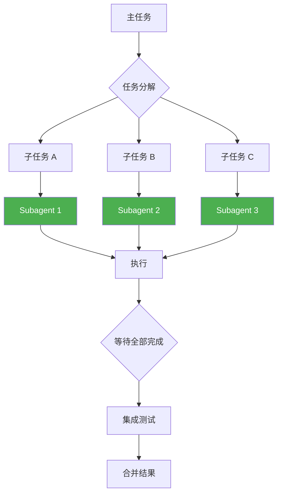

#### 并行执行实现

```typescript
// 并行执行器
class ParallelExecutor {
  private maxParallelAgents = 3;
  private agentPool: Subagent[] = [];
  
  async executeInParallel(
    tasks: Task[],
    options: ParallelOptions = {}
  ): Promise<TaskResult[]> {
    const {
      maxConcurrency = this.maxParallelAgents,
      dependencyAware = true
    } = options;
    
    // 如果任务有依赖，需要拓扑排序
    const orderedTasks = dependencyAware
      ? this.orderByDependencies(tasks)
      : tasks;
    
    // 分组可并行执行的任务
    const parallelGroups = this.groupByParallelism(orderedTasks);
    
    const allResults: TaskResult[] = [];
    
    // 按组执行
    for (const group of parallelGroups) {
      console.log(`🚀 并行执行 ${group.length} 个任务...`);
      
      // 限制并发数
      const batches = this.chunk(group, maxConcurrency);
      
      for (const batch of batches) {
        // 并行执行批次
        const results = await Promise.all(
          batch.map(task => this.executeTaskWithAgent(task))
        );
        
        allResults.push(...results);
        
        // 检查是否有失败
        const failures = results.filter(r => !r.success);
        if (failures.length > 0) {
          console.warn(`⚠️ ${failures.length} 个任务失败`);
          await this.handleFailures(failures);
        }
      }
    }
    
    return allResults;
  }
  
  private async executeTaskWithAgent(task: Task): Promise<TaskResult> {
    // 获取空闲 agent
    const agent = await this.acquireAgent();
    
    try {
      // 为 agent 提供任务上下文
      await agent.initialize({
        task,
        workspace: await this.createIsolatedWorkspace(task),
        constraints: this.getTaskConstraints(task)
      });
      
      // 执行任务
      const result = await agent.execute();
      
      // 验证结果
      await this.validateResult(result, task);
      
      return result;
    } finally {
      // 释放 agent
      this.releaseAgent(agent);
    }
  }
  
  private groupByParallelism(tasks: Task[]): Task[][] {
    // 根据依赖关系分组
    const groups: Task[][] = [];
    const assigned = new Set<string>();
    
    while (assigned.size < tasks.length) {
      const group: Task[] = [];
      
      for (const task of tasks) {
        if (assigned.has(task.id)) continue;
        
        // 检查所有依赖是否已分配
        const dependenciesMet = task.dependencies?.every(dep =>
          assigned.has(dep)
        ) ?? true;
        
        if (dependenciesMet) {
          group.push(task);
          assigned.add(task.id);
        }
      }
      
      if (group.length === 0) {
        throw new Error('检测到循环依赖');
      }
      
      groups.push(group);
    }
    
    return groups;
  }
  
  private async createIsolatedWorkspace(task: Task): Promise<string> {
    const workspacePath = `/tmp/harness-${task.id}-${Date.now()}`;
    await fs.mkdir(workspacePath, { recursive: true });
    
    return workspacePath;
  }
}

interface ParallelOptions {
  maxConcurrency?: number;
  dependencyAware?: boolean;
}
```

#### 并行任务示例

```typescript
// 示例：并行开发前端组件
const frontendTasks: Task[] = [
  {
    id: 'header',
    description: '实现 Header 组件',
    files: ['src/components/Header.tsx'],
    dependencies: [] // 无依赖
  },
  {
    id: 'sidebar',
    description: '实现 Sidebar 组件',
    files: ['src/components/Sidebar.tsx'],
    dependencies: [] // 无依赖
  },
  {
    id: 'footer',
    description: '实现 Footer 组件',
    files: ['src/components/Footer.tsx'],
    dependencies: [] // 无依赖
  },
  {
    id: 'layout',
    description: '实现 Layout 组件',
    files: ['src/components/Layout.tsx'],
    dependencies: ['header', 'sidebar', 'footer'] // 依赖以上组件
  }
];

// 并行执行
const executor = new ParallelExecutor();
const results = await executor.executeInParallel(frontendTasks, {
  maxConcurrency: 3,
  dependencyAware: true
});

// 执行顺序：
// 第 1 批: header, sidebar, footer（并行）
// 第 2 批: layout（等待第 1 批完成后执行）
```

### 6.3 自适应 Harness

Harness 应该能根据任务和环境自动调整策略。

#### 自适应策略

```typescript
// 自适应 Harness
class AdaptiveHarness {
  private history: ExecutionHistory;
  private metrics: PerformanceMetrics;
  
  async executeTask(task: Task): Promise<TaskResult> {
    // 1. 评估任务特征
    const taskProfile = await this.profileTask(task);
    
    // 2. 选择最优策略
    const strategy = this.selectStrategy(taskProfile);
    
    // 3. 配置 Harness
    await this.configureHarness(strategy);
    
    // 4. 执行任务
    const result = await this.execute(task);
    
    // 5. 记录结果用于学习
    await this.recordOutcome(taskProfile, strategy, result);
    
    // 6. 调整策略
    this.updateStrategy(result);
    
    return result;
  }
  
  private async profileTask(task: Task): Promise<TaskProfile> {
    return {
      complexity: await this.estimateComplexity(task),
      familiarity: this.getFamiliarity(task.type),
      riskLevel: this.assessRisk(task),
      estimatedDuration: this.estimateDuration(task),
      requiresCreativity: this.needsCreativity(task)
    };
  }
  
  private selectStrategy(profile: TaskProfile): HarnessStrategy {
    // 基于任务特征选择策略
    
    if (profile.complexity > 8) {
      return {
        type: 'strict',
        humanCheckpoints: 'all',
        tddEnforced: true,
        useSubagents: true,
        maxAutonomousTime: 15 * 60 * 1000 // 15 分钟
      };
    }
    
    if (profile.familiarity > 0.8 && profile.riskLevel < 0.3) {
      return {
        type: 'autonomous',
        humanCheckpoints: 'milestones-only',
        tddEnforced: true,
        useSubagents: false,
        maxAutonomousTime: 2 * 60 * 60 * 1000 // 2 小时
      };
    }
    
    // 默认策略
    return {
      type: 'moderate',
      humanCheckpoints: 'critical-only',
      tddEnforced: true,
      useSubagents: profile.complexity > 5,
      maxAutonomousTime: 30 * 60 * 1000 // 30 分钟
    };
  }
  
  private getFamiliarity(taskType: string): number {
    // 基于历史成功率计算熟悉度
    const history = this.history.filter(h => h.taskType === taskType);
    
    if (history.length === 0) return 0.5; // 无历史数据
    
    const successRate = history.filter(h => h.success).length / history.length;
    return successRate;
  }
  
  private updateStrategy(result: TaskResult): void {
    // 根据结果调整策略
    
    if (result.success && result.duration < this.metrics.averageDuration) {
      // 成功且快速：可以增加自主性
      this.metrics.confidenceLevel += 0.1;
    } else if (!result.success) {
      // 失败：减少自主性
      this.metrics.confidenceLevel -= 0.2;
    }
    
    // 限制在合理范围内
    this.metrics.confidenceLevel = Math.max(0, Math.min(1, 
      this.metrics.confidenceLevel
    ));
  }
}

interface HarnessStrategy {
  type: 'strict' | 'moderate' | 'autonomous';
  humanCheckpoints: 'all' | 'critical-only' | 'milestones-only' | 'none';
  tddEnforced: boolean;
  useSubagents: boolean;
  maxAutonomousTime: number;
}
```

#### 学习循环

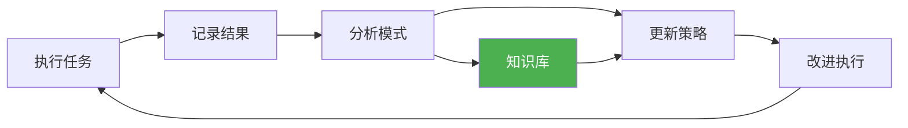

### 6.4 人类在环模式

人类在环（Human-in-the-Loop）是 Harness 的关键特性。

#### HITL 模式

```typescript
// 人类在环管理器
class HumanInLoopManager {
  private checkpoints: HumanCheckpoint[];
  private autoApproveThreshold = 0.95; // 95% 置信度可自动批准
  
  async processCheckpoint(
    checkpoint: HumanCheckpoint,
    context: CheckpointContext
  ): Promise<HumanDecision> {
    // 1. 评估是否可以自动批准
    const confidence = await this.calculateConfidence(checkpoint, context);
    
    if (confidence > this.autoApproveThreshold && checkpoint.autoApprove) {
      console.log(`✓ 自动批准: ${checkpoint.description}`);
      return { action: 'approve', automatic: true };
    }
    
    // 2. 准备人类审查材料
    const reviewPackage = await this.prepareReviewPackage(
      checkpoint,
      context
    );
    
    // 3. 等待人类决策
    const decision = await this.awaitHumanDecision(
      reviewPackage,
      checkpoint.timeout
    );
    
    // 4. 记录决策
    await this.recordDecision(checkpoint, decision);
    
    return decision;
  }
  
  private async prepareReviewPackage(
    checkpoint: HumanCheckpoint,
    context: CheckpointContext
  ): Promise<ReviewPackage> {
    return {
      summary: checkpoint.display.summary,
      details: checkpoint.display.details,
      changes: await this.summarizeChanges(context.changes),
      risks: context.risks,
      recommendation: checkpoint.display.recommendation,
      
      // 可视化
      diffs: await this.generateDiffs(context.changes),
      testResults: await this.getTestResults(context),
      metrics: await this.getMetrics(context)
    };
  }
  
  private async generateDiffs(changes: Change[]): Promise<string> {
    // 生成可读的 diff 摘要
    return changes.map(change => `
### ${change.file}

\`\`\`diff
${change.diff}
\`\`\`
    `).join('\n');
  }
}

interface HumanDecision {
  action: 'approve' | 'reject' | 'modify' | 'skip';
  automatic: boolean;
  feedback?: string;
  modifications?: Modification[];
}
```

---


---

<!-- 以下章节编号接续第一部分（1-6），从第 7 章开始 -->

## 7. 验证与测试策略

### 7.1 TDD for Harness

TDD 不仅是开发实践，也是 Harness 的核心机制。

#### TDD 强制实现

```typescript
// TDD 强制器
class TDDEnforcer {
  async enforceTDDCycle(task: Task): Promise<void> {
    // 阶段 1: RED - 编写失败的测试
    await this.phaseRed(task);
    
    // 阶段 2: GREEN - 编写最小代码
    await this.phaseGreen(task);
    
    // 阶段 3: REFACTOR - 优化代码
    await this.phaseRefactor(task);
    
    // 阶段 4: COMMIT - 提交
    await this.commit(task);
  }
  
  private async phaseRed(task: Task): Promise<void> {
    console.log('🔴 RED 阶段: 编写失败的测试');
    
    // 1. 检查测试文件是否存在
    const testFile = this.getTestFilePath(task);
    if (!await this.fileExists(testFile)) {
      throw new Error(
        '❌ TDD 违规: 测试文件不存在\n' +
        `请创建: ${testFile}`
      );
    }
    
    // 2. 验证测试确实失败
    const testResult = await this.runTests(testFile);
    if (testResult.passed) {
      throw new Error(
        '❌ TDD 违规: 测试从未失败\n' +
        '请确保:\n' +
        '1. 先写测试\n' +
        '2. 运行测试看到失败\n' +
        '3. 再写实现代码'
      );
    }
    
    console.log('✓ 测试失败（符合预期）');
  }
  
  private async phaseGreen(task: Task): Promise<void> {
    console.log('🟢 GREEN 阶段: 编写最小代码');
    
    // 1. 编写最小实现
    // Agent 应该写尽可能少的代码让测试通过
    
    // 2. 验证测试通过
    const testResult = await this.runTests();
    if (!testResult.passed) {
      const failedTests = testResult.failedTests;
      throw new Error(
        `❌ 测试未通过: ${failedTests.length} 个失败\n` +
        '请修复失败的测试'
      );
    }
    
    console.log('✓ 所有测试通过');
  }
  
  private async phaseRefactor(task: Task): Promise<void> {
    console.log('🔵 REFACTOR 阶段: 优化代码');
    
    // 1. 重构代码
    // Agent 应该在不破坏测试的前提下优化代码
    
    // 2. 验证测试仍然通过
    const testResult = await this.runTests();
    if (!testResult.passed) {
      throw new Error(
        '❌ 重构破坏了测试\n' +
        '请修复测试或回滚重构'
      );
    }
    
    // 3. 检查代码质量
    const qualityCheck = await this.checkCodeQuality();
    if (!qualityCheck.passed) {
      console.warn('⚠️ 代码质量问题:', qualityCheck.issues);
    }
    
    console.log('✓ 重构完成，测试通过');
  }
  
  private async commit(task: Task): Promise<void> {
    console.log('💾 COMMIT 阶段: 提交代码');
    
    // 1. 准备提交信息
    const commitMessage = this.generateCommitMessage(task);
    
    // 2. 添加文件
    await this.git('add', '.');
    
    // 3. 提交
    await this.git('commit', '-m', commitMessage);
    
    console.log('✓ 提交成功');
  }
  
  private generateCommitMessage(task: Task): string {
    return `feat: ${task.description}

- 遵循 TDD RED-GREEN-REFACTOR 流程
- 测试覆盖率: ${this.getCurrentCoverage()}%`;
  }
}
```

#### TDD 反模式检测

```typescript
// TDD 反模式检测器
class TDDAntiPatternDetector {
  async detectAntiPatterns(history: ExecutionHistory): Promise<AntiPattern[]> {
    const antiPatterns: AntiPattern[] = [];
    
    // 反模式 1: 先写代码后补测试
    if (this.testAfterCode(history)) {
      antiPatterns.push({
        type: 'test-after-code',
        severity: 'critical',
        description: '先写了代码，然后才补测试',
        evidence: this.getEvidence(history)
      });
    }
    
    // 反模式 2: 测试从未失败
    if (this.testsNeverFailed(history)) {
      antiPatterns.push({
        type: 'tests-never-failed',
        severity: 'critical',
        description: '测试从未失败过，可能不是真正的 TDD',
        evidence: this.getEvidence(history)
      });
    }
    
    // 反模式 3: 测试覆盖率不足
    if (this.lowCoverage(history)) {
      antiPatterns.push({
        type: 'low-coverage',
        severity: 'warning',
        description: '测试覆盖率低于 80%',
        evidence: this.getEvidence(history)
      });
    }
    
    // 反模式 4: 测试只覆盖 happy path
    if (this.onlyHappyPath(history)) {
      antiPatterns.push({
        type: 'only-happy-path',
        severity: 'warning',
        description: '测试只覆盖了正常路径，缺少边界和错误情况',
        evidence: this.getEvidence(history)
      });
    }
    
    return antiPatterns;
  }
  
  private testAfterCode(history: ExecutionHistory): boolean {
    // 检查文件修改时间戳
    for (const entry of history.entries) {
      if (entry.type === 'file-modify') {
        const testFile = this.getCorrespondingTestFile(entry.file);
        const testModified = history.entries.find(
          e => e.type === 'file-modify' && e.file === testFile
        );
        
        if (!testModified || testModified.timestamp > entry.timestamp) {
          return true;
        }
      }
    }
    
    return false;
  }
  
  private testsNeverFailed(history: ExecutionHistory): boolean {
    // 检查测试历史
    const testRuns = history.entries.filter(e => e.type === 'test-run');
    
    if (testRuns.length === 0) return true;
    
    // 如果所有测试运行都通过了
    const allPassed = testRuns.every(run => run.result === 'pass');
    
    return allPassed;
  }
}
```

### 7.2 全管道验证

完整的验证管道确保代码质量。

#### 验证管道

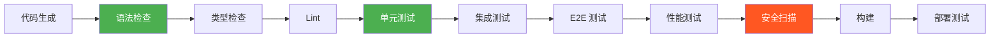

#### 管道实现

```typescript
// 验证管道
class ValidationPipeline {
  private stages: ValidationStage[];
  
  constructor() {
    this.stages = [
      { name: 'syntax', run: this.checkSyntax, required: true },
      { name: 'types', run: this.checkTypes, required: true },
      { name: 'lint', run: this.runLint, required: true },
      { name: 'unit-tests', run: this.runUnitTests, required: true },
      { name: 'integration-tests', run: this.runIntegrationTests, required: false },
      { name: 'e2e-tests', run: this.runE2ETests, required: false },
      { name: 'performance', run: this.checkPerformance, required: false },
      { name: 'security', run: this.securityScan, required: true },
      { name: 'build', run: this.runBuild, required: true }
    ];
  }
  
  async execute(code: CodeArtifact): Promise<ValidationResult> {
    const results: StageResult[] = [];
    
    for (const stage of this.stages) {
      console.log(`\n▶️  执行: ${stage.name}`);
      
      const startTime = Date.now();
      const result = await stage.run(code);
      const duration = Date.now() - startTime;
      
      const stageResult: StageResult = {
        name: stage.name,
        passed: result.passed,
        duration,
        issues: result.issues,
        required: stage.required
      };
      
      results.push(stageResult);
      
      if (!result.passed && stage.required) {
        console.error(`❌ ${stage.name} 失败（必须）`);
        return {
          passed: false,
          results,
          failedStage: stage.name,
          blockingIssues: result.issues
        };
      }
      
      console.log(`${result.passed ? '✓' : '⚠️'} ${stage.name} (${duration}ms)`);
    }
    
    return {
      passed: true,
      results,
      summary: this.generateSummary(results)
    };
  }
  
  private async checkSyntax(code: CodeArtifact): Promise<StageOutput> {
    // TypeScript 语法检查
    const result = await tsc.checkSyntax(code.files);
    
    return {
      passed: result.errors.length === 0,
      issues: result.errors.map(e => ({
        type: 'syntax',
        severity: 'error',
        message: e.message,
        file: e.file,
        line: e.line
      }))
    };
  }
  
  private async checkTypes(code: CodeArtifact): Promise<StageOutput> {
    // TypeScript 类型检查
    const result = await tsc.typeCheck(code.project);
    
    return {
      passed: result.errors.length === 0,
      issues: result.errors.map(e => ({
        type: 'type',
        severity: 'error',
        message: e.message,
        file: e.file
      }))
    };
  }
  
  private async runLint(code: CodeArtifact): Promise<StageOutput> {
    // ESLint
    const result = await eslint.lint(code.files);
    
    return {
      passed: result.errors.length === 0,
      issues: [
        ...result.errors.map(e => ({
          type: 'lint',
          severity: 'error',
          message: e.message,
          file: e.file
        })),
        ...result.warnings.map(w => ({
          type: 'lint',
          severity: 'warning',
          message: w.message,
          file: w.file
        }))
      ]
    };
  }
  
  private async securityScan(code: CodeArtifact): Promise<StageOutput> {
    // 安全扫描
    const issues: SecurityIssue[] = [];
    
    // 检查 1: 硬编码密钥
    const hardcodedSecrets = await this.detectHardcodedSecrets(code);
    if (hardcodedSecrets.length > 0) {
      issues.push(...hardcodedSecrets.map(s => ({
        type: 'security',
        severity: 'critical',
        message: `硬编码密钥: ${s.name}`,
        file: s.file
      })));
    }
    
    // 检查 2: SQL 注入风险
    const sqlInjectionRisks = await this.detectSQLInjection(code);
    if (sqlInjectionRisks.length > 0) {
      issues.push(...sqlInjectionRisks.map(s => ({
        type: 'security',
        severity: 'critical',
        message: '潜在 SQL 注入',
        file: s.file
      })));
    }
    
    // 检查 3: XSS 风险
    const xssRisks = await this.detectXSS(code);
    if (xssRisks.length > 0) {
      issues.push(...xssRisks.map(s => ({
        type: 'security',
        severity: 'high',
        message: '潜在 XSS',
        file: s.file
      })));
    }
    
    return {
      passed: issues.filter(i => i.severity === 'critical').length === 0,
      issues
    };
  }
}
```

### 7.3 自我验证机制

Agent 应该能够自我验证工作质量。

#### 自我验证实现

```typescript
// 自我验证器
class SelfValidator {
  async validate(work: WorkProduct): Promise<ValidationReport> {
    const report: ValidationReport = {
      score: 0,
      issues: [],
      recommendations: []
    };
    
    // 验证 1: 需求符合性
    const specCompliance = await this.checkSpecCompliance(work);
    report.score += specCompliance.score;
    report.issues.push(...specCompliance.issues);
    
    // 验证 2: 代码质量
    const codeQuality = await this.checkCodeQuality(work);
    report.score += codeQuality.score;
    report.issues.push(...codeQuality.issues);
    
    // 验证 3: 测试覆盖
    const testCoverage = await this.checkTestCoverage(work);
    report.score += testCoverage.score;
    report.issues.push(...testCoverage.issues);
    
    // 验证 4: 最佳实践
    const bestPractices = await this.checkBestPractices(work);
    report.score += bestPractices.score;
    report.recommendations.push(...bestPractices.recommendations);
    
    // 计算总分
    report.score = report.score / 4; // 平均分
    report.passed = report.score >= 0.8; // 80 分通过
    
    return report;
  }
  
  private async checkSpecCompliance(work: WorkProduct): Promise<PartialValidation> {
    const specification = work.task.specification;
    const issues: Issue[] = [];
    let score = 100;
    
    // 检查每个需求
    for (const requirement of specification.requirements) {
      const met = await this.isRequirementMet(requirement, work);
      
      if (!met) {
        issues.push({
          type: 'spec-compliance',
          severity: 'critical',
          message: `需求未满足: ${requirement.description}`
        });
        score -= 20;
      }
    }
    
    // 检查是否添加了多余功能
    if (this.hasExtraFeatures(work, specification)) {
      issues.push({
        type: 'yagni',
        severity: 'warning',
        message: '实现了需求之外的功能（违反 YAGNI）'
      });
      score -= 10;
    }
    
    return { score: Math.max(0, score), issues };
  }
  
  private async checkCodeQuality(work: WorkProduct): Promise<PartialValidation> {
    let score = 100;
    const issues: Issue[] = [];
    
    // 检查 1: 代码重复
    const duplicates = await this.findDuplicates(work);
    if (duplicates.length > 0) {
      score -= duplicates.length * 5;
      issues.push({
        type: 'duplication',
        severity: 'warning',
        message: `发现 ${duplicates.length} 处代码重复`
      });
    }
    
    // 检查 2: 圈复杂度
    const complexity = await this.calculateComplexity(work);
    if (complexity.average > 10) {
      score -= 15;
      issues.push({
        type: 'complexity',
        severity: 'warning',
        message: `平均圈复杂度过高: ${complexity.average}`
      });
    }
    
    // 检查 3: 函数长度
    const longFunctions = await this.findLongFunctions(work);
    if (longFunctions.length > 0) {
      score -= longFunctions.length * 5;
      issues.push({
        type: 'function-length',
        severity: 'warning',
        message: `${longFunctions.length} 个函数过长（> 50 行）`
      });
    }
    
    // 检查 4: 命名规范
    const namingViolations = await this.checkNaming(work);
    if (namingViolations.length > 0) {
      score -= namingViolations.length * 2;
      issues.push({
        type: 'naming',
        severity: 'info',
        message: `${namingViolations.length} 处命名不规范`
      });
    }
    
    return { score: Math.max(0, score), issues };
  }
  
  private async checkTestCoverage(work: WorkProduct): Promise<PartialValidation> {
    const coverage = await this.getCoverage(work);
    const issues: Issue[] = [];
    let score = 0;
    
    // 行覆盖率
    if (coverage.lines >= 80) {
      score += 40;
    } else if (coverage.lines >= 60) {
      score += 20;
      issues.push({
        type: 'coverage',
        severity: 'warning',
        message: `行覆盖率不足: ${coverage.lines}%`
      });
    } else {
      issues.push({
        type: 'coverage',
        severity: 'critical',
        message: `行覆盖率严重不足: ${coverage.lines}%`
      });
    }
    
    // 分支覆盖率
    if (coverage.branches >= 70) {
      score += 30;
    } else {
      score += 15;
      issues.push({
        type: 'coverage',
        severity: 'warning',
        message: `分支覆盖率不足: ${coverage.branches}%`
      });
    }
    
    // 函数覆盖率
    if (coverage.functions >= 80) {
      score += 30;
    } else {
      score += 15;
      issues.push({
        type: 'coverage',
        severity: 'warning',
        message: `函数覆盖率不足: ${coverage.functions}%`
      });
    }
    
    return { score, issues };
  }
}
```

### 7.4 集成测试

集成测试验证模块间的协作。

#### 集成测试框架

```typescript
// 集成测试助手
class IntegrationTestHelper {
  async testAPIIntegration(testCase: APITestCase): Promise<TestResult> {
    // 1. 设置测试环境
    await this.setupTestEnvironment();
    
    // 2. 准备测试数据
    const testData = await this.prepareTestData(testCase);
    
    // 3. 执行 API 调用
    const response = await this.callAPI(testCase.endpoint, testData);
    
    // 4. 验证响应
    const validationResult = this.validateResponse(
      response,
      testCase.expectedResponse
    );
    
    // 5. 验证副作用
    const sideEffectsValid = await this.validateSideEffects(
      testCase.expectedSideEffects
    );
    
    // 6. 清理
    await this.cleanup();
    
    return {
      passed: validationResult.passed && sideEffectsValid,
      details: {
        response: validationResult,
        sideEffects: sideEffectsValid
      }
    };
  }
  
  async testDatabaseIntegration(
    testCase: DatabaseTestCase
  ): Promise<TestResult> {
    // 1. 开始事务
    const transaction = await this.beginTransaction();
    
    try {
      // 2. 执行数据库操作
      const result = await testCase.operation(this.db);
      
      // 3. 验证结果
      const validated = await this.verifyResult(result, testCase.expected);
      
      // 4. 回滚（不污染数据库）
      await transaction.rollback();
      
      return {
        passed: validated,
        details: result
      };
    } catch (error) {
      await transaction.rollback();
      throw error;
    }
  }
}
```

---

## 8. 可观测性与调试

### 8.1 日志与追踪

完善的日志是可观测性的基础。

#### 结构化日志

```typescript
// 结构化日志系统
class StructuredLogger {
  private logStream: WriteStream;
  private correlationId: string;
  
  log(level: LogLevel, message: string, context: LogContext): void {
    const entry: LogEntry = {
      timestamp: new Date().toISOString(),
      level,
      message,
      correlationId: this.correlationId,
      context: {
        taskId: context.taskId,
        phase: context.phase,
        agent: context.agent,
        ...context.extra
      },
      metrics: context.metrics
    };
    
    // 写入日志
    this.logStream.write(JSON.stringify(entry) + '\n');
    
    // 同时输出到控制台
    if (this.shouldLogToConsole(level)) {
      this.logToConsole(entry);
    }
    
    // 发送到遥测系统
    this.sendToTelemetry(entry);
  }
  
  // 日志级别
  trace(message: string, context: LogContext): void {
    this.log('trace', message, context);
  }
  
  debug(message: string, context: LogContext): void {
    this.log('debug', message, context);
  }
  
  info(message: string, context: LogContext): void {
    this.log('info', message, context);
  }
  
  warn(message: string, context: LogContext): void {
    this.log('warn', message, context);
  }
  
  error(message: string, context: LogContext, error?: Error): void {
    this.log('error', message, {
      ...context,
      extra: {
        ...context.extra,
        error: error?.message,
        stack: error?.stack
      }
    });
  }
}

// 日志条目类型
interface LogEntry {
  timestamp: string;
  level: 'trace' | 'debug' | 'info' | 'warn' | 'error';
  message: string;
  correlationId: string;
  context: {
    taskId?: string;
    phase?: string;
    agent?: string;
    [key: string]: any;
  };
  metrics?: {
    duration?: number;
    tokenUsage?: number;
    retryCount?: number;
  };
}
```

#### 分布式追踪

```typescript
// 追踪系统
class TracingSystem {
  private traces: Map<string, Trace> = new Map();
  
  startTrace(operation: string): TraceContext {
    const traceId = generateId();
    const spanId = generateId();
    
    const trace: Trace = {
      traceId,
      operation,
      startTime: Date.now(),
      spans: [],
      metadata: {}
    };
    
    this.traces.set(traceId, trace);
    
    return { traceId, spanId, parentSpanId: null };
  }
  
  addSpan(
    context: TraceContext,
    operation: string,
    attributes: Record<string, any> = {}
  ): string {
    const spanId = generateId();
    
    const span: Span = {
      spanId,
      parentSpanId: context.spanId,
      operation,
      startTime: Date.now(),
      attributes
    };
    
    const trace = this.traces.get(context.traceId);
    if (trace) {
      trace.spans.push(span);
    }
    
    return spanId;
  }
  
  endSpan(context: TraceContext, status: SpanStatus): void {
    const trace = this.traces.get(context.traceId);
    if (trace) {
      const span = trace.spans.find(s => s.spanId === context.spanId);
      if (span) {
        span.endTime = Date.now();
        span.duration = span.endTime - span.startTime;
        span.status = status;
      }
    }
  }
  
  endTrace(context: TraceContext, result: TraceResult): void {
    const trace = this.traces.get(context.traceId);
    if (trace) {
      trace.endTime = Date.now();
      trace.duration = trace.endTime - trace.startTime;
      trace.result = result;
      
      // 保存追踪数据
      this.saveTrace(trace);
    }
  }
  
  async getTraceSummary(traceId: string): Promise<TraceSummary> {
    const trace = this.traces.get(traceId);
    if (!trace) {
      throw new Error(`Trace not found: ${traceId}`);
    }
    
    return {
      traceId: trace.traceId,
      operation: trace.operation,
      duration: trace.duration,
      spanCount: trace.spans.length,
      status: trace.result?.status,
      spans: trace.spans.map(s => ({
        operation: s.operation,
        duration: s.duration,
        status: s.status
      }))
    };
  }
}

interface Trace {
  traceId: string;
  operation: string;
  startTime: number;
  endTime?: number;
  duration?: number;
  spans: Span[];
  result?: TraceResult;
  metadata: Record<string, any>;
}

interface Span {
  spanId: string;
  parentSpanId: string | null;
  operation: string;
  startTime: number;
  endTime?: number;
  duration?: number;
  status?: SpanStatus;
  attributes: Record<string, any>;
}
```

### 8.2 状态检查点

检查点是调试和恢复的关键。

#### 检查点实现

```typescript
// 检查点系统
class CheckpointSystem {
  private checkpointDir: string;
  
  async createCheckpoint(
    state: HarnessState,
    metadata: CheckpointMetadata
  ): Promise<Checkpoint> {
    const checkpoint: Checkpoint = {
      id: generateId(),
      timestamp: Date.now(),
      state: this.serializeState(state),
      metadata: {
        ...metadata,
        gitHash: await this.getCurrentGitHash(),
        diskUsage: await this.getDiskUsage(),
        memoryUsage: process.memoryUsage()
      },
      diff: await this.getChangesSinceLastCheckpoint()
    };
    
    // 保存到磁盘
    const filepath = `${this.checkpointDir}/${checkpoint.id}.json`;
    await fs.writeJson(filepath, checkpoint, { spaces: 2 });
    
    console.log(`[Checkpoint] 已创建: ${checkpoint.id}`);
    
    return checkpoint;
  }
  
  async listCheckpoints(): Promise<CheckpointSummary[]> {
    const files = await fs.readdir(this.checkpointDir);
    
    const checkpoints = await Promise.all(
      files
        .filter(f => f.endsWith('.json'))
        .map(async f => {
          const checkpoint = await fs.readJson(`${this.checkpointDir}/${f}`);
          return {
            id: checkpoint.id,
            timestamp: checkpoint.timestamp,
            phase: checkpoint.metadata.phase,
            summary: checkpoint.metadata.summary
          };
        })
    );
    
    return checkpoints.sort((a, b) => b.timestamp - a.timestamp);
  }
  
  async restoreCheckpoint(checkpointId: string): Promise<HarnessState> {
    const filepath = `${this.checkpointDir}/${checkpointId}.json`;
    const checkpoint = await fs.readJson(filepath);
    
    // 恢复 Git 状态
    await exec(`git checkout ${checkpoint.metadata.gitHash}`);
    
    // 恢复 Harness 状态
    const state = this.deserializeState(checkpoint.state);
    
    console.log(`[Checkpoint] 已恢复: ${checkpointId}`);
    
    return state;
  }
  
  async compareCheckpoints(
    checkpointId1: string,
    checkpointId2: string
  ): Promise<CheckpointDiff> {
    const cp1 = await fs.readJson(
      `${this.checkpointDir}/${checkpointId1}.json`
    );
    const cp2 = await fs.readJson(
      `${this.checkpointDir}/${checkpointId2}.json`
    );
    
    return {
      from: checkpointId1,
      to: checkpointId2,
      stateChanges: this.diffStates(cp1.state, cp2.state),
      fileChanges: cp2.diff
    };
  }
  
  private async getChangesSinceLastCheckpoint(): Promise<FileChange[]> {
    const { stdout } = await exec('git diff --name-status');
    
    return stdout.split('\n').filter(Boolean).map(line => {
      const [status, file] = line.split('\t');
      return { status, file };
    });
  }
}

interface Checkpoint {
  id: string;
  timestamp: number;
  state: SerializedState;
  metadata: CheckpointMetadata;
  diff: FileChange[];
}

interface CheckpointMetadata {
  phase: string;
  summary: string;
  gitHash: string;
  taskId?: string;
  diskUsage: number;
  memoryUsage: NodeJS.MemoryUsage;
}
```

### 8.3 常见故障模式

了解常见故障模式有助于快速诊断。

#### 故障模式库

```typescript
// 故障模式检测器
class FailurePatternDetector {
  private patterns: FailurePattern[] = [
    {
      id: 'context-loss',
      name: '上下文丢失',
      symptoms: [
        'Agent 重复之前的操作',
        '忘记之前的决策',
        '询问已经回答的问题'
      ],
      detection: (logs: LogEntry[]) => {
        const repeatedActions = this.detectRepeatedActions(logs);
        return repeatedActions > 3;
      },
      solution: '增加检查点频率，改进上下文管理'
    },
    {
      id: 'goal-drift',
      name: '目标漂移',
      symptoms: [
        '实现需求之外的功能',
        '偏离原始计划',
        '添加不必要的复杂性'
      ],
      detection: (logs: LogEntry[]) => {
        const specDeviations = this.detectSpecDeviations(logs);
        return specDeviations > 2;
      },
      solution: '强化 YAGNI 检查，定期回顾目标'
    },
    {
      id: 'infinite-loop',
      name: '无限循环',
      symptoms: [
        '重复相同的错误',
        '不断重试相同操作',
        '进度停滞'
      ],
      detection: (logs: LogEntry[]) => {
        const loopDetected = this.detectRepetitionLoop(logs);
        return loopDetected;
      },
      solution: '添加执行限制，实施循环检测'
    },
    {
      id: 'hallucination',
      name: '幻觉代码',
      symptoms: [
        '使用不存在的 API',
        '引用不存在的文件',
        '生成无效代码'
      ],
      detection: async (code: CodeArtifact) => {
        const invalidRefs = await this.validateReferences(code);
        return invalidRefs.length > 0;
      },
      solution: '增强验证，使用类型检查'
    },
    {
      id: 'test-gaming',
      name: '测试作弊',
      symptoms: [
        '测试通过但功能不完整',
        '测试过于简单',
        '缺少边界情况测试'
      ],
      detection: (testResults: TestResult[]) => {
        const suspiciousPatterns = this.detectSuspiciousPatterns(testResults);
        return suspiciousPatterns;
      },
      solution: '强制测试审查，增加变异测试'
    }
  ];
  
  async diagnose(issue: Issue): Promise<Diagnosis> {
    for (const pattern of this.patterns) {
      const matches = await pattern.detection(issue.evidence);
      
      if (matches) {
        return {
          pattern: pattern,
          confidence: this.calculateConfidence(pattern, issue),
          recommendedActions: [
            pattern.solution,
            ...this.generateActions(pattern, issue)
          ]
        };
      }
    }
    
    return {
      pattern: null,
      confidence: 0,
      recommendedActions: ['手动检查日志和状态']
    };
  }
  
  private detectRepeatedActions(logs: LogEntry[]): number {
    const actionCounts = new Map<string, number>();
    
    for (const log of logs) {
      const action = log.context.action;
      if (action) {
        actionCounts.set(action, (actionCounts.get(action) || 0) + 1);
      }
    }
    
    let maxCount = 0;
    for (const count of actionCounts.values()) {
      maxCount = Math.max(maxCount, count);
    }
    
    return maxCount;
  }
  
  private detectRepetitionLoop(logs: LogEntry[]): boolean {
    // 检测重复的错误模式
    const recentLogs = logs.slice(-20);
    const errorPattern = recentLogs
      .filter(l => l.level === 'error')
      .map(l => l.message)
      .join('|');
    
    // 使用简单的字符串匹配检测重复
    const patternLength = errorPattern.length;
    if (patternLength < 10) return false;
    
    for (let len = 10; len < patternLength / 2; len++) {
      const pattern = errorPattern.substring(0, len);
      const occurrences = (errorPattern.match(new RegExp(pattern, 'g')) || [])
        .length;
      
      if (occurrences >= 3) {
        return true;
      }
    }
    
    return false;
  }
}

interface FailurePattern {
  id: string;
  name: string;
  symptoms: string[];
  detection: (evidence: any) => boolean | Promise<boolean>;
  solution: string;
}

interface Diagnosis {
  pattern: FailurePattern | null;
  confidence: number;
  recommendedActions: string[];
}
```

### 8.4 调试工具链

强大的调试工具能快速定位问题。

#### 调试助手

```typescript
// 调试助手
class DebugHelper {
  // 检查 Harness 状态
  async inspectState(taskId: string): Promise<StateReport> {
    const state = await this.loadState(taskId);
    
    return {
      taskId,
      phase: state.phase,
      completedTasks: state.completedTasks.length,
      pendingTasks: state.pendingTasks.length,
      failedTasks: state.failedTasks.length,
      decisions: state.decisions.slice(-10), // 最近 10 个决策
      metrics: state.metrics,
      health: this.assessHealth(state)
    };
  }
  
  // 分析失败原因
  async analyzeFailure(failure: Failure): Promise<FailureAnalysis> {
    const analysis: FailureAnalysis = {
      rootCause: null,
      contributingFactors: [],
      timeline: [],
      recommendations: []
    };
    
    // 1. 构建时间线
    analysis.timeline = await this.buildTimeline(failure);
    
    // 2. 识别根本原因
    analysis.rootCause = await this.identifyRootCause(
      failure,
      analysis.timeline
    );
    
    // 3. 识别促成因素
    analysis.contributingFactors = await this.identifyContributingFactors(
      failure,
      analysis.timeline
    );
    
    // 4. 生成建议
    analysis.recommendations = await this.generateRecommendations(analysis);
    
    return analysis;
  }
  
  // 构建时间线
  private async buildTimeline(failure: Failure): Promise<TimelineEvent[]> {
    const logs = await this.getRelatedLogs(failure.taskId);
    
    return logs
      .filter(l => l.timestamp >= failure.startTime)
      .map(l => ({
        timestamp: l.timestamp,
        event: l.message,
        level: l.level,
        context: l.context
      }))
      .sort((a, b) => a.timestamp - b.timestamp);
  }
  
  // 生成调试报告
  async generateDebugReport(issue: Issue): Promise<DebugReport> {
    const report: DebugReport = {
      issue,
      state: await this.inspectState(issue.taskId),
      failureAnalysis: await this.analyzeFailure(issue.failure),
      logs: await this.getRelevantLogs(issue),
      checkpoints: await this.getRelatedCheckpoints(issue),
      recommendations: []
    };
    
    // 生成建议
    report.recommendations = await this.generateDebugRecommendations(report);
    
    return report;
  }
  
  // 交互式调试
  async interactiveDebug(taskId: string): Promise<void> {
    console.log(`🔍 开始调试任务: ${taskId}`);
    
    const state = await this.inspectState(taskId);
    console.log('\n📊 状态报告:');
    console.log(JSON.stringify(state, null, 2));
    
    // 显示最近的操作
    const recentLogs = await this.getRecentLogs(taskId, 20);
    console.log('\n📝 最近操作:');
    for (const log of recentLogs) {
      console.log(`[${log.level}] ${log.message}`);
    }
    
    // 显示可用的检查点
    const checkpoints = await this.listCheckpoints();
    console.log('\n💾 可用检查点:');
    for (const cp of checkpoints) {
      console.log(`- ${cp.id}: ${cp.summary} (${new Date(cp.timestamp)})`);
    }
    
    // 等待用户输入
    console.log('\n❓ 选择操作:');
    console.log('1. 恢复到检查点');
    console.log('2. 查看完整日志');
    console.log('3. 分析失败');
    console.log('4. 退出');
  }
}

interface StateReport {
  taskId: string;
  phase: string;
  completedTasks: number;
  pendingTasks: number;
  failedTasks: number;
  decisions: DecisionLog[];
  metrics: ExecutionMetrics;
  health: 'healthy' | 'warning' | 'critical';
}

interface FailureAnalysis {
  rootCause: string | null;
  contributingFactors: string[];
  timeline: TimelineEvent[];
  recommendations: string[];
}
```

---

## 9. 生产级 Harness 设计

### 9.1 架构模式

生产环境需要更健壮的架构。

#### 参考架构

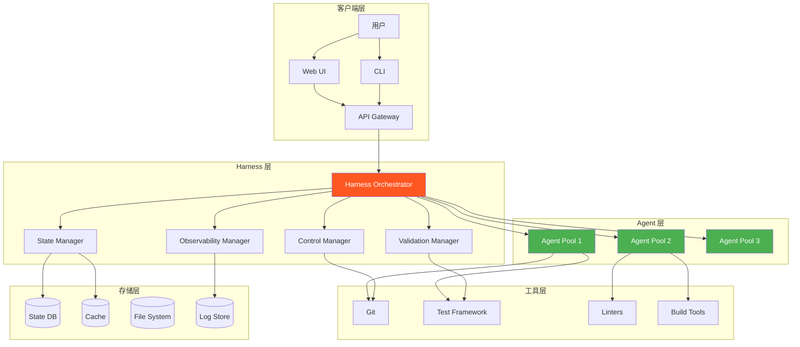

#### 微服务架构

```typescript
// Harness 微服务架构
interface HarnessServices {
  // 任务管理服务
  taskManager: {
    createTask: (task: Task) => Promise<Task>;
    getTask: (id: string) => Promise<Task>;
    updateTaskStatus: (id: string, status: TaskStatus) => Promise<void>;
    listTasks: (filter: TaskFilter) => Promise<Task[]>;
  };
  
  // Agent 管理服务
  agentManager: {
    allocateAgent: (requirements: AgentRequirements) => Promise<Agent>;
    releaseAgent: (agent: Agent) => Promise<void>;
    getAgentStatus: (agent: Agent) => Promise<AgentStatus>;
    scaleAgents: (count: number) => Promise<void>;
  };
  
  // 验证服务
  validationService: {
    runValidation: (artifact: Artifact) => Promise<ValidationResult>;
    getValidationHistory: (taskId: string) => Promise<Validation[]>;
  };
  
  // 状态服务
  stateService: {
    saveState: (state: HarnessState) => Promise<void>;
    loadState: (taskId: string) => Promise<HarnessState>;
    createCheckpoint: (state: HarnessState) => Promise<Checkpoint>;
    restoreCheckpoint: (id: string) => Promise<HarnessState>;
  };
  
  // 可观测性服务
  observabilityService: {
    log: (entry: LogEntry) => Promise<void>;
    trace: (span: Span) => Promise<void>;
    metric: (name: string, value: number) => Promise<void>;
    queryLogs: (query: LogQuery) => Promise<LogEntry[]>;
  };
}
```

### 9.2 安全性设计

安全是生产系统的核心。

#### 安全控制

```typescript
// 安全控制器
class SecurityController {
  private permissions: PermissionMap;
  private auditLog: AuditLogger;
  
  // 命令执行安全
  async executeCommand(
    command: string,
    context: ExecutionContext
  ): Promise<CommandResult> {
    // 1. 检查权限
    const permitted = await this.checkCommandPermission(command);
    if (!permitted) {
      throw new SecurityError(`命令被拒绝: ${command}`);
    }
    
    // 2. 参数验证
    const validated = this.validateCommandArgs(command);
    if (!validated.safe) {
      throw new SecurityError(`不安全的参数: ${validated.reason}`);
    }
    
    // 3. 资源限制
    const limits = this.getResourceLimits(context);
    
    // 4. 沙箱执行
    const result = await this.executeInSandbox(command, limits);
    
    // 5. 审计日志
    await this.auditLog.log({
      action: 'execute-command',
      command,
      result: result.success ? 'success' : 'failure',
      timestamp: Date.now(),
      context
    });
    
    return result;
  }
  
  // 文件访问安全
  async accessFile(
    path: string,
    mode: 'read' | 'write' | 'execute'
  ): Promise<boolean> {
    // 1. 路径规范化
    const normalizedPath = path.normalize(path);
    
    // 2. 路径遍历检查
    if (this.isPathTraversal(normalizedPath)) {
      throw new SecurityError('路径遍历攻击被阻止');
    }
    
    // 3. 权限检查
    const allowed = this.isFileAccessAllowed(normalizedPath, mode);
    if (!allowed) {
      return false;
    }
    
    // 4. 审计
    await this.auditLog.log({
      action: 'access-file',
      path: normalizedPath,
      mode,
      timestamp: Date.now()
    });
    
    return true;
  }
  
  // 网络安全
  async makeRequest(
    url: string,
    options: RequestOptions
  ): Promise<Response> {
    // 1. URL 验证
    const validated = this.validateURL(url);
    if (!validated.safe) {
      throw new SecurityError(`不安全的 URL: ${validated.reason}`);
    }
    
    // 2. 域名白名单检查
    const domain = new URL(url).hostname;
    if (!this.isDomainAllowed(domain)) {
      throw new SecurityError(`域名未在白名单: ${domain}`);
    }
    
    // 3. 请求限制
    const rateLimited = await this.checkRateLimit(domain);
    if (rateLimited.exceeded) {
      throw new SecurityError('请求频率超限');
    }
    
    // 4. 执行请求
    const response = await fetch(url, options);
    
    // 5. 审计
    await this.auditLog.log({
      action: 'http-request',
      url,
      method: options.method || 'GET',
      status: response.status,
      timestamp: Date.now()
    });
    
    return response;
  }
  
  // 敏感数据保护
  sanitizeOutput(output: string): string {
    // 移除潜在的敏感信息
    const patterns = [
      /password=["'][^"']*["']/gi,
      /api[_-]?key=["'][^"']*["']/gi,
      /secret=["'][^"']*["']/gi,
      /token=["'][^"']*["']/gi
    ];
    
    let sanitized = output;
    for (const pattern of patterns) {
      sanitized = sanitized.replace(pattern, '[REDACTED]');
    }
    
    return sanitized;
  }
  
  private isPathTraversal(path: string): boolean {
    // 检测路径遍历攻击
    return path.includes('..') || path.includes('~');
  }
  
  private isFileAccessAllowed(path: string, mode: string): boolean {
    // 检查文件访问权限
    const allowedPaths = this.permissions.allowedPaths;
    return allowedPaths.some(allowed => path.startsWith(allowed));
  }
  
  private isDomainAllowed(domain: string): boolean {
    // 检查域名白名单
    const allowedDomains = this.permissions.allowedDomains;
    return allowedDomains.some(allowed => 
      domain === allowed || domain.endsWith('.' + allowed)
    );
  }
}
```

### 9.3 性能优化

性能影响用户体验和成本。

#### 优化策略

```typescript
// 性能优化器
class PerformanceOptimizer {
  // Token 使用优化
  async optimizeTokenUsage(prompt: string): Promise<string> {
    // 1. 移除冗余信息
    const deduplicated = this.removeDuplicates(prompt);
    
    // 2. 压缩上下文
    const compressed = await this.compressContext(deduplicated);
    
    // 3. 优先级排序
    const prioritized = this.prioritizeContent(compressed);
    
    return prioritized;
  }
  
  // 缓存策略
  private cache: Map<string, CacheEntry>;
  
  async getFromCache<T>(
    key: string,
    factory: () => Promise<T>,
    ttl: number = 3600000 // 1 小时
  ): Promise<T> {
    const entry = this.cache.get(key);
    
    if (entry && Date.now() - entry.timestamp < ttl) {
      return entry.data as T;
    }
    
    // 缓存未命中，执行工厂函数
    const data = await factory();
    
    this.cache.set(key, {
      data,
      timestamp: Date.now()
    });
    
    return data;
  }
  
  // 并发优化
  async executeConcurrent<T>(
    tasks: Array<() => Promise<T>>,
    options: ConcurrencyOptions = {}
  ): Promise<T[]> {
    const {
      maxConcurrency = 5,
      timeout = 30000
    } = options;
    
    const results: T[] = [];
    const executing: Array<Promise<void>> = [];
    
    for (const task of tasks) {
      const promise = task().then(result => {
        results.push(result);
      }).catch(error => {
        console.error('Task failed:', error);
      });
      
      executing.push(promise);
      
      // 控制并发数
      if (executing.length >= maxConcurrency) {
        await Promise.race(executing);
        executing.splice(0, 1);
      }
    }
    
    await Promise.all(executing);
    
    return results;
  }
  
  // 资源清理
  async cleanupResources(): Promise<void> {
    // 清理过期的缓存
    this.cleanupExpiredCache();
    
    // 关闭空闲连接
    await this.closeIdleConnections();
    
    // 释放未使用的 agent
    await this.releaseIdleAgents();
  }
  
  private cleanupExpiredCache(): void {
    const now = Date.now();
    for (const [key, entry] of this.cache.entries()) {
      if (now - entry.timestamp > entry.ttl) {
        this.cache.delete(key);
      }
    }
  }
}

interface CacheEntry {
  data: any;
  timestamp: number;
  ttl: number;
}

interface ConcurrencyOptions {
  maxConcurrency?: number;
  timeout?: number;
}
```

### 9.4 成本管控

成本管理是生产系统的关键。

#### 成本追踪

```typescript
// 成本追踪器
class CostTracker {
  private costs: CostEntry[] = [];
  private budget: Budget;
  
  // 追踪 Token 成本
  async trackTokenUsage(usage: TokenUsage): Promise<void> {
    const cost = this.calculateTokenCost(usage);
    
    const entry: CostEntry = {
      timestamp: Date.now(),
      type: 'token-usage',
      taskId: usage.taskId,
      details: usage,
      cost
    };
    
    this.costs.push(entry);
    
    // 检查预算
    await this.checkBudget(entry);
  }
  
  // 计算 Token 成本
  // 注意：模型定价会频繁变动，请查阅各提供商最新文档
  private calculateTokenCost(usage: TokenUsage): number {
    // 此函数需要根据实际使用的模型和最新定价实现
    // 建议从配置文件或API获取最新价格
    throw new Error('Price lookup not implemented');
  }
  
  // 预算检查
  private async checkBudget(entry: CostEntry): Promise<void> {
    const totalCost = this.getTotalCost();
    
    if (totalCost > this.budget.monthlyLimit) {
      await this.triggerBudgetAlert({
        type: 'exceeded',
        current: totalCost,
        limit: this.budget.monthlyLimit
      });
      
      // 可以自动停止非关键任务
      if (this.budget.autoStopOnExceed) {
        await this.stopNonCriticalTasks();
      }
    } else if (totalCost > this.budget.monthlyLimit * 0.8) {
      await this.triggerBudgetAlert({
        type: 'warning',
        current: totalCost,
        limit: this.budget.monthlyLimit,
        percentage: (totalCost / this.budget.monthlyLimit) * 100
      });
    }
  }
  
  // 生成成本报告
  async generateCostReport(period: 'daily' | 'weekly' | 'monthly'): Promise<CostReport> {
    const periodCosts = this.getCostsForPeriod(period);
    
    return {
      period,
      totalCost: periodCosts.reduce((sum, c) => sum + c.cost, 0),
      breakdown: {
        byModel: this.groupByModel(periodCosts),
        byTask: this.groupByTask(periodCosts),
        byType: this.groupByType(periodCosts)
      },
      trends: this.calculateTrends(periodCosts),
      predictions: this.predictFutureCosts(periodCosts)
    };
  }
  
  // 优化建议
  async generateOptimizationSuggestions(): Promise<OptimizationSuggestion[]> {
    const suggestions: OptimizationSuggestion[] = [];
    
    const report = await this.generateCostReport('monthly');
    
    // 建议 1: 使用更便宜的模型
    if (report.breakdown.byModel['gpt-4'] > report.totalCost * 0.5) {
      suggestions.push({
        type: 'model-switch',
        description: '考虑对简单任务使用 GPT-3.5',
        potentialSavings: report.breakdown.byModel['gpt-4'] * 0.3
      });
    }
    
    // 建议 2: 减少重试
    const retryCost = this.getRetryCost();
    if (retryCost > report.totalCost * 0.2) {
      suggestions.push({
        type: 'reduce-retries',
        description: '重试成本过高，改进验证逻辑',
        potentialSavings: retryCost * 0.5
      });
    }
    
    // 建议 3: 增加缓存
    const cacheMissCost = this.getCacheMissCost();
    if (cacheMissCost > report.totalCost * 0.15) {
      suggestions.push({
        type: 'increase-caching',
        description: '增加缓存命中率',
        potentialSavings: cacheMissCost * 0.6
      });
    }
    
    return suggestions;
  }
}

interface CostEntry {
  timestamp: number;
  type: string;
  taskId: string;
  details: any;
  cost: number;
}

interface TokenUsage {
  model: string;
  taskId: string;
  inputTokens: number;
  outputTokens: number;
}

interface Budget {
  dailyLimit: number;
  monthlyLimit: number;
  autoStopOnExceed: boolean;
  alertThresholds: number[]; // [0.5, 0.8, 1.0]
}
```

---

## 10. 实战项目

### 10.1 Web 应用开发

完整演示使用 Harness 开发 Web 应用。

#### 项目：任务管理应用

```markdown
# 任务管理应用 - Harness 开发实战

## 5. 项目概述

构建一个任务管理 Web 应用，支持：
- 用户认证（登录/注册）
- 任务 CRUD（创建/读取/更新/删除）
- 任务分类和搜索
- 响应式 UI

## 6. 技术栈

- 前端：React 18 + TypeScript + TailwindCSS
- 后端：Node.js + Express + SQLite
- 测试：Vitest + React Testing Library
```

#### 阶段 1: Brainstorming

```typescript
// Agent 通过 brainstorming 技能澄清需求

// 提出的问题：
const questions = [
  '需要用户角色权限吗？',
  '任务是否需要子任务？',
  '是否需要协作功能（多人编辑）？',
  '需要文件附件吗？',
  '优先做 Web 版还是也做移动端？'
];

// 用户回答后，生成设计方案
const designDoc = {
  title: '任务管理应用设计',
  architecture: '前后端分离',
  components: {
    frontend: [
      'LoginPage',
      'RegisterPage',
      'Dashboard',
      'TaskList',
      'TaskDetail',
      'TaskForm',
      'SearchBar'
    ],
    backend: [
      'AuthController',
      'TaskController',
      'UserService',
      'TaskService',
      'Database'
    ]
  },
  dataModel: {
    User: {
      id: 'string',
      email: 'string',
      passwordHash: 'string',
      createdAt: 'Date'
    },
    Task: {
      id: 'string',
      userId: 'string',
      title: 'string',
      description: 'string',
      status: 'todo | in-progress | done',
      priority: 'low | medium | high',
      createdAt: 'Date',
      updatedAt: 'Date'
    }
  }
};

// 展示给用户审批
await presentToUser(designDoc);
const approved = await getUserApproval();
```

#### 阶段 2: Planning

```typescript
// 生成任务计划
const taskPlan: TaskPlan = {
  phases: [
    {
      name: 'Phase 1: 项目设置',
      tasks: [
        {
          id: '1.1',
          description: '初始化前端项目',
          estimatedMinutes: 5,
          verification: 'npm run dev 启动成功'
        },
        {
          id: '1.2',
          description: '初始化后端项目',
          estimatedMinutes: 5,
          verification: 'npm start 启动成功'
        }
      ]
    },
    {
      name: 'Phase 2: 用户认证',
      tasks: [
        {
          id: '2.1',
          description: '创建 User 类型定义',
          estimatedMinutes: 3,
          verification: 'TypeScript 编译通过'
        },
        {
          id: '2.2',
          description: '实现用户注册 API',
          estimatedMinutes: 10,
          verification: 'POST /api/register 测试通过'
        },
        {
          id: '2.3',
          description: '实现用户登录 API',
          estimatedMinutes: 10,
          verification: 'POST /api/login 测试通过'
        },
        {
          id: '2.4',
          description: '实现前端登录页面',
          estimatedMinutes: 15,
          verification: '可以登录并提交表单'
        }
      ]
    },
    // ... 更多阶段
  ],
  totalEstimatedMinutes: 120
};

// 展示计划
await presentToUser(taskPlan);
const approved = await getUserApproval();
```

#### 阶段 3: 执行（TDD）

```typescript
// 示例：实现用户注册 API（TDD）

// 步骤 1: RED - 编写测试
// tests/auth.test.ts
import { describe, it, expect, beforeEach } from 'vitest';
import request from 'supertest';
import app from '../src/app';
import { db } from '../src/database';

describe('Auth API', () => {
  beforeEach(async () => {
    // 清空测试数据
    await db.user.deleteMany();
  });

  describe('POST /api/register', () => {
    it('应该成功注册用户', async () => {
      const response = await request(app)
        .post('/api/register')
        .send({
          email: 'test@example.com',
          password: 'password123'
        });

      expect(response.status).toBe(201);
      expect(response.body).toHaveProperty('user');
      expect(response.body.user.email).toBe('test@example.com');
      expect(response.body.user).not.toHaveProperty('passwordHash');
    });

    it('应该拒绝重复邮箱', async () => {
      // 先注册一个用户
      await request(app)
        .post('/api/register')
        .send({
          email: 'duplicate@example.com',
          password: 'password123'
        });

      // 尝试再次注册
      const response = await request(app)
        .post('/api/register')
        .send({
          email: 'duplicate@example.com',
          password: 'password456'
        });

      expect(response.status).toBe(409);
      expect(response.body.error).toBe('Email already exists');
    });

    it('应该拒绝无效邮箱', async () => {
      const response = await request(app)
        .post('/api/register')
        .send({
          email: 'invalid-email',
          password: 'password123'
        });

      expect(response.status).toBe(400);
      expect(response.body.error).toContain('Invalid email');
    });

    it('应该拒绝弱密码', async () => {
      const response = await request(app)
        .post('/api/register')
        .send({
          email: 'test@example.com',
          password: '123'
        });

      expect(response.status).toBe(400);
      expect(response.body.error).toContain('Password too weak');
    });
  });
});

// 运行测试（应该失败）
// $ npm test
// ✓ 4 tests failed（符合预期）

// 步骤 2: GREEN - 编写最小实现
// src/controllers/auth.controller.ts
import { Router } from 'express';
import { z } from 'zod';
import bcrypt from 'bcryptjs';
import jwt from 'jsonwebtoken';
import { db } from '../database';

const router = Router();

const registerSchema = z.object({
  email: z.string().email('Invalid email'),
  password: z.string()
    .min(8, 'Password too weak')
    .regex(/[A-Z]/, 'Password must contain uppercase')
    .regex(/[0-9]/, 'Password must contain number')
});

router.post('/register', async (req, res) => {
  try {
    // 验证输入
    const validated = registerSchema.parse(req.body);
    
    // 检查邮箱是否已存在
    const existing = await db.user.findByEmail(validated.email);
    if (existing) {
      return res.status(409).json({ 
        error: 'Email already exists' 
      });
    }
    
    // 加密密码
    const passwordHash = await bcrypt.hash(validated.password, 10);
    
    // 创建用户
    const user = await db.user.create({
      email: validated.email,
      passwordHash,
      createdAt: new Date()
    });
    
    // 返回用户（不包含密码）
    res.status(201).json({
      user: {
        id: user.id,
        email: user.email,
        createdAt: user.createdAt
      }
    });
  } catch (error) {
    if (error instanceof z.ZodError) {
      return res.status(400).json({
        error: error.errors[0].message
      });
    }
    throw error;
  }
});

export default router;

// 运行测试（应该通过）
// $ npm test
// ✓ 4 tests passed

// 步骤 3: REFACTOR - 优化代码
// 提取验证逻辑、错误处理等

// 步骤 4: COMMIT
// $ git add .
// $ git commit -m "feat: 实现用户注册 API
// 
// - 添加 POST /api/register 端点
// - 输入验证（邮箱、密码强度）
// - 密码加密（bcrypt）
// - 重复邮箱检查
// - 完整的测试覆盖"
```

### 10.2 API 服务

开发 RESTful API 服务。

#### 项目：博客 API

```typescript
// 完整的博客 API 实现

// 数据模型
interface Post {
  id: string;
  title: string;
  content: string;
  authorId: string;
  tags: string[];
  status: 'draft' | 'published';
  createdAt: Date;
  updatedAt: Date;
  publishedAt?: Date;
}

// API 路由设计
const routes = {
  // 文章
  'GET    /api/posts': '获取文章列表',
  'GET    /api/posts/:id': '获取文章详情',
  'POST   /api/posts': '创建文章',
  'PUT    /api/posts/:id': '更新文章',
  'DELETE /api/posts/:id': '删除文章',
  
  // 评论
  'GET    /api/posts/:id/comments': '获取评论列表',
  'POST   /api/posts/:id/comments': '创建评论',
  
  // 标签
  'GET    /api/tags': '获取所有标签',
  'GET    /api/tags/:name/posts': '获取标签下的文章'
};

// 实现示例：文章控制器
class PostController {
  // 获取文章列表（支持分页、过滤、搜索）
  async listPosts(req: Request, res: Response): Promise<void> {
    const {
      page = 1,
      limit = 20,
      status,
      tag,
      search
    } = req.query;
    
    const posts = await this.postService.findPosts({
      page: parseInt(page as string),
      limit: parseInt(limit as string),
      status: status as Post['status'],
      tag: tag as string,
      search: search as string
    });
    
    res.json(posts);
  }
  
  // 创建文章
  async createPost(req: Request, res: Response): Promise<void> {
    // 验证输入
    const validated = createPostSchema.parse(req.body);
    
    // 创建文章
    const post = await this.postService.createPost({
      ...validated,
      authorId: req.user.id,
      status: 'draft'
    });
    
    res.status(201).json(post);
  }
}
```

### 10.3 CLI 工具

开发命令行工具。

#### 项目：文件组织工具

```typescript
#!/usr/bin/env node
// organize.ts - 智能文件组织工具

import { Command } from 'commander';
import { promises as fs } from 'fs';
import path from 'path';

const program = new Command();

program
  .name('organize')
  .description('智能组织目录中的文件')
  .version('1.0.0');

program
  .argument('<directory>', '要组织的目录')
  .option('-d, --dry-run', '预览模式，不实际移动文件')
  .option('-v, --verbose', '详细输出')
  .action(async (directory, options) => {
    const organizer = new FileOrganizer(directory, options);
    await organizer.organize();
  });

program.parse();

class FileOrganizer {
  private directory: string;
  private dryRun: boolean;
  private verbose: boolean;
  
  constructor(directory: string, options: any) {
    this.directory = directory;
    this.dryRun = options.dryRun;
    this.verbose = options.verbose;
  }
  
  async organize(): Promise<void> {
    console.log(`📁 扫描目录: ${this.directory}`);
    
    // 获取所有文件
    const files = await this.getFiles(this.directory);
    
    console.log(`发现 ${files.length} 个文件`);
    
    // 分类文件
    const categorized = this.categorizeFiles(files);
    
    // 创建目录结构
    await this.createDirectories(categorized);
    
    // 移动文件
    await this.moveFiles(categorized);
    
    console.log('✅ 组织完成！');
  }
  
  private categorizeFiles(files: string[]): Map<string, string[]> {
    const categories = new Map<string, string[]>();
    
    for (const file of files) {
      const ext = path.extname(file).toLowerCase();
      const category = this.getCategory(ext);
      
      if (!categories.has(category)) {
        categories.set(category, []);
      }
      categories.get(category)!.push(file);
    }
    
    return categories;
  }
  
  private getCategory(extension: string): string {
    const categoryMap: Record<string, string> = {
      '.jpg': 'images',
      '.jpeg': 'images',
      '.png': 'images',
      '.gif': 'images',
      