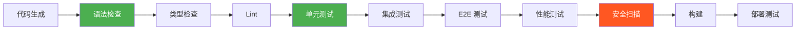
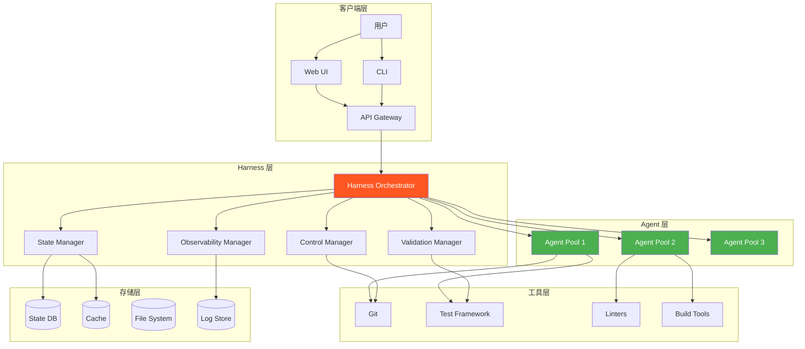

# Harness 高级与生产实战

> 📅 **更新时间**: 2026-06-17  

---

## 目录

- [1. 验证与测试策略](#1-验证与测试策略)
- [2. 可观测性与调试](#2-可观测性与调试)
- [3. 生产级 Harness 设计](#3-生产级-harness-设计)
- [4. 实战项目](#4-实战项目)
- [5. 项目概述](#5-项目概述)
- [6. 技术栈](#6-技术栈)

---

## 1. 验证与测试策略

### 1.1 TDD for Harness

TDD 不仅是开发实践，也是 Harness 的核心机制。

#### TDD 强制实现

```typescript
// TDD 强制器
class TDDEnforcer {
  async enforceTDDCycle(task: Task): Promise<void> {
    // 阶段 1: RED - 编写失败的测试
    await this.phaseRed(task);
    
    // 阶段 2: GREEN - 编写最小代码
    await this.phaseGreen(task);
    
    // 阶段 3: REFACTOR - 优化代码
    await this.phaseRefactor(task);
    
    // 阶段 4: COMMIT - 提交
    await this.commit(task);
  }
  
  private async phaseRed(task: Task): Promise<void> {
    console.log('🔴 RED 阶段: 编写失败的测试');
    
    // 1. 检查测试文件是否存在
    const testFile = this.getTestFilePath(task);
    if (!await this.fileExists(testFile)) {
      throw new Error(
        '❌ TDD 违规: 测试文件不存在\n' +
        `请创建: ${testFile}`
      );
    }
    
    // 2. 验证测试确实失败
    const testResult = await this.runTests(testFile);
    if (testResult.passed) {
      throw new Error(
        '❌ TDD 违规: 测试从未失败\n' +
        '请确保:\n' +
        '1. 先写测试\n' +
        '2. 运行测试看到失败\n' +
        '3. 再写实现代码'
      );
    }
    
    console.log('✓ 测试失败（符合预期）');
  }
  
  private async phaseGreen(task: Task): Promise<void> {
    console.log('🟢 GREEN 阶段: 编写最小代码');
    
    // 1. 编写最小实现
    // Agent 应该写尽可能少的代码让测试通过
    
    // 2. 验证测试通过
    const testResult = await this.runTests();
    if (!testResult.passed) {
      const failedTests = testResult.failedTests;
      throw new Error(
        `❌ 测试未通过: ${failedTests.length} 个失败\n` +
        '请修复失败的测试'
      );
    }
    
    console.log('✓ 所有测试通过');
  }
  
  private async phaseRefactor(task: Task): Promise<void> {
    console.log('🔵 REFACTOR 阶段: 优化代码');
    
    // 1. 重构代码
    // Agent 应该在不破坏测试的前提下优化代码
    
    // 2. 验证测试仍然通过
    const testResult = await this.runTests();
    if (!testResult.passed) {
      throw new Error(
        '❌ 重构破坏了测试\n' +
        '请修复测试或回滚重构'
      );
    }
    
    // 3. 检查代码质量
    const qualityCheck = await this.checkCodeQuality();
    if (!qualityCheck.passed) {
      console.warn('⚠️ 代码质量问题:', qualityCheck.issues);
    }
    
    console.log('✓ 重构完成，测试通过');
  }
  
  private async commit(task: Task): Promise<void> {
    console.log('💾 COMMIT 阶段: 提交代码');
    
    // 1. 准备提交信息
    const commitMessage = this.generateCommitMessage(task);
    
    // 2. 添加文件
    await this.git('add', '.');
    
    // 3. 提交
    await this.git('commit', '-m', commitMessage);
    
    console.log('✓ 提交成功');
  }
  
  private generateCommitMessage(task: Task): string {
    return `feat: ${task.description}

- 遵循 TDD RED-GREEN-REFACTOR 流程
- 测试覆盖率: ${this.getCurrentCoverage()}%`;
  }
}
```

#### TDD 反模式检测

```typescript
// TDD 反模式检测器
class TDDAntiPatternDetector {
  async detectAntiPatterns(history: ExecutionHistory): Promise<AntiPattern[]> {
    const antiPatterns: AntiPattern[] = [];
    
    // 反模式 1: 先写代码后补测试
    if (this.testAfterCode(history)) {
      antiPatterns.push({
        type: 'test-after-code',
        severity: 'critical',
        description: '先写了代码，然后才补测试',
        evidence: this.getEvidence(history)
      });
    }
    
    // 反模式 2: 测试从未失败
    if (this.testsNeverFailed(history)) {
      antiPatterns.push({
        type: 'tests-never-failed',
        severity: 'critical',
        description: '测试从未失败过，可能不是真正的 TDD',
        evidence: this.getEvidence(history)
      });
    }
    
    // 反模式 3: 测试覆盖率不足
    if (this.lowCoverage(history)) {
      antiPatterns.push({
        type: 'low-coverage',
        severity: 'warning',
        description: '测试覆盖率低于 80%',
        evidence: this.getEvidence(history)
      });
    }
    
    // 反模式 4: 测试只覆盖 happy path
    if (this.onlyHappyPath(history)) {
      antiPatterns.push({
        type: 'only-happy-path',
        severity: 'warning',
        description: '测试只覆盖了正常路径，缺少边界和错误情况',
        evidence: this.getEvidence(history)
      });
    }
    
    return antiPatterns;
  }
  
  private testAfterCode(history: ExecutionHistory): boolean {
    // 检查文件修改时间戳
    for (const entry of history.entries) {
      if (entry.type === 'file-modify') {
        const testFile = this.getCorrespondingTestFile(entry.file);
        const testModified = history.entries.find(
          e => e.type === 'file-modify' && e.file === testFile
        );
        
        if (!testModified || testModified.timestamp > entry.timestamp) {
          return true;
        }
      }
    }
    
    return false;
  }
  
  private testsNeverFailed(history: ExecutionHistory): boolean {
    // 检查测试历史
    const testRuns = history.entries.filter(e => e.type === 'test-run');
    
    if (testRuns.length === 0) return true;
    
    // 如果所有测试运行都通过了
    const allPassed = testRuns.every(run => run.result === 'pass');
    
    return allPassed;
  }
}
```

### 1.2 全管道验证

完整的验证管道确保代码质量。

#### 验证管道



#### 管道实现

```typescript
// 验证管道
class ValidationPipeline {
  private stages: ValidationStage[];
  
  constructor() {
    this.stages = [
      { name: 'syntax', run: this.checkSyntax, required: true },
      { name: 'types', run: this.checkTypes, required: true },
      { name: 'lint', run: this.runLint, required: true },
      { name: 'unit-tests', run: this.runUnitTests, required: true },
      { name: 'integration-tests', run: this.runIntegrationTests, required: false },
      { name: 'e2e-tests', run: this.runE2ETests, required: false },
      { name: 'performance', run: this.checkPerformance, required: false },
      { name: 'security', run: this.securityScan, required: true },
      { name: 'build', run: this.runBuild, required: true }
    ];
  }
  
  async execute(code: CodeArtifact): Promise<ValidationResult> {
    const results: StageResult[] = [];
    
    for (const stage of this.stages) {
      console.log(`\n▶️  执行: ${stage.name}`);
      
      const startTime = Date.now();
      const result = await stage.run(code);
      const duration = Date.now() - startTime;
      
      const stageResult: StageResult = {
        name: stage.name,
        passed: result.passed,
        duration,
        issues: result.issues,
        required: stage.required
      };
      
      results.push(stageResult);
      
      if (!result.passed && stage.required) {
        console.error(`❌ ${stage.name} 失败（必须）`);
        return {
          passed: false,
          results,
          failedStage: stage.name,
          blockingIssues: result.issues
        };
      }
      
      console.log(`${result.passed ? '✓' : '⚠️'} ${stage.name} (${duration}ms)`);
    }
    
    return {
      passed: true,
      results,
      summary: this.generateSummary(results)
    };
  }
  
  private async checkSyntax(code: CodeArtifact): Promise<StageOutput> {
    // TypeScript 语法检查
    const result = await tsc.checkSyntax(code.files);
    
    return {
      passed: result.errors.length === 0,
      issues: result.errors.map(e => ({
        type: 'syntax',
        severity: 'error',
        message: e.message,
        file: e.file,
        line: e.line
      }))
    };
  }
  
  private async checkTypes(code: CodeArtifact): Promise<StageOutput> {
    // TypeScript 类型检查
    const result = await tsc.typeCheck(code.project);
    
    return {
      passed: result.errors.length === 0,
      issues: result.errors.map(e => ({
        type: 'type',
        severity: 'error',
        message: e.message,
        file: e.file
      }))
    };
  }
  
  private async runLint(code: CodeArtifact): Promise<StageOutput> {
    // ESLint
    const result = await eslint.lint(code.files);
    
    return {
      passed: result.errors.length === 0,
      issues: [
        ...result.errors.map(e => ({
          type: 'lint',
          severity: 'error',
          message: e.message,
          file: e.file
        })),
        ...result.warnings.map(w => ({
          type: 'lint',
          severity: 'warning',
          message: w.message,
          file: w.file
        }))
      ]
    };
  }
  
  private async securityScan(code: CodeArtifact): Promise<StageOutput> {
    // 安全扫描
    const issues: SecurityIssue[] = [];
    
    // 检查 1: 硬编码密钥
    const hardcodedSecrets = await this.detectHardcodedSecrets(code);
    if (hardcodedSecrets.length > 0) {
      issues.push(...hardcodedSecrets.map(s => ({
        type: 'security',
        severity: 'critical',
        message: `硬编码密钥: ${s.name}`,
        file: s.file
      })));
    }
    
    // 检查 2: SQL 注入风险
    const sqlInjectionRisks = await this.detectSQLInjection(code);
    if (sqlInjectionRisks.length > 0) {
      issues.push(...sqlInjectionRisks.map(s => ({
        type: 'security',
        severity: 'critical',
        message: '潜在 SQL 注入',
        file: s.file
      })));
    }
    
    // 检查 3: XSS 风险
    const xssRisks = await this.detectXSS(code);
    if (xssRisks.length > 0) {
      issues.push(...xssRisks.map(s => ({
        type: 'security',
        severity: 'high',
        message: '潜在 XSS',
        file: s.file
      })));
    }
    
    return {
      passed: issues.filter(i => i.severity === 'critical').length === 0,
      issues
    };
  }
}
```

### 1.3 自我验证机制

Agent 应该能够自我验证工作质量。

#### 自我验证实现

```typescript
// 自我验证器
class SelfValidator {
  async validate(work: WorkProduct): Promise<ValidationReport> {
    const report: ValidationReport = {
      score: 0,
      issues: [],
      recommendations: []
    };
    
    // 验证 1: 需求符合性
    const specCompliance = await this.checkSpecCompliance(work);
    report.score += specCompliance.score;
    report.issues.push(...specCompliance.issues);
    
    // 验证 2: 代码质量
    const codeQuality = await this.checkCodeQuality(work);
    report.score += codeQuality.score;
    report.issues.push(...codeQuality.issues);
    
    // 验证 3: 测试覆盖
    const testCoverage = await this.checkTestCoverage(work);
    report.score += testCoverage.score;
    report.issues.push(...testCoverage.issues);
    
    // 验证 4: 最佳实践
    const bestPractices = await this.checkBestPractices(work);
    report.score += bestPractices.score;
    report.recommendations.push(...bestPractices.recommendations);
    
    // 计算总分
    report.score = report.score / 4; // 平均分
    report.passed = report.score >= 0.8; // 80 分通过
    
    return report;
  }
  
  private async checkSpecCompliance(work: WorkProduct): Promise<PartialValidation> {
    const specification = work.task.specification;
    const issues: Issue[] = [];
    let score = 100;
    
    // 检查每个需求
    for (const requirement of specification.requirements) {
      const met = await this.isRequirementMet(requirement, work);
      
      if (!met) {
        issues.push({
          type: 'spec-compliance',
          severity: 'critical',
          message: `需求未满足: ${requirement.description}`
        });
        score -= 20;
      }
    }
    
    // 检查是否添加了多余功能
    if (this.hasExtraFeatures(work, specification)) {
      issues.push({
        type: 'yagni',
        severity: 'warning',
        message: '实现了需求之外的功能（违反 YAGNI）'
      });
      score -= 10;
    }
    
    return { score: Math.max(0, score), issues };
  }
  
  private async checkCodeQuality(work: WorkProduct): Promise<PartialValidation> {
    let score = 100;
    const issues: Issue[] = [];
    
    // 检查 1: 代码重复
    const duplicates = await this.findDuplicates(work);
    if (duplicates.length > 0) {
      score -= duplicates.length * 5;
      issues.push({
        type: 'duplication',
        severity: 'warning',
        message: `发现 ${duplicates.length} 处代码重复`
      });
    }
    
    // 检查 2: 圈复杂度
    const complexity = await this.calculateComplexity(work);
    if (complexity.average > 10) {
      score -= 15;
      issues.push({
        type: 'complexity',
        severity: 'warning',
        message: `平均圈复杂度过高: ${complexity.average}`
      });
    }
    
    // 检查 3: 函数长度
    const longFunctions = await this.findLongFunctions(work);
    if (longFunctions.length > 0) {
      score -= longFunctions.length * 5;
      issues.push({
        type: 'function-length',
        severity: 'warning',
        message: `${longFunctions.length} 个函数过长（> 50 行）`
      });
    }
    
    // 检查 4: 命名规范
    const namingViolations = await this.checkNaming(work);
    if (namingViolations.length > 0) {
      score -= namingViolations.length * 2;
      issues.push({
        type: 'naming',
        severity: 'info',
        message: `${namingViolations.length} 处命名不规范`
      });
    }
    
    return { score: Math.max(0, score), issues };
  }
  
  private async checkTestCoverage(work: WorkProduct): Promise<PartialValidation> {
    const coverage = await this.getCoverage(work);
    const issues: Issue[] = [];
    let score = 0;
    
    // 行覆盖率
    if (coverage.lines >= 80) {
      score += 40;
    } else if (coverage.lines >= 60) {
      score += 20;
      issues.push({
        type: 'coverage',
        severity: 'warning',
        message: `行覆盖率不足: ${coverage.lines}%`
      });
    } else {
      issues.push({
        type: 'coverage',
        severity: 'critical',
        message: `行覆盖率严重不足: ${coverage.lines}%`
      });
    }
    
    // 分支覆盖率
    if (coverage.branches >= 70) {
      score += 30;
    } else {
      score += 15;
      issues.push({
        type: 'coverage',
        severity: 'warning',
        message: `分支覆盖率不足: ${coverage.branches}%`
      });
    }
    
    // 函数覆盖率
    if (coverage.functions >= 80) {
      score += 30;
    } else {
      score += 15;
      issues.push({
        type: 'coverage',
        severity: 'warning',
        message: `函数覆盖率不足: ${coverage.functions}%`
      });
    }
    
    return { score, issues };
  }
}
```

### 1.4 集成测试

集成测试验证模块间的协作。

#### 集成测试框架

```typescript
// 集成测试助手
class IntegrationTestHelper {
  async testAPIIntegration(testCase: APITestCase): Promise<TestResult> {
    // 1. 设置测试环境
    await this.setupTestEnvironment();
    
    // 2. 准备测试数据
    const testData = await this.prepareTestData(testCase);
    
    // 3. 执行 API 调用
    const response = await this.callAPI(testCase.endpoint, testData);
    
    // 4. 验证响应
    const validationResult = this.validateResponse(
      response,
      testCase.expectedResponse
    );
    
    // 5. 验证副作用
    const sideEffectsValid = await this.validateSideEffects(
      testCase.expectedSideEffects
    );
    
    // 6. 清理
    await this.cleanup();
    
    return {
      passed: validationResult.passed && sideEffectsValid,
      details: {
        response: validationResult,
        sideEffects: sideEffectsValid
      }
    };
  }
  
  async testDatabaseIntegration(
    testCase: DatabaseTestCase
  ): Promise<TestResult> {
    // 1. 开始事务
    const transaction = await this.beginTransaction();
    
    try {
      // 2. 执行数据库操作
      const result = await testCase.operation(this.db);
      
      // 3. 验证结果
      const validated = await this.verifyResult(result, testCase.expected);
      
      // 4. 回滚（不污染数据库）
      await transaction.rollback();
      
      return {
        passed: validated,
        details: result
      };
    } catch (error) {
      await transaction.rollback();
      throw error;
    }
  }
}
```

---

## 2. 可观测性与调试

### 2.1 日志与追踪

完善的日志是可观测性的基础。

#### 结构化日志

```typescript
// 结构化日志系统
class StructuredLogger {
  private logStream: WriteStream;
  private correlationId: string;
  
  log(level: LogLevel, message: string, context: LogContext): void {
    const entry: LogEntry = {
      timestamp: new Date().toISOString(),
      level,
      message,
      correlationId: this.correlationId,
      context: {
        taskId: context.taskId,
        phase: context.phase,
        agent: context.agent,
        ...context.extra
      },
      metrics: context.metrics
    };
    
    // 写入日志
    this.logStream.write(JSON.stringify(entry) + '\n');
    
    // 同时输出到控制台
    if (this.shouldLogToConsole(level)) {
      this.logToConsole(entry);
    }
    
    // 发送到遥测系统
    this.sendToTelemetry(entry);
  }
  
  // 日志级别
  trace(message: string, context: LogContext): void {
    this.log('trace', message, context);
  }
  
  debug(message: string, context: LogContext): void {
    this.log('debug', message, context);
  }
  
  info(message: string, context: LogContext): void {
    this.log('info', message, context);
  }
  
  warn(message: string, context: LogContext): void {
    this.log('warn', message, context);
  }
  
  error(message: string, context: LogContext, error?: Error): void {
    this.log('error', message, {
      ...context,
      extra: {
        ...context.extra,
        error: error?.message,
        stack: error?.stack
      }
    });
  }
}

// 日志条目类型
interface LogEntry {
  timestamp: string;
  level: 'trace' | 'debug' | 'info' | 'warn' | 'error';
  message: string;
  correlationId: string;
  context: {
    taskId?: string;
    phase?: string;
    agent?: string;
    [key: string]: any;
  };
  metrics?: {
    duration?: number;
    tokenUsage?: number;
    retryCount?: number;
  };
}
```

#### 分布式追踪

```typescript
// 追踪系统
class TracingSystem {
  private traces: Map<string, Trace> = new Map();
  
  startTrace(operation: string): TraceContext {
    const traceId = generateId();
    const spanId = generateId();
    
    const trace: Trace = {
      traceId,
      operation,
      startTime: Date.now(),
      spans: [],
      metadata: {}
    };
    
    this.traces.set(traceId, trace);
    
    return { traceId, spanId, parentSpanId: null };
  }
  
  addSpan(
    context: TraceContext,
    operation: string,
    attributes: Record<string, any> = {}
  ): string {
    const spanId = generateId();
    
    const span: Span = {
      spanId,
      parentSpanId: context.spanId,
      operation,
      startTime: Date.now(),
      attributes
    };
    
    const trace = this.traces.get(context.traceId);
    if (trace) {
      trace.spans.push(span);
    }
    
    return spanId;
  }
  
  endSpan(context: TraceContext, status: SpanStatus): void {
    const trace = this.traces.get(context.traceId);
    if (trace) {
      const span = trace.spans.find(s => s.spanId === context.spanId);
      if (span) {
        span.endTime = Date.now();
        span.duration = span.endTime - span.startTime;
        span.status = status;
      }
    }
  }
  
  endTrace(context: TraceContext, result: TraceResult): void {
    const trace = this.traces.get(context.traceId);
    if (trace) {
      trace.endTime = Date.now();
      trace.duration = trace.endTime - trace.startTime;
      trace.result = result;
      
      // 保存追踪数据
      this.saveTrace(trace);
    }
  }
  
  async getTraceSummary(traceId: string): Promise<TraceSummary> {
    const trace = this.traces.get(traceId);
    if (!trace) {
      throw new Error(`Trace not found: ${traceId}`);
    }
    
    return {
      traceId: trace.traceId,
      operation: trace.operation,
      duration: trace.duration,
      spanCount: trace.spans.length,
      status: trace.result?.status,
      spans: trace.spans.map(s => ({
        operation: s.operation,
        duration: s.duration,
        status: s.status
      }))
    };
  }
}

interface Trace {
  traceId: string;
  operation: string;
  startTime: number;
  endTime?: number;
  duration?: number;
  spans: Span[];
  result?: TraceResult;
  metadata: Record<string, any>;
}

interface Span {
  spanId: string;
  parentSpanId: string | null;
  operation: string;
  startTime: number;
  endTime?: number;
  duration?: number;
  status?: SpanStatus;
  attributes: Record<string, any>;
}
```

### 2.2 状态检查点

检查点是调试和恢复的关键。

#### 检查点实现

```typescript
// 检查点系统
class CheckpointSystem {
  private checkpointDir: string;
  
  async createCheckpoint(
    state: HarnessState,
    metadata: CheckpointMetadata
  ): Promise<Checkpoint> {
    const checkpoint: Checkpoint = {
      id: generateId(),
      timestamp: Date.now(),
      state: this.serializeState(state),
      metadata: {
        ...metadata,
        gitHash: await this.getCurrentGitHash(),
        diskUsage: await this.getDiskUsage(),
        memoryUsage: process.memoryUsage()
      },
      diff: await this.getChangesSinceLastCheckpoint()
    };
    
    // 保存到磁盘
    const filepath = `${this.checkpointDir}/${checkpoint.id}.json`;
    await fs.writeJson(filepath, checkpoint, { spaces: 2 });
    
    console.log(`[Checkpoint] 已创建: ${checkpoint.id}`);
    
    return checkpoint;
  }
  
  async listCheckpoints(): Promise<CheckpointSummary[]> {
    const files = await fs.readdir(this.checkpointDir);
    
    const checkpoints = await Promise.all(
      files
        .filter(f => f.endsWith('.json'))
        .map(async f => {
          const checkpoint = await fs.readJson(`${this.checkpointDir}/${f}`);
          return {
            id: checkpoint.id,
            timestamp: checkpoint.timestamp,
            phase: checkpoint.metadata.phase,
            summary: checkpoint.metadata.summary
          };
        })
    );
    
    return checkpoints.sort((a, b) => b.timestamp - a.timestamp);
  }
  
  async restoreCheckpoint(checkpointId: string): Promise<HarnessState> {
    const filepath = `${this.checkpointDir}/${checkpointId}.json`;
    const checkpoint = await fs.readJson(filepath);
    
    // 恢复 Git 状态
    await exec(`git checkout ${checkpoint.metadata.gitHash}`);
    
    // 恢复 Harness 状态
    const state = this.deserializeState(checkpoint.state);
    
    console.log(`[Checkpoint] 已恢复: ${checkpointId}`);
    
    return state;
  }
  
  async compareCheckpoints(
    checkpointId1: string,
    checkpointId2: string
  ): Promise<CheckpointDiff> {
    const cp1 = await fs.readJson(
      `${this.checkpointDir}/${checkpointId1}.json`
    );
    const cp2 = await fs.readJson(
      `${this.checkpointDir}/${checkpointId2}.json`
    );
    
    return {
      from: checkpointId1,
      to: checkpointId2,
      stateChanges: this.diffStates(cp1.state, cp2.state),
      fileChanges: cp2.diff
    };
  }
  
  private async getChangesSinceLastCheckpoint(): Promise<FileChange[]> {
    const { stdout } = await exec('git diff --name-status');
    
    return stdout.split('\n').filter(Boolean).map(line => {
      const [status, file] = line.split('\t');
      return { status, file };
    });
  }
}

interface Checkpoint {
  id: string;
  timestamp: number;
  state: SerializedState;
  metadata: CheckpointMetadata;
  diff: FileChange[];
}

interface CheckpointMetadata {
  phase: string;
  summary: string;
  gitHash: string;
  taskId?: string;
  diskUsage: number;
  memoryUsage: NodeJS.MemoryUsage;
}
```

### 2.3 常见故障模式

了解常见故障模式有助于快速诊断。

#### 故障模式库

```typescript
// 故障模式检测器
class FailurePatternDetector {
  private patterns: FailurePattern[] = [
    {
      id: 'context-loss',
      name: '上下文丢失',
      symptoms: [
        'Agent 重复之前的操作',
        '忘记之前的决策',
        '询问已经回答的问题'
      ],
      detection: (logs: LogEntry[]) => {
        const repeatedActions = this.detectRepeatedActions(logs);
        return repeatedActions > 3;
      },
      solution: '增加检查点频率，改进上下文管理'
    },
    {
      id: 'goal-drift',
      name: '目标漂移',
      symptoms: [
        '实现需求之外的功能',
        '偏离原始计划',
        '添加不必要的复杂性'
      ],
      detection: (logs: LogEntry[]) => {
        const specDeviations = this.detectSpecDeviations(logs);
        return specDeviations > 2;
      },
      solution: '强化 YAGNI 检查，定期回顾目标'
    },
    {
      id: 'infinite-loop',
      name: '无限循环',
      symptoms: [
        '重复相同的错误',
        '不断重试相同操作',
        '进度停滞'
      ],
      detection: (logs: LogEntry[]) => {
        const loopDetected = this.detectRepetitionLoop(logs);
        return loopDetected;
      },
      solution: '添加执行限制，实施循环检测'
    },
    {
      id: 'hallucination',
      name: '幻觉代码',
      symptoms: [
        '使用不存在的 API',
        '引用不存在的文件',
        '生成无效代码'
      ],
      detection: async (code: CodeArtifact) => {
        const invalidRefs = await this.validateReferences(code);
        return invalidRefs.length > 0;
      },
      solution: '增强验证，使用类型检查'
    },
    {
      id: 'test-gaming',
      name: '测试作弊',
      symptoms: [
        '测试通过但功能不完整',
        '测试过于简单',
        '缺少边界情况测试'
      ],
      detection: (testResults: TestResult[]) => {
        const suspiciousPatterns = this.detectSuspiciousPatterns(testResults);
        return suspiciousPatterns;
      },
      solution: '强制测试审查，增加变异测试'
    }
  ];
  
  async diagnose(issue: Issue): Promise<Diagnosis> {
    for (const pattern of this.patterns) {
      const matches = await pattern.detection(issue.evidence);
      
      if (matches) {
        return {
          pattern: pattern,
          confidence: this.calculateConfidence(pattern, issue),
          recommendedActions: [
            pattern.solution,
            ...this.generateActions(pattern, issue)
          ]
        };
      }
    }
    
    return {
      pattern: null,
      confidence: 0,
      recommendedActions: ['手动检查日志和状态']
    };
  }
  
  private detectRepeatedActions(logs: LogEntry[]): number {
    const actionCounts = new Map<string, number>();
    
    for (const log of logs) {
      const action = log.context.action;
      if (action) {
        actionCounts.set(action, (actionCounts.get(action) || 0) + 1);
      }
    }
    
    let maxCount = 0;
    for (const count of actionCounts.values()) {
      maxCount = Math.max(maxCount, count);
    }
    
    return maxCount;
  }
  
  private detectRepetitionLoop(logs: LogEntry[]): boolean {
    // 检测重复的错误模式
    const recentLogs = logs.slice(-20);
    const errorPattern = recentLogs
      .filter(l => l.level === 'error')
      .map(l => l.message)
      .join('|');
    
    // 使用简单的字符串匹配检测重复
    const patternLength = errorPattern.length;
    if (patternLength < 10) return false;
    
    for (let len = 10; len < patternLength / 2; len++) {
      const pattern = errorPattern.substring(0, len);
      const occurrences = (errorPattern.match(new RegExp(pattern, 'g')) || [])
        .length;
      
      if (occurrences >= 3) {
        return true;
      }
    }
    
    return false;
  }
}

interface FailurePattern {
  id: string;
  name: string;
  symptoms: string[];
  detection: (evidence: any) => boolean | Promise<boolean>;
  solution: string;
}

interface Diagnosis {
  pattern: FailurePattern | null;
  confidence: number;
  recommendedActions: string[];
}
```

### 2.4 调试工具链

强大的调试工具能快速定位问题。

#### 调试助手

```typescript
// 调试助手
class DebugHelper {
  // 检查 Harness 状态
  async inspectState(taskId: string): Promise<StateReport> {
    const state = await this.loadState(taskId);
    
    return {
      taskId,
      phase: state.phase,
      completedTasks: state.completedTasks.length,
      pendingTasks: state.pendingTasks.length,
      failedTasks: state.failedTasks.length,
      decisions: state.decisions.slice(-10), // 最近 10 个决策
      metrics: state.metrics,
      health: this.assessHealth(state)
    };
  }
  
  // 分析失败原因
  async analyzeFailure(failure: Failure): Promise<FailureAnalysis> {
    const analysis: FailureAnalysis = {
      rootCause: null,
      contributingFactors: [],
      timeline: [],
      recommendations: []
    };
    
    // 1. 构建时间线
    analysis.timeline = await this.buildTimeline(failure);
    
    // 2. 识别根本原因
    analysis.rootCause = await this.identifyRootCause(
      failure,
      analysis.timeline
    );
    
    // 3. 识别促成因素
    analysis.contributingFactors = await this.identifyContributingFactors(
      failure,
      analysis.timeline
    );
    
    // 4. 生成建议
    analysis.recommendations = await this.generateRecommendations(analysis);
    
    return analysis;
  }
  
  // 构建时间线
  private async buildTimeline(failure: Failure): Promise<TimelineEvent[]> {
    const logs = await this.getRelatedLogs(failure.taskId);
    
    return logs
      .filter(l => l.timestamp >= failure.startTime)
      .map(l => ({
        timestamp: l.timestamp,
        event: l.message,
        level: l.level,
        context: l.context
      }))
      .sort((a, b) => a.timestamp - b.timestamp);
  }
  
  // 生成调试报告
  async generateDebugReport(issue: Issue): Promise<DebugReport> {
    const report: DebugReport = {
      issue,
      state: await this.inspectState(issue.taskId),
      failureAnalysis: await this.analyzeFailure(issue.failure),
      logs: await this.getRelevantLogs(issue),
      checkpoints: await this.getRelatedCheckpoints(issue),
      recommendations: []
    };
    
    // 生成建议
    report.recommendations = await this.generateDebugRecommendations(report);
    
    return report;
  }
  
  // 交互式调试
  async interactiveDebug(taskId: string): Promise<void> {
    console.log(`🔍 开始调试任务: ${taskId}`);
    
    const state = await this.inspectState(taskId);
    console.log('\n📊 状态报告:');
    console.log(JSON.stringify(state, null, 2));
    
    // 显示最近的操作
    const recentLogs = await this.getRecentLogs(taskId, 20);
    console.log('\n📝 最近操作:');
    for (const log of recentLogs) {
      console.log(`[${log.level}] ${log.message}`);
    }
    
    // 显示可用的检查点
    const checkpoints = await this.listCheckpoints();
    console.log('\n💾 可用检查点:');
    for (const cp of checkpoints) {
      console.log(`- ${cp.id}: ${cp.summary} (${new Date(cp.timestamp)})`);
    }
    
    // 等待用户输入
    console.log('\n❓ 选择操作:');
    console.log('1. 恢复到检查点');
    console.log('2. 查看完整日志');
    console.log('3. 分析失败');
    console.log('4. 退出');
  }
}

interface StateReport {
  taskId: string;
  phase: string;
  completedTasks: number;
  pendingTasks: number;
  failedTasks: number;
  decisions: DecisionLog[];
  metrics: ExecutionMetrics;
  health: 'healthy' | 'warning' | 'critical';
}

interface FailureAnalysis {
  rootCause: string | null;
  contributingFactors: string[];
  timeline: TimelineEvent[];
  recommendations: string[];
}
```

---

## 3. 生产级 Harness 设计

### 3.1 架构模式

生产环境需要更健壮的架构。

#### 参考架构



#### 微服务架构

```typescript
// Harness 微服务架构
interface HarnessServices {
  // 任务管理服务
  taskManager: {
    createTask: (task: Task) => Promise<Task>;
    getTask: (id: string) => Promise<Task>;
    updateTaskStatus: (id: string, status: TaskStatus) => Promise<void>;
    listTasks: (filter: TaskFilter) => Promise<Task[]>;
  };
  
  // Agent 管理服务
  agentManager: {
    allocateAgent: (requirements: AgentRequirements) => Promise<Agent>;
    releaseAgent: (agent: Agent) => Promise<void>;
    getAgentStatus: (agent: Agent) => Promise<AgentStatus>;
    scaleAgents: (count: number) => Promise<void>;
  };
  
  // 验证服务
  validationService: {
    runValidation: (artifact: Artifact) => Promise<ValidationResult>;
    getValidationHistory: (taskId: string) => Promise<Validation[]>;
  };
  
  // 状态服务
  stateService: {
    saveState: (state: HarnessState) => Promise<void>;
    loadState: (taskId: string) => Promise<HarnessState>;
    createCheckpoint: (state: HarnessState) => Promise<Checkpoint>;
    restoreCheckpoint: (id: string) => Promise<HarnessState>;
  };
  
  // 可观测性服务
  observabilityService: {
    log: (entry: LogEntry) => Promise<void>;
    trace: (span: Span) => Promise<void>;
    metric: (name: string, value: number) => Promise<void>;
    queryLogs: (query: LogQuery) => Promise<LogEntry[]>;
  };
}
```

### 3.2 安全性设计

安全是生产系统的核心。

#### 安全控制

```typescript
// 安全控制器
class SecurityController {
  private permissions: PermissionMap;
  private auditLog: AuditLogger;
  
  // 命令执行安全
  async executeCommand(
    command: string,
    context: ExecutionContext
  ): Promise<CommandResult> {
    // 1. 检查权限
    const permitted = await this.checkCommandPermission(command);
    if (!permitted) {
      throw new SecurityError(`命令被拒绝: ${command}`);
    }
    
    // 2. 参数验证
    const validated = this.validateCommandArgs(command);
    if (!validated.safe) {
      throw new SecurityError(`不安全的参数: ${validated.reason}`);
    }
    
    // 3. 资源限制
    const limits = this.getResourceLimits(context);
    
    // 4. 沙箱执行
    const result = await this.executeInSandbox(command, limits);
    
    // 5. 审计日志
    await this.auditLog.log({
      action: 'execute-command',
      command,
      result: result.success ? 'success' : 'failure',
      timestamp: Date.now(),
      context
    });
    
    return result;
  }
  
  // 文件访问安全
  async accessFile(
    path: string,
    mode: 'read' | 'write' | 'execute'
  ): Promise<boolean> {
    // 1. 路径规范化
    const normalizedPath = path.normalize(path);
    
    // 2. 路径遍历检查
    if (this.isPathTraversal(normalizedPath)) {
      throw new SecurityError('路径遍历攻击被阻止');
    }
    
    // 3. 权限检查
    const allowed = this.isFileAccessAllowed(normalizedPath, mode);
    if (!allowed) {
      return false;
    }
    
    // 4. 审计
    await this.auditLog.log({
      action: 'access-file',
      path: normalizedPath,
      mode,
      timestamp: Date.now()
    });
    
    return true;
  }
  
  // 网络安全
  async makeRequest(
    url: string,
    options: RequestOptions
  ): Promise<Response> {
    // 1. URL 验证
    const validated = this.validateURL(url);
    if (!validated.safe) {
      throw new SecurityError(`不安全的 URL: ${validated.reason}`);
    }
    
    // 2. 域名白名单检查
    const domain = new URL(url).hostname;
    if (!this.isDomainAllowed(domain)) {
      throw new SecurityError(`域名未在白名单: ${domain}`);
    }
    
    // 3. 请求限制
    const rateLimited = await this.checkRateLimit(domain);
    if (rateLimited.exceeded) {
      throw new SecurityError('请求频率超限');
    }
    
    // 4. 执行请求
    const response = await fetch(url, options);
    
    // 5. 审计
    await this.auditLog.log({
      action: 'http-request',
      url,
      method: options.method || 'GET',
      status: response.status,
      timestamp: Date.now()
    });
    
    return response;
  }
  
  // 敏感数据保护
  sanitizeOutput(output: string): string {
    // 移除潜在的敏感信息
    const patterns = [
      /password=["'][^"']*["']/gi,
      /api[_-]?key=["'][^"']*["']/gi,
      /secret=["'][^"']*["']/gi,
      /token=["'][^"']*["']/gi
    ];
    
    let sanitized = output;
    for (const pattern of patterns) {
      sanitized = sanitized.replace(pattern, '[REDACTED]');
    }
    
    return sanitized;
  }
  
  private isPathTraversal(path: string): boolean {
    // 检测路径遍历攻击
    return path.includes('..') || path.includes('~');
  }
  
  private isFileAccessAllowed(path: string, mode: string): boolean {
    // 检查文件访问权限
    const allowedPaths = this.permissions.allowedPaths;
    return allowedPaths.some(allowed => path.startsWith(allowed));
  }
  
  private isDomainAllowed(domain: string): boolean {
    // 检查域名白名单
    const allowedDomains = this.permissions.allowedDomains;
    return allowedDomains.some(allowed => 
      domain === allowed || domain.endsWith('.' + allowed)
    );
  }
}
```

### 3.3 性能优化

性能影响用户体验和成本。

#### 优化策略

```typescript
// 性能优化器
class PerformanceOptimizer {
  // Token 使用优化
  async optimizeTokenUsage(prompt: string): Promise<string> {
    // 1. 移除冗余信息
    const deduplicated = this.removeDuplicates(prompt);
    
    // 2. 压缩上下文
    const compressed = await this.compressContext(deduplicated);
    
    // 3. 优先级排序
    const prioritized = this.prioritizeContent(compressed);
    
    return prioritized;
  }
  
  // 缓存策略
  private cache: Map<string, CacheEntry>;
  
  async getFromCache<T>(
    key: string,
    factory: () => Promise<T>,
    ttl: number = 3600000 // 1 小时
  ): Promise<T> {
    const entry = this.cache.get(key);
    
    if (entry && Date.now() - entry.timestamp < ttl) {
      return entry.data as T;
    }
    
    // 缓存未命中，执行工厂函数
    const data = await factory();
    
    this.cache.set(key, {
      data,
      timestamp: Date.now()
    });
    
    return data;
  }
  
  // 并发优化
  async executeConcurrent<T>(
    tasks: Array<() => Promise<T>>,
    options: ConcurrencyOptions = {}
  ): Promise<T[]> {
    const {
      maxConcurrency = 5,
      timeout = 30000
    } = options;
    
    const results: T[] = [];
    const executing: Array<Promise<void>> = [];
    
    for (const task of tasks) {
      const promise = task().then(result => {
        results.push(result);
      }).catch(error => {
        console.error('Task failed:', error);
      });
      
      executing.push(promise);
      
      // 控制并发数
      if (executing.length >= maxConcurrency) {
        await Promise.race(executing);
        executing.splice(0, 1);
      }
    }
    
    await Promise.all(executing);
    
    return results;
  }
  
  // 资源清理
  async cleanupResources(): Promise<void> {
    // 清理过期的缓存
    this.cleanupExpiredCache();
    
    // 关闭空闲连接
    await this.closeIdleConnections();
    
    // 释放未使用的 agent
    await this.releaseIdleAgents();
  }
  
  private cleanupExpiredCache(): void {
    const now = Date.now();
    for (const [key, entry] of this.cache.entries()) {
      if (now - entry.timestamp > entry.ttl) {
        this.cache.delete(key);
      }
    }
  }
}

interface CacheEntry {
  data: any;
  timestamp: number;
  ttl: number;
}

interface ConcurrencyOptions {
  maxConcurrency?: number;
  timeout?: number;
}
```

### 3.4 成本管控

成本管理是生产系统的关键。

#### 成本追踪

```typescript
// 成本追踪器
class CostTracker {
  private costs: CostEntry[] = [];
  private budget: Budget;
  
  // 追踪 Token 成本
  async trackTokenUsage(usage: TokenUsage): Promise<void> {
    const cost = this.calculateTokenCost(usage);
    
    const entry: CostEntry = {
      timestamp: Date.now(),
      type: 'token-usage',
      taskId: usage.taskId,
      details: usage,
      cost
    };
    
    this.costs.push(entry);
    
    // 检查预算
    await this.checkBudget(entry);
  }
  
  // 计算 Token 成本
  // 注意：模型定价会频繁变动，请查阅各提供商最新文档
  private calculateTokenCost(usage: TokenUsage): number {
    // 此函数需要根据实际使用的模型和最新定价实现
    // 建议从配置文件或API获取最新价格
    throw new Error('Price lookup not implemented');
  }
  
  // 预算检查
  private async checkBudget(entry: CostEntry): Promise<void> {
    const totalCost = this.getTotalCost();
    
    if (totalCost > this.budget.monthlyLimit) {
      await this.triggerBudgetAlert({
        type: 'exceeded',
        current: totalCost,
        limit: this.budget.monthlyLimit
      });
      
      // 可以自动停止非关键任务
      if (this.budget.autoStopOnExceed) {
        await this.stopNonCriticalTasks();
      }
    } else if (totalCost > this.budget.monthlyLimit * 0.8) {
      await this.triggerBudgetAlert({
        type: 'warning',
        current: totalCost,
        limit: this.budget.monthlyLimit,
        percentage: (totalCost / this.budget.monthlyLimit) * 100
      });
    }
  }
  
  // 生成成本报告
  async generateCostReport(period: 'daily' | 'weekly' | 'monthly'): Promise<CostReport> {
    const periodCosts = this.getCostsForPeriod(period);
    
    return {
      period,
      totalCost: periodCosts.reduce((sum, c) => sum + c.cost, 0),
      breakdown: {
        byModel: this.groupByModel(periodCosts),
        byTask: this.groupByTask(periodCosts),
        byType: this.groupByType(periodCosts)
      },
      trends: this.calculateTrends(periodCosts),
      predictions: this.predictFutureCosts(periodCosts)
    };
  }
  
  // 优化建议
  async generateOptimizationSuggestions(): Promise<OptimizationSuggestion[]> {
    const suggestions: OptimizationSuggestion[] = [];
    
    const report = await this.generateCostReport('monthly');
    
    // 建议 1: 使用更便宜的模型
    if (report.breakdown.byModel['gpt-4'] > report.totalCost * 0.5) {
      suggestions.push({
        type: 'model-switch',
        description: '考虑对简单任务使用 GPT-3.5',
        potentialSavings: report.breakdown.byModel['gpt-4'] * 0.3
      });
    }
    
    // 建议 2: 减少重试
    const retryCost = this.getRetryCost();
    if (retryCost > report.totalCost * 0.2) {
      suggestions.push({
        type: 'reduce-retries',
        description: '重试成本过高，改进验证逻辑',
        potentialSavings: retryCost * 0.5
      });
    }
    
    // 建议 3: 增加缓存
    const cacheMissCost = this.getCacheMissCost();
    if (cacheMissCost > report.totalCost * 0.15) {
      suggestions.push({
        type: 'increase-caching',
        description: '增加缓存命中率',
        potentialSavings: cacheMissCost * 0.6
      });
    }
    
    return suggestions;
  }
}

interface CostEntry {
  timestamp: number;
  type: string;
  taskId: string;
  details: any;
  cost: number;
}

interface TokenUsage {
  model: string;
  taskId: string;
  inputTokens: number;
  outputTokens: number;
}

interface Budget {
  dailyLimit: number;
  monthlyLimit: number;
  autoStopOnExceed: boolean;
  alertThresholds: number[]; // [0.5, 0.8, 1.0]
}
```

---

## 4. 实战项目

### 4.1 Web 应用开发

完整演示使用 Harness 开发 Web 应用。

#### 项目：任务管理应用

```markdown
# 任务管理应用 - Harness 开发实战

## 5. 项目概述

构建一个任务管理 Web 应用，支持：
- 用户认证（登录/注册）
- 任务 CRUD（创建/读取/更新/删除）
- 任务分类和搜索
- 响应式 UI

## 6. 技术栈

- 前端：React 18 + TypeScript + TailwindCSS
- 后端：Node.js + Express + SQLite
- 测试：Vitest + React Testing Library
```

#### 阶段 1: Brainstorming

```typescript
// Agent 通过 brainstorming 技能澄清需求

// 提出的问题：
const questions = [
  '需要用户角色权限吗？',
  '任务是否需要子任务？',
  '是否需要协作功能（多人编辑）？',
  '需要文件附件吗？',
  '优先做 Web 版还是也做移动端？'
];

// 用户回答后，生成设计方案
const designDoc = {
  title: '任务管理应用设计',
  architecture: '前后端分离',
  components: {
    frontend: [
      'LoginPage',
      'RegisterPage',
      'Dashboard',
      'TaskList',
      'TaskDetail',
      'TaskForm',
      'SearchBar'
    ],
    backend: [
      'AuthController',
      'TaskController',
      'UserService',
      'TaskService',
      'Database'
    ]
  },
  dataModel: {
    User: {
      id: 'string',
      email: 'string',
      passwordHash: 'string',
      createdAt: 'Date'
    },
    Task: {
      id: 'string',
      userId: 'string',
      title: 'string',
      description: 'string',
      status: 'todo | in-progress | done',
      priority: 'low | medium | high',
      createdAt: 'Date',
      updatedAt: 'Date'
    }
  }
};

// 展示给用户审批
await presentToUser(designDoc);
const approved = await getUserApproval();
```

#### 阶段 2: Planning

```typescript
// 生成任务计划
const taskPlan: TaskPlan = {
  phases: [
    {
      name: 'Phase 1: 项目设置',
      tasks: [
        {
          id: '1.1',
          description: '初始化前端项目',
          estimatedMinutes: 5,
          verification: 'npm run dev 启动成功'
        },
        {
          id: '1.2',
          description: '初始化后端项目',
          estimatedMinutes: 5,
          verification: 'npm start 启动成功'
        }
      ]
    },
    {
      name: 'Phase 2: 用户认证',
      tasks: [
        {
          id: '2.1',
          description: '创建 User 类型定义',
          estimatedMinutes: 3,
          verification: 'TypeScript 编译通过'
        },
        {
          id: '2.2',
          description: '实现用户注册 API',
          estimatedMinutes: 10,
          verification: 'POST /api/register 测试通过'
        },
        {
          id: '2.3',
          description: '实现用户登录 API',
          estimatedMinutes: 10,
          verification: 'POST /api/login 测试通过'
        },
        {
          id: '2.4',
          description: '实现前端登录页面',
          estimatedMinutes: 15,
          verification: '可以登录并提交表单'
        }
      ]
    },
    // ... 更多阶段
  ],
  totalEstimatedMinutes: 120
};

// 展示计划
await presentToUser(taskPlan);
const approved = await getUserApproval();
```

#### 阶段 3: 执行（TDD）

```typescript
// 示例：实现用户注册 API（TDD）

// 步骤 1: RED - 编写测试
// tests/auth.test.ts
import { describe, it, expect, beforeEach } from 'vitest';
import request from 'supertest';
import app from '../src/app';
import { db } from '../src/database';

describe('Auth API', () => {
  beforeEach(async () => {
    // 清空测试数据
    await db.user.deleteMany();
  });

  describe('POST /api/register', () => {
    it('应该成功注册用户', async () => {
      const response = await request(app)
        .post('/api/register')
        .send({
          email: 'test@example.com',
          password: 'password123'
        });

      expect(response.status).toBe(201);
      expect(response.body).toHaveProperty('user');
      expect(response.body.user.email).toBe('test@example.com');
      expect(response.body.user).not.toHaveProperty('passwordHash');
    });

    it('应该拒绝重复邮箱', async () => {
      // 先注册一个用户
      await request(app)
        .post('/api/register')
        .send({
          email: 'duplicate@example.com',
          password: 'password123'
        });

      // 尝试再次注册
      const response = await request(app)
        .post('/api/register')
        .send({
          email: 'duplicate@example.com',
          password: 'password456'
        });

      expect(response.status).toBe(409);
      expect(response.body.error).toBe('Email already exists');
    });

    it('应该拒绝无效邮箱', async () => {
      const response = await request(app)
        .post('/api/register')
        .send({
          email: 'invalid-email',
          password: 'password123'
        });

      expect(response.status).toBe(400);
      expect(response.body.error).toContain('Invalid email');
    });

    it('应该拒绝弱密码', async () => {
      const response = await request(app)
        .post('/api/register')
        .send({
          email: 'test@example.com',
          password: '123'
        });

      expect(response.status).toBe(400);
      expect(response.body.error).toContain('Password too weak');
    });
  });
});

// 运行测试（应该失败）
// $ npm test
// ✓ 4 tests failed（符合预期）

// 步骤 2: GREEN - 编写最小实现
// src/controllers/auth.controller.ts
import { Router } from 'express';
import { z } from 'zod';
import bcrypt from 'bcryptjs';
import jwt from 'jsonwebtoken';
import { db } from '../database';

const router = Router();

const registerSchema = z.object({
  email: z.string().email('Invalid email'),
  password: z.string()
    .min(8, 'Password too weak')
    .regex(/[A-Z]/, 'Password must contain uppercase')
    .regex(/[0-9]/, 'Password must contain number')
});

router.post('/register', async (req, res) => {
  try {
    // 验证输入
    const validated = registerSchema.parse(req.body);
    
    // 检查邮箱是否已存在
    const existing = await db.user.findByEmail(validated.email);
    if (existing) {
      return res.status(409).json({ 
        error: 'Email already exists' 
      });
    }
    
    // 加密密码
    const passwordHash = await bcrypt.hash(validated.password, 10);
    
    // 创建用户
    const user = await db.user.create({
      email: validated.email,
      passwordHash,
      createdAt: new Date()
    });
    
    // 返回用户（不包含密码）
    res.status(201).json({
      user: {
        id: user.id,
        email: user.email,
        createdAt: user.createdAt
      }
    });
  } catch (error) {
    if (error instanceof z.ZodError) {
      return res.status(400).json({
        error: error.errors[0].message
      });
    }
    throw error;
  }
});

export default router;

// 运行测试（应该通过）
// $ npm test
// ✓ 4 tests passed

// 步骤 3: REFACTOR - 优化代码
// 提取验证逻辑、错误处理等

// 步骤 4: COMMIT
// $ git add .
// $ git commit -m "feat: 实现用户注册 API
// 
// - 添加 POST /api/register 端点
// - 输入验证（邮箱、密码强度）
// - 密码加密（bcrypt）
// - 重复邮箱检查
// - 完整的测试覆盖"
```

### 4.2 API 服务

开发 RESTful API 服务。

#### 项目：博客 API

```typescript
// 完整的博客 API 实现

// 数据模型
interface Post {
  id: string;
  title: string;
  content: string;
  authorId: string;
  tags: string[];
  status: 'draft' | 'published';
  createdAt: Date;
  updatedAt: Date;
  publishedAt?: Date;
}

// API 路由设计
const routes = {
  // 文章
  'GET    /api/posts': '获取文章列表',
  'GET    /api/posts/:id': '获取文章详情',
  'POST   /api/posts': '创建文章',
  'PUT    /api/posts/:id': '更新文章',
  'DELETE /api/posts/:id': '删除文章',
  
  // 评论
  'GET    /api/posts/:id/comments': '获取评论列表',
  'POST   /api/posts/:id/comments': '创建评论',
  
  // 标签
  'GET    /api/tags': '获取所有标签',
  'GET    /api/tags/:name/posts': '获取标签下的文章'
};

// 实现示例：文章控制器
class PostController {
  // 获取文章列表（支持分页、过滤、搜索）
  async listPosts(req: Request, res: Response): Promise<void> {
    const {
      page = 1,
      limit = 20,
      status,
      tag,
      search
    } = req.query;
    
    const posts = await this.postService.findPosts({
      page: parseInt(page as string),
      limit: parseInt(limit as string),
      status: status as Post['status'],
      tag: tag as string,
      search: search as string
    });
    
    res.json(posts);
  }
  
  // 创建文章
  async createPost(req: Request, res: Response): Promise<void> {
    // 验证输入
    const validated = createPostSchema.parse(req.body);
    
    // 创建文章
    const post = await this.postService.createPost({
      ...validated,
      authorId: req.user.id,
      status: 'draft'
    });
    
    res.status(201).json(post);
  }
}
```

### 4.3 CLI 工具

开发命令行工具。

#### 项目：文件组织工具

```typescript
#!/usr/bin/env node
// organize.ts - 智能文件组织工具

import { Command } from 'commander';
import { promises as fs } from 'fs';
import path from 'path';

const program = new Command();

program
  .name('organize')
  .description('智能组织目录中的文件')
  .version('1.0.0');

program
  .argument('<directory>', '要组织的目录')
  .option('-d, --dry-run', '预览模式，不实际移动文件')
  .option('-v, --verbose', '详细输出')
  .action(async (directory, options) => {
    const organizer = new FileOrganizer(directory, options);
    await organizer.organize();
  });

program.parse();

class FileOrganizer {
  private directory: string;
  private dryRun: boolean;
  private verbose: boolean;
  
  constructor(directory: string, options: any) {
    this.directory = directory;
    this.dryRun = options.dryRun;
    this.verbose = options.verbose;
  }
  
  async organize(): Promise<void> {
    console.log(`📁 扫描目录: ${this.directory}`);
    
    // 获取所有文件
    const files = await this.getFiles(this.directory);
    
    console.log(`发现 ${files.length} 个文件`);
    
    // 分类文件
    const categorized = this.categorizeFiles(files);
    
    // 创建目录结构
    await this.createDirectories(categorized);
    
    // 移动文件
    await this.moveFiles(categorized);
    
    console.log('✅ 组织完成！');
  }
  
  private categorizeFiles(files: string[]): Map<string, string[]> {
    const categories = new Map<string, string[]>();
    
    for (const file of files) {
      const ext = path.extname(file).toLowerCase();
      const category = this.getCategory(ext);
      
      if (!categories.has(category)) {
        categories.set(category, []);
      }
      categories.get(category)!.push(file);
    }
    
    return categories;
  }
  
  private getCategory(extension: string): string {
    const categoryMap: Record<string, string> = {
      '.jpg': 'images',
      '.jpeg': 'images',
      '.png': 'images',
      '.gif': 'images',
      