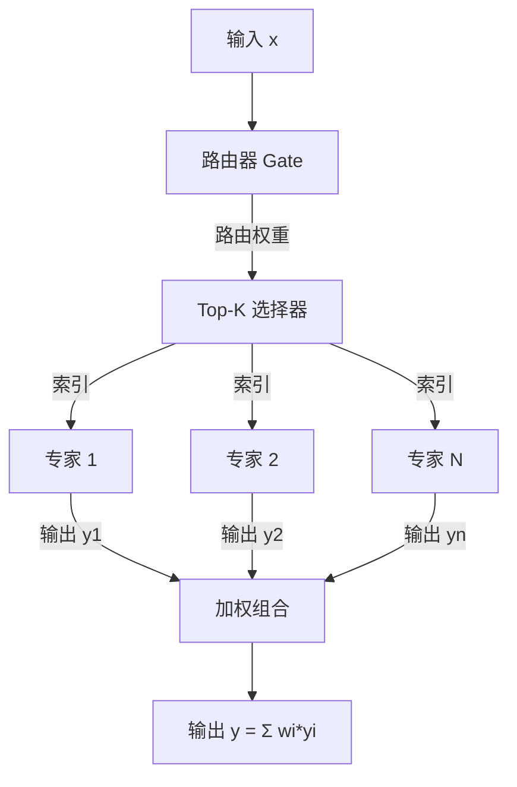

# MoE 混合专家架构详解

> 📅 **更新时间**: 2026-06-17

---

## 目录

- [1. 目录](#1-目录)
- [2. MoE 基础概念](#2-moe-基础概念)
- [3. MoE 架构原理](#3-moe-架构原理)

---

## 1. 目录

- [1. MoE 基础概念](#1-moe-基础概念)
  - [1.1 什么是 MoE](#11-什么是-moe)
  - [1.2 MoE 核心优势](#12-moe-核心优势)
  - [1.3 MoE 适用场景](#13-moe-适用场景)
- [2. MoE 架构原理](#2-moe-架构原理)
  - [2.1 基础架构](#21-基础架构)
  - [2.2 路由算法](#22-路由算法)
  - [2.3 训练机制](#23-训练机制)
  - [2.4 数学公式推导](#24-数学公式推导)

---

## 1. MoE 基础概念

### 1.1 什么是 MoE

**混合专家架构(Mixture of Experts, MoE)** 是一种稀疏神经网络架构,通过将模型参数分散到多个"专家"子网络中,并在每个前向传播中只激活部分专家,从而实现**参数规模**与**计算成本**的解耦。

#### 稠密模型 vs 稀疏模型

| 维度 | 稠密模型(Dense) | 稀疏模型(MoE) |
|------|------------------|----------------|
| **参数激活** | 100% 参数参与计算 | 仅 Top-K 专家参与(通常 10-25%) |
| **计算复杂度** | O(N) N为总参数 | O(K/N × N) K为激活专家数 |
| **内存占用** | 全部参数需加载 | 可动态加载专家 |
| **扩展性** | 受限于单设备显存 | 可跨设备分布式部署专家 |
| **训练成本** | 随参数量线性增长 | 计算成本增长缓慢 |

```python
# MoE 核心原理简化示例
class MoEFFN(nn.Module):
    """MoE 前馈网络"""
    def __init__(self, hidden_size: int, intermediate_size: int, num_experts: int, top_k: int = 2):
        super().__init__()
        self.num_experts = num_experts
        self.top_k = top_k
        
        # 多个专家
        self.experts = nn.ModuleList([
            nn.Sequential(
                nn.Linear(hidden_size, intermediate_size, bias=False),
                nn.SiLU(),
                nn.Linear(intermediate_size, hidden_size, bias=False)
            )
            for _ in range(num_experts)
        ])
        
        # 门控网络(路由器)
        self.gate = nn.Linear(hidden_size, num_experts, bias=False)
    
    def forward(self, x):
        # 计算路由权重
        router_logits = self.gate(x)
        routing_weights = torch.softmax(router_logits, dim=-1)
        
        # 选择 Top-K 专家
        topk_weights, topk_indices = torch.topk(routing_weights, self.top_k, dim=-1)
        topk_weights = topk_weights / topk_weights.sum(dim=-1, keepdim=True)
        
        # 专家计算并加权组合
        final_hidden_states = torch.zeros_like(x)
        for expert_idx in range(self.num_experts):
            expert_mask = (topk_indices == expert_idx)
            if expert_mask.any():
                expert_output = self.experts[expert_idx](x)
                expert_weights = (topk_weights * expert_mask).sum(dim=-1).unsqueeze(-1)
                final_hidden_states += expert_output * expert_weights
        
        return final_hidden_states
```

**关键优势**: MoE 允许在相同计算预算下,使用更大的模型参数规模,从而提升模型能力。

### 1.2 MoE 核心优势

#### 参数规模扩展

MoE 允许模型参数规模大幅增长,而计算成本仅小幅增加:

- **总参数量**随专家数线性增长
- **激活参数**保持恒定(仅取决于 top_k)
- **计算成本**几乎不随专家数增长

#### 推理成本优化

| 模型 | 总参数量 | 激活参数 | GPU需求 | 推理成本/1K tokens |
|------|---------|---------|---------|-------------------|
| LLaMA-2 70B | 70B | 70B | 8×A100 | $3.20 |
| Mixtral 8x7B | 46.7B | 11.7B | 1×A100 | $0.85 |
| DeepSeek-V3 | 671B | 37B | 16×H800 | $0.15 |

**关键优势**: MoE 模型在相同计算成本下,可提供更高的模型质量和更大的参数规模。

#### 能力专业化

MoE 的一个重要特性是**专家自发专业化**:训练过程中,不同专家会学习处理不同类型的输入(如代码、数学、多语言等)。

**Mixtral 8x7B 专家分工示例**:
- 专家 0-1: 语法结构处理
- 专家 2-3: 代码生成
- 专家 4-5: 数学推理
- 专家 6-7: 多语言处理

### 1.3 MoE 适用场景

MoE 主要应用于以下场景:

1. **大规模语言模型**: 万亿参数模型、长期上下文、知识密集型任务
2. **多语言模型**: 100+ 语言支持,语言特定专家
3. **代码模型**: 多编程语言专家
4. **多模态模型**: 视觉、语言、音频专家

**主流 MoE 模型**:

| 模型 | 参数量 | 专家数 | Top-K | 应用场景 |
|------|--------|--------|-------|----------|
| Mixtral 8x7B | 46.7B | 8 | 2 | 通用对话、代码 |
| Mixtral 8x22B | 141B | 8 | 2 | 高质通用任务 |
| DeepSeek-V3 | 671B | 256 | 8 | 大规模服务 |
| Qwen-MoE | 未公开 | 64 | 4 | 中文场景优化 |

---

## 2. MoE 架构原理

### 2.1 基础架构

MoE 架构由三个核心组件构成:



#### 核心组件

1. **专家网络(Expert)**: 独立的前馈网络(FFN),通常使用 SwiGLU 激活
2. **路由器(Router)**: 线性层,计算每个专家的得分
3. **Top-K 选择器**: 选择概率最高的 K 个专家

```python
# MoE 核心流程
class SparseMoEBlock(nn.Module):
    """稀疏 MoE 块"""
    def __init__(self, config):
        super().__init__()
        self.num_experts = config.num_experts
        self.top_k = config.top_k
        
        # 专家列表
        self.experts = nn.ModuleList([
            nn.Sequential(
                nn.Linear(config.hidden_size, config.intermediate_size, bias=False),
                nn.SiLU(),
                nn.Linear(config.intermediate_size, config.hidden_size, bias=False)
            )
            for _ in range(self.num_experts)
        ])
        
        # 路由器
        self.gate = nn.Linear(config.hidden_size, self.num_experts, bias=False)
    
    def forward(self, x, training=True):
        # 1. 计算路由 logits
        router_logits = self.gate(x)
        
        # 2. 训练时添加噪声(增强探索)
        if training:
            noise = torch.randn_like(router_logits) * 0.1
            router_logits = router_logits + noise
        
        # 3. Softmax + Top-K
        routing_weights = torch.softmax(router_logits, dim=-1)
        topk_weights, topk_indices = torch.topk(routing_weights, self.top_k, dim=-1)
        topk_weights = topk_weights / topk_weights.sum(dim=-1, keepdim=True)
        
        # 4. 专家计算并加权组合
        hidden_states = torch.zeros_like(x)
        for expert_idx in range(self.num_experts):
            expert_mask = (topk_indices == expert_idx)
            if expert_mask.any():
                expert_output = self.experts[expert_idx](x)
                expert_weights = (topk_weights * expert_mask).sum(dim=-1).unsqueeze(-1)
                hidden_states += expert_output * expert_weights
        
        return hidden_states
```

### 2.2 路由算法

#### Softmax 路由 + Top-K 选择

最常用的路由策略:

1. 计算每个专家的得分:`s_i = W_i · x`
2. Softmax 归一化:`P(i|x) = exp(s_i) / Σ exp(s_j)`
3. 选择 Top-K 个专家
4. 归一化 Top-K 权重

**Top-K 策略对比**:

| K值 | 激活专家% | 计算成本 | 质量 | 典型模型 |
|-----|----------|---------|------|----------|
| 1 | 12.5%(8专家) | 最低 | 中等 | Switch Transformer |
| 2 | 25.0% | 低 | 良好 | Mixtral 8x7B |
| 4 | 50.0% | 中 | 优秀 | - |
| 8 | 3.1%(256专家) | 低 | 优秀 | DeepSeek-V3 |

#### 噪声注入

训练时添加噪声的关键作用:
- **防止路由坍缩**: 避免所有 token 路由到同一专家
- **增强探索**: 尝试不同的路由组合
- **促进专业化**: 帮助专家学习不同模式

```python
# 噪声注入示例
if training:
    noise = torch.randn_like(router_logits) * noise_scale
    router_logits = router_logits + noise
```

### 2.3 训练机制

#### 负载均衡损失

MoE 训练的核心挑战是确保专家均匀使用。常用方法:

**Switch Transformer 损失**:
```
L_aux = α · N · Σᵢ (f_i · P_i)
```
- `f_i`: 专家 i 被选择的频率
- `P_i`: 专家 i 的平均路由概率
- `N`: 专家数量
- `α`: 损失权重(通常 0.001-0.01)

**推荐配置**:
- 训练初期: `aux_loss_weight = 0.1` (强负载均衡)
- 训练中期: `aux_loss_weight = 0.01` (中等)
- 训练后期: `aux_loss_weight = 0.001` (允许专业化)

#### 训练稳定性要点

1. **学习率预热**: warmup_steps=1000,线性增长到峰值
2. **梯度裁剪**: max_grad_norm=1.0,防止爆炸
3. **辅助损失退火**: aux_loss_weight 从高到低衰减
4. **Router 初始化**: 使用小权重,避免初期坍缩
5. **监控指标**: 实时监控专家利用率、辅助损失

---
