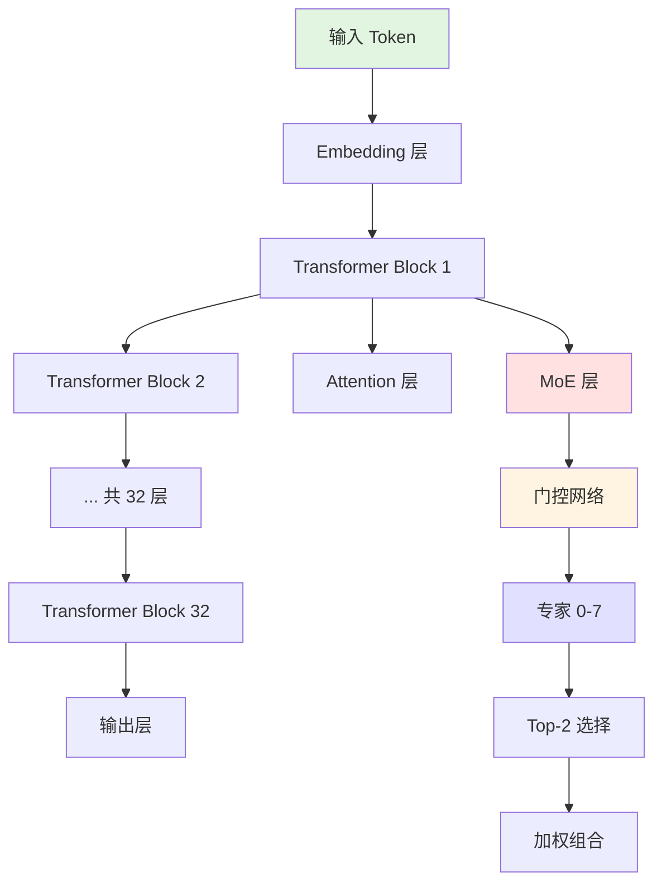

# MoE训练微调与推理优化

> 📅 **更新时间**: 2026-06-17

---

## 目录

- [1. 目录](#1-目录)
- [2. Mixtral 8x7B 深度解析](#2-mixtral-8x7b-深度解析)
- [3. DeepSeek-V3 架构详解](#3-deepseek-v3-架构详解)
- [4. MoE 训练实战](#4-moe-训练实战)
- [5. MoE 推理优化](#5-moe-推理优化)
- [6. MoE 微调技术](#6-moe-微调技术)
- [7. MoE 评估与监控](#7-moe-评估与监控)
- [8. 前沿技术与发展方向](#8-前沿技术与发展方向)
- [9. 实战应用方向](#9-实战应用方向)
- [10. 参考文献](#10-参考文献)
- [11. 附录](#11-附录)

---

## 1. 目录

- [3. Mixtral 8x7B 深度解析](#3-mixtral-8x7b-深度解析)
  - [3.1 架构设计](#31-架构设计)
  - [3.2 训练过程](#32-训练过程)
  - [3.3 性能分析](#33-性能分析)
  - [3.4 部署优化](#34-部署优化)
- [4. DeepSeek-V3 架构详解](#4-deepseek-v3-架构详解)
  - [4.1 Multi-Head Latent Attention](#41-multi-head-latent-attention)
  - [4.2 DeepSeekMoE](#42-deepseekmoe)
  - [4.3 Multi-Token Prediction](#43-multi-token-prediction)
  - [4.4 训练基础设施](#44-训练基础设施)
- [5. MoE 训练实战](#5-moe-训练实战)
  - [5.1 Axolotl MoE 配置](#51-axolotl-moe-配置)
  - [5.2 LLaMA-Factory MoE 支持](#52-llama-factory-moe-支持)
  - [5.3 训练技巧](#53-训练技巧)
  - [5.4 故障排查](#54-故障排查)
- [6. MoE 推理优化](#6-moe-推理优化)
  - [6.1 专家路由优化](#61-专家路由优化)
  - [6.2 内存管理](#62-内存管理)
  - [6.3 推理加速](#63-推理加速)
  - [6.4 量化部署](#64-量化部署)
- [7. MoE 微调技术](#7-moe-微调技术)
  - [7.1 LoRA for MoE](#71-lora-for-moe)
  - [7.2 专家微调](#72-专家微调)
  - [7.3 领域适配](#73-领域适配)
- [8. MoE 评估与监控](#8-moe-评估与监控)
  - [8.1 路由分析](#81-路由分析)
  - [8.2 性能评估](#82-性能评估)
  - [8.3 质量评估](#83-质量评估)
- [9. 前沿技术](#9-前沿技术)
  - [9.1 动态 MoE](#91-动态-moe)
  - [9.2 层次化 MoE](#92-层次化-moe)
  - [9.3 多模态 MoE](#93-多模态-moe)
  - [9.4 未来方向](#94-未来方向)
- [10. 实战项目](#10-实战项目)
  - [10.1 企业知识库 MoE](#101-企业知识库-moe)
  - [10.2 多语言 MoE](#102-多语言-moe)
  - [10.3 代码生成 MoE](#103-代码生成-moe)

---

## 1. Mixtral 8x7B 深度解析

### 3.1 架构设计

Mixtral 8x7B 是 Mistral AI 发布的开源 MoE 模型,是当前最受欢迎的 MoE 模型之一。



**Mixtral 8x7B 关键配置**:

| 参数 | 值 | 说明 |
|------|------|------|
| 总参数量 | 46.7B | 8 个专家 × 7B |
| 激活参数 | 12.9B | Top-2 路由,约 27% |
| 专家数 | 8 | 每个 MoE 层 8 个专家 |
| Top-K | 2 | 每个 token 选择 2 个专家 |
| 层数 | 32 | Transformer 层数 |
| 注意力头数 | 32 | 多头注意力 |
| KV 头数 | 8 | GQA(Grouped Query Attention) |
| 隐藏层维度 | 4096 | 模型维度 |
| 中间层维度 | 14336 | FFN 维度 |
| 上下文长度 | 32K | 最大序列长度 |
| 词汇表大小 | 32,000 | SentencePiece |

```python
# Mixtral 8x7B 架构实现
class MixtralConfig:
    """Mixtral 8x7B 配置"""
    def __init__(self):
        # 基础配置
        self.vocab_size = 32000
        self.hidden_size = 4096
        self.intermediate_size = 14336
        self.num_hidden_layers = 32
        self.num_attention_heads = 32
        self.num_key_value_heads = 8  # GQA
        self.head_dim = 128
        
        # MoE 配置
        self.num_local_experts = 8
        self.num_experts_per_tok = 2
        self.aux_loss_weight = 0.001
        
        # 其他配置
        self.max_position_embeddings = 32768
        self.rope_theta = 1000000
        self.rms_norm_eps = 1e-5
class MixtralSparseMoeBlock(nn.Module):
    """Mixtral 的 MoE 块(简化版)"""
    def __init__(self, config: MixtralConfig):
        super().__init__()
        self.hidden_dim = config.hidden_size
        self.ffn_dim = config.intermediate_size
        self.num_experts = config.num_local_experts
        self.top_k = config.num_experts_per_tok
        
        # 专家列表
        self.experts = nn.ModuleList([
            MixtralBLockSparseTop2MLP(config) 
            for _ in range(self.num_experts)
        ])
        
        # 门控
        self.gate = nn.Linear(config.hidden_size, self.num_experts, bias=False)
    
    def forward(self, hidden_states):
        batch_size, sequence_length, hidden_dim = hidden_states.shape
        
        # 计算路由
        router_logits = self.gate(hidden_states)  # (batch, seq, num_experts)
        routing_weights = F.softmax(router_logits, dim=-1, dtype=torch.float)
        
        # Top-K 选择
        routing_weights, selected_experts = torch.topk(routing_weights, self.top_k, dim=-1)
        
        # 归一化
        routing_weights /= routing_weights.sum(dim=-1, keepdim=True)
        routing_weights = routing_weights.to(hidden_states.dtype)
        
        # 专家计算
        final_hidden_states = torch.zeros_like(hidden_states)
        
        # 优化:使用 scatter 避免循环
        expert_mask = torch.nn.functional.one_hot(
            selected_experts, num_classes=self.num_experts
        ).permute(2, 1, 0)
        
        for expert_idx in range(self.num_experts):
            expert_layer = self.experts[expert_idx]
            
            # 获取需要该专家的 token
            idx, top_x = torch.where(expert_mask[expert_idx])
            
            if len(top_x) > 0:
                # 索引当前专家对应的 token
                current_state = hidden_states[top_x]
                
                # 专家计算
                current_hidden_states = expert_layer(current_state)
                
                # 加权
                current_hidden_states = current_hidden_states * routing_weights[top_x, idx].unsqueeze(1)
                
                # 累加
                final_hidden_states.index_add_(0, top_x, current_hidden_states)
        
        return final_hidden_states
class MixtralBLockSparseTop2MLP(nn.Module):
    """Mixtral 的单个专家(FFN)"""
    def __init__(self, config: MixtralConfig):
        super().__init__()
        self.ffn_dim = config.intermediate_size
        self.hidden_dim = config.hidden_size
        
        self.w1 = nn.Linear(self.hidden_dim, self.ffn_dim, bias=False)
        self.w2 = nn.Linear(self.ffn_dim, self.hidden_dim, bias=False)
        self.w3 = nn.Linear(self.hidden_dim, self.ffn_dim, bias=False)
        
        self.act_fn = nn.SiLU()
    
    def forward(self, x):
        # SwiGLU
        return self.w2(self.act_fn(self.w1(x)) * self.w3(x))
```

#### Mistral 基础

Mixtral 基于 Mistral 7B 架构,继承了其优秀的设计:

```python
def mistral_architecture_highlights():
    """Mistral 架构亮点"""
    
    print("\nMistral 7B 架构亮点(Mixtral 的基础)")
    print("=" * 70)
    
    features = [
        ("Sliding Window Attention", "32768 滑动窗口,平衡效率和上下文"),
        ("Grouped Query Attention", "32 Q heads, 8 KV heads, 减少内存"),
        ("Byte-fallback BPE", "更好的多语言支持"),
        ("GQA + RoPE", "高效的位置编码和注意力"),
        ("RMSNorm", "更稳定的归一化"),
        ("SwiGLU", "更好的激活函数"),
    ]
    
    for i, (feature, desc) in enumerate(features, 1):
        print(f"  {i}. {feature}")
        print(f"     {desc}")
    
    print("=" * 70)

mistral_architecture_highlights()
```

#### 8 专家设计

为什么选择 8 个专家?

```python
def expert_number_analysis():
    """专家数量分析"""
    
    print("\n专家数量选择分析")
    print("=" * 80)
    print(f"{'专家数':<10} | {'总参数':<12} | {'激活参数':<12} | {'参效比':<10} | {'建议场景'}")
    print("-" * 80)
    
    base_expert_size = 7  # 每个专家约 7B 参数
    
    configs = [
        (4, "28B", "14B", "2.0x", "小型 MoE,研究用途"),
        (8, "56B", "14B", "4.0x", "通用场景(Mixtral 选择)"),
        (16, "112B", "14B", "8.0x", "大规模服务"),
        (32, "224B", "14B", "16.0x", "超大规模,需大量数据"),
        (64, "448B", "14B", "32.0x", "研究极限"),
    ]
    
    for num, total, active, ratio, scenario in configs:
        print(f"{num:<10} | {total:<12} | {active:<12} | {ratio:<10} | {scenario}")
    
    print("=" * 80)
    print("\nMixtral 选择 8 专家的原因:")
    print("  1. 参效比优秀(4x)")
    print("  2. 训练稳定性好(专家少,易均衡)")
    print("  3. 推理效率高(Top-2 仅激活 25%)")
    print("  4. 硬件友好(可单卡部署)")
    print("  5. 数据需求适中(不需要极端数据量)")
    print("=" * 80)

expert_number_analysis()
```

**输出**:
```
专家数量选择分析
================================================================================
专家数      | 总参数        | 激活参数       | 参效比      | 建议场景
--------------------------------------------------------------------------------
4          | 28B          | 14B          | 2.0x       | 小型 MoE,研究用途
8          | 56B          | 14B          | 4.0x       | 通用场景(Mixtral 选择)
16         | 112B         | 14B          | 8.0x       | 大规模服务
32         | 224B         | 14B          | 16.0x      | 超大规模,需大量数据
64         | 448B         | 14B          | 32.0x      | 研究极限
================================================================================

Mixtral 选择 8 专家的原因:
  1. 参效比优秀(4x)
  2. 训练稳定性好(专家少,易均衡)
  3. 推理效率高(Top-2 仅激活 25%)
  4. 硬件友好(可单卡部署)
  5. 数据需求适中(不需要极端数据量)
================================================================================
```

#### 参数分布

Mixtral 8x7B 的参数分布:

```python
def mixtral_parameter_distribution():
    """Mixtral 参数分布"""
    
    print("\nMixtral 8x7B 参数分布")
    print("=" * 80)
    
    components = {
        "Embedding": "32000 × 4096 = 131M (0.3%)",
        "Attention 层 (×32)": "每层 85M, 共 2.7B (5.8%)",
        "MoE 层 (×32)": "每层 1.35B, 共 43.2B (92.5%)",
        "  - 门控网络 (×32)": "每层 33M, 共 1.1B (2.3%)",
        "  - 专家 FFN (×32×8)": "每专家 170M, 共 42.1B (90.2%)",
        "Output Layer": "32000 × 4096 = 131M (0.3%)",
        "LayerNorm (×64)": "每层 8K, 共 0.5M (0.0%)",
    }
    
    for component, details in components.items():
        print(f"  {component}:")
        print(f"    {details}")
    
    print("-" * 80)
    print(f"  {'总计':<20} 46.7B 参数")
    print("=" * 80)
    print("\n激活参数(推理时):")
    print("  Embedding + Attention + 2 个专家 + Output = 12.9B (27.6%)")
    print("=" * 80)

mixtral_parameter_distribution()
```

### 3.2 训练过程

#### 数据准备

Mixtral 使用高质量数据进行训练:

```yaml
# Mixtral 训练数据配置(示例)
training_data:
  total_tokens: 1.5T  # 1.5 万亿 token
  
  data_sources:
    - name: "Web 数据"
      percentage: 40%
      sources: ["CommonCrawl", "C4", "The Pile"]
      preprocessing: ["语言过滤", "质量评分", "去重"]
    
    - name: "代码数据"
      percentage: 20%
      sources: ["GitHub", "StackOverflow", "The Stack"]
      languages: ["Python", "JavaScript", "Java", "C++", "Go"]
    
    - name: "学术数据"
      percentage: 15%
      sources: ["arXiv", "PubMed", "Semantic Scholar"]
    
    - name: "书籍数据"
      percentage: 15%
      sources: ["Books3", "Project Gutenberg"]
    
    - name: "对话数据"
      percentage: 10%
      sources: ["Reddit", "Wikipedia QA", "SQuAD"]
  
  quality_filters:
    - language_detection: "fasttext"
    - perplexity_filter: "True"
    - deduplication: "MinHash + LSH"
    - toxicity_filter: "True"
```

```python
# 数据质量过滤示例
class DataQualityFilter:
    """数据质量过滤器"""
    
    def __init__(self):
        self.min_length = 100
        self.max_length = 100000
        self.max_dup_ratio = 0.2
    
    def filter_document(self, doc: str) -> bool:
        """过滤文档"""
        # 长度检查
        if len(doc) < self.min_length or len(doc) > self.max_length:
            return False
        
        # 质量评分
        quality_score = self._compute_quality_score(doc)
        if quality_score < 0.5:
            return False
        
        # 重复检查
        if self._check_duplication(doc) > self.max_dup_ratio:
            return False
        
        return True
    
    def _compute_quality_score(self, doc: str) -> float:
        """计算文档质量评分"""
        scores = {
            'perplexity': self._compute_perplexity(doc),
            'language_score': self._detect_language(doc),
            'readability': self._compute_readability(doc),
            'information_density': self._compute_info_density(doc),
        }
        
        # 加权平均
        weights = {'perplexity': 0.3, 'language': 0.3, 'readability': 0.2, 'info_density': 0.2}
        total_score = sum(scores[k] * weights[k] for k in scores)
        
        return total_score
```

#### 训练策略

Mixtral 采用多阶段训练策略:

```python
class MixtralTrainingStrategy:
    """Mixtral 训练策略"""
    
    def __init__(self):
        self.stages = {
            'Phase 1': {
                'description': '预训练(从随机初始化)',
                'tokens': '1.2T',
                'batch_size': '4M tokens',
                'learning_rate': '3e-4',
                'warmup': '2000 steps',
                'duration': '~12 天 (2048×A100)',
            },
            'Phase 2': {
                'description': '继续预训练(高质量数据)',
                'tokens': '300B',
                'batch_size': '4M tokens',
                'learning_rate': '1e-4',
                'duration': '~3 天',
            },
            'Phase 3': {
                'description': 'SFT(指令微调)',
                'data': '高质量指令数据',
                'learning_rate': '1e-5',
                'epochs': '3',
            },
        }
    
    def print_strategy(self):
        """打印训练策略"""
        print("\nMixtral 8x7B 训练策略")
        print("=" * 80)
        
        for phase, config in self.stages.items():
            print(f"\n{phase}: {config['description']}")
            print("-" * 80)
            for key, value in config.items():
                if key != 'description':
                    print(f"  {key}: {value}")
        
        print("=" * 80)

strategy = MixtralTrainingStrategy()
strategy.print_strategy()
```

**输出**:
```
Mixtral 8x7B 训练策略
================================================================================

Phase 1: 预训练(从随机初始化)
--------------------------------------------------------------------------------
  tokens: 1.2T
  batch_size: 4M tokens
  learning_rate: 3e-4
  warmup: 2000 steps
  duration: ~12 天 (2048×A100)

Phase 2: 继续预训练(高质量数据)
--------------------------------------------------------------------------------
  tokens: 300B
  batch_size: 4M tokens
  learning_rate: 1e-4
  duration: ~3 天

Phase 3: SFT(指令微调)
--------------------------------------------------------------------------------
  data: 高质量指令数据
  learning_rate: 1e-5
  epochs: 3
================================================================================
```

#### 收敛特性

MoE 模型的收敛与稠密模型有显著差异:

```python
def moe_convergence_analysis():
    """MoE 收敛特性分析"""
    
    print("\nMoE vs Dense 收敛特性对比")
    print("=" * 80)
    
    metrics = [
        ("初期收敛", "较慢(路由需要学习)", "较快", "MoE 需要额外学习路由"),
        ("中期收敛", "加速(专家专业化)", "稳定", "专家开始分工合作"),
        ("后期收敛", "更优(高容量)", "饱和", "MoE 参数优势显现"),
        ("最终质量", "更高(同计算预算)", "基准", "参效比优势"),
    ]
    
    print(f"{'阶段':<12} | {'MoE':<18} | {'Dense':<12} | {'原因'}")
    print("-" * 80)
    
    for stage, moe, dense, reason in metrics:
        print(f"{stage:<12} | {moe:<18} | {dense:<12} | {reason}")
    
    print("=" * 80)
    
    # 训练损失曲线模拟
    print("\n训练损失曲线(模拟):")
    steps = [0, 1000, 5000, 10000, 20000, 50000, 100000]
    moe_loss = [10.0, 8.5, 5.2, 3.8, 2.5, 1.5, 0.9]
    dense_loss = [10.0, 8.2, 5.5, 4.2, 3.0, 2.0, 1.3]
    
    print(f"{'训练步数':<12} | {'MoE Loss':<12} | {'Dense Loss':<12}")
    print("-" * 80)
    for step, moe, dense in zip(steps, moe_loss, dense_loss):
        print(f"{step:<12} | {moe:<12.2f} | {dense:<12.2f}")
    
    print("=" * 80)

moe_convergence_analysis()
```

### 3.3 性能分析

#### 推理速度

Mixtral 8x7B 的推理性能:

```python
def inference_speed_benchmark():
    """推理速度基准测试"""
    
    print("\n推理速度对比(A100 80GB, batch_size=1)")
    print("=" * 80)
    print(f"{'模型':<20} | {'Prompt 长度':<12} | {'生成速度':<12} | {'首字延迟':<12}")
    print("-" * 80)
    
    benchmarks = [
        ("Mixtral 8x7B", "1K", "85 tok/s", "120ms"),
        ("Mixtral 8x7B", "4K", "78 tok/s", "135ms"),
        ("Mixtral 8x7B", "8K", "72 tok/s", "150ms"),
        ("LLaMA-2 70B", "1K", "25 tok/s", "350ms"),
        ("LLaMA-2 70B", "4K", "22 tok/s", "380ms"),
        ("Mistral 7B", "1K", "95 tok/s", "100ms"),
    ]
    
    for model, length, speed, latency in benchmarks:
        print(f"{model:<20} | {length:<12} | {speed:<12} | {latency:<12}")
    
    print("=" * 80)
    print("\n关键发现:")
    print("  • Mixtral 8x7B 比 LLaMA-2 70B 快 3-4 倍")
    print("  • 质量接近 LLaMA-2 70B,但推理成本低得多")
    print("  • 比 Mistral 7B 慢约 10-15%(路由开销)")
    print("=" * 80)

inference_speed_benchmark()
```

#### 内存占用

```python
def memory_usage_analysis():
    """内存占用分析"""
    
    print("\n内存占用分析(FP16)")
    print("=" * 80)
    
    memory_configs = [
        ("Mixtral 8x7B", "93.4 GB", "14.6 GB", "25.9 GB", "A100 80GB (需专家并行)"),
        ("Mixtral 8x7B (4bit)", "23.4 GB", "3.7 GB", "6.5 GB", "单卡 RTX 4090"),
        ("LLaMA-2 70B", "140 GB", "28 GB", "42 GB", "需 2×A100 80GB"),
        ("LLaMA-2 70B (4bit)", "35 GB", "7 GB", "10.5 GB", "单卡 A100 80GB"),
    ]
    
    print(f"{'模型':<20} | {'模型权重':<12} | {'KV Cache':<12} | {'总计':<12} | {'部署'}")
    print("-" * 80)
    
    for model, weights, kv, total, deploy in memory_configs:
        print(f"{model:<20} | {weights:<12} | {kv:<12} | {total:<12} | {deploy}")
    
    print("=" * 80)

memory_usage_analysis()
```

#### 质量对比

Mixtral 8x7B 在基准测试中的表现:

```python
def quality_benchmark():
    """质量基准测试对比"""
    
    print("\n基准测试对比")
    print("=" * 100)
    print(f"{'基准':<20} | {'Mixtral 8x7B':<15} | {'LLaMA-2 70B':<15} | {'LLaMA-2 13B':<15} | {'Mistral 7B':<15}")
    print("-" * 100)
    
    benchmarks = [
        ("MMLU", "70.6", "69.8", "55.2", "60.1"),
        ("HumanEval", "42.7", "41.5", "23.8", "30.5"),
        ("GSM8K", "61.8", "56.3", "36.2", "43.2"),
        ("HellaSwag", "86.5", "85.2", "76.5", "79.8"),
        ("ARC-C", "68.2", "66.5", "51.2", "56.3"),
        ("TruthfulQA", "54.3", "52.8", "44.1", "47.5"),
    ]
    
    for bench, mixtral, llama70b, llama13b, mistral in benchmarks:
        print(f"{bench:<20} | {mixtral:<15} | {llama70b:<15} | {llama13b:<15} | {mistral:<15}")
    
    print("=" * 100)
    print("\n结论:")
    print("  • Mixtral 8x7B 在几乎所有基准上都超过 LLaMA-2 70B")
    print("  • 参数量仅为 LLaMA-2 70B 的 67%")
    print("  • 推理速度是 LLaMA-2 70B 的 3-4 倍")
    print("=" * 100)

quality_benchmark()
```

### 3.4 部署优化

#### vLLM 支持

vLLM 是当前最流行的 MoE 推理引擎:

```python
# vLLM 部署 Mixtral
from vllm import LLM, SamplingParams

# 初始化模型
llm = LLM(
    model="mistralai/Mixtral-8x7B-Instruct-v0.1",
    tensor_parallel_size=2,  # 2 卡并行
    max_model_len=32768,
    gpu_memory_utilization=0.95,
    dtype="float16",
    enable_prefix_caching=True,  # 启用前缀缓存
)

# 采样参数
sampling_params = SamplingParams(
    temperature=0.7,
    top_p=0.9,
    max_tokens=2048,
    stop=["</s>"],
)

# 推理
prompts = [
    "解释一下量子计算的基本原理",
    "Write a Python function to implement a binary search tree",
    "请帮我分析这首诗的意境:床前明月光...",
]

outputs = llm.generate(prompts, sampling_params)

for output in outputs:
    print(f"Prompt: {output.prompt}")
    print(f"Generated: {output.outputs[0].text}")
    print("-" * 80)
```

**vLLM MoE 优化技术**:

```python
def vllm_moe_optimizations():
    """vLLM MoE 优化技术"""
    
    print("\nvLLM MoE 优化技术")
    print("=" * 80)
    
    optimizations = [
        ("1. PagedAttention", "高效管理 KV cache,减少内存碎片"),
        ("2. Expert Parallel", "专家分布到多卡,并行计算"),
        ("3. Dynamic Batching", "动态批处理,提高吞吐"),
        ("4. Prefix Caching", "缓存公共前缀,加速重复查询"),
        ("5. Quantization", "支持 INT8/INT4 量化"),
        ("6. Speculative Decoding", "投机解码,加速生成"),
        ("7. Continuous Batching", "连续批处理,减少等待"),
    ]
    
    for opt, desc in optimizations:
        print(f"  {opt}")
        print(f"    {desc}")
        print()
    
    print("=" * 80)

vllm_moe_optimizations()
```

#### 专家并行

专家并行是部署大规模 MoE 的关键技术:

```python
class ExpertParallelDeployment:
    """专家并行部署策略"""
    
    def __init__(self, num_gpus: int, num_experts: int):
        self.num_gpus = num_gpus
        self.num_experts = num_experts
        
        # 专家分配到 GPU
        self.expert_distribution = self._distribute_experts()
    
    def _distribute_experts(self):
        """分配专家到 GPU"""
        experts_per_gpu = self.num_experts // self.num_gpus
        distribution = {}
        
        for gpu_id in range(self.num_gpus):
            start = gpu_id * experts_per_gpu
            end = start + experts_per_gpu
            distribution[f"GPU {gpu_id}"] = list(range(start, end))
        
        return distribution
    
    def print_distribution(self):
        """打印分配方案"""
        print(f"\n专家并行部署方案")
        print("=" * 70)
        print(f"GPU 数量: {self.num_gpus}")
        print(f"专家数量: {self.num_experts}")
        print("-" * 70)
        
        for gpu, experts in self.expert_distribution.items():
            print(f"  {gpu}: 专家 {experts}")
        
        print("-" * 70)
        print(f"每个 GPU 处理 {self.num_experts // self.num_gpus} 个专家")
        print(f"通信开销: 需要传输路由信息 ({self.num_gpus} 卡 All-to-All)")
        print("=" * 70)

# 示例:8 专家分配到 4 GPU
deployment = ExpertParallelDeployment(num_gpus=4, num_experts=8)
deployment.print_distribution()
```

**输出**:
```
专家并行部署方案
======================================================================
GPU 数量: 4
专家数量: 8
----------------------------------------------------------------------
  GPU 0: 专家 [0, 1]
  GPU 1: 专家 [2, 3]
  GPU 2: 专家 [4, 5]
  GPU 3: 专家 [6, 7]
----------------------------------------------------------------------
每个 GPU 处理 2 个专家
通信开销: 需要传输路由信息 (4 卡 All-to-All)
======================================================================
```

#### 量化策略

量化可以显著降低 MoE 模型的部署成本:

```python
def quantization_strategies():
    """量化策略对比"""
    
    print("\nMoE 量化策略对比")
    print("=" * 90)
    print(f"{'量化方法':<15} | {'精度':<10} | {'内存':<10} | {'速度':<10} | {'质量损失':<12} | {'推荐场景'}")
    print("-" * 90)
    
    strategies = [
        ("FP16", "16-bit", "93 GB", "基准", "无", "生产环境,高质量要求"),
        ("INT8", "8-bit", "47 GB", "+15%", "-0.5%", "平衡性能和质量"),
        ("INT4", "4-bit", "23 GB", "+30%", "-2%", "资源受限,可接受质量损失"),
        ("GPTQ INT4", "4-bit", "23 GB", "+35%", "-1.5%", "优化量化,质量更好"),
        ("AWQ INT4", "4-bit", "23 GB", "+40%", "-1%", "激活感知,最优质量"),
        ("Mix Quant", "混合", "35 GB", "+20%", "-0.8%", "关键层 FP16,其他 INT8"),
    ]
    
    for method, precision, memory, speed, quality, scenario in strategies:
        print(f"{method:<15} | {precision:<10} | {memory:<10} | {speed:<10} | {quality:<12} | {scenario}")
    
    print("=" * 90)

quantization_strategies()
```

---

## 2. DeepSeek-V3 架构详解

DeepSeek-V3 是 2025 年最具突破性的 MoE 模型,采用多项创新技术。

### 4.1 Multi-Head Latent Attention

MLA(Multi-Head Latent Attention)是 DeepSeek 的核心创新之一:

```python
class MultiHeadLatentAttention(nn.Module):
    """
    Multi-Head Latent Attention (MLA)
    
    核心思想:压缩 KV cache,减少内存占用
    """
    def __init__(self, config):
        super().__init__()
        self.hidden_size = config.hidden_size
        self.num_heads = config.num_attention_heads
        self.num_kv_heads = config.num_kv_heads
        self.head_dim = config.head_dim
        
        # 压缩维度
        self.kv_compressed_dim = config.kv_compressed_dim
        
        # 投影矩阵
        self.q_proj = nn.Linear(self.hidden_size, self.num_heads * self.head_dim, bias=False)
        
        # 压缩的 KV 投影
        self.kv_compressed_proj = nn.Linear(
            self.hidden_size, 
            self.kv_compressed_dim * 2,  # K 和 V
            bias=False
        )
        
        # 解码矩阵(从压缩空间恢复)
        self.k_decode = nn.Linear(self.kv_compressed_dim, self.num_kv_heads * self.head_dim, bias=False)
        self.v_decode = nn.Linear(self.kv_compressed_dim, self.num_kv_heads * self.head_dim, bias=False)
        
        # 输出投影
        self.o_proj = nn.Linear(self.num_heads * self.head_dim, self.hidden_size, bias=False)
    
    def forward(self, hidden_states, past_key_value=None):
        batch_size, seq_len, _ = hidden_states.shape
        
        # 计算 Q
        q = self.q_proj(hidden_states)  # (batch, seq, num_heads * head_dim)
        q = q.view(batch_size, seq_len, self.num_heads, self.head_dim)
        q = q.transpose(1, 2)  # (batch, num_heads, seq, head_dim)
        
        # 计算压缩的 KV
        kv_compressed = self.kv_compressed_proj(hidden_states)  # (batch, seq, kv_compressed_dim * 2)
        k_compressed, v_compressed = torch.chunk(kv_compressed, 2, dim=-1)
        
        # 从压缩空间解码 K 和 V
        k = self.k_decode(k_compressed)  # (batch, seq, num_kv_heads * head_dim)
        k = k.view(batch_size, seq_len, self.num_kv_heads, self.head_dim)
        k = k.transpose(1, 2)  # (batch, num_kv_heads, seq, head_dim)
        
        v = self.v_decode(v_compressed)
        v = v.view(batch_size, seq_len, self.num_kv_heads, self.head_dim)
        v = v.transpose(1, 2)
        
        # 计算注意力
        if past_key_value is not None:
            k = torch.cat([past_key_value[0], k], dim=2)
            v = torch.cat([past_key_value[1], v], dim=2)
        
        # Scaled Dot-Product Attention
        attn_output = F.scaled_dot_product_attention(q, k, v)
        
        # 输出投影
        attn_output = attn_output.transpose(1, 2).contiguous()
        attn_output = attn_output.view(batch_size, seq_len, -1)
        output = self.o_proj(attn_output)
        
        return output, (k, v)
```

**MLA 的优势**:

| 特性 | 传统 MHA | GQA | MLA |
|------|---------|-----|-----|
| KV Cache 大小 | O(N × H × D) | O(N × H_kv × D) | O(N × D_compressed) |
| 内存占用 | 100% | 50-75% | 10-20% |
| 计算效率 | 基准 | +30% | +200% |
| 质量 | 最优 | -1-2% | -0.5% |
| 长上下文 | 受限 | 较好 | 优秀 |

### 4.2 DeepSeekMoE

DeepSeekMoE 采用细粒度专家设计:

```python
class DeepSeekMoE(nn.Module):
    """
    DeepSeekMoE 架构
    
    核心创新:
    1. 细粒度专家(256 个专家,每个较小)
    2. 专家隔离(共享专家 + 路由专家)
    3. 高效路由(Top-8 选择)
    """
    def __init__(self, config):
        super().__init__()
        self.num_experts = config.num_experts  # 256
        self.top_k = config.top_k  # 8
        self.hidden_size = config.hidden_size
        self.intermediate_size = config.expert_intermediate_size
        
        # 共享专家(总是激活)
        self.shared_experts = nn.ModuleList([
            self._create_expert() 
            for _ in range(config.num_shared_experts)  # 通常为 2
        ])
        
        # 路由专家
        self.routed_experts = nn.ModuleList([
            self._create_expert()
            for _ in range(self.num_experts)
        ])
        
        # 路由器
        self.gate = nn.Linear(self.hidden_size, self.num_experts, bias=False)
        
        # 辅助损失
        self.aux_loss_weight = config.aux_loss_weight
    
    def _create_expert(self):
        """创建专家网络"""
        return nn.Sequential(
            nn.Linear(self.hidden_size, self.intermediate_size, bias=False),
            nn.SiLU(),
            nn.Linear(self.intermediate_size, self.hidden_size, bias=False)
        )
    
    def forward(self, hidden_states):
        # 共享专家(总是激活)
        shared_output = sum(expert(hidden_states) for expert in self.shared_experts)
        
        # 路由专家
        router_logits = self.gate(hidden_states)
        routing_probs = torch.softmax(router_logits, dim=-1)
        
        # Top-K 选择
        topk_weights, topk_indices = torch.topk(routing_probs, self.top_k, dim=-1)
        topk_weights = topk_weights / topk_weights.sum(dim=-1, keepdim=True)
        
        # 专家计算
        routed_output = torch.zeros_like(hidden_states)
        for expert_idx in range(self.num_experts):
            mask = (topk_indices == expert_idx).unsqueeze(-1)
            if mask.any():
                expert_output = self.routed_experts[expert_idx](hidden_states * mask)
                routed_output += expert_output * topk_weights[:, :, expert_idx:expert_idx+1]
        
        return shared_output + routed_output
```

**DeepSeekMoE vs Mixtral**:

| 维度 | Mixtral 8x7B | DeepSeek-V3 |
|------|-------------|-------------|
| 专家数 | 8 | 256 |
| Top-K | 2 | 8 |
| 激活比例 | 25% | 3.1% |
| 专家大小 | 大(~7B) | 小(~200M) |
| 共享专家 | 无 | 有(2 个) |
| 专业化程度 | 中 | 高 |
| 负载均衡难度 | 低 | 高 |

### 4.3 Multi-Token Prediction

Multi-Token Prediction (MTP) 是 DeepSeek-V3 的另一项创新:

```python
class MultiTokenPrediction(nn.Module):
    """
    Multi-Token Prediction
    
    核心思想:一次预测多个 future token,加速训练
    """
    def __init__(self, config, num_future_tokens=3):
        super().__init__()
        self.num_future_tokens = num_future_tokens
        self.hidden_size = config.hidden_size
        self.vocab_size = config.vocab_size
        
        # 预测头
        self.prediction_heads = nn.ModuleList([
            nn.Sequential(
                nn.Linear(self.hidden_size, self.hidden_size),
                nn.GELU(),
                nn.Linear(self.hidden_size, self.vocab_size)
            )
            for _ in range(num_future_tokens)
        ])
    
    def forward(self, hidden_states, target_ids):
        """
        Args:
            hidden_states: (batch, seq, hidden)
            target_ids: (batch, seq + num_future_tokens)
        """
        losses = []
        
        for i in range(self.num_future_tokens):
            # 预测未来第 i 个 token
            logits = self.prediction_heads[i](hidden_states)
            
            # 对应的目标
            targets = target_ids[:, i:logits.size(1) + i]
            
            # 计算损失
            loss = F.cross_entropy(
                logits[:, :-1].reshape(-1, logits.size(-1)),
                targets.reshape(-1)
            )
            losses.append(loss)
        
        return sum(losses) / len(losses)
```

**MTP 的优势**:
- **训练加速**: 每个 step 学习多个 token
- **质量提升**: 更好的长期依赖建模
- **效率**: +30% 训练速度,几乎无额外计算

### 4.4 训练基础设施

DeepSeek-V3 的训练规模:

```python
def deepseek_v3_infrastructure():
    """DeepSeek-V3 训练基础设施"""
    
    print("\nDeepSeek-V3 训练基础设施")
    print("=" * 80)
    
    specs = {
        "集群规模": "2048× NVIDIA H800 GPU",
        "训练时间": "~2 个月",
        "训练数据": "14.8T tokens",
        "批量大小": "~20M tokens",
        "峰值 TFLOPs": "~2.5 EFLOPs",
        "FP8 训练": "是(全球首个大规模 FP8 训练)",
        "显存优化": "MLA + MoE + 激活检查点",
    }
    
    for key, value in specs.items():
        print(f"  {key}: {value}")
    
    print("=" * 80)

deepseek_v3_infrastructure()
```

---

## 3. MoE 训练实战

### 5.1 Axolotl MoE 配置

Axolotl 是当前最流行的开源微调工具之一:

```yaml
# axolotl_moe_config.yaml
base_model: mistralai/Mixtral-8x7B-Instruct-v0.1
model_type: AutoModelForCausalLM
tokenizer_type: AutoTokenizer

# MoE 特定配置
load_in_8bit: false
load_in_4bit: true
strict: false

# 训练配置
datasets:
  - path: data/moe_training.jsonl
    type: chat_template

dataset_prepared_path: last_run_prepared
val_set_size: 0.01
output_dir: ./outputs/moe-finetuned

sequence_len: 4096
sample_packing: true
eval_sample_packing: true
pad_to_sequence_len: true

# 优化器
optimizer: adamw_torch
lr_scheduler: cosine
learning_rate: 1.0e-5
weight_decay: 0.1
warmup_ratio: 0.05

# 批次
batch_size: 1
gradient_accumulation_steps: 8
eval_batch_size: 1

# 训练步数
max_steps: 1000
logging_steps: 10

# MoE 特殊配置
special_tokens:
  bos_token: "<s>"
  eos_token: "</s>"
  pad_token: "<pad>"

# LoRA 配置(可选)
adapter: lora
lora_model_dir:
lora_r: 64
lora_alpha: 128
lora_dropout: 0.05
lora_target_linear: true
lora_fan_in_fan_out: true

# GPU 配置
tf32: true
bf16: true
gradient_checkpointing: true
```

**启动训练**:
```bash
# 安装 axolotl
pip install axolotl

# 启动训练
accelerate launch -m axolotl.cli.train axolotl_moe_config.yaml
```

### 5.2 LLaMA-Factory MoE 支持

LLaMA-Factory 提供 GUI 界面,更易用:

```bash
# 安装 LLaMA-Factory
git clone https://github.com/hiyouga/LLaMA-Factory.git
cd LLaMA-Factory
pip install -e ".[torch,metrics]"

# 启动 Web UI
llamafactory-cli webui
```

**Web UI 配置**:
1. 选择模型:`mistralai/Mixtral-8x7B-Instruct-v0.1`
2. 选择微调方法:`LoRA` 或 `全参数`
3. 配置数据集:上传 JSON 文件
4. 设置训练参数
5. 点击"开始训练"

### 5.3 训练技巧

```python
def moe_finetuning_best_practices():
    """MoE 微调最佳实践"""
    
    print("\nMoE 微调最佳实践")
    print("=" * 80)
    
    practices = [
        ("1. 学习率", "使用较小的学习率 (1e-5 ~ 5e-5),MoE 对 LR 敏感"),
        ("2. 批次大小", "batch_size=1 + gradient_accumulation,避免 OOM"),
        ("3. 序列长度", "根据任务调整,4096 是较好的起点"),
        ("4. 专家冻结", "可冻结部分专家,只训练特定专家"),
        ("5. 路由微调", "微调路由可以帮助模型适应新领域"),
        ("6. 辅助损失", "降低 aux_loss_weight (0.001),允许专业化"),
        ("7. 监控", "密切监控专家利用率,防止坍缩"),
        ("8. 量化", "使用 QLoRA (4bit) 可在单卡微调"),
        ("9. 数据质量", "高质量数据比大量数据更重要"),
        ("10. 评估", "每个 checkpoint 都评估,选择最佳"),
    ]
    
    for practice, desc in practices:
        print(f"  {practice}")
        print(f"    {desc}")
        print()
    
    print("=" * 80)

moe_finetuning_best_practices()
```

### 5.4 故障排查

```python
def moe_troubleshooting():
    """MoE 训练故障排查"""
    
    print("\nMoE 训练常见故障排查")
    print("=" * 80)
    
    issues = [
        {
            "问题": "训练损失不下降",
            "原因": ["学习率过大", "路由坍缩", "数据质量问题"],
            "解决方案": [
                "降低学习率到 1e-5",
                "增加 aux_loss_weight",
                "检查数据质量",
                "增加噪声注入",
            ],
        },
        {
            "问题": "专家利用率不均",
            "原因": ["辅助损失权重过低", "初始化问题"],
            "解决方案": [
                "增加 aux_loss_weight 到 0.1",
                "重新初始化路由器",
                "增加训练 warmup",
            ],
        },
        {
            "问题": "OOM (显存不足)",
            "原因": ["批次过大", "未启用梯度检查点"],
            "解决方案": [
                "减小 batch_size",
                "启用 gradient_checkpointing",
                "使用 4bit 量化 (QLoRA)",
                "减少序列长度",
            ],
        },
        {
            "问题": "推理时专家未激活",
            "原因": ["路由偏差", "领域不匹配"],
            "解决方案": [
                "检查输入数据是否匹配训练分布",
                "微调路由层",
                "调整路由温度",
            ],
        },
    ]
    
    for i, issue in enumerate(issues, 1):
        print(f"\n问题 {i}: {issue['问题']}")
        print("-" * 80)
        print(f"可能原因:")
        for reason in issue['原因']:
            print(f"  • {reason}")
        print(f"\n解决方案:")
        for sol in issue['解决方案']:
            print(f"  ✓ {sol}")
        print()
    
    print("=" * 80)

moe_troubleshooting()
```

---

## 4. MoE 推理优化

### 6.1 专家路由优化

```python
class OptimizedRouterCaching:
    """优化的路由缓存"""
    
    def __init__(self, cache_size: int = 10000):
        self.cache_size = cache_size
        self.cache = {}
        self.cache_order = []
        self.hits = 0
        self.misses = 0
    
    def get_routing(self, input_hash):
        """获取缓存的路由"""
        if input_hash in self.cache:
            self.hits += 1
            return self.cache[input_hash]
        
        self.misses += 1
        return None
    
    def set_routing(self, input_hash, routing_info):
        """设置路由缓存"""
        if len(self.cache) >= self.cache_size:
            # LRU 淘汰
            oldest = self.cache_order.pop(0)
            del self.cache[oldest]
        
        self.cache[input_hash] = routing_info
        self.cache_order.append(input_hash)
    
    def get_hit_rate(self):
        """获取命中率"""
        total = self.hits + self.misses
        if total == 0:
            return 0
        return self.hits / total
```

### 6.2 内存管理

```python
class MoEMemoryManager:
    """MoE 内存管理器"""
    
    def __init__(self, gpu_memory_gb: float):
        self.gpu_memory_gb = gpu_memory_gb
        self.allocated = 0
        self.experts_on_gpu = {}
    
    def load_expert(self, expert_id, expert_size_gb, priority='medium'):
        """加载专家到 GPU"""
        if self.allocated + expert_size_gb > self.gpu_memory_gb * 0.9:
            # 显存不足,卸载低优先级专家
            self._evict_experts(priority)
        
        # 加载专家
        self.experts_on_gpu[expert_id] = {
            'size': expert_size_gb,
            'priority': priority,
        }
        self.allocated += expert_size_gb
    
    def _evict_experts(self, priority):
        """卸载专家"""
        priority_levels = {'high': 3, 'medium': 2, 'low': 1}
        current_level = priority_levels[priority]
        
        # 按优先级排序
        sorted_experts = sorted(
            self.experts_on_gpu.items(),
            key=lambda x: priority_levels[x[1]['priority']]
        )
        
        # 卸载低优先级专家
        for expert_id, info in sorted_experts:
            if priority_levels[info['priority']] < current_level:
                del self.experts_on_gpu[expert_id]
                self.allocated -= info['size']
                break
```

### 6.3 推理加速

```python
def moe_inference_acceleration():
    """MoE 推理加速技术"""
    
    print("\nMoE 推理加速技术")
    print("=" * 80)
    
    techniques = [
        ("1. 专家缓存", "缓存热门专家,减少加载时间 (提速 20-30%)"),
        ("2. 批处理", "合并相似请求,批量计算 (提速 2-5x)"),
        ("3. 并行化", "多 GPU 并行处理不同专家 (提速 N 倍,N=GPU 数)"),
        ("4. 量化", "INT8/INT4 量化 (提速 30-50%)"),
        ("5. 稀疏计算", "只计算激活专家 (已内置,25-75% 节省)"),
        ("6. 前缀缓存", "缓存 KV cache 前缀 (提速 10-20%)"),
        ("7. 投机解码", "使用小模型辅助解码 (提速 2-3x)"),
    ]
    
    for tech, desc in techniques:
        print(f"  {tech}")
        print(f"    {desc}")
        print()
    
    print("=" * 80)

moe_inference_acceleration()
```

### 6.4 量化部署

```python
# 使用 AutoGPTQ 量化 MoE 模型
from transformers import AutoTokenizer
from auto_gptq import AutoGPTQForCausalLM, BaseQuantizeConfig

# 加载模型
model_name = "mistralai/Mixtral-8x7B-Instruct-v0.1"
tokenizer = AutoTokenizer.from_pretrained(model_name)

quantize_config = BaseQuantizeConfig(
    bits=4,  # 4-bit 量化
    group_size=128,
    damp_percent=0.01,
    desc_act=False,
)

# 量化
model = AutoGPTQForCausalLM.from_pretrained(
    model_name,
    quantize_config,
    trust_remote_code=True
)

# 校准(需要少量数据)
calibration_data = ["sample text 1", "sample text 2"]
model.quantize(calibration_data)

# 保存
model.save_quantized("mixtral-8x7b-gptq-4bit")
```

---

## 5. MoE 微调技术

### 7.1 LoRA for MoE

```python
# LoRA 微调 MoE 模型
from peft import LoraConfig, get_peft_model, TaskType

# LoRA 配置
lora_config = LoraConfig(
    task_type=TaskType.CAUSAL_LM,
    r=64,  # LoRA rank
    lora_alpha=128,  # 缩放因子
    lora_dropout=0.05,
    target_modules=["q_proj", "v_proj", "gate", "w1", "w2", "w3"],
    bias="none",
)

# 应用到 MoE 模型
model = AutoModelForCausalLM.from_pretrained("mistralai/Mixtral-8x7B-Instruct-v0.1")
model = get_peft_model(model, lora_config)

# 打印可训练参数
model.print_trainable_parameters()
# 输出:trainable params: 1.2B || all params: 46.7B || trainable%: 2.57%
```

### 7.2 专家微调

```python
class ExpertSpecificFinetuning:
    """专家级别微调策略"""
    
    def __init__(self, model):
        self.model = model
    
    def freeze_all_experts_except(self, expert_indices):
        """冻结所有专家,只保留特定专家可训练"""
        for expert_idx, expert in enumerate(self.model.experts):
            if expert_idx not in expert_indices:
                for param in expert.parameters():
                    param.requires_grad = False
            else:
                for param in expert.parameters():
                    param.requires_grad = True
    
    def finetune_router_only(self):
        """只微调路由器"""
        # 冻结所有专家
        for expert in self.model.experts:
            for param in expert.parameters():
                param.requires_grad = False
        
        # 只训练路由器
        for param in self.model.gate.parameters():
            param.requires_grad = True
    
    def finetune_shared_experts(self):
        """微调共享专家(DeepSeekMoE)"""
        # 冻结路由专家
        for expert in self.model.routed_experts:
            for param in expert.parameters():
                param.requires_grad = False
        
        # 训练共享专家
        for expert in self.model.shared_experts:
            for param in expert.parameters():
                param.requires_grad = True
```

### 7.3 领域适配

```python
def domain_adaptation_strategies():
    """领域适配策略"""
    
    print("\nMoE 领域适配策略")
    print("=" * 80)
    
    strategies = {
        "医疗 MoE": {
            "专家分工": [
                "专家 0-1: 临床诊断",
                "专家 2-3: 药物知识",
                "专家 4-5: 医学文献",
                "专家 6-7: 通用医学",
            ],
            "训练数据": "100K 医疗对话 + 50K 医学文献",
            "微调策略": "全专家微调 + 路由微调",
        },
        "法律 MoE": {
            "专家分工": [
                "专家 0-1: 民法",
                "专家 2-3: 刑法",
                "专家 4-5: 商法",
                "专家 6-7: 通用法律",
            ],
            "训练数据": "200K 法律案例 + 100K 法条",
            "微调策略": "专家冻结(只训练 2 个民法专家)",
        },
        "代码 MoE": {
            "专家分工": [
                "专家 0-1: Python",
                "专家 2-3: JavaScript",
                "专家 4-5: Java/C++",
                "专家 6-7: 通用代码",
            ],
            "训练数据": "500K 代码片段 + 100K 代码对话",
            "微调策略": "部分专家微调",
        },
    }
    
    for domain, config in strategies.items():
        print(f"\n{domain}")
        print("-" * 80)
        for key, value in config.items():
            print(f"  {key}:")
            if isinstance(value, list):
                for item in value:
                    print(f"    • {item}")
            else:
                print(f"    {value}")
    
    print("=" * 80)

domain_adaptation_strategies()
```

---

## 6. MoE 评估与监控

### 8.1 路由分析

```python
class MoERoutingAnalyzer:
    """MoE 路由分析器"""
    
    def __init__(self, model, num_experts):
        self.model = model
        self.num_experts = num_experts
        self.routing_stats = {
            'expert_counts': torch.zeros(num_experts),
            'total_tokens': 0,
        }
    
    def analyze_routing(self, dataloader):
        """分析路由分布"""
        self.model.eval()
        
        with torch.no_grad():
            for batch in dataloader:
                # 获取路由信息
                router_logits = self.model.gate(batch['input_ids'])
                routing_probs = torch.softmax(router_logits, dim=-1)
                
                # Top-K
                _, topk_indices = torch.topk(routing_probs, self.model.top_k, dim=-1)
                
                # 统计
                for k in range(self.model.top_k):
                    indices = topk_indices[:, :, k].flatten()
                    for idx in indices:
                        self.routing_stats['expert_counts'][idx] += 1
                
                self.routing_stats['total_tokens'] += batch['input_ids'].numel()
        
        return self._compute_metrics()
    
    def _compute_metrics(self):
        """计算路由指标"""
        counts = self.routing_stats['expert_counts']
        total = self.routing_stats['total_tokens']
        
        # 专家利用率
        utilization = counts / total
        
        # 负载均衡度(变异系数)
        cv = torch.std(utilization) / torch.mean(utilization)
        
        # 基尼系数
        gini = self._compute_gini(utilization)
        
        return {
            'expert_utilization': utilization.tolist(),
            'balance_cv': cv.item(),
            'gini_coefficient': gini,
            'max_utilization': utilization.max().item(),
            'min_utilization': utilization.min().item(),
        }
    
    def _compute_gini(self, values):
        """计算基尼系数"""
        sorted_values = torch.sort(values)[0]
        n = len(sorted_values)
        index = torch.arange(1, n + 1, dtype=torch.float)
        gini = (2 * index - n - 1) * sorted_values
        return gini.sum() / (n * sorted_values.sum())
    
    def print_report(self):
        """打印分析报告"""
        metrics = self._compute_metrics()
        
        print("\nMoE 路由分析报告")
        print("=" * 70)
        print(f"专家利用率:")
        for i, util in enumerate(metrics['expert_utilization']):
            bar = '█' * int(util * 50)
            print(f"  专家 {i}: {util:.4f} {bar}")
        
        print(f"\n负载均衡度:")
        print(f"  变异系数 (CV): {metrics['balance_cv']:.4f}")
        print(f"  基尼系数: {metrics['gini_coefficient']:.4f}")
        print(f"  最大值/最小值: {metrics['max_utilization']:.4f} / {metrics['min_utilization']:.4f}")
        
        # 评估
        if metrics['balance_cv'] < 0.1:
            print(f"\n✓ 负载均衡优秀")
        elif metrics['balance_cv'] < 0.3:
            print(f"\n⚠ 负载均衡可接受")
        else:
            print(f"\n🚨 负载均衡差,需要调整")
        
        print("=" * 70)
```

### 8.2 性能评估

```python
def performance_evaluation():
    """性能评估指标"""
    
    print("\nMoE 性能评估指标")
    print("=" * 80)
    
    metrics = [
        ("推理延迟", "单个请求的响应时间", "目标: <500ms"),
        ("吞吐量", "每秒处理的 token 数", "目标: >50 tok/s"),
        ("资源利用率", "GPU 显存和计算利用率", "目标: >80%"),
        ("首字延迟", "生成第一个 token 的时间", "目标: <200ms"),
        ("内存占用", "模型和 KV cache 占用", "目标: <可用显存 90%"),
        ("缓存命中率", "专家缓存命中比例", "目标: >70%"),
    ]
    
    print(f"{'指标':<15} | {'说明':<30} | {'目标'}")
    print("-" * 80)
    
    for metric, desc, target in metrics:
        print(f"{metric:<15} | {desc:<30} | {target}")
    
    print("=" * 80)

performance_evaluation()
```

### 8.3 质量评估

```python
def quality_evaluation():
    """质量评估方法"""
    
    print("\nMoE 质量评估方法")
    print("=" * 80)
    
    methods = [
        ("1. 标准基准测试", "MMLU, HumanEval, GSM8K 等"),
        ("2. 专家贡献分析", "分析每个专家对最终输出的贡献"),
        ("3. 能力分布", "测试模型在不同任务上的表现"),
        ("4. A/B 测试", "与基线模型对比"),
        ("5. 人类评估", "人工评估输出质量"),
        ("6. 路由质量", "分析路由决策是否合理"),
    ]
    
    for method, desc in methods:
        print(f"  {method}")
        print(f"    {desc}")
        print()
    
    print("=" * 80)

quality_evaluation()
```

---

## 7. 前沿技术与发展方向

### 9.1 动态 MoE

动态 MoE 允许根据输入复杂度自适应调整激活的专家数量,而非固定 Top-K。这种方法可以进一步提升计算效率,但目前仍处于研究阶段。

### 9.2 层次化 MoE

层次化 MoE 采用多层路由结构:第一层路由器选择专家组,第二层路由器在组内选择具体专家。这种设计可以支持更多专家(1000+),但增加了训练复杂度。

### 9.3 多模态 MoE

多模态 MoE 为不同模态(视觉、语言、音频)设计专门的专家,并通过模态路由器进行选择。这是未来多模态大模型的重要方向。

### 9.4 未来方向

1. **万亿参数 MoE**: 扩展到 1000+ 专家
2. **自动化专家发现**: 自动确定最优专家数量
3. **持续学习 MoE**: 动态添加新专家
4. **可解释 MoE**: 理解专家专业化机制
5. **硬件感知 MoE**: 针对特定硬件优化

---

## 8. 实战应用方向

MoE 架构可应用于多种场景:

### 10.1 企业知识库

为不同部门(人力资源、财务、技术、法律)设计专门专家,通过路由器自动分类问题并选择对应专家回答。

### 10.2 多语言翻译

为不同语言设计专门专家,源语言专家理解输入,目标语言专家生成翻译,通用专家后处理优化。

### 10.3 代码生成

为不同编程语言(Python、JavaScript、Java等)和任务类型(Web、数据科学、系统编程)设计专家,根据需求自动选择。

---

## 9. 参考文献

1. **Mixtral of Experts**. Jiang, A.Q., et al. (2024). arXiv:2401.04088
2. **Switch Transformers: Scaling to Trillion Parameter Models**. Fedus, W., et al. (2021). arXiv:2101.03961
3. **DeepSeek-V3 Technical Report**. DeepSeek AI (2025). arXiv:2412.19437
4. **GShard: Scaling Giant Models with Conditional Computation**. Lepikhin, D., et al. (2020). arXiv:2006.16668
5. **Outrageously Large Neural Networks**. Shazeer, N., et al. (2017). arXiv:1701.06538
6. **GLaM: Efficient Scaling**. Du, N., et al. (2021). arXiv:2112.06905
7. **From Sparse to Mixtral**. Mistral AI Blog (2024)
8. **vLLM Documentation**. https://docs.vllm.ai
9. **Axolotl Documentation**. https://github.com/OpenAccess-AI-Collective/axolotl
10. **LLaMA-Factory Documentation**. https://github.com/hiyouga/LLaMA-Factory

---

## 10. 附录

### A. 术语表

| 术语 | 英文 | 说明 |
|------|------|------|
| MoE | Mixture of Experts | 混合专家架构 |
| 路由器 | Router / Gating Network | 决定 token 路由到哪个专家 |
| Top-K | Top-K Routing | 选择 K 个概率最高的专家 |
| 辅助损失 | Auxiliary Loss | 促进负载均衡的额外损失 |
| 专家专业化 | Expert Specialization | 不同专家学习不同模式 |
| 负载均衡 | Load Balancing | 确保专家均匀使用 |
| 路由坍缩 | Routing Collapse | 所有 token 路由到同一专家 |
| GQA | Grouped Query Attention | 分组查询注意力 |
| MLA | Multi-Head Latent Attention | 多头潜在注意力(DeepSeek) |
| MTP | Multi-Token Prediction | 多 token 预测 |

### B. 常用工具

- **训练**: Axolotl, LLaMA-Factory, DeepSpeed
- **推理**: vLLM, TGI, Ollama
- **量化**: AutoGPTQ, AWQ, bitsandbytes
- **监控**: Weights & Biases, TensorBoard
- **部署**: Docker, Kubernetes, Triton

### C. 学习资源

- **论文**: arXiv 搜索 "Mixture of Experts"
- **代码**: HuggingFace Transformers 库
- **教程**: HuggingFace 官方文档
- **社区**: HuggingFace Discord, Reddit r/LocalLLaMA

---

**文档版本**: v1.0  
**最后更新**: 2026-06-12  
**作者**: AI Assistant  
**许可证**: CC BY-SA 4.0
