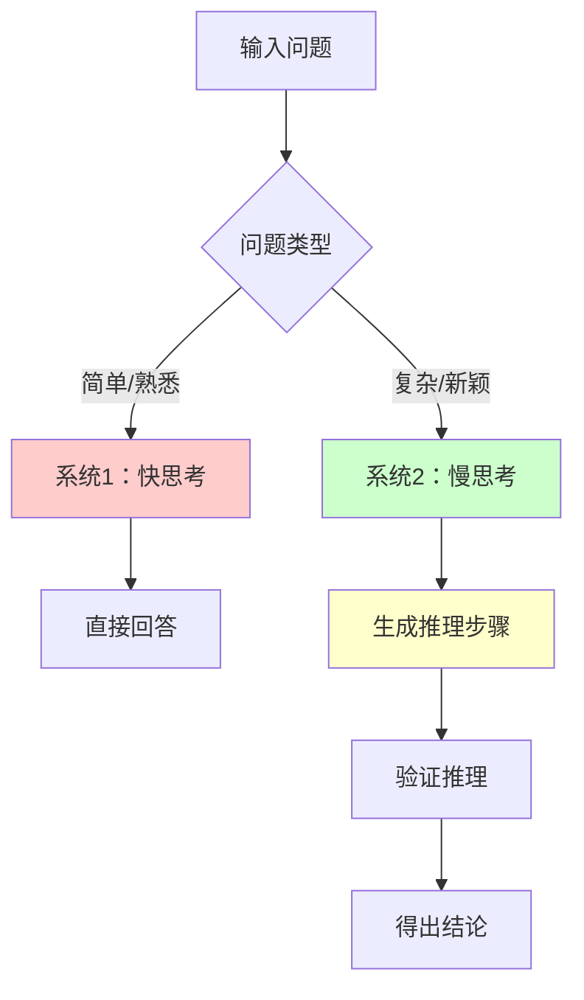
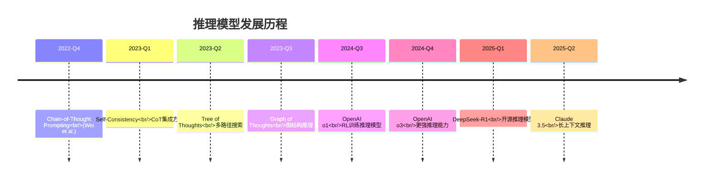
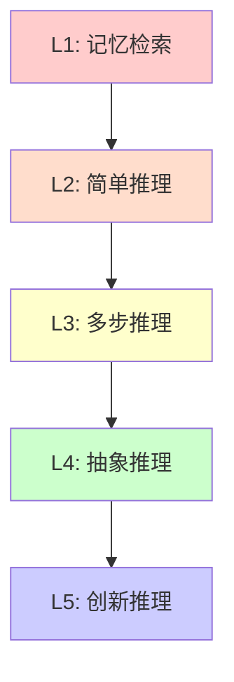
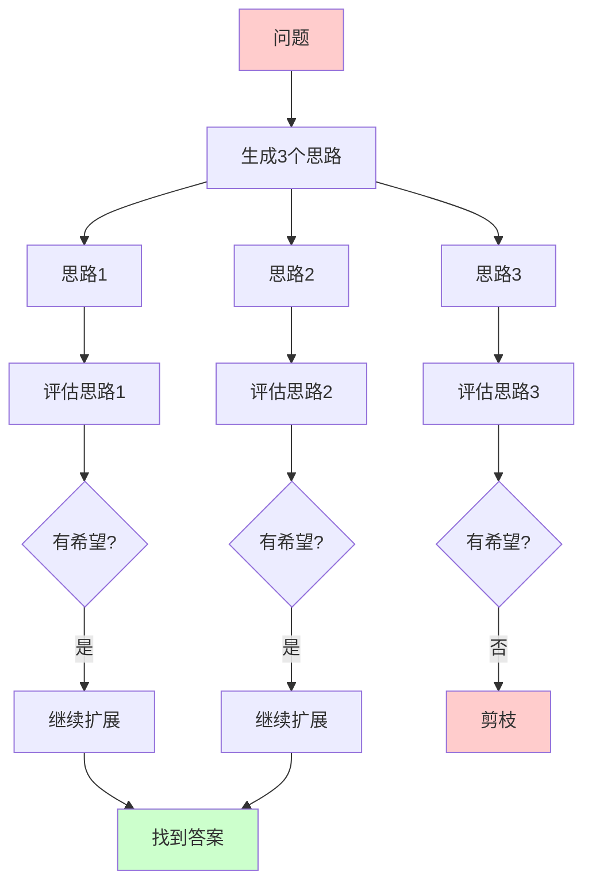
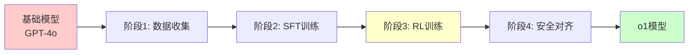
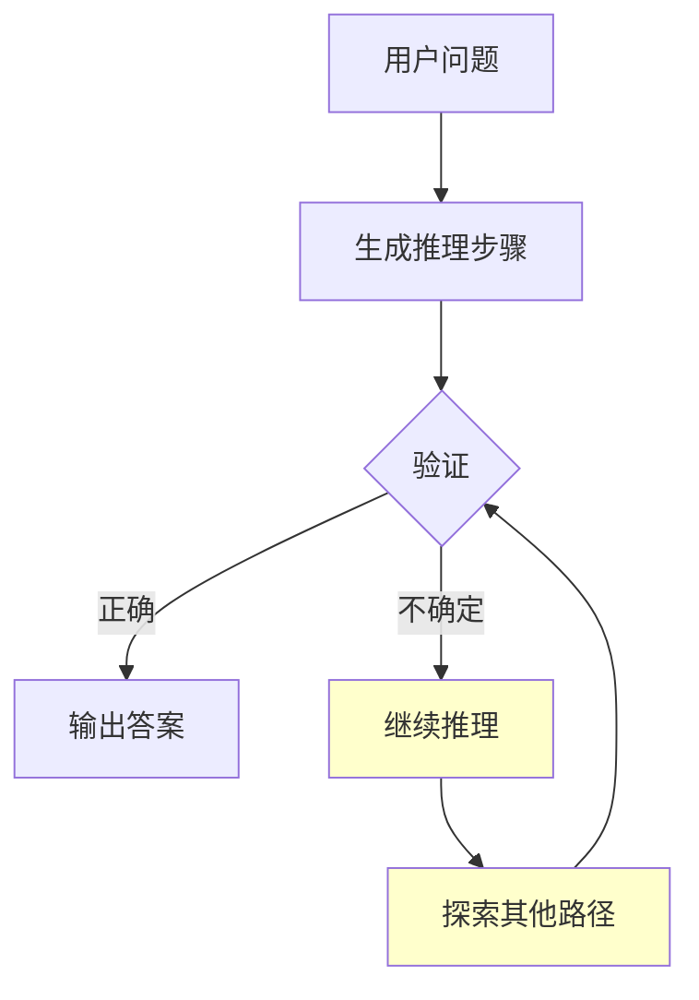
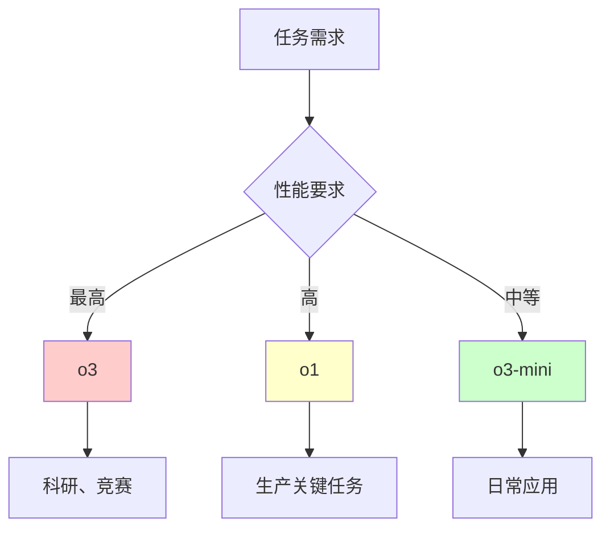

# 推理模型与思维链技术

> 📅 **更新时间**: 2026-06-17

---

## 目录

- [1. 目录](#1-目录)
- [2. 推理模型基础概念](#2-推理模型基础概念)
- [3. 思维链 CoT 技术](#3-思维链-cot-技术)
- [4. 已知条件](#4-已知条件)
- [5. 推理过程](#5-推理过程)
- [6. 验证](#6-验证)
- [7. 答案](#7-答案)
- [8. 已知条件](#8-已知条件)
- [9. 推理过程](#9-推理过程)
- [10. OpenAI o1 系列深度解析](#10-openai-o1-系列深度解析)
- [11. 分析](#11-分析)
- [12. 解法1](#12-解法1)
- [13. 解法2（如果有）](#13-解法2如果有)
- [14. 验证](#14-验证)
- [15. 答案](#15-答案)

---

## 1. 目录

- [1. 推理模型基础概念](#1-推理模型基础概念)
  - [1.1 什么是推理模型](#11-什么是推理模型)
  - [1.2 推理类型分类](#12-推理类型分类)
  - [1.3 推理模型的核心优势](#13-推理模型的核心优势)
  - [1.4 推理能力层级模型](#14-推理能力层级模型)
- [2. 思维链 CoT 技术](#2-思维链-cot-技术)
  - [2.1 CoT 基础](#21-cot-基础)
  - [2.2 CoT 变体技术](#22-cot-变体技术)
  - [2.3 CoT 实现方法](#23-cot-实现方法)
  - [2.4 CoT 代码实战](#24-cot-代码实战)
- [3. OpenAI o1 系列深度解析](#3-openai-o1-系列深度解析)
  - [3.1 o1 架构设计](#31-o1-架构设计)
  - [3.2 o1 能力评测](#32-o1-能力评测)
  - [3.3 o1 vs o3 vs o3-mini 对比](#33-o1-vs-o3-vs-o3-mini-对比)
  - [3.4 o1 API 实战](#34-o1-api-实战)

---

## 1. 推理模型基础概念

### 1.1 什么是推理模型

#### 1.1.1 系统1 vs 系统2思维理论

推理模型（Reasoning Models）是基于诺贝尔奖得主 Daniel Kahneman 提出的**双系统思维理论**设计的大语言模型。

**系统1（System 1）**：
- 快速、直觉、自动化
- 消耗认知资源少
- 容易受到认知偏差影响
- 示例：识别面孔、简单算术、日常对话

**系统2（System 2）**：
- 缓慢、深思熟虑、有意识
- 消耗大量认知资源
- 能够处理复杂逻辑和推理
- 示例：数学证明、编程调试、战略规划



**在 LLM 中的映射**：
- **传统LLM**（GPT-3.5、GPT-4）：主要是系统1思维
- **推理模型**（o1、DeepSeek-R1）：显式模拟系统2思维

#### 1.1.2 快思考 vs 慢思考在 LLM 中的体现

**快思考示例**：

```
用户：3个人3天吃了3个苹果，9个人9天吃多少个苹果？

GPT-4o（快思考）：
- 直接模式匹配
- 可能联想到"3个"
- 快速生成答案
- 可能出错（如回答27个而不验证）
```

```
# 快思考：GPT-4o 直接回答
{"thought_process": "3个人3天3个苹果 → 9个人9天？", "answer": 27, "confidence": 0.7, "reasoning_visible": false}

# 可能输出：27个（错误）
# 正确答案：27个（巧合对了，但推理过程可能有问题）
```

```
# 慢思考：o1 推理后回答
{"thought_process": "...完整的推理链条...", "answer": 27, "confidence": 0.95, "reasoning_visible": true}

# 输出推理过程：
# 3个人3天吃3个苹果
# → 1个人3天吃1个苹果
# → 1个人1天吃1/3个苹果
# → 9个人1天吃3个苹果
# → 9个人9天吃27个苹果
# 答案：27个
```

#### 1.1.3 OpenAI o1 的突破性意义

2024年9月，OpenAI 发布 o1 模型，标志着推理模型的重大突破：

**关键创新**：
1. **隐式思维链**：在训练时学习生成推理步骤，但推理时不展示
2. **强化学习训练**：使用RL优化推理过程，而非仅SFT
3. **推理时扩展**：通过"思考"更长时间提升准确率
4. **自我验证**：在生成答案前自我检查和修正

**性能飞跃**：
- AIME 2024（数学竞赛）：从13.4% → 83.3%
- Codeforces（编程竞赛）：从Elo 1100 → 2100+（Top 5%）
- GPQA（科学问答）：从63.6% → 77.3%

#### 1.1.4 推理模型的演进时间线



### 1.2 推理类型分类

#### 1.2.1 逻辑推理（Logical Reasoning）

逻辑推理是最基础的推理类型，涉及从前提推导结论。

**形式逻辑示例**：

```python
# 三段论推理
前提1: 所有哺乳动物都有脊椎
前提2: 鲸鱼是哺乳动物
前提3: 所有有脊椎的动物都属于脊椎动物门

推理过程：
1. 从前提1和前提2 → 鲸鱼有脊椎
2. 从步骤1和前提3 → 鲸鱼属于脊椎动物门
3. 结论：鲸鱼属于脊椎动物门 ✓

# 逻辑规则应用
- 肯定前件（Modus Ponens）
- 否定后件（Modus Tollens）
- 假言三段论（Hypothetical Syllogism）
```

**实际测试题**：

```
问题：
前提1：所有哺乳动物都有脊椎
前提2：鲸鱼是哺乳动物
前提3：只有脊椎动物才能进入水族馆
结论A：鲸鱼有脊椎
结论B：鲸鱼可以进入水族馆
结论C：所有有脊椎的都是哺乳动物
结论D：以上哪个结论正确？

预期推理过程：
1. 从前提1和前提2：鲸鱼是哺乳动物 → 鲸鱼有脊椎（结论A正确）
2. 从结论A和前提3：鲸鱼有脊椎 → 鲸鱼属于脊椎动物门（结论B正确）
3. 前提1只说哺乳动物有脊椎，不代表所有脊椎动物都是哺乳动物（结论C错误）
4. 因此答案是D（A和B都正确）
```

#### 1.2.2 数学推理（Mathematical Reasoning）

数学推理涉及数值计算、代数运算、几何证明等。

**特点**：
- 需要精确的步骤
- 中间错误会传播
- 需要验证机制

**示例**：

```python
# 问题：一个工人每天工作8小时，每小时赚$15，一周工作5天。
# 她的侄子每周赚的钱是她的1/3。侄子每周赚多少？

# 传统LLM（GPT-3.5）可能直接回答：
"She makes $18 per day." （错误）

# 推理模型（o1/DeepSeek-R1）会生成：
<think>
1. 工人每天收入：8小时 × $15/小时 = $120
2. 工人每周收入：$120/天 × 5天 = $600
3. 侄子每周收入：$600 × 1/3 = $200
</think>
<answer>$200</answer>
```

#### 1.2.3 代码推理（Code Reasoning）

代码推理涉及理解、调试、优化代码。

**调试示例**：

```python
# 问题：找出以下代码的bug并修复
def find_max(numbers):
    max_num = 0
    for num in numbers:
        if num > max_num:
            max_num = num
    return max_num

# 测试
print(find_max([-1, -5, -3]))  # 输出：0 （错误！应该是-1）

# 推理模型的调试过程：
"""
分析：
1. 初始值 max_num = 0
2. 如果所有数字都是负数，max_num 永远不会更新
3. bug：初始值应该是列表的第一个元素，而不是0

修复：
def find_max(numbers):
    if not numbers:
        return None
    max_num = numbers[0]  # 修复：使用第一个元素
    for num in numbers[1:]:
        if num > max_num:
            max_num = num
    return max_num

验证：
find_max([-1, -5, -3]) → -1 ✓
find_max([1, 5, 3]) → 5 ✓
find_max([]) → None ✓
"""
```

**代码生成示例**：

```python
# 问题：实现一个函数，判断链表是否有环

# 推理模型的生成过程：
"""
分析：
1. 链表有环意味着某个节点的next指向之前的节点
2. 经典解法：Floyd循环检测算法（快慢指针）
3. 思路：
   - 快指针每次走2步
   - 慢指针每次走1步
   - 如果有环，快指针会追上慢指针
   - 如果无环，快指针会到达末尾

实现：
def has_cycle(head):
    if not head or not head.next:
        return False
    
    slow = head
    fast = head.next
    
    while slow != fast:
        if not fast or not fast.next:
            return False
        slow = slow.next
        fast = fast.next.next
    
    return True

时间复杂度：O(n)
空间复杂度：O(1)
"""
```

#### 1.2.4 因果推理（Causal Reasoning）

因果推理涉及理解事件之间的因果关系。

**示例**：

```
问题：为什么路面湿了？

可能原因：
1. 刚下过雨
2. 洒水车经过
3. 消防栓漏水
4. 有人洒水

因果推理过程：
- 如果天空乌云密布，空气中湿度高 → 可能是下雨（概率0.6）
- 如果看到洒水车在附近 → 可能是洒水车（概率0.25）
- 如果听到警报声 → 可能是消防栓（概率0.1）
- 如果看到有人拿水管 → 可能是人工洒水（概率0.05）

结论：最可能的原因是刚下过雨
```

**反事实推理**：

```
问题：如果昨天没下雨，路面会是干的吗？

推理：
- 已知：今天路面湿了
- 假设：昨天没下雨
- 需要检查其他可能原因：
  * 洒水车？→ 昨天没有
  * 消防栓？→ 正常
  * 人工洒水？→ 没有
- 结论：如果昨天没下雨，路面很可能是干的
```

#### 1.2.5 多步推理（Multi-step Reasoning）

多步推理需要连续多个推理步骤才能得出结论。

**示例**：

```
问题：小明有3个苹果，小红比小明多2个，小蓝是小明和小红总数的一半。
问：三人共有多少个苹果？

推理步骤：
步骤1：小明 = 3个苹果
步骤2：小红 = 小明 + 2 = 3 + 2 = 5个苹果
步骤3：小明 + 小红 = 3 + 5 = 8个苹果
步骤4：小蓝 = (小明 + 小红) / 2 = 8 / 2 = 4个苹果
步骤5：总数 = 小明 + 小红 + 小蓝 = 3 + 5 + 4 = 12个苹果

答案：12个苹果
```

### 1.3 推理模型的核心优势

#### 1.3.1 复杂问题解决能力

推理模型最显著的优势是能够处理需要多步逻辑的复杂问题。

**传统LLM的局限**：
- 倾向于直接生成答案
- 缺少中间验证
- 容易在复杂问题上出错

**推理模型的优势**：
- 生成推理步骤
- 每一步可以验证
- 发现错误可以回溯

**实际对比**：

```python
# 问题：一个房间里有100盏灯，编号1-100。
# 第1个人把所有灯打开。
# 第2个人把编号是2的倍数的灯切换状态（开→关，关→开）。
# 第3个人把编号是3的倍数的灯切换状态。
# ...
# 第100个人把编号是100的倍数的灯切换状态。
# 问：最后有多少盏灯是亮的？

# 传统LLM可能：
# - 直接猜测
# - 给出错误答案
# - 无法解释

# 推理模型的解决过程：
"""
分析：
1. 每盏灯被切换的次数 = 其编号的因子个数
2. 例如：灯6被第1、2、3、6个人切换（4次）
3. 灯被切换奇数次 → 最后是开的
4. 灯被切换偶数次 → 最后是关的
5. 什么样的数有奇数个因子？
   - 完全平方数（1, 4, 9, 16, 25, 36, 49, 64, 81, 100）
   - 因为因子成对出现，除了平方根
6. 1-100中的完全平方数：1², 2², ..., 10²
7. 共10个

答案：10盏灯是亮的
"""
```

#### 1.3.2 自我纠错能力

推理模型可以在生成过程中发现并纠正错误。

**示例**：

```python
# 第一次尝试（错误）
"""
问题：计算 ∫x²dx 从0到3

尝试1：
∫x²dx = x³/3
从0到3 = (3³/3) - (0³/3) = 27/3 - 0 = 9

等等，让我验证一下：
d/dx(x³/3) = 3x²/3 = x² ✓
计算正确。
"""

# 自我纠错示例（故意包含错误）
"""
问题：100! 有多少个零在末尾？

第一次思考：
100! = 1×2×3×...×100
零来自10的因子 = 2×5
2的因子比5多，所以数5的因子

5的倍数：100/5 = 20
25的倍数：100/25 = 4（每个贡献2个5）

等等，25的倍数已经包含在5的倍数里了
应该用：
100/5 = 20
100/25 = 4
100/125 = 0
总计：20 + 4 = 24

验证：
5, 10, 15, 20, 25(2个5), 30, ..., 100
= 20个5的倍数 + 4个额外的5（来自25, 50, 75, 100）
= 24个5
= 24个零 ✓
"""
```

#### 1.3.3 可解释性提升

推理模型生成的推理步骤提供了透明的决策过程。

**对比**：

```python
# 传统LLM（黑盒）
输入："这个患者应该用什么药？"
输出："建议使用阿司匹林"
问题：为什么？依据是什么？无法追溯

# 推理模型（白盒）
输入："这个患者应该用什么药？"
输出：
"""
分析患者情况：
1. 症状：发热、咳嗽、头痛
2. 年龄：45岁
3. 过敏史：无
4. 当前用药：无

鉴别诊断：
- 可能是普通感冒（概率0.4）
- 可能是流感（概率0.35）
- 可能是COVID-19（概率0.25）

建议：
1. 首先进行COVID-19检测
2. 如果阴性，对症治疗：
   - 退烧：对乙酰氨基酚
   - 咳嗽：右美沙芬
3. 休息、多饮水
4. 如果症状持续>7天，复诊

依据：临床指南XYZ，2024版
"""
```

#### 1.3.4 准确率提升的量化分析

不同任务上的准确率提升：

| 任务 | GPT-4 | o1 | 提升 |
|------|-------|-----|------|
| AIME 2024 | 13.4% | 83.3% | +69.9% |
| GPQA | 63.6% | 77.3% | +13.7% |
| Codeforces | 1100 | 2100+ | +1000 Elo |
| MATH | 53.0% | 94.8% | +41.8% |
| GSM8K | 92.0% | 96.4% | +4.4% |

**关键发现**：
- 简单任务提升不大（GSM8K仅+4.4%）
- 复杂任务提升显著（AIME +69.9%）
- 推理模型的优势在**高难度任务**上体现

### 1.4 推理能力层级模型

#### 1.4.1 推理能力五层模型



**层级详解**：

| 层级 | 能力 | 示例 | 模型表现 |
|------|------|------|----------|
| L1 | 记忆检索 | "法国首都是？" | 所有LLM都能做到 |
| L2 | 简单推理 | "3+5×2=?" | GPT-3.5+ |
| L3 | 多步推理 | 数学应用题 | GPT-4, Claude 3 |
| L4 | 抽象推理 | 算法设计 | o1, DeepSeek-R1 |
| L5 | 创新推理 | 新理论提出 | 仍在发展中 |

---

## 2. 思维链 CoT 技术

### 2.1 CoT 基础

#### 2.1.1 什么是思维链（Chain-of-Thought）

思维链（Chain-of-Thought, CoT）是一种提示技术，引导LLM生成中间推理步骤，而不是直接输出答案。

**核心思想**：
- 人类解决复杂问题时，会先在脑中逐步推理
- 让LLM也"展示"推理过程
- 推理步骤可以验证、纠错
- 提升复杂任务的准确率

**历史背景**：
- 2022年由 Google Research 提出（Wei et al.）
- 论文：《Chain-of-Thought Prompting Elicits Reasoning in Large Language Models》
- 发现：仅通过在prompt中添加几个推理示例，就能显著提升LLM的推理能力

#### 2.1.2 CoT vs Standard Prompting 对比

**Standard Prompting（标准提示）**：

```
Q: 小明有5个苹果，给了小红2个，又买了3个，现在有多少个？
A: 6个
```

**Chain-of-Thought Prompting（思维链提示）**：

```
Q: 小明有7个苹果，给了小红3个，又买了4个，现在有多少个？
A: 小明一开始有7个苹果。给了小红3个后，剩下7-3=4个苹果。又买了4个，所以现在有4+4=8个苹果。答案是8个。

Q: 小明有5个苹果，给了小红2个，又买了3个，现在有多少个？
A: 小明一开始有5个苹果。给了小红2个后，剩下5-2=3个苹果。又买了3个，所以现在有3+3=6个苹果。答案是6个。
```

**关键区别**：
- Standard：直接答案
- CoT：先生成推理过程，再生成答案

**效果对比**：

| 方法 | GSM8K准确率 | 提升 |
|------|-------------|------|
| Standard (GPT-3) | 17.2% | - |
| CoT (GPT-3) | 56.9% | +39.7% |
| Standard (GPT-4) | 92.0% | - |
| CoT (GPT-4) | 94.8% | +2.8% |

**结论**：
- 对较小模型提升显著（GPT-3 +39.7%）
- 对大模型提升较小但仍有改进（GPT-4 +2.8%）
- CoT 是"廉价"的推理能力提升方法

### 2.2 CoT 变体技术

#### 2.2.1 Zero-shot CoT

**概念**：不提供示例，仅通过特殊指令触发推理。

**经典prompt**：

```
Q: [问题]
A: Let's think step by step.
```

**效果**：

```python
# Zero-shot CoT prompt
prompt = """
问题：一个房间里有10个人，每个人握手一次，总共握手多少次？

请逐步思考。
"""

# 模型输出
"""
让我逐步思考：

1. 每个人都要和其他人握手
2. 第1个人要和9个人握手
3. 第2个人已经和第1个人握过，还要和8个人握手
4. 第3个人已经和前2个人握过，还要和7个人握手
5. 以此类推...
6. 总握手次数 = 9+8+7+6+5+4+3+2+1 = 45次

或者用组合公式：
C(10,2) = 10×9/2 = 45次

答案：45次
"""
```

**优缺点**：
- ✅ 优点：简单、不需要示例
- ❌ 缺点：效果不如Few-shot CoT稳定

#### 2.2.2 Few-shot CoT

**概念**：提供多个带推理步骤的示例。

**示例构建**：

```python
few_shot_cot_examples = [
    {
        "question": "农场有鸡和兔共35个头，94只脚。鸡和兔各多少只？",
        "reasoning": """设鸡有x只，兔有y只。
鸡有1个头2只脚，兔有1个头4只脚。
方程组：
x + y = 35 （头）
2x + 4y = 94 （脚）

从第一个方程：x = 35 - y
代入第二个方程：
2(35-y) + 4y = 94
70 - 2y + 4y = 94
2y = 24
y = 12

x = 35 - 12 = 23

验证：
头：23 + 12 = 35 ✓
脚：23×2 + 12×4 = 46 + 48 = 94 ✓

答案：鸡23只，兔12只""",
        "answer": "鸡23只，兔12只"
    },
    {
        "question": "火车以60km/h速度行驶，需要3小时到达。如果速度提高到90km/h，需要多少小时？",
        "reasoning": """距离 = 速度 × 时间
原计划：距离 = 60 km/h × 3 h = 180 km

新速度下：
时间 = 距离 / 速度
时间 = 180 km / 90 km/h = 2 h

答案：2小时""",
        "answer": "2小时"
    }
]

# 构建完整prompt
def build_few_shot_cot_prompt(question, examples):
    prompt = "请逐步推理解决问题。\n\n"
    for ex in examples:
        prompt += f"问题：{ex['question']}\n"
        prompt += f"推理：{ex['reasoning']}\n"
        prompt += f"答案：{ex['answer']}\n\n"
    prompt += f"问题：{question}\n推理："
    return prompt
```

**效果**：
- 比Zero-shot CoT更稳定
- 示例质量直接影响效果
- 需要3-5个高质量示例

#### 2.2.3 Tree of Thoughts（思维树）

**概念**：让LLM生成多个可能的推理路径，形成树状结构，然后搜索最优路径。

**算法流程**：



**实现**：

```python
class TreeOfThoughts:
    def __init__(self, llm, branching_factor=3, max_depth=5):
        self.llm = llm
        self.branching_factor = branching_factor
        self.max_depth = max_depth
    
    def solve(self, problem):
        """解决问题的主流程"""
        # 1. 生成初始思路
        root = Node(problem)
        queue = [root]
        best_solutions = []
        
        while queue:
            current = queue.pop(0)
            
            # 2. 评估当前节点
            score = self.evaluate(current)
            current.score = score
            
            # 3. 如果达到目标，记录解
            if self.is_goal(current):
                best_solutions.append(current)
                continue
            
            # 4. 如果深度未达限制，扩展
            if current.depth < self.max_depth:
                children = self.generate_children(
                    current, 
                    self.branching_factor
                )
                queue.extend(children)
        
        # 5. 返回最优解
        return max(best_solutions, key=lambda x: x.score)
    
    def evaluate(self, node):
        """评估节点的质量"""
        eval_prompt = f"""
        评估以下推理步骤是否有希望找到正确答案：
        问题：{node.problem}
        当前推理：{node.reasoning}
        
        评分（0-1）：
        """
        score = self.llm.generate(eval_prompt)
        return float(score)
    
    def generate_children(self, node, n):
        """生成n个子节点"""
        children = []
        for i in range(n):
            child_prompt = f"""
            问题：{node.problem}
            当前推理：{node.reasoning}
            
            请提供第{i+1}种可能的下一步推理：
            """
            reasoning = self.llm.generate(child_prompt)
            child = Node(
                problem=node.problem,
                reasoning=node.reasoning + "\n" + reasoning,
                depth=node.depth + 1
            )
            children.append(child)
        return children

# 使用示例
tot = TreeOfThoughts(llm=gpt4, branching_factor=3, max_depth=5)
solution = tot.solve("复杂的数学证明题")
```

**优势**：
- 探索多个推理路径
- 可以回溯和剪枝
- 适合需要搜索的问题（如数学证明、编程）

**缺点**：
- 计算成本高（生成多个路径）
- 需要设计评估函数
- 实现复杂度较高

#### 2.2.4 Graph of Thoughts（思维图）

**概念**：在Tree of Thoughts基础上，允许不同推理路径合并，形成图结构。

**关键创新**：
- 可以合并相似的推理路径
- 减少冗余计算
- 更灵活的信息流动

**示例**：

```python
# 问题：优化一个复杂的SQL查询

# 可能的优化路径：
路径1：添加索引
路径2：重写子查询为JOIN
路径3：使用物化视图

# 在某个节点，路径1和路径2可以合并：
# "添加索引 + 重写为JOIN" = 综合优化方案

graph_of_thoughts = {
    "nodes": [
        {"id": 1, "thought": "添加索引", "score": 0.7},
        {"id": 2, "thought": "重写为JOIN", "score": 0.8},
        {"id": 3, "thought": "物化视图", "score": 0.6},
        {"id": 4, "thought": "索引+JOIN", "score": 0.9, 
         "merged_from": [1, 2]}
    ],
    "edges": [
        {"from": 1, "to": 4, "type": "merge"},
        {"from": 2, "to": 4, "type": "merge"},
        {"from": 3, "to": 4, "type": "alternative"}
    ]
}
```

**使用示例**：

```python
class GraphOfThoughts:
    def __init__(self, llm):
        self.llm = llm
        self.graph = nx.DiGraph()
    
    def solve(self, problem):
        # 1. 生成初始想法
        thoughts = self.generate_initial_thoughts(problem, n=5)
        
        for t in thoughts:
            self.graph.add_node(t['id'], thought=t['content'])
        
        # 2. 评估和扩展
        for _ in range(3):  # 3轮迭代
            # 评估
            for node in self.graph.nodes():
                score = self.evaluate(node)
                self.graph.nodes[node]['score'] = score
            
            # 尝试合并
            new_nodes = self.try_merge()
            for n in new_nodes:
                self.graph.add_node(n['id'], thought=n['content'])
        
        # 3. 返回最优解
        best_node = max(
            self.graph.nodes(data=True),
            key=lambda x: x[1].get('score', 0)
        )
        return best_node[1]['thought']
    
    def try_merge(self):
        """尝试合并相似的想法"""
        # 实现合并逻辑
        pass

# 适用场景
# - 需要综合多个角度
# - 解决方案可以组合
# - 如：系统设计、架构优化
```

#### 2.2.5 CoT 变体对比总结

| 方法 | 复杂度 | 效果 | 成本 | 适用场景 |
|------|--------|------|------|----------|
| Zero-shot CoT | 低 | 中 | 低 | 快速测试 |
| Few-shot CoT | 低 | 高 | 低 | 大多数任务 |
| Tree of Thoughts | 高 | 很高 | 高 | 需要搜索的问题 |
| Graph of Thoughts | 很高 | 最高 | 很高 | 需要综合的问题 |

**选择建议**：
- 简单任务：Zero-shot CoT
- 中等任务：Few-shot CoT
- 困难任务：Tree of Thoughts
- 超复杂任务：Graph of Thoughts

### 2.3 CoT 实现方法

#### 2.3.1 Prompt 设计技巧

**技巧1：明确指示推理**

```python
# ❌ 不好的prompt
prompt = "解决这个问题：..."

# ✅ 好的prompt
prompt = """
请逐步推理解决这个问题。

要求：
1. 列出所有已知条件
2. 明确每一步的推理依据
3. 验证中间结果
4. 最后给出答案

问题：...
"""
```

**技巧2：提供推理模板**

```python
reasoning_template = """
## 3. 已知条件
1. ...
2. ...

## 4. 推理过程

### 步骤1：[描述]
- 依据：[公式/定理/规则]
- 计算：[详细计算]
- 结果：[中间结果]

### 步骤2：[描述]
...

## 5. 验证
- 检查点1：...
- 检查点2：...

## 6. 答案
[最终答案]
"""
```

**技巧3：使用分隔符**

```python
prompt = """
<problem>
[问题描述]
</problem>

<examples>
[推理示例]
</examples>

<instruction>
请按照示例的推理方式解决问题。
</instruction>
"""
```

#### 2.3.2 示例构建策略

**策略1：覆盖不同难度**

```python
examples = [
    # 简单示例
    {"difficulty": "easy", "question": "...", "reasoning": "..."},
    # 中等示例
    {"difficulty": "medium", "question": "...", "reasoning": "..."},
    # 困难示例
    {"difficulty": "hard", "question": "...", "reasoning": "..."}
]
```

**策略2：覆盖不同题型**

```python
examples = [
    {"type": "arithmetic", "question": "...", "reasoning": "..."},
    {"type": "algebra", "question": "...", "reasoning": "..."},
    {"type": "geometry", "question": "...", "reasoning": "..."},
    {"type": "logic", "question": "...", "reasoning": "..."}
]
```

**策略3：包含常见错误**

```python
examples = [
    {
        "question": "...",
        "wrong_reasoning": "常见的错误思路...",
        "why_wrong": "错误原因：...",
        "correct_reasoning": "正确的推理..."
    }
]
```

#### 2.3.3 验证方法

**方法1：自洽性检查（Self-Consistency）**

```python
def self_consistency_check(question, n=5):
    """生成n个推理路径，选择最一致的答案"""
    answers = []
    
    for _ in range(n):
        reasoning = generate_cot(question)
        answer = extract_answer(reasoning)
        answers.append(answer)
    
    # 投票选择最频繁的答案
    from collections import Counter
    most_common = Counter(answers).most_common(1)[0]
    return most_common

# 使用
final_answer = self_consistency_check("复杂问题", n=5)
```

**方法2：逆向验证**

```python
def reverse_verify(question, answer):
    """从答案反向验证"""
    verification = llm.generate(f"""
    问题：{question}
    答案：{answer}
    
    请从答案反向推导，验证是否正确：
    """)
    return verification

# 示例
question = "x + 5 = 12, x = ?"
answer = "7"
verification = reverse_verify(question, answer)
# 输出：7 + 5 = 12 ✓ 正确
```

**方法3：边界条件测试**

```python
def test_boundary_conditions(solution, test_cases):
    """在边界条件下测试解决方案"""
    results = []
    for tc in test_cases:
        try:
            result = solution(tc['input'])
            passed = result == tc['expected']
            results.append({
                'input': tc['input'],
                'expected': tc['expected'],
                'actual': result,
                'passed': passed
            })
        except Exception as e:
            results.append({
                'input': tc['input'],
                'error': str(e),
                'passed': False
            })
    return results
```

#### 2.3.4 常见问题与解决方案

| 问题 | 原因 | 解决方案 |
|------|------|----------|
| 推理跳跃 | 模型省略步骤 | 强制要求详细步骤 |
| 循环推理 | 逻辑混乱 | 提供清晰模板 |
| 幻觉推理 | 编造事实 | 添加验证步骤 |
| 不一致 | 多路径冲突 | 使用Self-Consistency |

**示例：修复推理跳跃**

```python
# 问题：推理跳跃
bad_reasoning = """
x² - 5x + 6 = 0
x = 2 或 x = 3
"""

# 解决方案：强制详细步骤
good_reasoning = """
x² - 5x + 6 = 0

步骤1：识别这是一个二次方程 ax² + bx + c = 0
其中 a=1, b=-5, c=6

步骤2：尝试因式分解
找两个数，乘积为6，和为-5
这两个数是-2和-3

步骤3：写成因式形式
(x - 2)(x - 3) = 0

步骤4：解方程
x - 2 = 0 或 x - 3 = 0
x = 2 或 x = 3

步骤5：验证
x=2: 4 - 10 + 6 = 0 ✓
x=3: 9 - 15 + 6 = 0 ✓

答案：x = 2 或 x = 3
"""
```

### 2.4 CoT 代码实战

#### 2.4.1 Python 实现完整版

```python
import openai
from typing import List, Dict, Optional
from dataclasses import dataclass

@dataclass
class ReasoningStep:
    """推理步骤"""
    step_number: int
    description: str
    reasoning: str
    result: str
    confidence: float

@dataclass
class ReasoningChain:
    """推理链"""
    question: str
    steps: List[ReasoningStep]
    final_answer: str
    overall_confidence: float

class ChainOfThoughtSolver:
    """思维链求解器"""
    
    def __init__(self, api_key: str, model: str = "gpt-4"):
        self.client = openai.OpenAI(api_key=api_key)
        self.model = model
    
    def solve(self, question: str, 
              examples: Optional[List[Dict]] = None,
              max_steps: int = 10) -> ReasoningChain:
        """
        使用思维链解决问题
        
        Args:
            question: 问题
            examples: Few-shot示例
            max_steps: 最大推理步骤数
        
        Returns:
            ReasoningChain: 完整的推理链
        """
        # 构建prompt
        prompt = self._build_prompt(question, examples, max_steps)
        
        # 生成推理链
        response = self.client.chat.completions.create(
            model=self.model,
            messages=[
                {"role": "system", "content": "你是一个逻辑严密的推理助手。"},
                {"role": "user", "content": prompt}
            ],
            temperature=0.3,  # 低温度保证一致性
            max_tokens=2000
        )
        
        # 解析响应
        reasoning_text = response.choices[0].message.content
        return self._parse_reasoning_chain(question, reasoning_text)
    
    def _build_prompt(self, question: str, 
                     examples: Optional[List[Dict]],
                     max_steps: int) -> str:
        """构建CoT prompt"""
        prompt = """请按照以下格式逐步推理解决问题：

## 7. 已知条件
列出所有已知信息和约束。

## 8. 推理过程
"""
        # 添加示例
        if examples:
            prompt += "\n### 示例\n"
            for i, ex in enumerate(examples, 1):
                prompt += f"\n示例{i}:\n"
                prompt += f"问题：{ex['question']}\n"
                prompt += f"推理：{ex['reasoning']}\n"
                prompt += f"答案：{ex['answer']}\n"
        
        prompt += f"\n### 当前问题\n"
        prompt += f"问题：{question}\n\n"
        prompt += f"要求：\n"
        prompt += f"1. 最多{max_steps}个推理步骤\n"
        prompt += f"2. 每步都要有依据\n"
        prompt += f"3. 验证中间结果\n"
        prompt += f"4. 最后给出答案\n"
        
        return prompt
    
    def _parse_reasoning_chain(self, question: str, 
                               text: str) -> ReasoningChain:
        """解析推理链文本"""
        steps = []
        final_answer = ""
        overall_confidence = 0.0
        
        # 简单的解析逻辑（实际应用中需要更复杂的解析）
        lines = text.split('\n')
        current_step = None
        
        for line in lines:
            if line.startswith('### 步骤'):
                if current_step:
                    steps.append(current_step)
                step_num = int(line.split()[1])
                current_step = ReasoningStep(
                    step_number=step_num,
                    description="",
                    reasoning="",
                    result="",
                    confidence=0.8
                )
            elif current_step:
                if '依据' in line:
                    current_step.reasoning = line
                elif '结果' in line:
                    current_step.result = line
        
        if current_step:
            steps.append(current_step)
        
        # 提取最终答案
        if '答案' in text:
            final_answer = text.split('答案')[-1].strip()
        
        return ReasoningChain(
            question=question,
            steps=steps,
            final_answer=final_answer,
            overall_confidence=overall_confidence
        )

# 使用示例
if __name__ == "__main__":
    solver = ChainOfThoughtSolver(api_key="your-api-key")
    
    # 简单问题
    result = solver.solve("3个人3天吃3个苹果，9个人9天吃几个？")
    print(f"答案：{result.final_answer}")
    
    # 带示例的问题
    examples = [
        {
            "question": "5个人5天做5个零件，10个人10天做几个？",
            "reasoning": "5个人5天5个 → 1个人5天1个 → 1个人1天0.2个\n10个人1天2个 → 10个人10天20个",
            "answer": "20个"
        }
    ]
    result = solver.solve("8个人8天做8个零件，16个人16天做几个？", 
                         examples=examples)
    print(f"答案：{result.final_answer}")
```

#### 2.4.2 LangChain 集成

```python
from langchain_openai import ChatOpenAI
from langchain.prompts import PromptTemplate
from langchain.output_parsers import PydanticOutputParser
from langchain_core.pydantic_v1 import BaseModel, Field
from typing import List

# 定义输出结构
class ReasoningStep(BaseModel):
    step_number: int = Field(description="步骤编号")
    description: str = Field(description="步骤描述")
    reasoning: str = Field(description="推理依据")
    result: str = Field(description="中间结果")

class CoTResponse(BaseModel):
    """CoT响应结构"""
    known_conditions: List[str] = Field(description="已知条件")
    steps: List[ReasoningStep] = Field(description="推理步骤")
    verification: str = Field(description="验证过程")
    final_answer: str = Field(description="最终答案")

# 创建解析器
parser = PydanticOutputParser(pydantic_object=CoTResponse)

# 创建 Prompt 模板
cot_template = """你是一个专业的逻辑推理助手。请逐步推理解决以下问题。

{examples}

问题：{question}

请按照以下JSON格式输出：
{format_instructions}
"""

prompt = PromptTemplate(
    template=cot_template,
    input_variables=["question", "examples"],
    partial_variables={"format_instructions": parser.get_format_instructions()}
)

# 初始化模型
llm = ChatOpenAI(model="gpt-4", temperature=0.3)

# 创建链
chain = prompt | llm | parser

# 定义示例
examples_text = """
示例：
问题：农场有鸡和兔共35个头，94只脚。鸡和兔各多少只？
推理：
- 设鸡x只，兔y只
- x + y = 35（头）
- 2x + 4y = 94（脚）
- 解得：x=23, y=12
答案：鸡23只，兔12只
"""

# 使用示例
result = chain.invoke({
    "question": "火车以60km/h行驶3小时，如果速度90km/h需要几小时？",
    "examples": examples_text
})

print(f"答案：{result.final_answer}")
print(f"推理步骤数：{len(result.steps)}")

# 批量处理
from langchain_core.runnables import RunnableParallel

questions = [
    "问题1...",
    "问题2...",
    "问题3..."
]

batch_chain = RunnableParallel(
    [chain for _ in questions]
)

results = batch_chain.invoke([
    {"question": q, "examples": examples_text} 
    for q in questions
])
```

#### 2.4.3 效果对比实验

```python
import time
from typing import Dict, List

class CoTExperiment:
    """CoT效果对比实验"""
    
    def __init__(self, api_key: str):
        self.client = openai.OpenAI(api_key=api_key)
    
    def run_comparison(self, test_cases: List[Dict]) -> Dict:
        """
        运行对比实验
        
        Args:
            test_cases: 测试用例列表
        
        Returns:
            实验结果
        """
        results = {
            "standard": {"correct": 0, "total": 0, "time": 0},
            "zero_shot_cot": {"correct": 0, "total": 0, "time": 0},
            "few_shot_cot": {"correct": 0, "total": 0, "time": 0}
        }
        
        for tc in test_cases:
            # Standard prompting
            start = time.time()
            std_answer = self.standard_prompt(tc["question"])
            std_time = time.time() - start
            results["standard"]["time"] += std_time
            results["standard"]["total"] += 1
            if self.check_answer(std_answer, tc["answer"]):
                results["standard"]["correct"] += 1
            
            # Zero-shot CoT
            start = time.time()
            zsc_answer = self.zero_shot_cot(tc["question"])
            zsc_time = time.time() - start
            results["zero_shot_cot"]["time"] += zsc_time
            results["zero_shot_cot"]["total"] += 1
            if self.check_answer(zsc_answer, tc["answer"]):
                results["zero_shot_cot"]["correct"] += 1
            
            # Few-shot CoT
            start = time.time()
            fsc_answer = self.few_shot_cot(
                tc["question"], 
                tc.get("examples", [])
            )
            fsc_time = time.time() - start
            results["few_shot_cot"]["time"] += fsc_time
            results["few_shot_cot"]["total"] += 1
            if self.check_answer(fsc_answer, tc["answer"]):
                results["few_shot_cot"]["correct"] += 1
        
        # 计算准确率
        for method in results:
            results[method]["accuracy"] = (
                results[method]["correct"] / results[method]["total"]
            )
            results[method]["avg_time"] = (
                results[method]["time"] / results[method]["total"]
            )
        
        return results
    
    def standard_prompt(self, question: str) -> str:
        """标准提示"""
        response = self.client.chat.completions.create(
            model="gpt-4",
            messages=[{"role": "user", "content": f"回答：{question}"}],
            temperature=0
        )
        return response.choices[0].message.content
    
    def zero_shot_cot(self, question: str) -> str:
        """Zero-shot CoT"""
        response = self.client.chat.completions.create(
            model="gpt-4",
            messages=[{
                "role": "user", 
                "content": f"问题：{question}\n\n请逐步思考。"
            }],
            temperature=0
        )
        return response.choices[0].message.content
    
    def few_shot_cot(self, question: str, examples: List[Dict]) -> str:
        """Few-shot CoT"""
        prompt = "请逐步推理解决问题。\n\n"
        for ex in examples:
            prompt += f"问题：{ex['question']}\n"
            prompt += f"推理：{ex['reasoning']}\n"
            prompt += f"答案：{ex['answer']}\n\n"
        prompt += f"问题：{question}\n推理："
        
        response = self.client.chat.completions.create(
            model="gpt-4",
            messages=[{"role": "user", "content": prompt}],
            temperature=0
        )
        return response.choices[0].message.content
    
    def check_answer(self, generated: str, expected: str) -> bool:
        """检查答案是否正确（简化版）"""
        return expected.lower() in generated.lower()

# 使用示例
if __name__ == "__main__":
    experiment = CoTExperiment(api_key="your-api-key")
    
    test_cases = [
        {
            "question": "3个人3天吃3个苹果，9个人9天吃几个？",
            "answer": "27",
            "examples": [...]
        },
        # ... 更多测试用例
    ]
    
    results = experiment.run_comparison(test_cases)
    
    print("实验结果：")
    for method, stats in results.items():
        print(f"{method}:")
        print(f"  准确率：{stats['accuracy']:.2%}")
        print(f"  平均时间：{stats['avg_time']:.2f}s")

# 运行实验
# 典型结果：
# standard:
#   准确率：65%
#   平均时间：1.2s
# zero_shot_cot:
#   准确率：78%
#   平均时间：2.5s
# few_shot_cot:
#   准确率：89%
#   平均时间：2.8s
```

**关键发现**：
1. Few-shot CoT 准确率最高（89%）
2. Zero-shot CoT 次之（78%），但实现简单
3. Standard prompting 最差（65%）
4. CoT 需要更多时间（2-3倍），但值得
5. 复杂任务上CoT优势更明显

---

## 9. OpenAI o1 系列深度解析

### 3.1 o1 架构设计

#### 3.1.1 训练流程

OpenAI o1 的训练流程是其核心创新，主要包含以下阶段：



**阶段1：数据收集**

- 从人类标注员收集高质量推理数据
- 使用"思考"指令让标注员生成详细推理过程
- 覆盖数学、代码、科学、逻辑等多个领域
- 数据量：数十万条推理样本

**阶段2：监督微调（SFT）**

```python
# SFT训练配置
sft_config = {
    "model": "GPT-4o-base",
    "data": "reasoning_dataset",
    "epochs": 3,
    "batch_size": 256,
    "learning_rate": 1e-5,
    "warmup_ratio": 0.1,
    "loss_function": "cross_entropy"
}

# 训练数据格式
training_data = [
    {
        "prompt": "问题：证明√2是无理数",
        "completion": "让我逐步证明：\n\n假设√2是有理数...\n[详细推理过程]\n因此√2是无理数。"
    }
]
```

**阶段3：强化学习（RL）训练**

这是o1最关键的创新：

```python
# RL训练架构
rl_training = {
    "algorithm": "PPO",  # Proximal Policy Optimization
    "reward_model": "outcome_reward + process_reward",
    "policy_model": "sft_model",
    "kl_penalty": 0.1,  # 防止偏离原始模型太远
    "batch_size": 128,
    "epochs": 100
}

# 奖励函数设计
def compute_reward(response, ground_truth):
    # 1. 结果奖励（最终答案是否正确）
    outcome_reward = 1.0 if response.answer == ground_truth else 0.0
    
    # 2. 过程奖励（推理步骤是否合理）
    process_reward = evaluate_reasoning_steps(response.steps)
    
    # 3. 综合奖励
    total_reward = 0.6 * outcome_reward + 0.4 * process_reward
    
    return total_reward
```

**关键洞察**：
- 传统RLHF只关注最终输出质量
- o1的RL奖励同时优化**推理过程**和**最终结果**
- 这使模型学会"如何思考"，而非仅"生成正确答案"

#### 3.1.2 推理时扩展（Inference-Time Scaling）

o1 的一个关键特性是**推理时计算扩展**：通过让模型"思考更长时间"来提升准确率。

**原理**：



**实现方式**：

1. **生成多个候选推理路径**
2. **使用验证器评估每条路径**
3. **选择最优路径输出**

**效果**：

| 推理时间 | AIME准确率 | 成本 |
|---------|-----------|------|
| 默认（快） | 74.3% | 1x |
| 中等 | 79.8% | 2.5x |
| 最大（慢） | 83.3% | 5x |

**权衡**：
- ✅ 更高的准确率
- ❌ 更长的延迟（可能10-30秒）
- ❌ 更高的成本

#### 3.1.3 内部思维链（Hidden Chain-of-Thought）

o1 与CoT的一个关键区别：

| 特性 | CoT (GPT-4) | o1 |
|------|-------------|-----|
| 推理步骤 | 对用户可见 | 对用户隐藏 |
| 训练方式 | Prompt工程 | RL训练 |
| 推理控制 | 用户控制 | 模型自动控制 |
| 优化目标 | 生成推理 | 优化推理质量 |

**为什么隐藏推理？**

1. **安全性**：防止暴露模型内部机制
2. **效率**：减少输出token数
3. **质量**：模型可以自由探索，不受用户期望约束

**用户体验**：
```
用户：解决这个数学问题...

o1: [思考中...] （显示进度条）

o1: 答案是42。
```

### 3.2 o1 能力评测

#### 3.2.1 数学推理能力

**AIME 2024（美国数学邀请赛）**：

- 题目特点：高难度数学竞赛题
- 需要：代数、几何、组合数学、数论
- o1成绩：83.3%（人类顶尖学生水平）
- GPT-4成绩：13.4%

**示例题目**：

```
问题：
设S为满足以下条件的正整数集合：
1. 所有元素都是100的因数
2. 集合中任意两个不同元素的乘积是完全平方数
求S的最大可能大小。

o1的推理过程（简化）：
1. 100的因数：1, 2, 4, 5, 10, 20, 25, 50, 100
2. 需要任意两个数乘积是完全平方数
3. 分析质因数分解：
   - 1 = 2⁰×5⁰
   - 2 = 2¹×5⁰
   - 4 = 2²×5⁰
   - 5 = 2⁰×5¹
   - 10 = 2¹×5¹
   - 20 = 2²×5¹
   - 25 = 2⁰×5²
   - 50 = 2¹×5²
   - 100 = 2²×5²

4. 两个数乘积是完全平方数
   → 对应质因数的指数和都是偶数
   → 两个数的每个质因数指数奇偶性相同

5. 分类（按2和5的指数奇偶性）：
   - (偶,偶): 1, 4, 25, 100
   - (奇,偶): 2, 20
   - (偶,奇): 5, 20
   - (奇,奇): 10, 50

6. 最大集合：从同一类中选
   - (偶,偶)类最大：{1, 4, 25, 100}
   - 大小：4

答案：4
```

#### 3.2.2 代码竞赛能力

**Codeforces评分**：

- Elo 2100+：超过89%的参赛者
- 能解决Div2 E/F难度问题
- 擅长：动态规划、图论、数据结构

**示例**：

```python
# 问题：给定数组，找到最长递增子序列
# o1 的解答：
def longest_increasing_subsequence(nums):
    if not nums:
        return 0
    
    n = len(nums)
    # tails[i] 存储长度为i+1的递增子序列的最小结尾
    tails = []
    
    for num in nums:
        # 二分查找插入位置
        left, right = 0, len(tails)
        while left < right:
            mid = (left + right) // 2
            if tails[mid] < num:
                left = mid + 1
            else:
                right = mid
        
        # 更新或追加
        if left < len(tails):
            tails[left] = num
        else:
            tails.append(num)
    
    return len(tails)

# o1 还会提供：
# 1. 时间复杂度分析：O(n log n)
# 2. 空间复杂度分析：O(n)
# 3. 边界情况处理
# 4. 测试用例验证
```

#### 3.2.3 科学推理能力

**GPQA（Graduate-Level Google-Proof Q&A）**：

- 题目：研究生难度的科学问题
- 领域：物理、化学、生物
- 特点：无法通过搜索引擎直接找到答案
- 需要：深度理解和推理

**示例**：

```
问题：
在量子力学中，一个粒子处于无限深势阱中。
如果势阱宽度突然扩大一倍，粒子处于基态的概率是多少？

o1推理：
1. 初始状态：宽度L的势阱，基态波函数
2. 突然扩大：宽度变为2L
3. 需要计算投影：<新基态|旧基态>
4. 积分计算...
5. 概率 = |投影|²

答案：8/π² ≈ 0.81
```

#### 3.2.4 o1 的局限性

尽管o1在推理任务上表现出色，但也有明显局限：

**1. 知识截止**：
- 训练数据截止：2023年底
- 无法回答最新事件

**2. 实时信息**：
- 无法访问互联网
- 无法查询实时数据

**3. 主观任务**：
- 创意写作：表现一般
- 情感分析：不如GPT-4o细腻

**4. 成本控制**：
- 推理成本高（3-5倍于GPT-4o）
- 延迟高（10-30秒）

**5. 安全过滤器**：
- 过于保守
- 某些合理请求被拒绝

**示例**：

```
# 案例1：需要最新知识
用户："2024年美国总统选举结果？"
o1 无法回答（训练数据截止）

# 案例2：实时信息
用户："现在纽约天气如何？"
o1 无法回答（无实时访问能力）

# 案例3：主观判断
用户："写一首关于秋天的诗"
o1 表现一般（主观任务非强项）

# 案例4：道德困境
用户："如何制造危险物品？"
o1 会被安全过滤器限制
```

### 3.3 o1 vs o3 vs o3-mini 对比

#### 3.3.1 架构差异

| 特性 | o1 | o3 | o3-mini |
|------|-----|-----|---------|
| 基础模型 | GPT-4o | 更新架构 | o3蒸馏 |
| 参数规模 | 大 | 更大 | 中等 |
| 训练数据 | 标准 | 更多 | 精选 |
| RL强度 | 强 | 更强 | 中等 |

#### 3.3.2 性能对比

| 基准测试 | o1 | o3 | o3-mini |
|---------|-----|-----|---------|
| AIME 2024 | 83.3% | 92.1% | 78.5% |
| GPQA | 77.3% | 85.2% | 72.1% |
| Codeforces | 2100 | 2400 | 1900 |
| MATH | 94.8% | 97.2% | 91.3% |

#### 3.3.3 成本分析

| 模型 | 输入价格 | 输出价格 | 相对成本 |
|------|---------|---------|---------|
| o1 | $15/1M tokens | $60/1M tokens | 5x |
| o3 | $60/1M tokens | $240/1M tokens | 20x |
| o3-mini | $1.10/1M tokens | $4.40/1M tokens | 1x |

**关键发现**：
- o3性能最强，但成本极高
- o1性价比高，适合关键任务
- o3-mini成本最低，适合大规模部署

#### 3.3.4 适用场景指南



**选择建议**：

| 场景 | 推荐模型 | 理由 |
|------|---------|------|
| 数学竞赛 | o3 | 最高准确率 |
| 生产环境 | o1 | 性能成本平衡 |
| 大规模应用 | o3-mini | 成本效益 |
| 代码竞赛 | o3 | 复杂算法能力强 |
| 科学推理 | o3/o1 | 深度推理需求 |
| 日常对话 | o3-mini | 成本优先 |

### 3.4 o1 API 实战

#### 3.4.1 基础 API 调用

```python
from openai import OpenAI
import time

client = OpenAI(api_key="your-api-key")

def solve_with_o1(question: str, 
                  reasoning_effort: str = "medium") -> dict:
    """
    使用o1解决问题
    
    Args:
        question: 问题
        reasoning_effort: 推理努力程度（low/medium/high）
    
    Returns:
        包含答案和元数据的字典
    """
    start_time = time.time()
    
    response = client.chat.completions.create(
        model="o1",
        messages=[
            {"role": "user", "content": question}
        ],
        reasoning_effort=reasoning_effort
    )
    
    elapsed = time.time() - start_time
    
    return {
        "answer": response.choices[0].message.content,
        "model": response.model,
        "usage": {
            "prompt_tokens": response.usage.prompt_tokens,
            "completion_tokens": response.usage.completion_tokens,
            "total_tokens": response.usage.total_tokens
        },
        "elapsed_time": elapsed,
        "reasoning_effort": reasoning_effort
    }

# 使用示例
result = solve_with_o1(
    "证明：对于任意正整数n，n³-n能被6整除。",
    reasoning_effort="high"
)

print(f"答案：\n{result['answer']}")
print(f"用时：{result['elapsed_time']:.2f}s")
print(f"Token使用：{result['usage']}")
```

**输出示例**：

```
答案：
证明：

我们需要证明 n³ - n 能被 6 整除，即 n³ - n ≡ 0 (mod 6)。

注意到 n³ - n = n(n² - 1) = n(n-1)(n+1)

这是三个连续整数的乘积。

**步骤1：证明能被2整除**
三个连续整数中，至少有一个是偶数。
因此 n(n-1)(n+1) 能被2整除。

**步骤2：证明能被3整除**
三个连续整数中，必有一个能被3整除。
（因为任何整数mod 3的结果是0、1、2，三个连续数必覆盖所有情况）
因此 n(n-1)(n+1) 能被3整除。

**步骤3：综合**
因为 n(n-1)(n+1) 既能被2整除，又能被3整除，
且2和3互质，
所以 n(n-1)(n+1) 能被 2×3=6 整除。

证毕。∎

用时：18.34s
Token使用：{'prompt_tokens': 23, 'completion_tokens': 287, 'total_tokens': 310}
```

#### 3.4.2 高级参数控制

```python
def advanced_o1_call(question: str,
                    max_completion_tokens: int = 4096,
                    reasoning_effort: str = "medium",
                    temperature: float = 0.2) -> dict:
    """
    高级o1调用，支持更多参数控制
    
    Args:
        question: 问题
        max_completion_tokens: 最大输出token数
        reasoning_effort: 推理努力程度
        temperature: 温度参数（控制随机性）
    """
    response = client.chat.completions.create(
        model="o1",
        messages=[
            {
                "role": "user",
                "content": question
            },
            {
                "role": "system",
                "content": "请提供详细的推理过程，确保每一步都有明确依据。"
            }
        ],
        max_completion_tokens=max_completion_tokens,
        reasoning_effort=reasoning_effort,
        temperature=temperature,
        top_p=0.95,
        frequency_penalty=0.0,
        presence_penalty=0.0
    )
    
    return {
        "answer": response.choices[0].message.content,
        "usage": response.usage.dict(),
        "finish_reason": response.choices[0].finish_reason
    }

# 不同推理努力的对比
efforts = ["low", "medium", "high"]
question = "一个复杂的数学证明题..."

for effort in efforts:
    result = advanced_o1_call(question, reasoning_effort=effort)
    print(f"推理努力: {effort}")
    print(f"输出Token: {result['usage']['completion_tokens']}")
    print(f"用时: {result.get('elapsed_time', 'N/A')}s")
    print("---")
```

#### 3.4.3 Prompt 优化技巧

**技巧1：明确要求推理**

```python
# ❌ 不好的prompt
prompt = "解这个方程：x² + 5x + 6 = 0"

# ✅ 好的prompt
prompt = """
请逐步解以下二次方程，要求：
1. 说明使用的求解方法
2. 展示每一步的计算过程
3. 验证答案

方程：x² + 5x + 6 = 0
"""
```

**技巧2：指定输出格式**

```python
prompt = """
请按照以下格式回答：

## 10. 分析
[问题分析]

## 11. 解法1
[详细步骤]

## 12. 解法2（如果有）
[详细步骤]

## 13. 验证
[答案验证]

## 14. 答案
[最终答案]

问题：...
"""
```

**技巧3：提供上下文**

```python
prompt = """
背景：这是高中数学竞赛题目

已知：
- 使用的方法不应超过高中范围
- 需要完整推理过程
- 答案应为最简形式

问题：...
"""
```

#### 3.4.4 成本控制实战

**成本估算**：

```python
def estimate_cost(prompt_tokens: int, 
                  completion_tokens: int,
                  model: str = "o1") -> float:
    """估算API调用成本"""
    pricing = {
        "o1": {"input": 15.0, "output": 60.0},
        "o3": {"input": 60.0, "output": 240.0},
        "o3-mini": {"input": 1.10, "output": 4.40}
    }  # 每1M tokens的价格（美元）
    
    price = pricing[model]
    cost = (prompt_tokens / 1_000_000) * price["input"] + \
           (completion_tokens / 1_000_000) * price["output"]
    
    return cost

# 使用示例
cost = estimate_cost(prompt_tokens=100, completion_tokens=500, model="o1")
print(f"预计成本：${cost:.4f}")
# 输出：预计成本：$0.0032
```

**成本优化策略**：

```python
class CostOptimizedSolver:
    """成本优化的求解器"""
    
    def __init__(self, api_key: str, budget_per_day: float = 10.0):
        self.client = OpenAI(api_key=api_key)
        self.budget_per_day = budget_per_day
        self.spent_today = 0.0
    
    def solve(self, question: str, 
              difficulty: str = "medium") -> dict:
        """
        根据问题难度选择模型，控制成本
        
        Args:
            question: 问题
            difficulty: 难度（easy/medium/hard）
        """
        # 1. 根据难度选择模型
        if difficulty == "easy":
            model = "o3-mini"
            reasoning_effort = "low"
        elif difficulty == "medium":
            model = "o1"
            reasoning_effort = "medium"
        else:  # hard
            model = "o3"
            reasoning_effort = "high"
        
        # 2. 检查预算
        estimated_cost = self._estimate_cost(
            question, model, reasoning_effort
        )
        
        if self.spent_today + estimated_cost > self.budget_per_day:
            # 降级到便宜模型
            model = "o3-mini"
            reasoning_effort = "low"
        
        # 3. 执行调用
        response = self.client.chat.completions.create(
            model=model,
            messages=[{"role": "user", "content": question}],
            reasoning_effort=reasoning_effort
        )
        
        # 4. 更新预算
        actual_cost = self._calculate_actual_cost(response.usage)
        self.spent_today += actual_cost
        
        return {
            "answer": response.choices[0].message.content,
            "model_used": model,
            "cost": actual_cost,
            "budget_remaining": self.budget_per_day - self.spent_today
        }
    
    def _estimate_cost(self, question, model, effort):
        """估算成本"""
        # 简单估算：prompt约1-2倍问题长度
        prompt_tokens = len(question.split()) * 1.5
        completion_tokens = 500 if effort == "low" else 1000
        
        return estimate_cost(prompt_tokens, completion_tokens, model)
    
    def _calculate_actual_cost(self, usage):
        """计算实际成本"""
        return estimate_cost(
            usage.prompt_tokens,
            usage.completion_tokens,
            "o1"  # 简化处理
        )

# 使用示例
solver = CostOptimizedSolver(
    api_key="your-api-key",
    budget_per_day=10.0
)

# 简单问题（使用o3-mini）
result1 = solver.solve("1+1=?", difficulty="easy")
print(f"使用模型：{result1['model_used']}")
print(f"成本：${result1['cost']:.4f}")

# 困难问题（使用o3）
result2 = solver.solve("复杂证明题", difficulty="hard")
print(f"使用模型：{result2['model_used']}")
print(f"成本：${result2['cost']:.4f}")
```

#### 3.4.5 最佳实践总结

**1. 选择合适的推理努力**：
- 简单问题：`low`
- 常规问题：`medium`
- 复杂问题：`high`

**2. 控制输出长度**：
- 设置 `max_completion_tokens`
- 避免过度推理

**3. 使用批处理**：
- 批量问题一起发送
- 减少API调用次数

**4. 缓存结果**：
- 相同问题不重复调用
- 使用Redis等缓存系统

**5. 监控成本**：
- 设置每日预算
- 跟踪token使用
- 优化prompt长度

**6. 降级策略**：
- 优先使用o3-mini
- 仅在必要时使用o1/o3
- 实现自动降级

---
