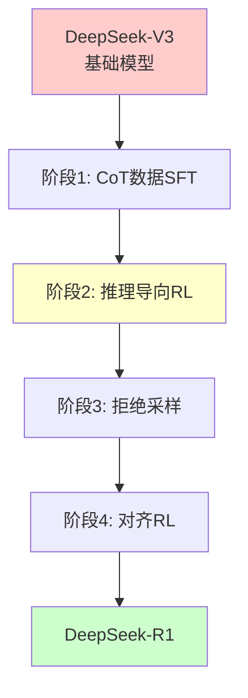
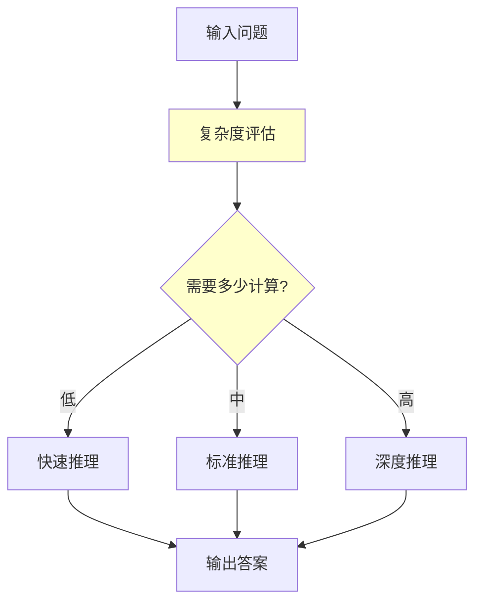

# 推理模型与思维链技术

> 📅 **更新时间**: 2026-06-17

---

## 目录

- [1. 目录](#1-目录)
- [2. 主流推理模型对比](#2-主流推理模型对比)
- [3. 思维链工程实践](#3-思维链工程实践)
- [4. 前沿技术趋势](#4-前沿技术趋势)
- [5. 参考资料](#5-参考资料)
- [6. 附录:快速参考卡片](#6-附录快速参考卡片)

---

## 1. 目录

- [4. 主流推理模型对比](#4-主流推理模型对比)
  - [4.1 DeepSeek-R1](#41-deepseek-r1)
  - [4.2 Claude 3.5 Sonnet/Opus](#42-claude-35-sonnetopus)
  - [4.3 Gemini 2.0/2.5](#43-gemini-2025)
  - [4.4 开源推理模型](#44-开源推理模型)
- [5. 思维链工程实践](#5-思维链工程实践)
  - [5.1 生产环境部署](#51-生产环境部署)
  - [5.2 评估与测试体系](#52-评估与测试体系)
  - [5.3 常见陷阱与解决方案](#53-常见陷阱与解决方案)
- [6. 前沿技术趋势](#6-前沿技术趋势)
  - [6.1 测试时计算 Scaling](#61-测试时计算-scaling)
  - [6.2 推理模型训练方法](#62-推理模型训练方法)
  - [6.3 未来发展方向](#63-未来发展方向)
- [参考资料](#参考资料)
- [附录：快速参考卡片](#附录快速参考卡片)

---

## 1. 主流推理模型对比

### 4.1 DeepSeek-R1

#### 4.1.1 架构特点

DeepSeek-R1 是由 DeepSeek（深度求索）开发的开源推理模型,于2025年1月发布,是首个在性能上接近 OpenAI o1 的开源模型。

**核心架构**:



**关键技术特点**:

1. **混合注意力机制**:
   ```
   - MLA (Multi-Head Latent Attention)
   - 降低KV cache内存占用
   - 提升推理效率30-50%
   ```

2. **MoE架构(Mixture of Experts)**:
   ```
   - 总参数:671B
   - 激活参数:37B(每次推理)
   - 专家数量:256个
   - 路由策略:Top-2专家选择
   ```

3. **多token预测**:
   ```
   - 一次预测多个token
   - 推理速度提升2-3倍
   - 不牺牲准确率
   ```

#### 4.1.2 训练方法

DeepSeek-R1 的训练方法完全开源,包含四个阶段:

**阶段1:CoT数据监督微调(SFT)**

```python
# 训练数据格式
sft_data = [
    {
        "prompt": "问题:...",
        "completion": "<think>\n推理过程...\n</think>\n<answer>\n答案\n</answer>"
    }
]

# 数据特点
- 数千条高质量CoT示例
- 覆盖数学、代码、逻辑推理
- 人工审核确保质量
```

**阶段2:推理导向的强化学习**

```python
# RL训练配置
rl_config = {
    "algorithm": "GRPO",  # Group Relative Policy Optimization
    "reward_model": "rule_based",  # 基于规则的奖励
    "kl_penalty": 0.04,
    "batch_size": 128,
    "rollout_per_prompt": 16,
    "temperature": 1.0
}

# 奖励函数(简化版)
def compute_reward(response, ground_truth):
    # 规则1:答案正确性(最高权重)
    if response.answer == ground_truth:
        outcome_reward = 1.0
    else:
        outcome_reward = 0.0
    
    # 规则2:格式正确性
    format_reward = 1.0 if (
        response.has_thinking_tags and 
        response.has_answer_tags
    ) else 0.0
    
    # 规则3:推理长度(避免过短)
    length_reward = min(len(response.thinking) / 1000, 1.0)
    
    # 综合奖励
    total = 0.7 * outcome_reward + 0.2 * format_reward + 0.1 * length_reward
    return total
```

**阶段3:拒绝采样数据合成**

```python
# 生成更多高质量数据
def rejection_sampling(model, prompts, n_samples=1000):
    """通过拒绝采样生成训练数据"""
    high_quality_data = []
    
    for prompt in prompts:
        # 生成多个响应
        responses = [model.generate(prompt) for _ in range(16)]
        
        # 评分
        scored = [(r, compute_reward(r)) for r in responses]
        
        # 选择最好的
        best = max(scored, key=lambda x: x[1])
        
        if best[1] > 0.8:  # 阈值
            high_quality_data.append({
                "prompt": prompt,
                "completion": best[0]
            })
    
    return high_quality_data
```

**阶段4:对齐RL(有用性和无害性)**

```python
# 对齐训练
alignment_config = {
    "helpfulness_reward": "LLM-based",
    "harmlessness_reward": "classifier-based",
    "target": "balance usefulness and safety"
}

# 目标:提升有用性和无害性
def alignment_reward(response):
    usefulness = llm_judge.evaluate_usefulness(response)
    harmlessness = classifier.check_safety(response)
    
    # 平衡两者
    return 0.7 * usefulness + 0.3 * harmlessness
```

#### 4.1.3 开源优势

DeepSeek-R1 的最大优势是完全开源:

```bash
# 方式1:Hugging Face Transformers
from transformers import AutoModelForCausalLM, AutoTokenizer

model = AutoModelForCausalLM.from_pretrained(
    "deepseek-ai/DeepSeek-R1",
    torch_dtype="auto",
    device_map="auto"
)
tokenizer = AutoTokenizer.from_pretrained("deepseek-ai/DeepSeek-R1")

# 方式2:vLLM(高性能推理)
from vllm import LLM, SamplingParams

llm = LLM(model="deepseek-ai/DeepSeek-R1")
sampling_params = SamplingParams(temperature=0.6, top_p=0.95)

# 方式3:Ollama(本地运行)
# ollama run deepseek-r1
```

#### 4.1.4 性能对比

| 基准测试 | DeepSeek-R1 | o1 | 差距 |
|---------|-------------|-----|------|
| AIME 2024 | 79.8% | 83.3% | -3.5% |
| MATH | 97.3% | 94.8% | +2.5% |
| GPQA | 71.5% | 77.3% | -5.8% |
| Codeforces | 2029 | 2100+ | -71 |
| 推理成本 | $ | $$$$$ | 显著更低 |

**关键优势**:
- ✅ 完全开源,可本地部署
- ✅ 成本低(1/10 of o1)
- ✅ MATH基准超过o1
- ✅ 训练方法透明

**劣势**:
- ❌ 某些基准略低于o1
- ❌ 生态系统不如OpenAI
- ❌ 文档和社区较小

### 4.2 Claude 3.5 Sonnet/Opus

#### 4.2.1 推理能力

Claude 3.5系列虽然不是专门的推理模型,但在推理任务上表现出色:

**特点**:
1. **隐式推理**:不生成显式思维链,但内部进行深度推理
2. **长上下文**:200K tokens上下文窗口
3. **工具使用**:原生支持工具调用辅助推理

**性能**:

| 基准 | Claude 3.5 Sonnet | Claude 3.5 Opus |
|------|-------------------|-----------------|
| MATH | 96.4% | 97.8% |
| GSM8K | 96.8% | 98.1% |
| HumanEval | 92.1% | 94.3% |

**推理风格**:

```
用户:解决这个问题...

Claude:
[直接给出结构化的解答,不显示推理过程]

但如果你要求:
"请逐步思考"

Claude会:
1. 分析问题
2. 列出已知条件
3. 逐步推理
4. 验证答案
```

#### 4.2.2 长上下文优势

Claude 3.5的200K上下文窗口在推理中有独特优势:

```python
# 场景:分析整个代码库的bug
# 可以同时输入:
- 所有相关源文件(~50K tokens)
- 错误日志(~5K tokens)
- 测试用例(~10K tokens)
- 文档(~20K tokens)
总计:~85K tokens

# Claude可以处理整个代码库(~100K tokens)
# 而o1的上下文窗口较小(~32K)
```

**优势**:
- 更全面的问题理解
- 减少信息遗漏
- 适合复杂系统分析

#### 4.2.3 工具集成

Claude原生支持工具调用,可以辅助推理:

```python
# 使用工具辅助推理
tools = [
    {
        "name": "calculator",
        "description": "执行数学计算"
    },
    {
        "name": "code_interpreter",
        "description": "执行代码验证"
    },
    {
        "name": "web_search",
        "description": "搜索实时信息"
    }
]

# 推理流程
# 1. Claude分析问题
# 2. 决定使用哪些工具
# 3. 调用工具获取结果
# 4. 基于工具结果继续推理

# 工具执行后
tool_results = {
    "calculator": "42",
    "code_interpreter": "Test passed",
    "web_search": "Latest info:..."
}

# Claude基于工具结果继续推理
final_answer = claude.reason_with_tools(
    problem,
    tool_results
)
```

### 4.3 Gemini 2.0/2.5

#### 4.3.1 多模态推理

Gemini的独特优势是多模态推理能力:

```python
# Gemini多模态推理
# 输入:图像+文本
prompt = """
分析这个几何图形,计算阴影部分面积。
[附带图像]
"""

# Gemini可以:
# 1. 识别图像中的几何图形
# 2. 理解标注和尺寸
# 3. 应用几何定理
# 4. 建立方程
# 5. 求解并解释
```

**应用场景**:
- 数学题(含图形)
- 物理问题(含图表)
- 医学影像分析
- 工程设计审查

#### 4.3.2 长上下文推理

Gemini 2.5支持1M tokens上下文:

- 可以处理整本书
- 分析大型代码库
- 长视频理解
- 但:推理质量可能随长度下降

#### 4.3.3 性能对比

| 基准 | Gemini 2.0 | Gemini 2.5 | o1 |
|------|-----------|-----------|-----|
| MATH | 95.2% | 96.8% | 94.8% |
| GPQA | 74.1% | 76.9% | 77.3% |
| 多模态 | ★★★★★ | ★★★★★ | ★★☆ |

### 4.4 开源推理模型

#### 4.4.1 Qwen 2.5/3

阿里巴巴的Qwen系列也推出了推理模型:

```python
# 加载Qwen
from transformers import AutoModelForCausalLM

model = AutoModelForCausalLM.from_pretrained(
    "Qwen/Qwen2.5-72B-Instruct",
    device_map="auto"
)

# CoT推理
prompt = """Q: 问题...
A: 让我们逐步思考:
"""
```

**特点**:
- 中英文双语优化
- 成本效益好
- 社区活跃

#### 4.4.2 Llama 3.1/3.2

Meta的Llama系列:

```python
# Llama 3.1 405B(最强开源)
# 需要多GPU或量化
from transformers import AutoModelForCausalLM, BitsAndBytesConfig

quantization_config = BitsAndBytesConfig(
    load_in_4bit=True,
    bnb_4bit_quant_type="nf4"
)

model = AutoModelForCausalLM.from_pretrained(
    "meta-llama/Llama-3.1-405B",
    quantization_config=quantization_config
)
```

**特点**:
- 最大的开源模型(405B)
- 需要大量计算资源
- 性能接近GPT-4

#### 4.4.3 Mistral

Mistral的推理模型:

- Mistral Large 2
- 欧洲开发
- 注重隐私和效率
- 适合欧洲市场

#### 4.4.4 开源模型对比总结

| 模型 | 参数 | MATH | 成本 | 推荐场景 |
|------|------|------|------|---------|
| DeepSeek-R1 | 671B(MoE) | 97.3% | 低 | 生产部署 |
| Qwen 2.5 | 72B | 94.1% | 中 | 中英双语 |
| Llama 3.1 | 405B | 93.5% | 高 | 研究 |
| Mistral L2 | 123B | 91.2% | 中 | 欧洲市场 |

---

## 2. 思维链工程实践

### 5.1 生产环境部署

#### 5.1.1 延迟优化

推理模型的主要挑战是延迟。以下是优化策略:

**策略1:流式输出**

```python
from openai import OpenAI

client = OpenAI()

def stream_reasoning(question: str):
    """流式输出推理过程"""
    stream = client.chat.completions.create(
        model="o1",
        messages=[{"role": "user", "content": question}],
        stream=True  # 启用流式
    )
    
    for chunk in stream:
        if chunk.choices[0].delta.content:
            print(chunk.choices[0].delta.content, end="", flush=True)

# 用户体验:
# [思考中...]
# 让我逐步分析...
# 步骤1:...
# 步骤2:...
# 答案:...
```

**策略2:异步处理**

```python
import asyncio
from openai import AsyncOpenAI

async_client = AsyncOpenAI()

async def async_reasoning(question: str) -> str:
    """异步推理,不阻塞主线程"""
    response = await async_client.chat.completions.create(
        model="o1",
        messages=[{"role": "user", "content": question}]
    )
    return response.choices[0].message.content

# 使用
async def main():
    tasks = [
        async_reasoning("问题1"),
        async_reasoning("问题2"),
        async_reasoning("问题3")
    ]
    results = await asyncio.gather(*tasks)
    return results

# 并行处理多个问题
```

**策略3:分层推理**

```python
class TieredReasoning:
    """分层推理系统"""
    
    def __init__(self):
        self.fast_model = "gpt-5.2"  # 快速模型
        self.medium_model = "o3"  # 中等模型
        self.slow_model = "o3"  # 慢速模型
    
    async def solve(self, question: str, 
                   complexity: str = "auto") -> dict:
        """根据复杂度选择模型"""
        
        if complexity == "auto":
            # 先评估复杂度
            complexity = await self.estimate_complexity(question)
        
        if complexity == "low":
            model = self.fast_model
            max_time = 2.0
        elif complexity == "medium":
            model = self.medium_model
            max_time = 10.0
        else:
            model = self.slow_model
            max_time = 30.0
        
        # 执行推理
        start = asyncio.get_event_loop().time()
        result = await self.call_model(model, question)
        elapsed = asyncio.get_event_loop().time() - start
        
        return {
            "result": result,
            "model": model,
            "complexity": complexity,
            "time": elapsed
        }
    
    async def estimate_complexity(self, question: str) -> str:
        """评估问题复杂度"""
        # 简单启发式
        if len(question) < 50 and "?" in question:
            return "low"
        elif "证明" in question or "推导" in question:
            return "high"
        else:
            return "medium"
```

**策略4:缓存**

```python
import hashlib
import redis

class CachedReasoning:
    """带缓存的推理系统"""
    
    def __init__(self, redis_url: str):
        self.client = OpenAI()
        self.cache = redis.Redis.from_url(redis_url)
        self.cache_ttl = 3600  # 1小时
    
    def solve(self, question: str) -> str:
        """解决问题,优先使用缓存"""
        # 生成缓存键
        cache_key = self._generate_cache_key(question)
        
        # 检查缓存
        cached = self.cache.get(cache_key)
        if cached:
            return cached.decode("utf-8")
        
        # 调用API
        response = self.client.chat.completions.create(
            model="o1",
            messages=[{"role": "user", "content": question}]
        )
        result = response.choices[0].message.content
        
        # 存入缓存
        self.cache.setex(cache_key, self.cache_ttl, result)
        
        return result
    
    def _generate_cache_key(self, question: str) -> str:
        """生成缓存键"""
        # 标准化问题
        normalized = question.lower().strip()
        return hashlib.md5(normalized.encode()).hexdigest()
```

#### 5.1.2 成本控制

**成本监控**:

```python
class CostTracker:
    """成本跟踪器"""
    
    def __init__(self, daily_budget: float = 100.0):
        self.daily_budget = daily_budget
        self.spent_today = 0.0
        self.usage_log = []
    
    def track_usage(self, model: str, 
                   prompt_tokens: int,
                   completion_tokens: int):
        """记录使用情况"""
        cost = self._calculate_cost(
            model, prompt_tokens, completion_tokens
        )
        
        self.spent_today += cost
        self.usage_log.append({
            "timestamp": datetime.now(),
            "model": model,
            "prompt_tokens": prompt_tokens,
            "completion_tokens": completion_tokens,
            "cost": cost
        })
        
        # 检查预算
        if self.spent_today > self.daily_budget * 0.9:
            self._send_alert("预算即将耗尽!")
        
        if self.spent_today > self.daily_budget:
            raise BudgetExceededError(
                f"已超出日预算:${self.daily_budget}"
            )
    
    def _calculate_cost(self, model: str, 
                       prompt_tokens: int,
                       completion_tokens: int) -> float:
        """计算成本"""
        # 注意：模型定价会频繁变动，请查阅各提供商最新文档
        # 此处仅为示例结构
        pricing = {
            "o3": {"input": 60.0, "output": 240.0},
            "o4-mini": {"input": 1.10, "output": 4.40},
            "gpt-5.2": {"input": 2.50, "output": 10.0}
        }
        
        price = pricing[model]
        cost = (
            prompt_tokens / 1_000_000 * price["input"] +
            completion_tokens / 1_000_000 * price["output"]
        )
        return cost
    
    def _send_alert(self, message: str):
        """发送警报"""
        # 实现邮件/Slack/短信通知
        print(f"⚠️ 警报:{message}")
        pass
```

**成本优化策略**:

```python
class CostOptimizer:
    """成本优化器"""
    
    def __init__(self):
        self.cost_tracker = CostTracker()
    
    def smart_solve(self, question: str) -> dict:
        """智能解题,平衡成本和效果"""
        
        # 策略1:先尝试便宜模型
        try:
            result = self._try_cheap(question)
            if self._is_confident(result):
                return {
                    "result": result,
                    "strategy": "cheap_model",
                    "cost": "low"
                }
        except:
            pass
        
        # 策略2:使用中等模型
        try:
            result = self._try_medium(question)
            if self._is_confident(result):
                return {
                    "result": result,
                    "strategy": "medium_model",
                    "cost": "medium"
                }
        except:
            pass
        
        # 策略3:使用昂贵模型
        result = self._try_expensive(question)
        return {
            "result": result,
            "strategy": "expensive_model",
            "cost": "high"
        }
    
    def _try_cheap(self, question: str):
        """使用便宜模型"""
        client = OpenAI()
        response = client.chat.completions.create(
            model="o3-mini",
            messages=[{"role": "user", "content": question}]
        )
        return response.choices[0].message.content
    
    def _try_medium(self, question: str):
        """使用中等模型"""
        client = OpenAI()
        response = client.chat.completions.create(
            model="o1",
            messages=[{"role": "user", "content": question}]
        )
        return response.choices[0].message.content
    
    def _try_expensive(self, question: str):
        """使用昂贵模型"""
        client = OpenAI()
        response = client.chat.completions.create(
            model="o3",
            messages=[{"role": "user", "content": question}]
        )
        return response.choices[0].message.content
    
    def _is_confident(self, result: str) -> bool:
        """检查结果是否可信"""
        # 简单启发式
        # 实际应用中可以使用验证器
        if "不确定" in result or "可能" in result:
            return False
        if len(result) < 50:  # 太短可能不完整
            return False
        return True
```

#### 5.1.3 缓存策略

**多级缓存**:

```python
class MultiLevelCache:
    """多级缓存系统"""
    
    def __init__(self):
        # L1:内存缓存(最快,容量小)
        self.l1_cache = {}
        self.l1_max_size = 1000
        
        # L2:Redis缓存(快,容量中)
        self.l2_cache = redis.Redis()
        
        # L3:数据库缓存(慢,容量大)
        self.l3_cache = DatabaseCache()
    
    def get(self, question: str) -> Optional[str]:
        """获取缓存"""
        key = self._hash(question)
        
        # L1查找
        if key in self.l1_cache:
            self._update_stats("l1_hit")
            return self.l1_cache[key]
        
        # L2查找
        l2_result = self.l2_cache.get(key)
        if l2_result:
            result = l2_result.decode("utf-8")
            self.l1_cache[key] = result  # 提升到L1
            self._update_stats("l2_hit")
            return result
        
        # L3查找
        l3_result = self.l3_cache.get(key)
        if l3_result:
            self.l2_cache.setex(key, 3600, l3_result)  # 提升到L2
            self.l1_cache[key] = l3_result  # 提升到L1
            self._update_stats("l3_hit")
            return l3_result
        
        self._update_stats("miss")
        return None
    
    def set(self, question: str, answer: str):
        """设置缓存"""
        key = self._hash(question)
        
        # 写入所有层级
        self.l1_cache[key] = answer
        self.l2_cache.setex(key, 3600, answer)  # 1小时
        self.l3_cache.set(key, answer)  # 持久化
        
        # L1容量控制
        if len(self.l1_cache) > self.l1_max_size:
            # 删除最旧的
            oldest_key = next(iter(self.l1_cache))
            del self.l1_cache[oldest_key]
    
    def _hash(self, question: str) -> str:
        """生成哈希"""
        return hashlib.sha256(
            question.lower().strip().encode()
        ).hexdigest()[:16]
```

**缓存失效策略**:

```python
class SmartCacheInvalidation:
    """智能缓存失效"""
    
    def __init__(self):
        self.cache = MultiLevelCache()
        self.model_version = "v1.0"
    
    def invalidate_on_model_update(self):
        """模型更新时失效所有缓存"""
        old_version = self.model_version
        self.model_version = get_current_model_version()
        
        if old_version != self.model_version:
            print(f"模型更新:{old_version} -> {self.model_version}")
            self.cache.clear_all()
    
    def selective_invalidation(self, topic: str):
        """选择性失效(按主题)"""
        # 失效与特定主题相关的缓存
        keys = self.cache.find_keys_by_topic(topic)
        for key in keys:
            self.cache.delete(key)
    
    def ttl_based_invalidation(self):
        """基于TTL的自动失效"""
        # 不同问题类型设置不同TTL
        ttl_config = {
            "math": 86400 * 30,  # 数学题:30天
            "news": 3600,  # 新闻:1小时
            "code": 86400 * 7,  # 代码:7天
            "general": 86400  # 通用:1天
        }
        
        for topic, ttl in ttl_config.items():
            self.cache.set_default_ttl(topic, ttl)
```

#### 5.1.4 降级方案

**优雅降级**:

```python
class GracefulDegradation:
    """优雅降级系统"""
    
    def __init__(self):
        self.primary_model = "o3"
        self.fallback_models = ["gpt-5.2", "o4-mini", "gpt-5.5"]
    
    def solve_with_fallback(self, question: str) -> dict:
        """带降级的解题"""
        last_error = None
        
        # 尝试主模型
        try:
            result = self._call_model(self.primary_model, question)
            return {
                "result": result,
                "model": self.primary_model,
                "status": "success"
            }
        except Exception as e:
            last_error = e
            print(f"主模型失败:{e}")
        
        # 尝试降级模型
        for model in self.fallback_models:
            try:
                result = self._call_model(model, question)
                return {
                    "result": result,
                    "model": model,
                    "status": "degraded",
                    "warning": f"使用降级模型:{model}"
                }
            except Exception as e:
                last_error = e
                print(f"降级模型{model}失败:{e}")
        
        # 全部失败
        return {
            "result": None,
            "model": None,
            "status": "failed",
            "error": str(last_error)
        }
    
    def _call_model(self, model: str, question: str) -> str:
        """调用模型"""
        client = OpenAI()
        response = client.chat.completions.create(
            model=model,
            messages=[{"role": "user", "content": question}],
            timeout=30  # 30秒超时
        )
        return response.choices[0].message.content
```

**断路器模式**:

```python
import time
from enum import Enum

class CircuitState(Enum):
    CLOSED = "closed"  # 正常
    OPEN = "open"  # 断开
    HALF_OPEN = "half_open"  # 半开

class CircuitBreaker:
    """断路器模式"""
    
    def __init__(self, failure_threshold: int = 5,
                 recovery_timeout: int = 60):
        self.failure_threshold = failure_threshold
        self.recovery_timeout = recovery_timeout
        self.state = CircuitState.CLOSED
        self.failure_count = 0
        self.last_failure_time = None
    
    def call(self, func, *args, **kwargs):
        """执行调用"""
        if self.state == CircuitState.OPEN:
            # 检查是否可以恢复
            if time.time() - self.last_failure_time > self.recovery_timeout:
                self.state = CircuitState.HALF_OPEN
            else:
                raise CircuitOpenError("断路器已断开")
        
        try:
            result = func(*args, **kwargs)
            self._on_success()
            return result
        except Exception as e:
            self._on_failure()
            raise
    
    def _on_success(self):
        """成功回调"""
        self.failure_count = 0
        self.state = CircuitState.CLOSED
    
    def _on_failure(self):
        """失败回调"""
        self.failure_count += 1
        self.last_failure_time = time.time()
        
        if self.failure_count >= self.failure_threshold:
            self.state = CircuitState.OPEN
```

### 5.2 评估与测试体系

#### 5.2.1 推理基准测试

**自动化测试框架**:

```python
import pytest
from typing import List, Dict

class ReasoningBenchmark:
    """推理基准测试"""
    
    def __init__(self, test_suite: List[Dict]):
        self.test_suite = test_suite
        self.results = []
    
    def run(self, model_name: str, solver_func) -> Dict:
        """运行基准测试"""
        correct = 0
        total = len(self.test_suite)
        times = []
        
        for test_case in self.test_suite:
            start = time.time()
            
            try:
                result = solver_func(test_case["question"])
                elapsed = time.time() - start
                times.append(elapsed)
                
                # 检查答案
                if self._check_answer(result, test_case["answer"]):
                    correct += 1
                    status = "PASS"
                else:
                    status = "FAIL"
                
                self.results.append({
                    "question": test_case["question"],
                    "expected": test_case["answer"],
                    "actual": result,
                    "status": status,
                    "time": elapsed
                })
                
            except Exception as e:
                elapsed = time.time() - start
                times.append(elapsed)
                self.results.append({
                    "question": test_case["question"],
                    "expected": test_case["answer"],
                    "actual": None,
                    "status": "ERROR",
                    "error": str(e),
                    "time": elapsed
                })
        
        accuracy = correct / total
        avg_time = sum(times) / len(times)
        
        return {
            "model": model_name,
            "accuracy": accuracy,
            "correct": correct,
            "total": total,
            "avg_time": avg_time,
            "total_time": sum(times)
        }
    
    def _check_answer(self, actual: str, expected: str) -> bool:
        """检查答案"""
        # 简单字符串匹配
        # 实际应用中需要更复杂的评估
        return expected.lower() in actual.lower()

# 使用示例
if __name__ == "__main__":
    # 定义测试集
    test_suite = [
        {
            "question": "3个人3天吃3个苹果,9个人9天吃几个?",
            "answer": "27"
        },
        {
            "question": "农场有鸡和兔共35个头,94只脚。各多少?",
            "answer": "鸡23只,兔12只"
        },
        # ... 更多测试用例
    ]
    
    benchmark = ReasoningBenchmark(test_suite)
    
    # 测试不同模型
    models = {
        "o1": lambda q: solve_with_o1(q),
        "o3-mini": lambda q: solve_with_o3mini(q),
        "deepseek-r1": lambda q: solve_with_deepseek(q)
    }
    
    for name, solver in models.items():
        result = benchmark.run(name, solver)
        print(f"模型:{name}")
        print(f"准确率:{result['accuracy']:.2%}")
        print(f"平均时间:{result['avg_time']:.2f}s")
        print("---")

# 使用示例
# benchmark = ReasoningBenchmark(math_test_suite)
# results = benchmark.run("o1", solve_with_o1)
```

**常用基准测试集**:

```python
# MATH基准测试
math_benchmark = {
    "name": "MATH",
    "description": "高中数学竞赛题",
    "size": 12500,
    "categories": [
        "algebra",
        "geometry",
        "number_theory",
        "combinatorics",
        "precalculus"
    ]
}

# GSM8K基准测试
gsm8k_benchmark = {
    "name": "GSM8K",
    "description": "小学数学应用题",
    "size": 8500,
    "difficulty": "elementary"
}

# AIME基准测试
aime_benchmark = {
    "name": "AIME",
    "description": "美国数学邀请赛",
    "size": 300,
    "difficulty": "hard",
    "time_limit": "3 hours"
}

# GPQA基准测试
gpqa_benchmark = {
    "name": "GPQA",
    "description": "研究生水平科学问答",
    "size": 448,
    "domains": [
        "physics",
        "chemistry",
        "biology"
    ]
}
```

#### 5.2.2 自定义评估

**LLM-as-a-Judge**:

```python
class LLMJudge:
    """使用LLM作为评估器"""
    
    def __init__(self, judge_model: str = "gpt-4"):
        self.client = OpenAI()
        self.judge_model = judge_model
    
    def evaluate(self, question: str,
                generated_answer: str,
                ground_truth: str) -> dict:
        """评估生成的答案"""
        
        prompt = f"""
        你是一个严格的评估器。请评估以下答案的质量。

        问题:{question}
        
        标准答案:{ground_truth}
        
        生成的答案:{generated_answer}
        
        请从以下维度评分(0-10):
        1. 正确性:答案是否正确?
        2. 完整性:是否涵盖了所有要点?
        3. 推理质量:推理过程是否合理?
        4. 清晰度:表达是否清晰?
        
        输出格式:
        {{
            "correctness": <score>,
            "completeness": <score>,
            "reasoning_quality": <score>,
            "clarity": <score>,
            "overall": <average>,
            "feedback": "<brief feedback>"
        }}
        """
        
        response = self.client.chat.completions.create(
            model=self.judge_model,
            messages=[{"role": "user", "content": prompt}],
            response_format={"type": "json_object"}
        )
        
        return json.loads(response.choices[0].message.content)
    
    def batch_evaluate(self, test_cases: List[Dict]) -> List[dict]:
        """批量评估"""
        results = []
        for tc in test_cases:
            result = self.evaluate(
                tc["question"],
                tc["generated"],
                tc["ground_truth"]
            )
            results.append(result)
        return results

# 使用示例
judge = LLMJudge()

test_case = {
    "question": "证明√2是无理数",
    "generated": "假设√2是有理数...",
    "ground_truth": "标准证明过程..."
}

evaluation = judge.evaluate(
    test_case["question"],
    test_case["generated"],
    test_case["ground_truth"]
)

print(f"正确性:{evaluation['correctness']}/10")
print(f"反馈:{evaluation['feedback']}")
```

**人工评估流程**:

```python
class HumanEvaluation:
    """人工评估流程"""
    
    def __init__(self):
        self.evaluators = []
        self.evaluation_form = """
        评估表:
        1. 答案是否正确? [是/部分/否]
        2. 推理是否清晰? [1-5分]
        3. 有无逻辑错误? [是/否,如有请指出]
        4. 总体评价: [1-5分]
        5. 备注:
        """
    
    def add_evaluator(self, evaluator_id: str):
        """添加评估员"""
        self.evaluators.append(evaluator_id)
    
    def assign_task(self, task_id: str,
                   evaluators: List[str]):
        """分配评估任务"""
        # 每个任务至少2个评估员
        if len(evaluators) < 2:
            raise ValueError("需要至少2个评估员")
        
        # 分配任务
        for evaluator in evaluators:
            self._send_task(evaluator, task_id)
    
    def collect_feedback(self, task_id: str) -> dict:
        """收集反馈"""
        feedback = {}
        for evaluator in self.evaluators:
            feedback[evaluator] = self._get_feedback(
                evaluator, task_id
            )
        
        # 计算一致性
        agreement = self._calculate_agreement(feedback)
        
        return {
            "task_id": task_id,
            "feedback": feedback,
            "agreement": agreement
        }
    
    def _calculate_agreement(self, feedback: dict) -> float:
        """计算评估员间一致性"""
        # 简单实现:计算评分的标准差
        scores = [
            f["overall_score"] 
            for f in feedback.values()
        ]
        std_dev = statistics.stdev(scores)
        
        # 转换为一致性分数(0-1)
        agreement = max(0, 1 - std_dev / 2)
        return agreement
```

### 5.3 常见陷阱与解决方案

#### 5.3.1 过度推理(Over-Reasoning)

**问题**:模型对简单问题生成过长的推理过程。

```python
# 简单问题
question = "1+1=?"

# 过度推理输出
bad_reasoning = """
让我逐步思考这个问题:

首先,我需要理解加法的定义。
加法是基本的算术运算之一...

[长篇大论500字]

步骤1:理解数字1的概念
步骤2:理解加号的意义
步骤3:执行加法运算
步骤4:验证结果
...

答案:2
"""

# 解决方案:控制推理深度
class AdaptiveReasoning:
    """自适应推理"""
    
    def solve(self, question: str) -> str:
        # 评估问题难度
        difficulty = self.estimate_difficulty(question)
        
        if difficulty == "very_easy":
            # 直接回答
            return self.direct_answer(question)
        elif difficulty == "easy":
            # 简短推理
            return self.short_reasoning(question)
        elif difficulty == "medium":
            # 标准推理
            return self.standard_reasoning(question)
        else:
            # 详细推理
            return self.detailed_reasoning(question)
    
    def estimate_difficulty(self, question: str) -> str:
        """评估难度"""
        # 启发式规则
        if re.match(r'^\d+\s*[+\-*/]\s*\d+\s*=?$', question):
            return "very_easy"
        elif len(question.split()) < 10:
            return "easy"
        elif "证明" in question or "推导" in question:
            return "hard"
        else:
            return "medium"
```

#### 5.3.2 幻觉放大

**问题**:推理过程可能放大模型的幻觉。

```python
# 数学幻觉
question = "计算123456789 × 987654321"

# 模型可能编造看似合理但错误的答案
hallucinated_reasoning = """
步骤1:使用分配律
123456789 × 987654321
= 123456789 × (1000000000 - 12345679)
= 123456789000000000 - 15241578750190521
= 121932631137021379

答案:121932631137021379
"""

# 实际答案应该是:121932631112635269

# 解决方案:验证机制
class HallucinationDetector:
    """幻觉检测器"""
    
    def __init__(self):
        self.verifier = ToolVerifier()
    
    def verify_math(self, question: str,
                   reasoning: str) -> bool:
        """验证数学推理"""
        # 提取计算步骤
        calculations = self._extract_calculations(reasoning)
        
        # 使用计算器验证
        for calc in calculations:
            expected = self._calculate(calc["expression"])
            if expected != calc["result"]:
                return False  # 发现错误
        
        return True
    
    def verify_fact(self, claim: str) -> bool:
        """验证事实陈述"""
        # 使用知识图谱或搜索引擎验证
        return self.verifier.check_fact(claim)
    
    def verify_code(self, code: str) -> bool:
        """验证代码"""
        # 执行代码测试
        try:
            exec(code)
            return True
        except:
            return False
```

#### 5.3.3 一致性错误

**问题**:同一问题多次运行得到不同答案。

```python
class ConsistencyChecker:
    """一致性检查器"""
    
    def __init__(self, n_runs: int = 5):
        self.n_runs = n_runs
    
    def check(self, question: str,
             solver_func) -> dict:
        """检查一致性"""
        results = []
        
        # 多次运行
        for _ in range(self.n_runs):
            result = solver_func(question)
            results.append(result)
        
        # 提取答案
        answers = [self._extract_answer(r) for r in results]
        
        # 计算一致性
        unique_answers = set(answers)
        consistency = len(unique_answers) == 1
        
        # 统计
        from collections import Counter
        answer_counts = Counter(answers)
        most_common = answer_counts.most_common(1)[0]
        
        return {
            "consistency": consistency,
            "unique_answers": len(unique_answers),
            "most_common_answer": most_common[0],
            "agreement_rate": most_common[1] / self.n_runs,
            "all_answers": dict(answer_counts)
        }

# 使用示例
checker = ConsistencyChecker(n_runs=5)

result = checker.check(
    "复杂问题...",
    lambda q: solve_with_o1(q)
)

print(f"一致性:{result['consistency']}")
print(f"最普遍答案:{result['most_common_answer']}")
print(f"一致率:{result['agreement_rate']:.0%}")

# 使用示例
# checker = ConsistencyChecker(n_runs=5)
# result = checker.check("问题", solve_with_o1)
# if result['agreement_rate'] < 0.8:
#     print("警告:一致性低,需要人工审查")
```

#### 5.3.4 解决方案总结表

| 问题 | 症状 | 解决方案 | 预防 |
|------|------|----------|------|
| 过度推理 | 简单问题长输出 | 自适应推理深度 | 难度评估 |
| 幻觉放大 | 错误但合理 | 验证机制 | 工具辅助 |
| 一致性错误 | 多次结果不同 | Self-Consistency | 多次运行投票 |
| 推理跳跃 | 步骤不完整 | 强制模板 | Prompt设计 |
| 循环推理 | 重复内容 | 检测循环 | 步数限制 |
| 成本过高 | token过多 | 缓存+降级 | 预算控制 |

---

## 3. 前沿技术趋势

### 6.1 测试时计算 Scaling

#### 6.1.1 Compute-Optimal Inference

**概念**:在推理时动态分配计算资源,以达到最优的准确率-成本平衡。



**核心思想**:
- 不是所有问题都需要深度推理
- 简单问题应该快速回答
- 困难问题应该分配更多计算
- 目标:最大化整体准确率,最小化总成本

**实现方法**:

```python
class ComputeOptimalInference:
    """计算最优推理"""
    
    def __init__(self):
        self.fast_model = "gpt-5.2"
        self.medium_model = "o3"
        self.slow_model = "o3"
    
    def solve(self, question: str,
              budget: float = 1.0) -> dict:
        """
        在预算内最优求解
        
        Args:
            question: 问题
            budget: 计算预算(相对值)
        """
        # 1. 预测难度和收益
        difficulty = self.predict_difficulty(question)
        
        # 2. 计算最优策略
        strategy = self.optimize_strategy(
            difficulty, budget
        )
        
        # 3. 执行
        result = self.execute_strategy(question, strategy)
        
        return {
            "result": result,
            "strategy": strategy,
            "budget_used": strategy["cost"],
            "expected_accuracy": strategy["accuracy"]
        }
    
    def predict_difficulty(self, question: str) -> float:
        """预测问题难度(0-1)"""
        # 使用小模型预测
        prompt = f"""
        评估以下问题的难度(0-1):
        {question}
        
        只输出数字:
        """
        response = self.call_model(
            self.fast_model, prompt
        )
        return float(response)
    
    def optimize_strategy(self, difficulty: float,
                         budget: float) -> dict:
        """优化推理策略"""
        # 策略空间
        strategies = [
            {
                "model": self.fast_model,
                "effort": "low",
                "cost": 0.1,
                "accuracy": self.predict_accuracy(
                    "fast", difficulty
                )
            },
            {
                "model": self.medium_model,
                "effort": "medium",
                "cost": 0.5,
                "accuracy": self.predict_accuracy(
                    "medium", difficulty
                )
            },
            {
                "model": self.slow_model,
                "effort": "high",
                "cost": 1.0,
                "accuracy": self.predict_accuracy(
                    "slow", difficulty
                )
            }
        ]
        
        # 在预算内选择最优
        feasible = [s for s in strategies if s["cost"] <= budget]
        best = max(feasible, key=lambda s: s["accuracy"])
        
        return best
    
    def predict_accuracy(self, model_type: str,
                        difficulty: float) -> float:
        """预测准确率"""
        # 基于历史数据的经验公式
        if model_type == "fast":
            return max(0.3, 0.9 - difficulty * 0.6)
        elif model_type == "medium":
            return max(0.5, 0.95 - difficulty * 0.3)
        else:  # slow
            return max(0.7, 0.98 - difficulty * 0.15)
```

#### 6.1.2 动态推理深度

**概念**:根据推理过程中的信心水平,动态调整推理深度。

```python
class DynamicReasoningDepth:
    """动态推理深度"""
    
    def __init__(self, min_depth: int = 1,
                 max_depth: int = 10,
                 confidence_threshold: float = 0.9):
        self.min_depth = min_depth
        self.max_depth = max_depth
        self.confidence_threshold = confidence_threshold
    
    def solve(self, question: str) -> dict:
        """动态深度求解"""
        current_depth = self.min_depth
        reasoning_history = []
        
        while current_depth <= self.max_depth:
            # 生成当前深度的推理
            result = self.reason_at_depth(
                question, current_depth, reasoning_history
            )
            
            # 评估信心
            confidence = self.evaluate_confidence(result)
            
            if confidence >= self.confidence_threshold:
                # 信心足够,停止
                return {
                    "result": result,
                    "depth_used": current_depth,
                    "confidence": confidence,
                    "status": "converged"
                }
            
            # 继续加深
            reasoning_history.append(result)
            current_depth += 1
        
        # 达到最大深度
        return {
            "result": result,
            "depth_used": self.max_depth,
            "confidence": confidence,
            "status": "max_depth_reached"
        }
    
    def reason_at_depth(self, question: str,
                       depth: int,
                       history: List) -> str:
        """在指定深度推理"""
        prompt = f"""
        问题:{question}
        
        当前推理深度:{depth}
        
        {self._format_history(history)}
        
        请{'简要' if depth <= 2 else '详细'}推理:
        """
        
        return self.call_model("o1", prompt)
    
    def evaluate_confidence(self, reasoning: str) -> float:
        """评估推理信心"""
        # 使用验证模型
        prompt = f"""
        评估以下推理的信心水平(0-1):
        {reasoning}
        
        只输出数字:
        """
        response = self.call_model("gpt-5.2", prompt)
        return float(response)
```

#### 6.1.3 自适应策略

**多臂老虎机方法**:

```python
class MultiArmedBandit:
    """多臂老虎机自适应策略"""
    
    def __init__(self, strategies: List[str]):
        self.strategies = strategies
        self.rewards = {s: [] for s in strategies}
        self.counts = {s: 0 for s in strategies}
    
    def select_strategy(self) -> str:
        """使用UCB算法选择策略"""
        total_counts = sum(self.counts.values())
        
        if total_counts < len(self.strategies):
            # 探索阶段:每个策略至少试一次
            for s in self.strategies:
                if self.counts[s] == 0:
                    return s
        
        ucb_values = {}
        for s in self.strategies:
            avg_reward = np.mean(self.rewards[s])
            exploration = np.sqrt(
                2 * np.log(total_counts) / self.counts[s]
            )
            ucb_values[s] = avg_reward + exploration
        
        # 选择UCB值最高的策略
        return max(ucb_values, key=ucb_values.get)
    
    def update(self, strategy: str, reward: float):
        """更新策略反馈"""
        self.rewards[strategy].append(reward)
        self.counts[strategy] += 1

# 使用示例
bandit = MultiArmedBandit([
    "fast_model",
    "medium_model", 
    "slow_model"
])

for question in questions:
    # 选择策略
    strategy = bandit.select_strategy()
    
    # 执行
    result = solve_with_strategy(question, strategy)
    
    # 评估奖励
    reward = evaluate_result(result)
    
    # 更新
    bandit.update(strategy, reward)
```

### 6.2 推理模型训练方法

#### 6.2.1 数据合成

**Self-Play数据生成**:

```python
class SelfPlayDataGeneration:
    """自我对弈数据生成"""
    
    def __init__(self, model, verifier):
        self.model = model
        self.verifier = verifier
    
    def generate(self, seed_questions: List[str],
                n_samples: int = 1000) -> List[Dict]:
        """生成训练数据"""
        dataset = []
        
        for seed in seed_questions:
            for _ in range(n_samples // len(seed_questions)):
                # 1. 生成推理
                reasoning = self.model.generate(seed)
                
                # 2. 提取答案
                answer = self.extract_answer(reasoning)
                
                # 3. 验证
                if self.verifier.check(seed, answer):
                    # 高质量数据
                    dataset.append({
                        "prompt": seed,
                        "completion": reasoning,
                        "quality": "high"
                    })
                else:
                    # 低质量,但可用于负样本
                    dataset.append({
                        "prompt": seed,
                        "completion": reasoning,
                        "quality": "low"
                    })
        
        return dataset
    
    def iterative_improvement(self, initial_model,
                             n_iterations: int = 5):
        """迭代改进"""
        current_model = initial_model
        
        for iteration in range(n_iterations):
            print(f"迭代 {iteration + 1}")
            
            # 1. 生成数据
            data = self.generate(seed_questions, n_samples=10000)
            
            # 2. 过滤高质量数据
            high_quality = [
                d for d in data if d["quality"] == "high"
            ]
            
            # 3. 训练新模型
            new_model = self.train(current_model, high_quality)
            
            # 4. 评估
            accuracy = self.evaluate(new_model)
            print(f"准确率:{accuracy:.2%}")
            
            # 5. 更新
            if accuracy > self.evaluate(current_model):
                current_model = new_model
        
        return current_model
```

**过程奖励模型训练**:

```python
class ProcessRewardModel:
    """过程奖励模型"""
    
    def __init__(self):
        self.prm = AutoModelForSequenceClassification()
    
    def train(self, trajectory_data: List[Dict]):
        """训练过程奖励模型"""
        # 数据格式
        # {
        #     "trajectory": [step1, step2, ..., stepN],
        #     "outcome": "correct" or "incorrect",
        #     "step_rewards": [r1, r2, ..., rN]
        # }
        
        optimizer = AdamW(self.prm.parameters())
        
        for epoch in range(10):
            for batch in trajectory_data:
                # 前向传播
                outputs = self.prm(
                    input_ids=batch["trajectory"]
                )
                
                # 计算损失
                loss = self.compute_process_loss(
                    outputs, batch["step_rewards"]
                )
                
                # 反向传播
                loss.backward()
                optimizer.step()
                optimizer.zero_grad()
    
    def compute_process_loss(self, predictions,
                           true_rewards):
        """计算过程奖励损失"""
        # MSE损失
        loss = F.mse_loss(predictions, true_rewards)
        return loss
    
    def predict_step_reward(self, step: str) -> float:
        """预测单步奖励"""
        reward = self.prm(step)
        return reward.item()
```

#### 6.2.2 奖励设计

**多目标奖励**:

```python
class MultiObjectiveReward:
    """多目标奖励函数"""
    
    def __init__(self):
        self.weights = {
            "outcome": 0.5,
            "process": 0.3,
            "efficiency": 0.1,
            "safety": 0.1
        }
    
    def compute(self, response, ground_truth) -> float:
        """计算综合奖励"""
        # 1. 结果奖励
        outcome = self.outcome_reward(
            response.answer, ground_truth
        )
        
        # 2. 过程奖励
        process = self.process_reward(
            response.reasoning_steps
        )
        
        # 3. 效率奖励
        efficiency = self.efficiency_reward(
            response.length
        )
        
        # 4. 安全奖励
        safety = self.safety_reward(response)
        
        # 加权求和
        total = (
            self.weights["outcome"] * outcome +
            self.weights["process"] * process +
            self.weights["efficiency"] * efficiency +
            self.weights["safety"] * safety
        )
        
        return total
    
    def outcome_reward(self, predicted, true) -> float:
        """结果奖励"""
        return 1.0 if predicted == true else 0.0
    
    def process_reward(self, steps) -> float:
        """过程奖励"""
        if not steps:
            return 0.0
        
        # 评估每步质量
        step_scores = []
        for step in steps:
            score = self.evaluate_step(step)
            step_scores.append(score)
        
        return np.mean(step_scores)
    
    def efficiency_reward(self, length) -> float:
        """效率奖励"""
        # 理想长度范围
        if 100 <= length <= 1000:
            return 1.0
        elif length < 100:
            return 0.5  # 太短
        else:
            return max(0.0, 1.0 - (length - 1000) / 1000)
    
    def safety_reward(self, response) -> float:
        """安全奖励"""
        if self.contains_harmful_content(response):
            return 0.0
        return 1.0
```

#### 6.2.3 训练稳定性

**KL正则化**:

```python
class KLRegularizedTraining:
    """KL正则化训练"""
    
    def __init__(self, reference_model, policy_model):
        self.reference_model = reference_model  # 参考模型
        self.policy_model = policy_model  # 策略模型
        self.kl_coefficient = 0.1
    
    def compute_loss(self, batch):
        """计算带KL正则化的损失"""
        # 策略模型输出
        policy_logits = self.policy_model(batch)
        
        # 参考模型输出
        with torch.no_grad():
            reference_logits = self.reference_model(batch)
        
        # RL损失
        rl_loss = self.compute_rl_loss(
            policy_logits, batch["rewards"]
        )
        
        # KL散度
        kl_div = F.kl_div(
            F.log_softmax(policy_logits, dim=-1),
            F.softmax(reference_logits, dim=-1),
            reduction="batchmean"
        )
        
        # 总损失
        total_loss = rl_loss + self.kl_coefficient * kl_div
        
        return total_loss
    
    def train_step(self, batch):
        """训练步骤"""
        loss = self.compute_loss(batch)
        
        loss.backward()
        torch.nn.utils.clip_grad_norm_(
            self.policy_model.parameters(), max_norm=1.0
        )
        self.optimizer.step()
        self.optimizer.zero_grad()
        
        return loss.item()
```

### 6.3 未来发展方向

#### 6.3.1 世界模型(World Models)

**概念**:构建对物理世界的内部模型,支持更真实的推理。

```
当前LLM:基于文本模式匹配
↓
世界模型:基于物理规律和因果关系

示例:
问题:"把球从桌子推下去会怎样?"

当前LLM:基于训练数据中的类似描述回答
世界模型:模拟物理过程
- 球受重力作用
- 下落轨迹计算
- 落地结果预测
```

**关键技术**:
- 物理引擎集成
- 因果推理
- 空间理解
- 时间推理

#### 6.3.2 规划能力(Planning)

**概念**:能够制定长期计划并执行。

```python
# 未来推理模型
class PlanningModel:
    """规划模型"""
    
    def solve_complex_task(self, goal: str) -> Plan:
        """解决复杂任务"""
        # 1. 目标分解
        subgoals = self.decompose(goal)
        
        # 2. 制定计划
        plan = self.create_plan(subgoals)
        
        # 3. 执行
        for step in plan:
            result = self.execute(step)
            
            # 4. 监控和调整
            if not self.verify(result):
                # 重新规划
                plan = self.replan(plan, result)
        
        return plan
```

**应用场景**:
- 科研:设计实验、分析数据
- 工程:系统设计、优化
- 商业:战略规划、决策支持
- 教育:个性化学习路径

#### 6.3.3 通用推理(General Reasoning)

**目标**:跨领域、跨模态的通用推理能力。

**技术路线**:
1. **多模态融合**:文本+图像+音频+视频
2. **跨领域知识迁移**:从一个领域学到另一个
3. **元学习能力**:学会如何推理
4. **自我改进**:持续学习和进化

**挑战**:
- 计算资源需求巨大
- 评估标准不统一
- 安全性和可控性
- 伦理和社会影响

---

## 4. 参考资料

### 学术论文

1. **Chain-of-Thought Prompting Elicits Reasoning in Large Language Models**
   - Wei, J., et al. (2022)
   - NeurIPS 2022
   - 链接:https://arxiv.org/abs/2201.11903

2. **Tree of Thoughts:Deliberate Problem Solving with Large Language Models**
   - Yao, S., et al. (2023)
   - NeurIPS 2023
   - 链接:https://arxiv.org/abs/2305.10601

3. **Graph of Thoughts:Solving Elaborate Problems with Large Language Models**
   - Besta, M., et al. (2023)
   - AAAI 2024
   - 链接:https://arxiv.org/abs/2308.09687

4. **Training Language Models to Follow Instructions with Human Feedback**
   - Ouyang, L., et al. (2022)
   - NeurIPS 2022 (InstructGPT)
   - 链接:https://arxiv.org/abs/2203.02155

5. **DeepSeek-R1:Incentivizing Reasoning Capability in LLMs via Reinforcement Learning**
   - DeepSeek (2025)
   - 链接:https://arxiv.org/abs/2501.12948

### 在线资源

1. **OpenAI o1系统卡片**
   - https://openai.com/o1

2. **Anthropic Claude技术报告**
   - https://www.anthropic.com/research

3. **Google Gemini技术报告**
   - https://deepmind.google/technologies/gemini/

4. **Hugging Face推理模型集合**
   - https://huggingface.co/models?pipeline_tag=text-generation&sort=trending

### 工具与框架

1. **LangChain**:LLM应用开发框架
   - https://python.langchain.com/

2. **OpenAI API**:o1/o3系列API
   - https://platform.openai.com/

3. **vLLM**:高性能推理引擎
   - https://github.com/vllm-project/vllm

4. **Ollama**:本地LLM运行
   - https://ollama.ai/

### 延伸阅读

1. 《人工智能:一种现代方法》- Stuart Russell & Peter Norvig
2. 《思考,快与慢》- Daniel Kahneman
3. LLM推理能力调研报告(2024)
4. 强化学习在LLM中的应用综述

---

## 5. 附录:快速参考卡片

### CoT 方法速查表

| 方法 | 适用场景 | 实现难度 | 效果 |
|------|---------|---------|------|
| Zero-shot CoT | 快速测试 | ⭐ | ⭐⭐⭐ |
| Few-shot CoT | 大多数任务 | ⭐⭐ | ⭐⭐⭐⭐ |
| Tree of Thoughts | 搜索问题 | ⭐⭐⭐⭐ | ⭐⭐⭐⭐⭐ |
| Graph of Thoughts | 复杂综合 | ⭐⭐⭐⭐⭐ | ⭐⭐⭐⭐⭐ |

### 模型选择速查表

| 需求 | 推荐模型 | 理由 |
|------|---------|------|
| 最高准确率 | o3 | 性能最强 |
| 性价比 | o1 | 平衡 |
| 低成本 | o3-mini | 便宜 |
| 开源部署 | DeepSeek-R1 | 完全开源 |
| 多模态 | Gemini 2.5 | 图像+文本 |
| 长上下文 | Claude 3.5 | 200K tokens |

### 常见错误排查

| 症状 | 可能原因 | 解决方法 |
|------|---------|---------|
| 答案错误 | 推理跳跃 | 强制详细步骤 |
| 输出过长 | 过度推理 | 控制深度 |
| 结果不一致 | 温度过高 | 降低temperature |
| 成本过高 | 未缓存 | 实现缓存 |
| 延迟过高 | 模型过大 | 使用小模型+降级 |
